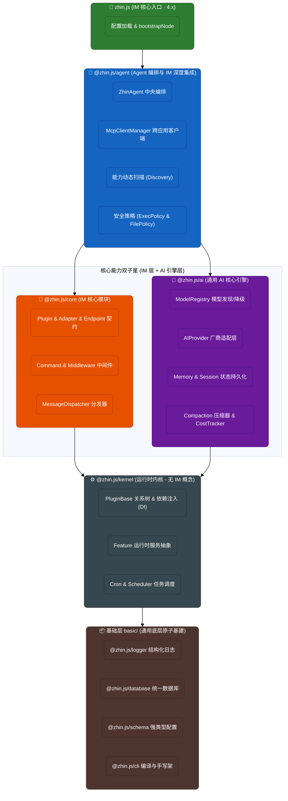
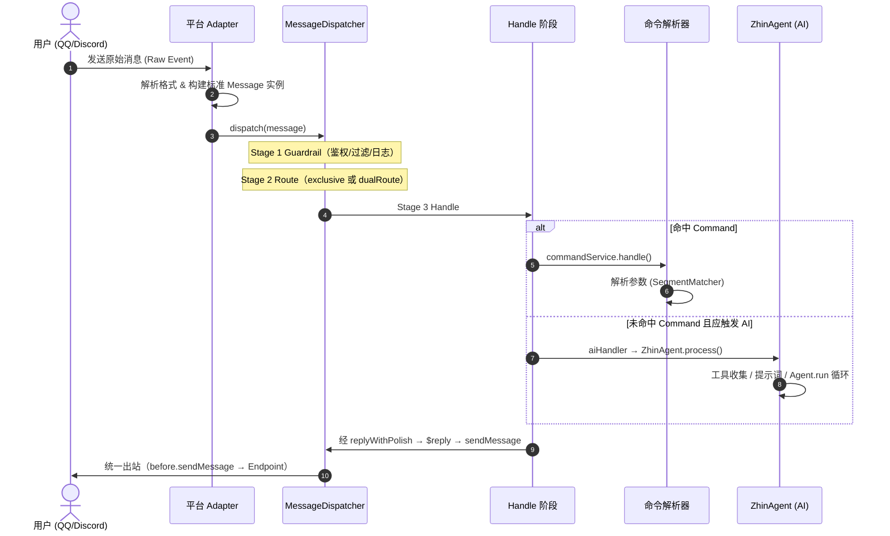
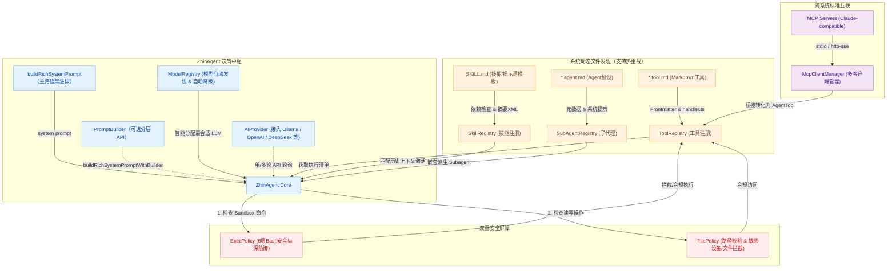
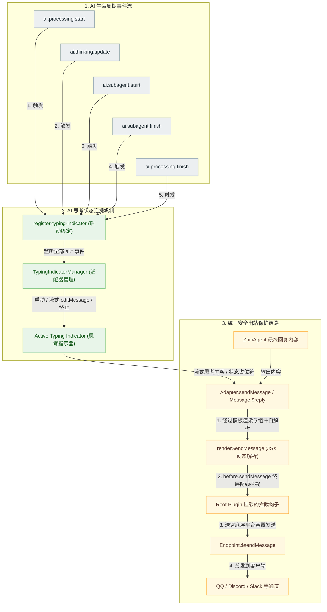

# Zhin.js

TypeScript **多通道 IM Bot 框架** — 插件热重载、Sandbox 调试、Remote Console  
可选 **Agent 栈**（`@zhin.js/agent`）— 命令与 `@` / `ai:` 对话可混用

[文档](https://zhin.js.org)
[CI](https://github.com/zhinjs/zhin/actions/workflows/ci.yml)
[codecov](https://codecov.io/github/zhinjs/zhin)
[License](./LICENSE)

<details>
<summary>产品边界（展开）</summary>

对标多通道 **生活/工作助手**（私聊/群聊、记忆、cron、通知）——**不是** Cursor / Claude Code 类的 coding agent，也不内置 plan mode。IM 是 Endpoint 最常见的一类通道，不是产品定义的全部。详见 [能力分档与产品定位](./docs/essentials/capability-tiers.md)。

</details>

## 核心特性

能力按成熟度分档：**Stable**（推荐首跑与对外默认承诺）、**Advanced**（多 Endpoint / toolSearch / MCP 等）。完整分档见下表。

**核心词汇**：**Adapter** 承载平台协议；**Endpoint** 是 Adapter 下的账号/连接实例（QQ 号、Discord Bot、邮箱、Sandbox 会话等）；**ZhinAgent** 在 Endpoint 入站消息上编排大模型、工具与安全策略。IM 是 Endpoint 最常见的一类通道，不是产品边界。

| Tier | 特性 | 说明 |
|------|------|------|
| **Stable** | IM 核心 | Sandbox + 命令 + Console；`pnpm add zhin.js` **<10MB** |
| **Stable** | AI 驱动（可选） | 另装 `@zhin.js/agent` + provider；见 **Install tiers** |
| **Stable** | 插件化架构 | `usePlugin()` Hooks API，AsyncLocalStorage 上下文 |
| **Stable** | 热重载 | 代码与配置变更自动生效 |
| **Stable** | Remote Console | Host 仅 API（`:8086`）；UI 在 [console.zhin.dev](https://console.zhin.dev)（Sandbox 聊天） |
| **Stable** | TypeScript | 完整类型推导 |
| **Stable** | 安全（基础） | Bash allowlist、文件策略、交互式审批（见 [Agent 安全文档](./docs/advanced/agent-harness-engineering.md)） |
| **Advanced** | 多通道 Endpoint | IM / 邮件 / GitHub / Webhook 等适配器见 [plugins/adapters](./plugins/adapters) 与 [适配器文档](./docs/essentials/adapters.md) |
| **Advanced** | Feature 体系 | 命令、工具、技能、cron、数据库等组合 |
| **Advanced** | toolSearch / MCP | 编排工具、deferred worker、MCP Client/Server |

> **首跑入口（任选其一）**：[**demo.zhin.dev**](https://demo.zhin.dev) 零安装 · `npm create zhin-app -y` 独立项目 · [`examples/minimal-bot`](./examples/minimal-bot/) 贡献者调试。[`examples/test-bot`](./examples/test-bot/) 为维护者厨房水槽，勿作默认模板。

## 快速开始

### 环境要求

- **Node.js** 20.19.0+ 或 22.12.0+
- **pnpm** 9.0+（`npm install -g pnpm`）

### 三种入口（并列，任选）

| 路径 | 适合谁 | 第一步 |
|------|--------|--------|
| [**demo.zhin.dev**](https://demo.zhin.dev) | 零安装体验 | 沙盒发 `hello` / `card` |
| `npm create zhin-app -y` | 独立项目 | [5 分钟首跑](./docs/getting-started/first-run.md) |
| `git clone` + [`minimal-bot`](./examples/minimal-bot/) | 贡献者 / 深度调试 | minimal-bot README |

#### 脚手架（独立项目）

```bash
npm create zhin-app my-bot -y
cd my-bot
pnpm dev          # 开发模式（热重载）
```

`-y` 使用 IM-only 黄金路径：Sandbox + Host API + Remote Console，不要求 Ollama 或云模型 Key。

#### Monorepo 内调试

```bash
git clone https://github.com/zhinjs/zhin.git
cd zhin
pnpm install
cd examples/minimal-bot
cp .env.example .env   # 可选
pnpm dev
```

#### 连接 Remote Console（三种入口共用）

1. 保持 `pnpm dev` 运行（Host 监听 `http://127.0.0.1:8086`，**无**内置网页 UI）。
2. 打开 **[Remote Console](https://console.zhin.dev)**，API Base 填终端日志中的 Host 地址，Token 与 `.env` 中 `HTTP_TOKEN` 一致。零安装可先试 [demo.zhin.dev](https://demo.zhin.dev)。
3. 在 Sandbox 发 `hello`（回复含 `card` / `ai:` 引导）；发 `card` 查看 JSX 卡片示例。详见 [minimal-bot README](./examples/minimal-bot/README.md) 与 [Remote Console 说明](./docs/console-remote.md)。

首跑成功后（任选）：`npx zhin setup --adapters` · `npx zhin setup --ai` · [插件开发](./docs/guide/plugin-development.md) · `npx zhin doctor`

### Install tiers（zhin.js 4.x）

> **SSOT**：分档表维护于 [`docs/snippets/install-tiers.md`](./docs/snippets/install-tiers.md)（VitePress 站点页自动引用）。在线：[快速开始 — Install tiers](https://zhin.js.org/getting-started/#install-tierszhinjs-4x)。

| 档位 | 安装 | 约 production 体积 | 能力 |
|------|------|-------------------|------|
| **IM** | `pnpm add zhin.js` | **<10MB** | Plugin、Adapter、Endpoint、命令、Sandbox |
| **AI** | `+ @zhin.js/agent zod ai` | +~12–15MB | ZhinAgent、会话、工具、压缩 |
| **Provider** | `+ @ai-sdk/openai` 等 | 按厂商 | 大模型调用 |
| **MCP** | `+ @modelcontextprotocol/sdk` | +~数 MB | MCP Client / memoryMcp |
| **Rich media** | `+ @zhin.js/html-renderer` | +~数 MB | 出站 `html` / `markdown` 转 PNG（未装则降级 text） |
| **Speech** | `+ @zhin.js/speech` | +~数 MB | 入站 STT、出站 TTS、`segment.tts`（未装则 warn 降级） |

Breaking（4.x）：`import from 'zhin.js'` 不再含 `ZhinAgent` / `AIService`；请 `import from 'zhin.js/agent'` 或 `zhin.js/ai`。详见 [ADR 0019](./docs/adr/0019-install-size-layering.md)。

> **Windows 用户** 📌：遇到问题请参考 [Windows 初始化指南](./docs/essentials/windows-setup.md)。

### 基础用法

```typescript
// src/plugins/hello.ts
import { usePlugin, MessageCommand } from 'zhin.js'

const { addCommand } = usePlugin()

addCommand(
  new MessageCommand('hello <name:word>')
    .desc('打个招呼')
    .action((_, result) => `Hello, ${result.params.name}!`)
)
```

在 `zhin.config.yml` 中启用插件：

```yaml
plugins:
  - hello
```

## 插件开发、测试与发布

Zhin.js 提供完整的插件开发工具链：

```bash
# 创建插件
npx zhin new my-plugin        # 交互式创建插件模板

# 开发调试
pnpm dev                      # 热重载开发，终端直接输入消息测试

# 测试
pnpm test                     # 运行 Vitest 单元测试
pnpm test:watch               # 监听模式
pnpm test:coverage            # 生成覆盖率报告

# 构建与发布
npx zhin build                # 构建插件
npx zhin pub                  # 发布到 npm
```

其他用户安装你发布的插件：

```bash
npx zhin search <keyword>     # 搜索插件
npx zhin install <name>       # 安装插件
npx zhin info <name>          # 查看插件信息
```

📖 完整指南：[插件开发、测试与发布](./docs/guide/plugin-development.md)

## AI 智能体

启用 AI 栈后，**ZhinAgent**（`@zhin.js/agent`）在各 Endpoint 上编排大模型对话、工具调用与 Harness 安全能力：

```bash
pnpm add @zhin.js/agent zod ai
pnpm add @ai-sdk/openai   # 或 ollama / anthropic 等，用哪个装哪个
```

```yaml
# zhin.config.yml
ai:
  enabled: true
  providers:
    ollama:
      api: ollama-chat
      host: "http://localhost:11434"
      # models 可省略 — 启动时 listModels（Ollama / OpenAI 兼容 GET /v1/models）
  agents:
    zhin:
      provider: ollama
      model: qwen3:14b         # 须出现在发现列表；中转 API 无需手写 models 白名单
  agent:
    execSecurity: allowlist      # bash：deny / allowlist / full
    execPreset: network        # 预设：readonly / network / development
    execApprovalMode: ask      # 白名单外：ask / allow / deny
```

插件通过 `addTool` 注册 AI 可调用的工具：

```typescript
const { addTool } = usePlugin()

addTool({
  name: 'get_weather',
  description: '查询指定城市的天气',
  parameters: {
    city: { type: 'string', description: '城市名称', required: true }
  },
  execute: async ({ city }) => `${city}：晴，25°C`
})
```

### 文件化 AI 能力（零代码 / 轻代码）

除了上述程序化注册，还可以在约定目录放置 Markdown 文件，框架**自动发现并注册**，无需编写 TypeScript。

#### Tool（`*.tool.md`）

```text
tools/
├── greeting.tool.md          # 纯模板 Tool
└── weather/
    ├── weather.tool.md        # 带 handler 的 Tool
    └── handler.ts             # execute 逻辑
```

**纯模板示例**（`greeting.tool.md`）：

```markdown
---
name: greeting
description: 向用户问好
parameters:
  name:
    type: string
    description: 用户名称
    required: true
---
你好，{{name}}！欢迎使用 Zhin.js 🎉
```

> body 中的 `{{param}}` 会被参数值替换后直接作为返回。若需复杂逻辑，在 frontmatter 加 `handler: ./handler.ts`，指向一个默认导出函数。

#### Skill（`SKILL.md`）

```text
skills/
└── code-review/
    └── SKILL.md
```

```markdown
---
name: code-review
description: 代码审查助手
keywords: [review, lint, best-practice]
tags: [dev]
tools: [read_file, grep_search]
always: false          # true = 常驻注入；false = 按需激活
---
你是一个代码审查专家，请对用户提供的代码进行审查……
```

#### Agent 预设（`*.agent.md`）

```text
agents/
└── translator.agent.md
```

```markdown
---
name: translator
description: 多语翻译助手
model: gpt-4o
maxIterations: 5
tools: [web_search]
---
你是一名专业翻译，精通中英日三语互译……
```

#### 发现顺序

框架按 **`./tools`（或 `./skills` / `./agents`）→ `~/.zhin/<kind>/` → `.agents/skills/`（向上至 git 根）→ 已加载插件包内对应目录 → `~/.zhin/packages/` / `.zhin/packages/`** 的顺序扫描（实现见 `packages/im/agent/src/discovery/`），同名先发现者优先；插件模块变更可通过 `Plugin.watch` **热重载**。

### IM 会话与 Harness（[ADR 0010](./docs/adr/0010-pi-coding-agent-harness-alignment.md)）

长对话自动 **Compaction**（L1 micro + L2 LLM）、**消息级会话树**（`/tree`）、epoch 归档（`/reset`）。`zhin.config.yml` 示例：

```yaml
ai:
  agent:
    compaction:
      enabled: true
      auto: true
      keepRecentTokens: 20000
```

| 类别 | IM 命令 |
|------|---------|
| 会话 | `/compact` · `/tree` · `/tree N` · `/reset` |
| 运维 | `/models` · `/health` |
| 内省 | `/cmd` · `/endpoints` · `/bindings` · `/tools` · `/mcp` |

zhin-package 安装：

```bash
zhin packages install npm:@scope/pkg
```

Console 可查询会话树：`GET /api/agent/sessions/:sessionKey/tree`、`POST .../leaf`。

📖 详见：[AI 模块](./docs/advanced/ai.md) · [工具与技能](./docs/advanced/tools-skills.md) · [pi 映射表](./docs/advanced/pi-coding-agent-mapping.md)

### 安全模型

AI 执行 bash 命令时受 **6 层纵深防御** 保护：


| 层   | 防御                                          |
| --- | ------------------------------------------- |
| 1   | 危险命令黑名单（`sudo`/`eval`/`dd` 等即使 full 模式也拦截）  |
| 2   | 环境变量前缀剥离（`FOO=bar rm` → 识别为 `rm`）           |
| 3   | Safe wrapper 剥离（`timeout 10 rm` → 识别为 `rm`） |
| 4   | 复合命令拆分（`ls && rm -rf /` → 逐段检查）             |
| 5   | 只读命令自动放行（`cat`/`grep`/`ls` 无需白名单）           |
| 6   | Owner 审批信号（`execApprovalMode: ask` 时经 `ask_user` / `ZHIN_NEEDS_OWNER` 确认）  |


## 架构设计

Zhin.js 采用分层架构，将 AI 编排、IM 消息生命周期与可选队列运行时分离。入口：[docs/architecture/README.md](docs/architecture/README.md)、[docs/architecture-overview.md](docs/architecture-overview.md)、[docs/contributing/repo-structure.md](docs/contributing/repo-structure.md)。**默认开发示例**：`examples/minimal-bot`；全功能回归：`examples/test-bot`。

### 1. Monorepo 分层依赖拓扑

本系统是基于 pnpm workspace 的单体多包结构，严格遵循从**无状态元通用层**向**智能体/应用层**单向依赖流转：




- **[packages/im/kernel](packages/im/kernel)** 剥离了一切 IM 交互要素，只负责插件和 Feature 开发契约，能作为独立任务框架。
- **[packages/im/ai](packages/im/ai)** 不含 IM/Endpoint 概念，仅专注多轮 AI 交互及上下文管理，可在任意 Web 服务内单用。

---

### 2. IM 消息分发与中间件洋葱生命周期

当外部事件到达时，[packages/im/core/src/built/dispatcher.ts](packages/im/core/src/built/dispatcher.ts) 分解为 Guardrail（护栏安全检查）、Route（规则路由）与 Handle（中间件洋葱路由与指令处理）三个阶段：




---

### 3. AI 智能体编排与文件化能力注册图

[packages/im/agent/src/orchestrator](packages/im/agent/src/orchestrator) 是 AI 的交互中轴，它扫描目录，以零代/代码化的格式汇聚资产，并受运行、文件沙盒的多重审查机制保护：




---

### 4. AI 思考状态连携与统一出站链路

[packages/im/agent/src/init/register-typing-indicator.ts](packages/im/agent/src/init/register-typing-indicator.ts) 自动转换 AI 复杂的思考流、子任务分发状态并渲染给指示器。最终的渲染通过统一保护链路：




- **不允许直发绕过**：指示器和最终答案均触发统一的 [packages/im/core/src/adapter.ts](packages/im/core/src/adapter.ts) 中的发送生命周期，拒绝 `Endpoint.$sendMessage` 被业务层直接旁路调用。

## 多平台适配器

仓库内 [`plugins/adapters/`](./plugins/adapters/) 共 **19** 个适配器包（成熟度因平台而异，对外默认承诺以 Sandbox 为主）：

| 平台 | 包名 | 平台 | 包名 |
|------|------|------|------|
| Sandbox（Stable 首跑） | `@zhin.js/adapter-sandbox` | QQ (ICQQ) | `@zhin.js/adapter-icqq` |
| QQ 官方 | `@zhin.js/adapter-qq` | NapCat | `@zhin.js/adapter-napcat` |
| OneBot v11 | `@zhin.js/adapter-onebot11` | OneBot v12 | `@zhin.js/adapter-onebot12` |
| Milky | `@zhin.js/adapter-milky` | KOOK | `@zhin.js/adapter-kook` |
| Discord | `@zhin.js/adapter-discord` | Telegram | `@zhin.js/adapter-telegram` |
| Slack | `@zhin.js/adapter-slack` | 钉钉 | `@zhin.js/adapter-dingtalk` |
| 飞书 | `@zhin.js/adapter-lark` | 微信公众号 | `@zhin.js/adapter-wechat-mp` |
| Email | `@zhin.js/adapter-email` | GitHub | `@zhin.js/adapter-github` |
| 企业微信（WeCom） | `@zhin.js/adapter-wecom` | LINE | `@zhin.js/adapter-line` |
| Satori | `@zhin.js/adapter-satori` | | |


## 常用命令

```bash
# 运行
pnpm dev                      # 开发模式（热重载）
pnpm start                    # 生产模式
pnpm start -- -d              # 后台守护进程
npx zhin stop                 # 停止后台进程

# 插件管理
npx zhin new <name>           # 创建插件模板
npx zhin build                # 构建插件
npx zhin pub                  # 发布插件到 npm
npx zhin search <keyword>     # 搜索 npm 上的 Zhin 插件
npx zhin install <name>       # 安装插件

# zhin-package（ADR 0010）
npx zhin packages list        # 已安装的 zhin-package
npx zhin packages install npm:@scope/pkg

# 诊断
npx zhin doctor               # 检查环境和配置
npx zhin setup                # 交互式配置向导
```

## 文档导航


| 分类     | 链接                                                                                                                                                                |
| ------ | ----------------------------------------------------------------------------------------------------------------------------------------------------------------- |
| **入门** | [快速开始](./docs/getting-started/index.md) · [Docker 部署](./docs/getting-started/docker.md) · [Windows 环境](./docs/essentials/windows-setup.md)                        |
| **基础** | [核心概念](./docs/essentials/index.md) · [配置文件](./docs/essentials/configuration.md) · [命令系统](./docs/essentials/commands.md) · [插件系统](./docs/essentials/plugins.md)    |
| **进阶** | [AI 模块](./docs/advanced/ai.md) · [ADR 0010 Harness](./docs/adr/0010-pi-coding-agent-harness-alignment.md) · [Feature 系统](./docs/advanced/features.md) · [工具与技能](./docs/advanced/tools-skills.md) · [消息流转](./docs/essentials/message-flow.md) |
| **开发** | [插件开发指南](./docs/guide/plugin-development.md) · [贡献指南](./docs/contributing.md) · [架构概览](./docs/architecture-overview.md) · API 参考（`pnpm docs:api` 本地生成）|


## 项目结构

本仓库采用 **pnpm workspace** 单仓多包管理（**无 git submodule**）：

```
zhin/                          # 主仓库 (github.com/zhinjs/zhin)
├── basic/                     # 基础层（独立 npm 包目录）
│   ├── cli/                   #   CLI 工具       (@zhin.js/cli)
│   ├── database/              #   数据库抽象
│   ├── logger/                #   日志系统
│   └── schema/                #   Schema 校验
├── packages/                  # 核心层
│   ├── kernel/                #   运行时内核
│   ├── ai/                    #   AI 引擎
│   ├── core/                  #   IM 框架
│   ├── agent/                 #   Agent 编排
│   ├── client/                #   Web 控制台
│   ├── satori/                #   渲染引擎
│   ├── create-zhin/           #   项目脚手架（create zhin-app）
│   ├── scaffold-wizard/       #   共享配置向导（create + zhin setup）
│   └── zhin/                  #   主入口包
├── plugins/                   # 插件生态（适配器 / 服务 / 特性 / 工具）
├── docs/                      # VitePress 文档站
└── examples/                  # 示例项目
```

📖 详见：[仓库结构与模块化约定](./docs/contributing/repo-structure.md) · [单仓库迁移说明](./docs/contributing/monorepo-no-submodules.md)

## 贡献者

[](https://github.com/zhinjs/zhin/graphs/contributors)


## 参与贡献
```bash
git clone https://github.com/zhinjs/zhin.git
cd zhin
pnpm install && pnpm build
cd examples/minimal-bot && pnpm dev   # Stable 黄金路径（根目录 pnpm dev 启动的是 test-bot）
```

📖 详见：[贡献指南](./docs/contributing.md)

## 许可证

MIT License
