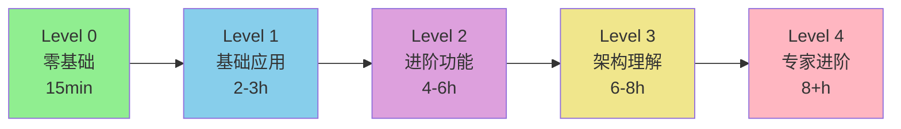

# 🚀 Zhin.js 快速学习指南

> **为初学者设计的渐进式学习路径**

## 🎯 适合你的学习路径

### 我是谁？选择你的角色：

<table>
<tr>
<td width="50%">

### 🌱 **完全新手**
**"我从没做过机器人"**

✨ **推荐路径**: 零基础启动
- ⏱️ 时间: 15 分钟
- 🎯 目标: 看到机器人跑起来
- 📖 开始: [Level 0 教程](./tutorials/level0-quickstart.md)

```bash
# 3 行命令就能启动！
npm create zhin-app my-bot
cd my-bot
pnpm dev
```

</td>
<td width="50%">

### 💻 **有编程基础**
**"我会 JavaScript/TypeScript"**

⚡ **推荐路径**: 基础应用
- ⏱️ 时间: 2-3 小时
- 🎯 目标: 开发实用插件
- 📖 开始: [Level 1 教程](./tutorials/level1-basics.md)

```typescript
// 立即开始写代码！
addCommand(new MessageCommand('hello')
  .action(() => '你好！')
)
```

</td>
</tr>
<tr>
<td width="50%">

### 🚀 **有框架经验**
**"我用过其他机器人框架"**

🎨 **推荐路径**: 进阶功能
- ⏱️ 时间: 4-6 小时
- 🎯 目标: 掌握高级特性
- 📖 开始: [核心概念](./guide/concepts.md)

```typescript
// 体验依赖注入
useContext('database', 'cache', 
  (db, cache) => {
    // 自动管理依赖
  }
)
```

</td>
<td width="50%">

### 🏆 **追求深度**
**"我想成为专家"**

🧠 **推荐路径**: 架构深入
- ⏱️ 时间: 8+ 小时
- 🎯 目标: 精通框架设计
- 📖 开始: [架构解析](./guide/architecture.md)

```typescript
// 理解四层架构
App → HMR → Dependency → Plugin
```

</td>
</tr>
</table>

---

## 📚 完整学习路径



### 详细路径规划

| Level | 主题 | 时间 | 你将学到 | 开始链接 |
|-------|------|------|----------|----------|
| 0️⃣ | **零基础启动** | 15 分钟 | 启动机器人、发送消息、体验热重载 | [开始](./tutorials/level0-quickstart.md) |
| 1️⃣ | **基础应用** | 2-3 小时 | 命令系统、消息监听、日志使用 | [开始](./tutorials/level1-basics.md) |
| 2️⃣ | **进阶功能** | 4-6 小时 | 中间件、依赖注入、配置系统 | [开始](./guide/concepts.md) |
| 3️⃣ | **架构理解** | 6-8 小时 | 四层架构、热重载原理、性能优化 | [开始](./guide/architecture.md) |
| 4️⃣ | **专家进阶** | 8+ 小时 | 自定义适配器、复杂插件、生产部署 | [开始](./guide/best-practices.md) |

---

## ⚡ 5分钟快速体验

### 如果你只有5分钟...

```bash
# 1️⃣ 创建项目（自动安装依赖）
npm create zhin-app demo-bot -y

# 2️⃣ 启动
cd demo-bot && pnpm dev

# 3️⃣ 测试（在终端输入）
> hello
< 你好！欢迎使用 Zhin 机器人框架！

# 4️⃣ 打开浏览器
# http://localhost:8086
```

✅ **完成！你已经有一个运行中的机器人了！**

---

## 💡 按需求学习

### 我想...

<details>
<summary>🎯 <strong>快速做一个问答机器人</strong></summary>

```typescript
// src/plugins/qa.ts
import { onMessage } from 'zhin.js'

const qa = {
  '你好': '你好！有什么可以帮助你的吗？',
  '天气': '今天天气很好！☀️',
  '时间': () => `现在是 ${new Date().toLocaleString()}`
}

onMessage(async (message) => {
  for (const [question, answer] of Object.entries(qa)) {
    if (message.raw.includes(question)) {
      const reply = typeof answer === 'function' ? answer() : answer
      await message.reply(reply)
      break
    }
  }
})
```

**10 行代码搞定！** [查看完整教程](./tutorials/level1-basics.md#part-2-消息监听)

</details>

<details>
<summary>🎲 <strong>做一个游戏机器人</strong></summary>

```typescript
// 骰子游戏
addCommand(new MessageCommand('roll [sides:number=6]')
  .action((message, result) => {
    const sides = result.params.sides ?? 6
    const roll = Math.floor(Math.random() * sides) + 1
    return `🎲 你掷出了 ${roll} 点！`
  })
)

// 猜数字游戏
let secretNumber = Math.floor(Math.random() * 100) + 1

addCommand(new MessageCommand('guess <num:number>')
  .action((message, result) => {
    const guess = result.params.num
    if (guess === secretNumber) {
      secretNumber = Math.floor(Math.random() * 100) + 1
      return '🎉 恭喜你猜对了！新的数字已生成！'
    }
    return guess < secretNumber ? '📈 太小了！' : '📉 太大了！'
  })
)
```

**简单有趣！** [查看更多示例](./examples/index.md)

</details>

<details>
<summary>📊 <strong>构建管理工具（签到、统计等）</strong></summary>

```typescript
// 用户签到系统
const userData = new Map()

addCommand(new MessageCommand('checkin')
  .action((message) => {
    const userId = message.sender.id
    const user = userData.get(userId) || { days: 0, points: 0 }
    
    user.days++
    user.points += 10
    userData.set(userId, user)
    
    return `✅ 签到成功！连续${user.days}天，获得${user.points}积分`
  })
)
```

**实用功能！** [查看完整实现](./examples/advanced-usage.md)

</details>

<details>
<summary>🌐 <strong>连接到 QQ/Discord/Telegram</strong></summary>

```typescript
// zhin.config.ts
export default defineConfig({
  bots: [
    // QQ
    {
      context: 'icqq',
      uin: 123456789,
      password: 'your-password'
    },
    // Discord
    {
      context: 'discord',
      token: 'your-bot-token'
    }
  ],
  plugins: [
    'adapter-icqq',
    'adapter-discord',
    'your-plugin'
  ]
})
```

**多平台支持！** [查看适配器文档](./official/adapters.md)

</details>

<details>
<summary>🔥 <strong>理解热重载是如何工作的</strong></summary>

**核心机制**:

1. **文件监听**: 监控插件文件变化
2. **缓存清除**: 清除 Node.js 模块缓存
3. **重新加载**: 动态导入更新的模块
4. **依赖注入**: 智能重新注入服务

```typescript
// 多运行时兼容的缓存清除
const cache = isBun ? 
  require?.cache?.[filePath] || import.meta?.cache?.[filePath] :
  isCommonJS ? 
    require?.cache?.[filePath] :
    import.meta?.cache?.[filePath]

delete require?.cache?.[filePath]
delete import.meta?.cache?.[filePath]

// 防缓存动态导入
await import(`${fileUrl}?t=${Date.now()}`)
```

**深入原理！** [查看架构文档](./guide/innovations.md)

</details>

---

## 📖 文档导航

### 快速参考

| 文档类型 | 链接 | 说明 |
|---------|------|------|
| 🚀 **入门教程** | [零基础启动](./tutorials/level0-quickstart.md) | 15分钟上手 |
| 📘 **基础学习** | [Level 1 教程](./tutorials/level1-basics.md) | 命令和插件 |
| 📙 **进阶学习** | [核心概念](./guide/concepts.md) | 中间件和服务 |
| 📕 **架构深入** | [架构设计](./guide/architecture.md) | 理解框架设计 |
| 📗 **专家指南** | [最佳实践](./guide/best-practices.md) | 生产环境部署 |
| 🔍 **API 参考** | [API 文档](./api/index.md) | 完整 API 列表 |
| 💡 **示例代码** | [示例集合](./examples/index.md) | 实用案例 |

---

## 🎓 学习建议

### ✅ 有效的学习方法

1. **边学边练**: 每个概念都要写代码验证
2. **循序渐进**: 不要跳级，扎实掌握每个 Level
3. **阅读代码**: 看示例项目的源码
4. **提问交流**: 在社区分享你的问题和经验
5. **做笔记**: 记录关键概念和常用代码

### ❌ 要避免的陷阱

1. ~~急于求成，跳过基础~~
2. ~~只看不练，不写代码~~
3. ~~遇到问题就放弃~~
4. ~~不看文档，盲目尝试~~
5. ~~独自苦战，不寻求帮助~~

---

## 📊 学习进度追踪

复制下面的清单到你的笔记中，完成一项打勾一项：

### Level 0 - 零基础启动 ✨
- [ ] 成功创建项目
- [ ] 启动机器人
- [ ] 发送第一条消息
- [ ] 访问 Web 控制台
- [ ] 体验热重载

### Level 1 - 基础应用 📘
- [ ] 创建简单命令
- [ ] 使用命令参数
- [ ] 监听消息事件
- [ ] 使用日志系统
- [ ] 完成计算器项目

### Level 2 - 进阶功能 📙
- [ ] 编写中间件
- [ ] 理解依赖注入
- [ ] 配置 Schema
- [ ] 完成签到系统
- [ ] 完成 TODO 管理

### Level 3 - 架构理解 📕
- [ ] 理解四层架构
- [ ] 掌握热重载原理
- [ ] 深入依赖注入
- [ ] 阅读核心源码
- [ ] 完成性能监控项目

### Level 4 - 专家进阶 📗
- [ ] 开发自定义适配器
- [ ] 发布插件
- [ ] 生产环境部署
- [ ] 贡献开源代码
- [ ] 帮助其他开发者

---

## 🆘 遇到问题？

### 自助指南

1. **📖 查文档**: 使用搜索功能查找关键词
2. **🔍 看示例**: 在 [examples](./examples/) 目录找类似案例
3. **💬 问社区**: [GitHub Discussions](https://github.com/zhinjs/zhin/discussions)
4. **🐛 报 Bug**: [GitHub Issues](https://github.com/zhinjs/zhin/issues)

### 常见问题快速解决

<details>
<summary>❓ <strong>端口被占用</strong></summary>

```typescript
// zhin.config.ts
export default defineConfig({
  http: {
    port: 3000, // 改成其他端口
    // ...
  }
})
```

</details>

<details>
<summary>❓ <strong>热重载不工作</strong></summary>

检查清单:
- [ ] 是否在 `dev` 模式运行？
- [ ] 文件是否保存？
- [ ] 文件是否在 `src/plugins/` 目录？
- [ ] 终端是否有错误？

</details>

<details>
<summary>❓ <strong>命令不响应</strong></summary>

检查:
1. 命令格式是否正确？
2. 插件是否加载？（看日志）
3. 是否有语法错误？
4. 尝试重启机器人

</details>

---

## 🎉 开始你的学习之旅！

选择你的起点：

<table>
<tr>
<td align="center" width="33%">

### 🌱 新手
**从零开始**

👉 [Level 0 教程](./tutorials/level0-quickstart.md)

15 分钟快速入门

</td>
<td align="center" width="33%">

### 💻 开发者
**快速上手**

👉 [Level 1 教程](./tutorials/level1-basics.md)

2-3 小时掌握基础

</td>
<td align="center" width="33%">

### 🚀 进阶
**深入学习**

👉 [完整学习路径](./guide/learning-path.md)

系统化进阶指南

</td>
</tr>
</table>

---

💡 **记住**: 学习是一个渐进的过程，不要着急。每个专家都是从初学者开始的！

**🌟 祝你学习愉快，享受 Zhin.js 带来的乐趣！**

