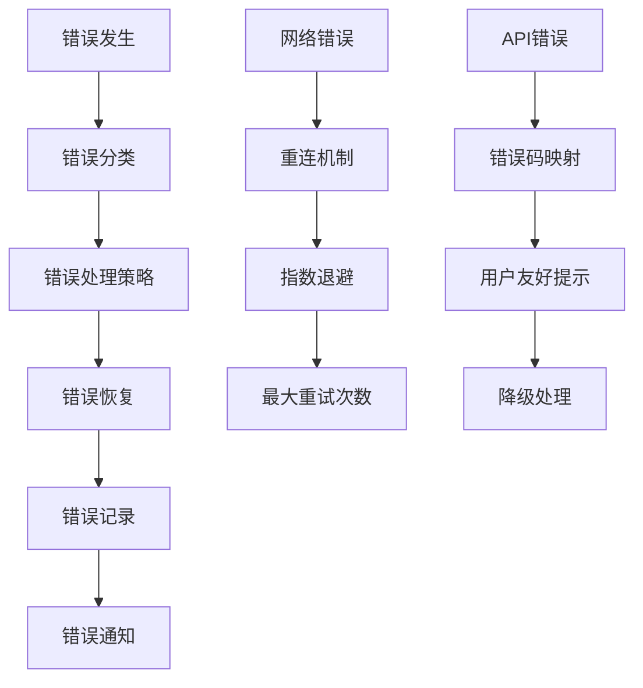

# 🚨 错误处理

深入了解 Zhin.js 适配器中的错误处理机制。

## 🎯 错误处理概述

错误处理是适配器稳定性的关键，需要处理网络错误、平台API错误、消息解析错误等各种异常情况。

## 🔄 错误处理流程

### 错误处理流程图


## 🚨 错误分类

### 错误类型定义
```typescript
enum ErrorType {
  NETWORK = 'network',
  API = 'api',
  AUTHENTICATION = 'authentication',
  RATE_LIMIT = 'rate_limit',
  PERMISSION = 'permission',
  MESSAGE_PARSE = 'message_parse',
  MESSAGE_SEND = 'message_send',
  CONNECTION = 'connection',
  UNKNOWN = 'unknown'
}

interface BotError extends Error {
  type: ErrorType
  code?: string | number
  retryable: boolean
  context?: any
  timestamp: number
}
```

### 错误分类器
```typescript
class ErrorClassifier {
  static classify(error: any): BotError {
    const botError: BotError = {
      name: error.name || 'BotError',
      message: error.message || 'Unknown error',
      type: ErrorType.UNKNOWN,
      retryable: false,
      timestamp: Date.now(),
      stack: error.stack
    }
    
    // 网络错误
    if (this.isNetworkError(error)) {
      botError.type = ErrorType.NETWORK
      botError.retryable = true
    }
    
    // API错误
    else if (this.isApiError(error)) {
      botError.type = ErrorType.API
      botError.code = error.code || error.status
      botError.retryable = this.isRetryableApiError(error)
    }
    
    // 认证错误
    else if (this.isAuthError(error)) {
      botError.type = ErrorType.AUTHENTICATION
      botError.retryable = false
    }
    
    // 限流错误
    else if (this.isRateLimitError(error)) {
      botError.type = ErrorType.RATE_LIMIT
      botError.retryable = true
    }
    
    // 权限错误
    else if (this.isPermissionError(error)) {
      botError.type = ErrorType.PERMISSION
      botError.retryable = false
    }
    
    return botError
  }
  
  private static isNetworkError(error: any): boolean {
    return error.code === 'ECONNRESET' ||
           error.code === 'ENOTFOUND' ||
           error.code === 'ETIMEDOUT' ||
           error.message.includes('timeout') ||
           error.message.includes('network')
  }
  
  private static isApiError(error: any): boolean {
    return error.status >= 400 && error.status < 600
  }
  
  private static isAuthError(error: any): boolean {
    return error.status === 401 || 
           error.code === 'UNAUTHORIZED' ||
           error.message.includes('token') ||
           error.message.includes('auth')
  }
  
  private static isRateLimitError(error: any): boolean {
    return error.status === 429 ||
           error.code === 'RATE_LIMITED' ||
           error.message.includes('rate limit')
  }
  
  private static isPermissionError(error: any): boolean {
    return error.status === 403 ||
           error.code === 'FORBIDDEN' ||
           error.message.includes('permission')
  }
  
  private static isRetryableApiError(error: any): boolean {
    return error.status >= 500 || 
           error.status === 429 ||
           error.code === 'TIMEOUT'
  }
}
```

## 🔄 重试机制

### 指数退避重试
```typescript
class RetryManager {
  private maxRetries = 5
  private baseDelay = 1000
  private maxDelay = 30000
  
  async executeWithRetry<T>(
    operation: () => Promise<T>,
    context?: string
  ): Promise<T> {
    let lastError: BotError
    
    for (let attempt = 0; attempt <= this.maxRetries; attempt++) {
      try {
        return await operation()
      } catch (error) {
        lastError = ErrorClassifier.classify(error)
        
        if (!lastError.retryable || attempt === this.maxRetries) {
          throw lastError
        }
        
        const delay = this.calculateDelay(attempt)
        this.plugin.logger.warn(
          `操作失败，${delay}ms后重试 (${attempt + 1}/${this.maxRetries}):`,
          lastError.message
        )
        
        await this.sleep(delay)
      }
    }
    
    throw lastError!
  }
  
  private calculateDelay(attempt: number): number {
    const delay = this.baseDelay * Math.pow(2, attempt)
    return Math.min(delay, this.maxDelay)
  }
  
  private sleep(ms: number): Promise<void> {
    return new Promise(resolve => setTimeout(resolve, ms))
  }
}
```

### 连接重试
```typescript
class MyBot implements Bot {
  private retryManager = new RetryManager()
  private reconnectAttempts = 0
  private maxReconnectAttempts = 10
  
  async connect() {
    try {
      await this.retryManager.executeWithRetry(
        () => this.establishConnection(),
        'Bot连接'
      )
      
      this.setConnected(true)
      this.reconnectAttempts = 0
      this.plugin.logger.info('Bot 连接成功')
      
    } catch (error) {
      this.plugin.logger.error('Bot 连接失败:', error)
      throw error
    }
  }
  
  private async establishConnection() {
    // 实现具体的连接逻辑
    await this.client.connect()
  }
  
  private async handleConnectionError(error: any) {
    const botError = ErrorClassifier.classify(error)
    
    if (botError.retryable && this.reconnectAttempts < this.maxReconnectAttempts) {
      this.reconnectAttempts++
      const delay = this.calculateReconnectDelay()
      
      this.plugin.logger.warn(
        `连接错误，${delay}ms后尝试重连 (${this.reconnectAttempts}/${this.maxReconnectAttempts}):`,
        botError.message
      )
      
      setTimeout(() => {
        this.connect()
      }, delay)
    } else {
      this.plugin.logger.error('重连次数超限，停止重连')
      this.plugin.emit('bot.connection.failed', botError)
    }
  }
  
  private calculateReconnectDelay(): number {
    const baseDelay = 5000
    const maxDelay = 300000 // 5分钟
    const delay = baseDelay * Math.pow(2, this.reconnectAttempts - 1)
    return Math.min(delay, maxDelay)
  }
}
```

## 📝 错误记录

### 错误日志记录
```typescript
class ErrorLogger {
  private errorCounts = new Map<string, number>()
  private errorHistory: BotError[] = []
  private maxHistorySize = 1000
  
  logError(error: BotError, context?: any) {
    // 记录错误计数
    const key = `${error.type}:${error.code || 'unknown'}`
    const count = this.errorCounts.get(key) || 0
    this.errorCounts.set(key, count + 1)
    
    // 记录错误历史
    this.errorHistory.push({
      ...error,
      context
    })
    
    // 限制历史记录大小
    if (this.errorHistory.length > this.maxHistorySize) {
      this.errorHistory.shift()
    }
    
    // 根据错误类型选择日志级别
    switch (error.type) {
      case ErrorType.NETWORK:
        this.plugin.logger.warn('网络错误:', error.message, context)
        break
      case ErrorType.API:
        this.plugin.logger.error('API错误:', error.message, context)
        break
      case ErrorType.AUTHENTICATION:
        this.plugin.logger.error('认证错误:', error.message, context)
        break
      case ErrorType.RATE_LIMIT:
        this.plugin.logger.warn('限流错误:', error.message, context)
        break
      case ErrorType.PERMISSION:
        this.plugin.logger.error('权限错误:', error.message, context)
        break
      default:
        this.plugin.logger.error('未知错误:', error.message, context)
    }
  }
  
  getErrorStats() {
    return {
      counts: Object.fromEntries(this.errorCounts),
      recent: this.errorHistory.slice(-10),
      total: this.errorHistory.length
    }
  }
}
```

### 错误监控
```typescript
class ErrorMonitor {
  private errorLogger = new ErrorLogger()
  private alertThresholds = {
    errorRate: 0.1, // 10%错误率
    consecutiveErrors: 5,
    criticalErrors: 3
  }
  
  private recentErrors: BotError[] = []
  private consecutiveErrorCount = 0
  
  handleError(error: BotError, context?: any) {
    this.errorLogger.logError(error, context)
    this.updateErrorStats(error)
    this.checkAlerts(error)
  }
  
  private updateErrorStats(error: BotError) {
    this.recentErrors.push(error)
    
    // 只保留最近100个错误
    if (this.recentErrors.length > 100) {
      this.recentErrors.shift()
    }
    
    if (error.type === ErrorType.API || error.type === ErrorType.NETWORK) {
      this.consecutiveErrorCount++
    } else {
      this.consecutiveErrorCount = 0
    }
  }
  
  private checkAlerts(error: BotError) {
    // 检查连续错误
    if (this.consecutiveErrorCount >= this.alertThresholds.consecutiveErrors) {
      this.triggerAlert('consecutive_errors', {
        count: this.consecutiveErrorCount,
        lastError: error
      })
    }
    
    // 检查错误率
    const errorRate = this.calculateErrorRate()
    if (errorRate >= this.alertThresholds.errorRate) {
      this.triggerAlert('high_error_rate', {
        rate: errorRate,
        recentErrors: this.recentErrors.slice(-10)
      })
    }
    
    // 检查关键错误
    if (error.type === ErrorType.AUTHENTICATION || error.type === ErrorType.PERMISSION) {
      this.triggerAlert('critical_error', {
        type: error.type,
        error: error
      })
    }
  }
  
  private calculateErrorRate(): number {
    const now = Date.now()
    const recentWindow = 5 * 60 * 1000 // 5分钟
    const recentErrors = this.recentErrors.filter(
      error => now - error.timestamp < recentWindow
    )
    
    // 这里需要知道总操作数，简化处理
    return recentErrors.length / 100 // 假设最近有100次操作
  }
  
  private triggerAlert(type: string, data: any) {
    this.plugin.emit('bot.alert', { type, data })
    this.plugin.logger.error(`Bot 告警 [${type}]:`, data)
  }
}
```

## 🔧 错误恢复

### 自动恢复策略
```typescript
class ErrorRecovery {
  private recoveryStrategies = new Map<ErrorType, (error: BotError) => Promise<void>>()
  
  constructor(private bot: MyBot) {
    this.setupRecoveryStrategies()
  }
  
  private setupRecoveryStrategies() {
    this.recoveryStrategies.set(ErrorType.NETWORK, this.handleNetworkError.bind(this))
    this.recoveryStrategies.set(ErrorType.RATE_LIMIT, this.handleRateLimitError.bind(this))
    this.recoveryStrategies.set(ErrorType.AUTHENTICATION, this.handleAuthError.bind(this))
    this.recoveryStrategies.set(ErrorType.CONNECTION, this.handleConnectionError.bind(this))
  }
  
  async recover(error: BotError) {
    const strategy = this.recoveryStrategies.get(error.type)
    if (strategy) {
      try {
        await strategy(error)
        this.bot.plugin.logger.info(`错误恢复成功: ${error.type}`)
      } catch (recoveryError) {
        this.bot.plugin.logger.error(`错误恢复失败: ${error.type}`, recoveryError)
      }
    }
  }
  
  private async handleNetworkError(error: BotError) {
    // 网络错误：等待一段时间后重连
    await this.sleep(5000)
    await this.bot.connect()
  }
  
  private async handleRateLimitError(error: BotError) {
    // 限流错误：等待更长时间
    const delay = this.extractRetryAfter(error) || 60000
    await this.sleep(delay)
  }
  
  private async handleAuthError(error: BotError) {
    // 认证错误：尝试重新认证
    await this.bot.authenticate()
  }
  
  private async handleConnectionError(error: BotError) {
    // 连接错误：重新建立连接
    await this.bot.disconnect()
    await this.sleep(2000)
    await this.bot.connect()
  }
  
  private extractRetryAfter(error: BotError): number | null {
    // 从错误中提取重试时间
    const retryAfter = error.context?.retryAfter || error.context?.retry_after
    return retryAfter ? parseInt(retryAfter) * 1000 : null
  }
  
  private sleep(ms: number): Promise<void> {
    return new Promise(resolve => setTimeout(resolve, ms))
  }
}
```

## 🔗 相关链接

- [Bot 接口实现](./bot-interface.md)
- [消息处理](./message-handling.md)
- [事件处理](./event-handling.md)
