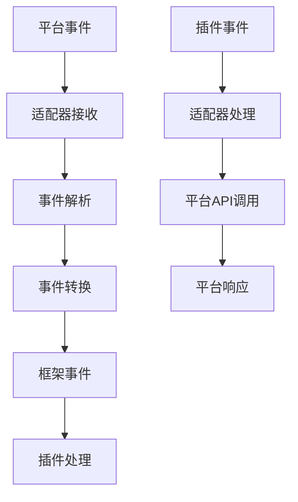

# 📡 事件处理

深入了解 Zhin.js 适配器中的事件处理机制。

## 🎯 事件处理概述

事件处理是适配器与框架交互的核心机制，通过事件系统实现消息传递、状态同步和错误处理。

## 🔄 事件流程

### 事件流程图


## 📥 接收事件

### 基础事件监听
```typescript
class MyBot implements Bot {
  private setupEventHandlers() {
    this.client.on('message', this.handleMessage.bind(this))
    this.client.on('error', this.handleError.bind(this))
    this.client.on('disconnect', this.handleDisconnect.bind(this))
    this.client.on('reconnect', this.handleReconnect.bind(this))
    this.client.on('ready', this.handleReady.bind(this))
  }
  
  private handleMessage(platformMessage: any) {
    try {
      const message = this.parseMessage(platformMessage)
      this.plugin.emit('message.receive', message)
    } catch (error) {
      this.plugin.logger.error('消息事件处理失败:', error)
    }
  }
  
  private handleError(error: any) {
    this.plugin.logger.error('Bot 错误:', error)
    this.plugin.emit('bot.error', error)
  }
  
  private handleDisconnect() {
    this.setConnected(false)
    this.plugin.emit('bot.disconnect')
  }
  
  private handleReconnect() {
    this.setConnected(true)
    this.plugin.emit('bot.reconnect')
  }
  
  private handleReady() {
    this.plugin.logger.info('Bot 已就绪')
    this.plugin.emit('bot.ready')
  }
}
```

### 消息事件分类
```typescript
class MyBot implements Bot {
  private handleMessage(platformMessage: any) {
    const message = this.parseMessage(platformMessage)
    
    // 触发通用消息事件
    this.plugin.emit('message.receive', message)
    
    // 根据消息类型触发特定事件
    switch (message.channel.type) {
      case 'private':
        this.plugin.emit('message.private.receive', message)
        break
      case 'group':
        this.plugin.emit('message.group.receive', message)
        break
      case 'channel':
        this.plugin.emit('message.channel.receive', message)
        break
    }
    
    // 根据消息内容触发事件
    this.triggerContentEvents(message)
  }
  
  private triggerContentEvents(message: Message) {
    // 检查是否包含@用户
    if (this.containsMention(message)) {
      this.plugin.emit('message.mention', message)
    }
    
    // 检查是否包含图片
    if (this.containsImage(message)) {
      this.plugin.emit('message.image', message)
    }
    
    // 检查是否是命令
    if (this.isCommand(message)) {
      this.plugin.emit('message.command', message)
    }
    
    // 检查是否包含链接
    if (this.containsLink(message)) {
      this.plugin.emit('message.link', message)
    }
  }
  
  private containsMention(message: Message): boolean {
    return message.content.some(segment => segment.type === 'at')
  }
  
  private containsImage(message: Message): boolean {
    return message.content.some(segment => segment.type === 'image')
  }
  
  private isCommand(message: Message): boolean {
    return message.raw.startsWith('/') || message.raw.startsWith('!')
  }
  
  private containsLink(message: Message): boolean {
    const urlRegex = /https?:\/\/[^\s]+/g
    return urlRegex.test(message.raw)
  }
}
```

## 📤 发送事件

### 事件发送接口
```typescript
class MyBot implements Bot {
  async sendMessage(options: SendOptions) {
    try {
      // 触发发送前事件
      this.plugin.emit('message.send.before', options)
      
      const platformMessage = this.convertToPlatformFormat(options)
      await this.client.sendMessage(platformMessage)
      
      // 触发发送成功事件
      this.plugin.emit('message.send.success', options)
      
      this.plugin.logger.debug('消息发送成功:', options)
    } catch (error) {
      // 触发发送失败事件
      this.plugin.emit('message.send.error', { options, error })
      
      this.plugin.logger.error('消息发送失败:', error)
      throw error
    }
  }
}
```

### 状态变化事件
```typescript
class MyBot implements Bot {
  private _connected = false
  
  get connected(): boolean {
    return this._connected
  }
  
  private setConnected(value: boolean) {
    const wasConnected = this._connected
    this._connected = value
    
    if (wasConnected !== value) {
      this.plugin.emit('bot.connection.changed', {
        connected: value,
        bot: this.config.name,
        context: this.config.context
      })
      
      if (value) {
        this.plugin.emit('bot.connected', {
          bot: this.config.name,
          context: this.config.context
        })
      } else {
        this.plugin.emit('bot.disconnected', {
          bot: this.config.name,
          context: this.config.context
        })
      }
    }
  }
}
```

## 🎯 自定义事件

### 事件定义
```typescript
interface BotEvents {
  'message.receive': (message: Message) => void
  'message.send.before': (options: SendOptions) => void
  'message.send.success': (options: SendOptions) => void
  'message.send.error': (data: { options: SendOptions; error: any }) => void
  'bot.connected': (data: { bot: string; context: string }) => void
  'bot.disconnected': (data: { bot: string; context: string }) => void
  'bot.error': (error: any) => void
  'bot.ready': () => void
}
```

### 事件触发
```typescript
class MyBot implements Bot {
  private triggerCustomEvent<T extends keyof BotEvents>(
    event: T,
    ...args: Parameters<BotEvents[T]>
  ) {
    this.plugin.emit(event, ...args)
  }
  
  private handlePlatformEvent(eventName: string, data: any) {
    switch (eventName) {
      case 'user_join':
        this.triggerCustomEvent('bot.user.join', data)
        break
      case 'user_leave':
        this.triggerCustomEvent('bot.user.leave', data)
        break
      case 'channel_create':
        this.triggerCustomEvent('bot.channel.create', data)
        break
      case 'channel_delete':
        this.triggerCustomEvent('bot.channel.delete', data)
        break
      default:
        this.plugin.logger.debug('未知平台事件:', eventName, data)
    }
  }
}
```

## 🔧 事件中间件

### 事件中间件系统
```typescript
class MyBot implements Bot {
  private eventMiddlewares: Array<(event: string, data: any) => any> = []
  
  addEventMiddleware(middleware: (event: string, data: any) => any) {
    this.eventMiddlewares.push(middleware)
  }
  
  private processEvent(event: string, data: any) {
    let processedData = data
    
    for (const middleware of this.eventMiddlewares) {
      try {
        processedData = middleware(event, processedData)
      } catch (error) {
        this.plugin.logger.error('事件中间件处理失败:', error)
      }
    }
    
    return processedData
  }
  
  private emitEvent(event: string, data: any) {
    const processedData = this.processEvent(event, data)
    this.plugin.emit(event, processedData)
  }
}
```

### 内置中间件
```typescript
class EventMiddlewares {
  static addTimestamp(event: string, data: any) {
    return {
      ...data,
      timestamp: Date.now()
    }
  }
  
  static addBotInfo(event: string, data: any) {
    return {
      ...data,
      bot: this.config.name,
      context: this.config.context
    }
  }
  
  static filterSensitiveData(event: string, data: any) {
    if (event.includes('message')) {
      return {
        ...data,
        content: this.sanitizeContent(data.content)
      }
    }
    return data
  }
  
  private static sanitizeContent(content: any): any {
    // 实现敏感数据过滤逻辑
    return content
  }
}
```

## 📊 事件统计

### 事件统计收集
```typescript
class MyBot implements Bot {
  private eventStats = new Map<string, number>()
  private eventTimestamps = new Map<string, number[]>()
  
  private trackEvent(event: string) {
    const count = this.eventStats.get(event) || 0
    this.eventStats.set(event, count + 1)
    
    const timestamps = this.eventTimestamps.get(event) || []
    timestamps.push(Date.now())
    
    // 只保留最近1000个时间戳
    if (timestamps.length > 1000) {
      timestamps.splice(0, timestamps.length - 1000)
    }
    
    this.eventTimestamps.set(event, timestamps)
  }
  
  private emitEvent(event: string, data: any) {
    this.trackEvent(event)
    this.plugin.emit(event, data)
  }
  
  getEventStats() {
    const stats: Record<string, any> = {}
    
    for (const [event, count] of this.eventStats) {
      const timestamps = this.eventTimestamps.get(event) || []
      const now = Date.now()
      const recentCount = timestamps.filter(ts => now - ts < 60000).length // 最近1分钟
      
      stats[event] = {
        total: count,
        recent: recentCount,
        rate: recentCount / 60 // 每秒事件数
      }
    }
    
    return stats
  }
}
```

## 🔗 相关链接

- [Bot 接口实现](./bot-interface.md)
- [消息处理](./message-handling.md)
- [错误处理](./error-handling.md)
