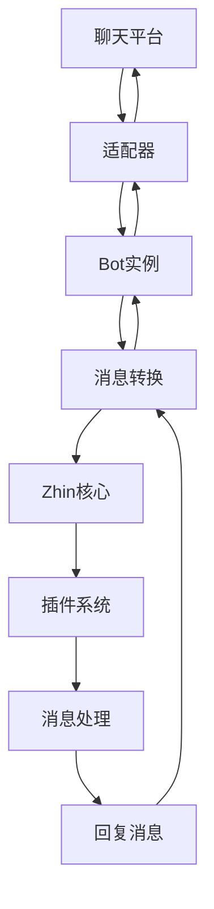

# 🔌 适配器开发指南

本指南将帮助你为 Zhin.js 开发新的平台适配器，连接各种聊天平台。

> **生态说明**：Zhin.js 开箱即用支持控制台适配器、HTTP 服务、Web 控制台、SQLite 数据库。Telegram、Discord、QQ、KOOK、OneBot v11、MySQL、PostgreSQL 等需手动安装扩展包。建议适配器开发优先兼容主仓库内置平台，跨平台请注明依赖。

## 🎯 适配器核心概念

适配器是连接不同聊天平台的桥梁，是 Zhin 多平台支持的核心。一个优秀的适配器应该：

- 🔗 **平台连接管理** - 稳定的连接建立和维护
- 💬 **消息双向传输** - 接收和发送消息的完整支持
- 📡 **事件处理** - 处理平台特有的事件类型
- 🔄 **会话管理** - 维护用户和群组的会话状态
- 🛡️ **错误恢复** - 自动重连和异常处理

## 🏗️ 适配器架构



## 📁 现代适配器结构

基于实际项目的适配器实现：

```typescript
import { 
  Adapter, 
  Bot, 
  BotConfig, 
  SendOptions,
  Plugin 
} from 'zhin.js'

// 🔧 Bot配置接口
interface MyBotConfig extends BotConfig {
  name: string           // 机器人名称
  context: string        // 适配器上下文名
  token: string          // 平台访问令牌
  endpoint?: string      // 可选的API端点
  options?: {
    reconnect?: boolean  // 是否自动重连
    timeout?: number     // 连接超时时间
  }
}

// 🤖 Bot实现
class MyBot implements Bot<MyBotConfig> {
  public connected = false
  private client: any
  
  constructor(
    private plugin: Plugin,
    public config: MyBotConfig
  ) {}
  
  async connect() {
    try {
      // 🔗 建立平台连接
      this.client = await this.createConnection()
      this.setupEventHandlers()
      this.connected = true
      
      this.plugin.logger.info(`机器人 ${this.config.name} 连接成功`)
    } catch (error) {
      this.plugin.logger.error('连接失败:', error)
      throw error
    }
  }
  
  async disconnect() {
    try {
      if (this.client) {
        await this.client.disconnect()
      }
      this.connected = false
      
      this.plugin.logger.info(`机器人 ${this.config.name} 已断开连接`)
    } catch (error) {
      this.plugin.logger.error('断开连接失败:', error)
    }
  }
  
  async sendMessage(options: SendOptions) {
    if (!this.connected) {
      throw new Error('机器人未连接')
    }
    
    try {
      // 🔄 转换消息格式
      const platformMessage = this.convertToPlatformFormat(options)
      
      // 📤 发送消息
      await this.client.sendMessage(platformMessage)
      
      this.plugin.logger.debug('消息发送成功:', options)
    } catch (error) {
      this.plugin.logger.error('消息发送失败:', error)
      throw error
    }
  }
  
  // 🔧 私有方法
  private async createConnection() {
    // 实现具体的连接逻辑
    return await createPlatformClient(this.config)
  }
  
  private setupEventHandlers() {
    // 📡 设置事件监听
    this.client.on('message', this.handleMessage.bind(this))
    this.client.on('error', this.handleError.bind(this))
    this.client.on('disconnect', this.handleDisconnect.bind(this))
  }
  
  private handleMessage(rawMessage: any) {
    // 💬 处理收到的消息
    const message = this.convertFromPlatformFormat(rawMessage)
    
    // 🎯 触发消息事件
    this.plugin.emit('message.receive', message)
    
    // 📋 根据消息类型触发特定事件
    if (message.type === 'group') {
      this.plugin.emit('message.group.receive', message)
    } else {
      this.plugin.emit('message.private.receive', message)
    }
  }
  
  private handleError(error: any) {
    this.plugin.logger.error('平台错误:', error)
    
    // 🔄 自动重连逻辑
    if (this.config.options?.reconnect && this.shouldReconnect(error)) {
      this.reconnect()
    }
  }
  
  private async reconnect() {
    try {
      await this.disconnect()
      await new Promise(resolve => setTimeout(resolve, 5000)) // 等待5秒
      await this.connect()
    } catch (error) {
      this.plugin.logger.error('重连失败:', error)
    }
  }
}

// 🔌 适配器实现
export class MyAdapter extends Adapter {
  constructor() {
    super('my-platform', (plugin, config) => new MyBot(plugin, config))
  }
  
  // 可以重写适配器方法来自定义行为
  async start() {
    await super.start()
    this.plugin.logger.info(`${this.name} 适配器启动完成`)
  }
  
  async stop() {
    await super.stop()
    this.plugin.logger.info(`${this.name} 适配器已停止`)
  }
}
```

## 🎯 实际适配器示例

### 📱 基于现有适配器的学习

让我们看看项目中已有的适配器实现：

#### 1️⃣ Process 适配器（控制台交互）
```typescript
// 基于 adapters/process/index.ts
import { Adapter, Bot, BotConfig, SendOptions } from 'zhin.js'

interface ProcessBotConfig extends BotConfig {
  name: string
  context: 'process'
}

class ProcessBot implements Bot<ProcessBotConfig> {
  connected = false
  
  constructor(
    private plugin: Plugin,
    public config: ProcessBotConfig
  ) {}
  
  async connect() {
    this.connected = true
    
    // 🎯 监听控制台输入
    process.stdin.on('data', (data) => {
      const content = data.toString().trim()
      if (content) {
        this.handleConsoleInput(content)
      }
    })
    
    this.plugin.logger.info('控制台机器人已就绪，可以直接输入消息')
  }
  
  async disconnect() {
    this.connected = false
    process.stdin.removeAllListeners('data')
  }
  
  async sendMessage(options: SendOptions) {
    // 🖨️ 输出到控制台
    console.log(`[${new Date().toLocaleTimeString()}] ${options.content}`)
  }
  
  private handleConsoleInput(content: string) {
    const message = {
      id: Date.now().toString(),
      type: 'private' as const,
      raw: content,
      content: [{ type: 'text', data: { text: content } }],
      sender: {
        id: 'console-user',
        name: '控制台用户'
      },
      reply: async (replyContent: string) => {
        await this.sendMessage({
          context: this.config.context,
          bot: this.config.name,
          id: 'console',
          type: 'private',
          content: replyContent
        })
      }
    }
    
    // 触发消息事件
    this.plugin.emit('message.receive', message)
  }
}

export class ProcessAdapter extends Adapter {
  constructor() {
    super('process', (plugin, config) => new ProcessBot(plugin, config))
  }
}
```

#### 2️⃣ WebSocket 适配器（OneBot v11）
```typescript
// 基于 adapters/onebot11/index.ts
import WebSocket from 'ws'

interface OneBot11Config extends BotConfig {
  name: string
  context: 'onebot11'
  url: string
  access_token?: string
}

class OneBot11Bot implements Bot<OneBot11Config> {
  private ws?: WebSocket
  private heartbeatInterval?: NodeJS.Timeout
  connected = false
  
  async connect() {
    const wsUrl = new URL('/ws', this.config.url)
    if (this.config.access_token) {
      wsUrl.searchParams.set('access_token', this.config.access_token)
    }
    
    this.ws = new WebSocket(wsUrl.toString())
    
    this.ws.on('open', () => {
      this.connected = true
      this.startHeartbeat()
      this.plugin.logger.info('OneBot WebSocket 连接成功')
    })
    
    this.ws.on('message', (data) => {
      try {
        const payload = JSON.parse(data.toString())
        this.handleWebSocketMessage(payload)
      } catch (error) {
        this.plugin.logger.error('消息解析失败:', error)
      }
    })
    
    this.ws.on('close', () => {
      this.connected = false
      this.stopHeartbeat()
      
      // 🔄 自动重连
      setTimeout(() => {
        if (!this.connected) {
          this.connect()
        }
      }, 5000)
    })
  }
  
  async sendMessage(options: SendOptions) {
    if (!this.ws || !this.connected) {
      throw new Error('WebSocket 未连接')
    }
    
    const apiCall = {
      action: options.type === 'group' ? 'send_group_msg' : 'send_private_msg',
      params: {
        [options.type === 'group' ? 'group_id' : 'user_id']: options.id,
        message: options.content
      }
    }
    
    this.ws.send(JSON.stringify(apiCall))
  }
  
  private startHeartbeat() {
    this.heartbeatInterval = setInterval(() => {
      if (this.ws && this.connected) {
        this.ws.ping()
      }
    }, 30000)
  }
  
  private stopHeartbeat() {
    if (this.heartbeatInterval) {
      clearInterval(this.heartbeatInterval)
    }
  }
}
```

#### 3️⃣ HTTP API 适配器（KOOK）
```typescript
// 基于 adapters/kook/index.ts  
import { Client as KookClient } from 'kook-client'

interface KookBotConfig extends BotConfig {
  name: string
  context: 'kook'
  token: string
  mode: 'websocket' | 'webhook'
  logLevel?: 'off' | 'info' | 'debug'
  ignore?: 'bot' | 'none'
}

class KookBot implements Bot<KookBotConfig> {
  private client: KookClient
  connected = false
  
  constructor(
    private plugin: Plugin,
    public config: KookBotConfig
  ) {
    this.client = new KookClient({
      token: config.token,
      mode: config.mode,
      logLevel: config.logLevel || 'info'
    })
  }
  
  async connect() {
    // 🎯 设置事件监听
    this.client.on('message', this.handleKookMessage.bind(this))
    this.client.on('ready', () => {
      this.connected = true
      this.plugin.logger.info(`KOOK机器人 ${this.config.name} 已就绪`)
    })
    
    // 🔗 连接到KOOK
    await this.client.connect()
  }
  
  async disconnect() {
    await this.client.disconnect()
    this.connected = false
  }
  
  async sendMessage(options: SendOptions) {
    const channel = options.type === 'group' ? options.id : null
    const userId = options.type === 'private' ? options.id : null
    
    if (channel) {
      await this.client.sendChannelMessage(channel, options.content)
    } else if (userId) {
      await this.client.sendDirectMessage(userId, options.content)
    }
  }
  
  private handleKookMessage(kookMsg: any) {
    // 🔄 转换KOOK消息格式
    const message = {
      id: kookMsg.msgId,
      type: kookMsg.channelType === 'GROUP' ? 'group' : 'private',
      raw: kookMsg.content,
      content: [{ type: 'text', data: { text: kookMsg.content } }],
      sender: {
        id: kookMsg.authorId,
        name: kookMsg.author?.nickname || '未知用户'
      },
      channel: kookMsg.channelType === 'GROUP' ? {
        id: kookMsg.targetId,
        name: kookMsg.extra?.guild?.name || '未知频道'
      } : undefined
    }
    
    this.plugin.emit('message.receive', message)
  }
}
```

## 🚀 适配器最佳实践

### 💡 错误处理策略

```typescript
import { useLogger } from 'zhin.js'

class MyBot implements Bot {
  private logger = useLogger()
  
  // 🛡️ 安全调用包装器
  private async safeCall<T>(
    action: () => Promise<T>,
    errorMessage: string,
    fallback?: T
  ): Promise<T> {
    try {
      return await action()
    } catch (error) {
      this.logger.error(`${errorMessage}:`, error)
      
      if (fallback !== undefined) {
        return fallback
      }
      throw error
    }
  }
  
  // 🔄 重试机制
  private async withRetry<T>(
    action: () => Promise<T>,
    maxRetries = 3,
    delay = 1000
  ): Promise<T> {
    let lastError: Error
    
    for (let attempt = 1; attempt <= maxRetries; attempt++) {
      try {
        return await action()
      } catch (error) {
        lastError = error as Error
        
        if (attempt === maxRetries) {
          throw lastError
        }
        
        // 指数退避延迟
        const backoffDelay = delay * Math.pow(2, attempt - 1)
        await new Promise(resolve => setTimeout(resolve, backoffDelay))
        
        this.logger.warn(`第 ${attempt} 次尝试失败，${backoffDelay}ms 后重试:`, error)
      }
    }
    
    throw lastError!
  }
  
  async sendMessage(options: SendOptions) {
    return this.withRetry(
      () => this.safeCall(
        () => this.client.sendMessage(options),
        '发送消息失败'
      ),
      3,
      1000
    )
  }
}
```

### 🧹 资源管理

```typescript
class MyBot implements Bot {
  private cleanupTasks: (() => Promise<void>)[] = []
  private timers: NodeJS.Timeout[] = []
  private connections: any[] = []
  
  async connect() {
    // 创建连接
    const connection = await this.createConnection()
    this.connections.push(connection)
    
    // 注册清理任务
    this.addCleanupTask(async () => {
      await connection.close()
    })
    
    // 启动心跳
    const heartbeat = setInterval(() => {
      this.sendHeartbeat()
    }, 30000)
    this.timers.push(heartbeat)
  }
  
  async disconnect() {
    // 清理定时器
    this.timers.forEach(timer => clearInterval(timer))
    this.timers = []
    
    // 执行所有清理任务
    await Promise.allSettled(
      this.cleanupTasks.map(task => task())
    )
    this.cleanupTasks = []
    
    // 关闭连接
    await Promise.allSettled(
      this.connections.map(conn => conn.close())
    )
    this.connections = []
    
    this.connected = false
  }
  
  private addCleanupTask(task: () => Promise<void>) {
    this.cleanupTasks.push(task)
  }
}
```

### 🔧 配置验证

```typescript
import { z } from 'zod'

// 配置模式定义
const BotConfigSchema = z.object({
  name: z.string().min(1),
  token: z.string().min(1),
  endpoint: z.string().url().optional(),
  options: z.object({
    reconnect: z.boolean().default(true),
    timeout: z.number().min(1000).default(5000),
    retries: z.number().min(1).max(10).default(3)
  }).default({})
})

class MyBot implements Bot {
  private validatedConfig: z.infer<typeof BotConfigSchema>
  
  constructor(plugin: Plugin, config: any) {
    // ✅ 验证配置
    this.validatedConfig = BotConfigSchema.parse(config)
    this.plugin = plugin
  }
  
  async connect() {
    const { token, endpoint, options } = this.validatedConfig
    
    // 使用验证过的配置
    this.client = await createClient(token, {
      endpoint,
      timeout: options.timeout,
      reconnect: options.reconnect
    })
  }
}
```

### 📊 性能监控

```typescript
class MyBot implements Bot {
  private stats = {
    messagesReceived: 0,
    messagesSent: 0,
    errors: 0,
    connectionUptime: Date.now()
  }
  
  async sendMessage(options: SendOptions) {
    const start = Date.now()
    
    try {
      await this.client.sendMessage(options)
      this.stats.messagesSent++
      
      const duration = Date.now() - start
      this.logger.debug(`消息发送成功 (${duration}ms)`)
      
    } catch (error) {
      this.stats.errors++
      throw error
    }
  }
  
  private handleMessage(message: any) {
    this.stats.messagesReceived++
    
    // 处理消息...
    this.plugin.emit('message.receive', convertedMessage)
  }
  
  getStats() {
    return {
      ...this.stats,
      uptime: Date.now() - this.stats.connectionUptime
    }
  }
}
```

## 🎯 适配器注册和使用

### 📝 注册适配器

```typescript
// adapters/my-platform/index.ts
export { MyAdapter as default } from './adapter'

// 或者在插件中注册
import { registerAdapter } from 'zhin.js'
import { MyAdapter } from './my-adapter'

registerAdapter(new MyAdapter())
```

### ⚙️ 配置使用

```typescript
// zhin.config.ts
export default defineConfig(async (env) => {
  return {
    bots: [
      {
        name: 'my-bot',
        context: 'my-platform',  // 对应适配器名称
        token: env.MY_PLATFORM_TOKEN,
        endpoint: env.MY_PLATFORM_ENDPOINT,
        options: {
          reconnect: true,
          timeout: 10000
        }
      }
    ],
    plugins: [
      'adapter-my-platform',  // 启用适配器插件
      'my-other-plugins'
    ]
  }
})
```

## 🧪 测试适配器

### 单元测试示例

```typescript
// tests/adapter.test.ts
import { describe, it, expect, beforeEach, afterEach } from 'vitest'
import { MyAdapter, MyBot } from '../src/adapter'

describe('MyAdapter', () => {
  let adapter: MyAdapter
  let mockPlugin: any
  
  beforeEach(() => {
    mockPlugin = {
      logger: {
        info: vi.fn(),
        error: vi.fn(),
        debug: vi.fn()
      },
      emit: vi.fn()
    }
    
    adapter = new MyAdapter()
  })
  
  it('should create bot instance correctly', () => {
    const config = {
      name: 'test-bot',
      context: 'my-platform',
      token: 'test-token'
    }
    
    const bot = adapter.createBot(mockPlugin, config)
    expect(bot).toBeInstanceOf(MyBot)
    expect(bot.config).toEqual(config)
  })
  
  it('should handle connection success', async () => {
    const bot = adapter.createBot(mockPlugin, {
      name: 'test-bot',
      context: 'my-platform', 
      token: 'valid-token'
    })
    
    await bot.connect()
    expect(bot.connected).toBe(true)
    expect(mockPlugin.logger.info).toHaveBeenCalledWith(
      expect.stringContaining('连接成功')
    )
  })
  
  it('should handle connection failure', async () => {
    const bot = adapter.createBot(mockPlugin, {
      name: 'test-bot',
      context: 'my-platform',
      token: 'invalid-token'
    })
    
    await expect(bot.connect()).rejects.toThrow()
    expect(mockPlugin.logger.error).toHaveBeenCalled()
  })
})
```


---

## 🌍 生态系统与扩展

### � 开箱即用
- 控制台适配器（@zhin.js/adapter-process，默认内置）
- HTTP 服务（@zhin.js/http）
- Web 控制台（@zhin.js/console）
- SQLite 数据库（默认）

### 🔌 可选扩展（需手动安装）
- Telegram（@zhin.js/adapter-telegram）
- Discord（@zhin.js/adapter-discord）
- QQ（@zhin.js/adapter-qq）
- KOOK（@zhin.js/adapter-kook）
- OneBot v11（@zhin.js/adapter-onebot11）
- MySQL（@zhin.js/database-mysql）
- PostgreSQL（@zhin.js/database-pg）

## �📚 更多资源
- 📖 [完整 API 参考](../api/README.md) - 详细的接口定义
- 💡 [实用示例](../examples/README.md) - 更多适配器示例
- 🚀 [最佳实践指南](../guide/best-practices.md) - 生产环境优化
- 🎯 [现有适配器源码](../../adapters/) - 学习实际实现

---

🎉 **恭喜！** 你现在已经掌握了 Zhin 适配器开发的完整技能，可以为任何聊天平台创建高质量的适配器了！
