# 💬 消息处理

深入了解 Zhin.js 适配器中的消息处理机制。

## 🎯 消息处理概述

消息处理是适配器的核心功能，负责在平台原生消息格式和 Zhin.js 统一消息格式之间进行转换。

## 🔄 消息转换流程

### 转换流程图

```mermaid
graph LR
    A[平台原生消息] --> B[解析消息内容]
    B --> C[提取发送者信息]
    C --> D[提取频道信息]
    D --> E[构建Message对象]
    E --> F[触发事件]
    
    G[Zhin.js消息] --> H[转换为平台格式]
    H --> I[发送到平台]
```


## 📥 接收消息

### 基础消息解析
```typescript
class MyBot implements Bot {
  private handleMessage(platformMessage: any) {
    try {
      const message = this.parseMessage(platformMessage)
      this.plugin.emit('message.receive', message)
    } catch (error) {
      this.plugin.logger.error('消息解析失败:', error)
    }
  }
  
  private parseMessage(platformMessage: any): Message {
    return {
      id: this.generateMessageId(platformMessage),
      adapter: this.config.context,
      bot: this.config.name,
      content: this.parseContent(platformMessage.content),
      sender: this.parseSender(platformMessage.author),
      channel: this.parseChannel(platformMessage.channel),
      timestamp: this.parseTimestamp(platformMessage.timestamp),
      raw: this.extractRawText(platformMessage.content),
      reply: this.createReplyHandler(platformMessage)
    }
  }
}
```

### 消息内容解析
```typescript
class MyBot implements Bot {
  private parseContent(content: any): MessageSegment[] {
    if (typeof content === 'string') {
      return [{ type: 'text', data: { text: content } }]
    }
    
    if (Array.isArray(content)) {
      return content.map(segment => this.parseSegment(segment))
    }
    
    return []
  }
  
  private parseSegment(segment: any): MessageSegment {
    switch (segment.type) {
      case 'text':
        return { type: 'text', data: { text: segment.text } }
      
      case 'image':
        return { 
          type: 'image', 
          data: { 
            url: segment.url,
            width: segment.width,
            height: segment.height
          } 
        }
      
      case 'mention':
        return { 
          type: 'at', 
          data: { 
            id: segment.user_id,
            name: segment.name 
          } 
        }
      
      case 'emoji':
        return { 
          type: 'face', 
          data: { 
            id: segment.emoji_id,
            name: segment.name 
          } 
        }
      
      default:
        return { type: 'text', data: { text: String(segment) } }
    }
  }
}
```

### 发送者信息解析
```typescript
class MyBot implements Bot {
  private parseSender(author: any): MessageSender {
    return {
      id: author.id || author.user_id,
      name: author.name || author.username || author.nickname,
      avatar: author.avatar,
      roles: author.roles || [],
      permissions: author.permissions || []
    }
  }
}
```

### 频道信息解析
```typescript
class MyBot implements Bot {
  private parseChannel(channel: any): MessageChannel {
    return {
      id: channel.id,
      type: this.mapChannelType(channel.type),
      name: channel.name,
      guild_id: channel.guild_id,
      parent_id: channel.parent_id
    }
  }
  
  private mapChannelType(platformType: string): 'private' | 'group' | 'channel' {
    const typeMap = {
      'dm': 'private',
      'private': 'private',
      'group': 'group',
      'guild': 'group',
      'channel': 'channel',
      'text': 'channel'
    }
    
    return typeMap[platformType] || 'private'
  }
}
```

## 📤 发送消息

### 消息发送接口
```typescript
class MyBot implements Bot {
  async sendMessage(options: SendOptions) {
    if (!this.connected) {
      throw new Error('Bot 未连接')
    }
    
    try {
      const platformMessage = this.convertToPlatformFormat(options)
      await this.client.sendMessage(platformMessage)
      
      this.plugin.logger.debug('消息发送成功:', options)
    } catch (error) {
      this.plugin.logger.error('消息发送失败:', error)
      throw error
    }
  }
}
```

### 消息格式转换
```typescript
class MyBot implements Bot {
  private convertToPlatformFormat(options: SendOptions): any {
    return {
      channel_id: options.id,
      content: this.convertContent(options.content),
      type: options.type,
      reply_to: options.quote
    }
  }
  
  private convertContent(content: SendContent): any {
    if (typeof content === 'string') {
      return content
    }
    
    if (Array.isArray(content)) {
      return content.map(segment => this.convertSegment(segment))
    }
    
    return String(content)
  }
  
  private convertSegment(segment: MessageSegment): any {
    switch (segment.type) {
      case 'text':
        return { type: 'text', text: segment.data.text }
      
      case 'image':
        return { 
          type: 'image', 
          url: segment.data.url,
          width: segment.data.width,
          height: segment.data.height
        }
      
      case 'at':
        return { 
          type: 'mention', 
          user_id: segment.data.id,
          name: segment.data.name 
        }
      
      case 'face':
        return { 
          type: 'emoji', 
          emoji_id: segment.data.id,
          name: segment.data.name 
        }
      
      default:
        return { type: 'text', text: String(segment) }
    }
  }
}
```

## 🎨 富文本消息

### 支持的消息类型
```typescript
interface MessageSegmentTypes {
  text: { text: string }
  image: { url: string; width?: number; height?: number }
  at: { id: string; name?: string }
  face: { id: string; name?: string }
  record: { url: string; duration?: number }
  video: { url: string; width?: number; height?: number }
  file: { url: string; name?: string; size?: number }
  location: { lat: number; lon: number; title?: string }
  share: { url: string; title?: string; description?: string }
  json: { data: any }
  xml: { data: string }
}
```

### 消息段构建器
```typescript
class MessageSegmentBuilder {
  static text(text: string): MessageSegment {
    return { type: 'text', data: { text } }
  }
  
  static image(url: string, options?: { width?: number; height?: number }): MessageSegment {
    return { type: 'image', data: { url, ...options } }
  }
  
  static at(id: string, name?: string): MessageSegment {
    return { type: 'at', data: { id, name } }
  }
  
  static face(id: string, name?: string): MessageSegment {
    return { type: 'face', data: { id, name } }
  }
  
  static record(url: string, duration?: number): MessageSegment {
    return { type: 'record', data: { url, duration } }
  }
  
  static video(url: string, options?: { width?: number; height?: number }): MessageSegment {
    return { type: 'video', data: { url, ...options } }
  }
  
  static file(url: string, options?: { name?: string; size?: number }): MessageSegment {
    return { type: 'file', data: { url, ...options } }
  }
  
  static location(lat: number, lon: number, title?: string): MessageSegment {
    return { type: 'location', data: { lat, lon, title } }
  }
  
  static share(url: string, options?: { title?: string; description?: string }): MessageSegment {
    return { type: 'share', data: { url, ...options } }
  }
  
  static json(data: any): MessageSegment {
    return { type: 'json', data: { data } }
  }
  
  static xml(data: string): MessageSegment {
    return { type: 'xml', data: { data } }
  }
}
```

## 🔄 消息回复

### 回复处理器
```typescript
class MyBot implements Bot {
  private createReplyHandler(originalMessage: any) {
    return async (content: SendContent, quote?: boolean | string) => {
      const replyOptions: SendOptions = {
        context: this.config.context,
        bot: this.config.name,
        id: originalMessage.channel.id,
        type: originalMessage.channel.type,
        content
      }
      
      if (quote) {
        replyOptions.quote = typeof quote === 'string' ? quote : originalMessage.id
      }
      
      await this.sendMessage(replyOptions)
    }
  }
}
```

### 引用消息
```typescript
class MyBot implements Bot {
  private convertQuoteMessage(quoteId: string, originalMessage: any): any {
    return {
      message_id: quoteId,
      channel_id: originalMessage.channel.id,
      guild_id: originalMessage.channel.guild_id
    }
  }
}
```

## 🎯 消息过滤

### 消息过滤器
```typescript
class MyBot implements Bot {
  private messageFilters: Array<(message: Message) => boolean> = []
  
  addMessageFilter(filter: (message: Message) => boolean) {
    this.messageFilters.push(filter)
  }
  
  private shouldProcessMessage(message: Message): boolean {
    return this.messageFilters.every(filter => filter(message))
  }
  
  private handleMessage(platformMessage: any) {
    const message = this.parseMessage(platformMessage)
    
    if (!this.shouldProcessMessage(message)) {
      this.plugin.logger.debug('消息被过滤器过滤:', message.id)
      return
    }
    
    this.plugin.emit('message.receive', message)
  }
}
```

### 内置过滤器
```typescript
class MessageFilters {
  static fromUser(userId: string) {
    return (message: Message) => message.sender.id === userId
  }
  
  static fromChannel(channelId: string) {
    return (message: Message) => message.channel.id === channelId
  }
  
  static containsText(text: string) {
    return (message: Message) => message.raw.includes(text)
  }
  
  static hasImage() {
    return (message: Message) => 
      message.content.some(segment => segment.type === 'image')
  }
  
  static isCommand() {
    return (message: Message) => message.raw.startsWith('/')
  }
}
```

## 🔗 相关链接

- [Bot 接口实现](./bot-interface.md)
- [事件处理](./event-handling.md)
- [错误处理](./error-handling.md)
