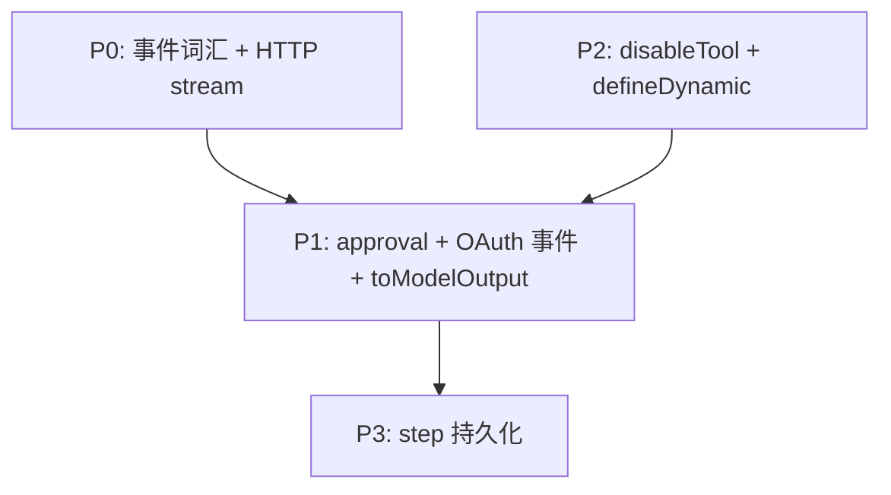

# ADR 0039: Eve 对齐 Agent 创作面 — 边界与分阶段路线

## 状态

Accepted（架构边界与分阶段路线）；各 Phase 实现项随 PR 逐步闭合。

## 背景

[Eve](https://eve.dev/docs/introduction) 是以 **filesystem-first** 组织 Agent 能力的 TypeScript 框架：instructions、tools、skills、connections、hooks、subagents 等均有固定目录槽位，并在运行时提供 **durable session**（Workflow SDK）、统一 **HTTP session/stream 契约** 与 **HITL/OAuth 事件流**。

Zhin.js 已在插件与工作区侧落地 Eve-style 创作面（见 [agent-authoring.md](../advanced/agent-authoring.md)），并在 IM 栈、安全 harness、安装分档上与 Eve 存在 deliberate 差异。维护者完成 [eve-comparison-zh.md](../advanced/eve-comparison-zh.md) 全栈对照后，需要将「学什么 / 不学什么 / 按什么顺序做」固化为 ADR，避免后续实现漂移或误伤 IM 核心。

## 决策

### D1. 创作面 SSOT：`agent/` 文件化发现

- 插件与工作区 Agent 继续以 `agent/{agent.ts, instructions.md, tools/, skills/, connections/, hooks/, schedules/, subagents/}` 为 SSOT。
- **路径即身份**；插件工具保留 `{pluginId}_` 前缀（多插件共存），不改为 Eve 单 app 裸 slug。
- 详细规则见 [agent-authoring.md](../advanced/agent-authoring.md)；差距矩阵见 [eve-comparison-zh.md](../advanced/eve-comparison-zh.md) 第二章。

### D2. 不替换 IM 发送与入站模型

- **禁止**用 Eve `Channel` 抽象替换 Zhin `Adapter` + `Endpoint` + `Message.$reply` / `Adapter.sendMessage` 统一出站链（ADR 0004）。
- Eve 的「channel 持有 `continuationToken`」仅作为 **Host/Console/SDK 层 resume 句柄** 的设计参考；IM 入站路由仍走 ADR 0002。

### D3. 模型与安装分层保持现状

- **模型、provider、harness YAML 覆盖** 留在 `zhin.config.yml`（ADR 0007、0019），不强制迁入 `agent.ts` 的 `model` 字段。
- **`@zhin.js/agent` 保持 optional peer**（ADR 0019）；不合并为 Eve 式单包 `eve` 安装体。

### D4. 安全：ExecPolicy / FilePolicy 保留，per-tool approval 叠加

- Zhin **5 层 ExecPolicy + 4 层 FilePolicy** 继续作为 IM 场景主 harness（群管、Owner、audit）。
- 从 Eve 借鉴的 **`defineTool({ approval })` 声明式 API** 与 ExecPolicy **叠加**，不替代 ExecPolicy。
- Eve sandbox network policy / credential brokering 仅作 **互补文档与后续 sandbox 抽象** 参考，不削弱现有策略层。

### D5. 不追求 Vercel 专有 API parity

以下 Eve 能力 **只借鉴可移植概念**，不在 Zhin 复刻同名 API 或绑定 Vercel：

- Vercel Connect OAuth（`connect()`）
- `vercel()` sandbox、Build Output sandbox prewarm
- Vercel Cron / Agent Runs dashboard
- Gateway 模型 id 字符串作为唯一模型配置方式

可移植概念包括：`authorization.required/completed` 事件形状、route auth 有序 walk、fail-closed 默认、NDJSON 生命周期事件词汇。

### D6. 分阶段对齐路线（P0 → P3）

对照文档第三章；此处为 ADR 级摘要。**优先级可随 PR 调整，但不得违反 D2–D5。**

| 阶段 | 主题 | 主要落点 |
|------|------|----------|
| **P0** | 统一 **turn/stream 事件词汇**；Host **稳定 session + NDJSON stream API**；Console/SDK **消费契约**；明确 **resume 句柄 vs stream 句柄** | `packages/host/*`、`packages/console/contract`、`packages/im/agent` turn 事件 |
| **P1** | `defineTool` **approval** / **toModelOutput**；MCP **qualified 工具名**与发现体验；connection **OAuth 事件模型**（Zhin Host 实现）；schedule → adapter **投递 helper**；skills **渐进披露**规范 | `@zhin.js/agent/authoring`、`McpRegistry`、schedule 设施（ADR 0031） |
| **P2** | `disableTool` sentinel；维护者 **`zhin agent info` 诊断**；`defineDynamic` / `defineState`（多租户按需）；sandbox backend 文档化 | CLI、`packages/im/agent` |
| **P3** | **Step 级 durable 持久化** 与 `session.waiting` park/resume（Workflow 或自研 world） | 独立 follow-up ADR；工程量大 |

依赖关系：

### D7. 对照文档为路线图 SSOT，直至单项毕业

- [eve-comparison-zh.md](../advanced/eve-comparison-zh.md) 为 Eve vs Zhin **全栈差距矩阵** 与建议优先级的 SSOT。
- 某 Phase 项开始实现时，可在 PR 中更新矩阵状态；**P3 持久化** 须另开 ADR（本 ADR 不预选 Workflow SDK vs 自研方案）。

## 非目标

- 将 Zhin 重写为 Eve fork 或兼容 Eve HTTP 路径（`/eve/v1/*`）。
- 移除插件 `agent/` 与遗留 `skills/` 双路径（渐进迁移策略不变，见 agent-authoring）。
- 在本 ADR 内选定 P3 的具体 workflow world 或数据库 schema。

## 后果

### 正面

- 作者面、Host、Console 可对齐 **可观测、可 SDK 化** 的会话模型，而不动 IM 核心发送链。
- 插件作者获得声明式 **approval / toModelOutput**，与 IM 富消息场景更匹配。
- 边界清晰，避免 Vercel lock-in 与 ADR 0019 安装策略冲突。

### 负面 / 成本

- P0 需跨 `host`、`console/contract`、`agent` 协调，短期接口面扩大。
- P1 approval 与 ExecPolicy、Owner orchestration 并存，文档与测试矩阵变复杂。
- P3 若启动，为最大架构项，与现有 DB session / turn 队列模型需长期共存或迁移设计。

## 实现追踪（随 PR 更新）

| 阶段 | 项 | 状态 |
|------|-----|------|
| P0 | Turn/stream 事件词汇表（`@zhin.js/ai` `agent-stream`；`@zhin.js/contract` re-export） | **已实现** |
| P0 | TurnEvent → AgentStreamEvent 映射（`packages/im/agent/src/event/turn-to-agent-stream.ts`） | **已实现** |
| P0 | Host session + NDJSON stream 路由（`GET/POST /zhin/v1/*`，`registerZhinAgentStreamRoutes`） | **已实现** |
| P0 | 内存 session store + continuationToken 双句柄（续聊响应 / `session.waiting` 事件均返回新 token） | **已实现** |
| P0 | Console stream reducer + client SDK（`subscribeAgentStream` / `foldAgentStreamNdjson`） | **已实现** |
| P0 | Host `/zhin/v1` REST 集成测试（`zhin-agent-stream-rest-api.test.ts`） | **已实现** |
| P0 | Hooks 事件词汇对齐 `AgentStreamEvent`（`HookRegistry.triggerStream` + 遗留别名映射） | **已实现** |
| P1 | `defineTool({ approval })` | **已实现**（`@zhin.js/ai/tool-policy` + `runToolApprovalGate`，与 ExecPolicy 叠加） |
| P1 | `defineTool({ toModelOutput })` | **已实现**（`applyToolToModelOutput` 于 tool 执行后） |
| P1 | MCP qualified 工具名 + 发现 | **已实现**（`{connection}__{tool}` + `McpRegistry.listQualifiedTools()`） |
| P1 | connection OAuth 事件模型 + Host 回调 | **已实现**（`authorization.required/completed` + `POST /zhin/v1/authorization/:requestId/complete`） |
| P1 | schedule → adapter 投递 helper | **已实现**（`deliverScheduleToAdapter`） |
| P1 | skills 渐进披露规范 | **已实现**（`discover` → `load_skill` + `SKILL_DISCLOSURE_*`） |
| P1 | Console `input.requested` reducer | **已实现**（`pendingInputs` / `pendingAuthorizations`） |
| P2 | `disableTool()` | **已实现**（`defineAgent({ disallowedTools: [disableTool('bash')] })`） |
| P2 | `zhin agent info` | **已实现**（`buildAgentSurfaceInfoReport` + CLI） |
| P2 | sandbox backend 文档化 | **已实现**（见 agent-authoring Sandbox 节） |
| P2 | `defineDynamic` | **已实现**（`agent/dynamic.ts` + turn 工具/指令覆盖） |
| P2 | `defineState` | **已实现**（`agent/state/*.ts` + `getAgentState` / `updateAgentState`） |
| P2 | Host `GET /zhin/v1/info` | **已实现**（agent surface 快照 JSON） |
| P3 | Step durable 持久化 | **已实现**（ADR 0040：`FileHttpSessionPersistence` + `step.*` 事件 + HTTP `/input` park/resume） |

## 相关

- [eve-comparison-zh.md](../advanced/eve-comparison-zh.md) — 全栈对照矩阵（SSOT）
- [agent-authoring.md](../advanced/agent-authoring.md) — 插件 `agent/` 创作面
- [ADR 0019](./0019-install-size-layering.md) — 安装分档与 optional peer
- [ADR 0004](./0004-normalize-queue-outbound-fields-before-im-send.md) — IM 出站链
- [ADR 0007](./0007-ai-agent-model-harness-yaml-overrides.md) — modelHarness YAML
- [ADR 0031](./0031-schedule-facility-replace-cron.md) — Schedule 设施
- [ADR 0010](./0010-pi-coding-agent-harness-alignment.md) — pi harness 对齐（与 Eve harness 并列参考）
- [Eve 官方文档 — Introduction](https://eve.dev/docs/introduction)
