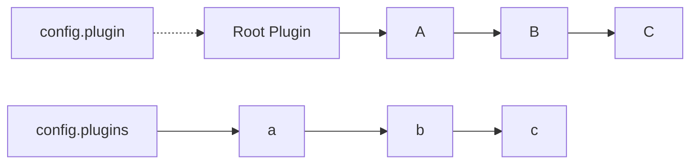
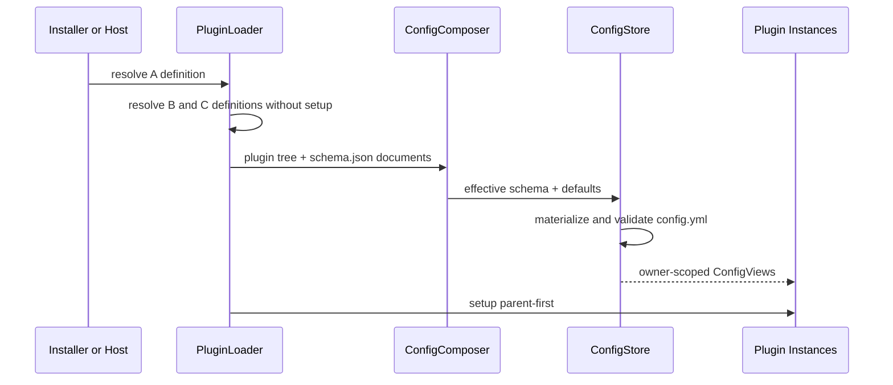

# ADR 0045: 层级 Plugin 配置与 schema.json

## 状态

Accepted；全新项目目标架构。

## 背景

Plugin A 可以装载 B，B 可以继续装载 C。配置必须遵循同一 owner 和层级关系，不能让每个包自行选择顶层 key，也不能要求父 Plugin 手动转发子 Plugin 配置。

每个 Plugin 包根提供一个 `schema.json`，用于约束配置文件中的值并为安装、控制台、校验和运行时 ConfigView 提供单一事实源。

## 决策

### D1. schema.json 是包根 contract

```text
<plugin-package>/
├── package.json
├── plugin.ts
├── schema.json
└── pages/ commands/ components/ middlewares/ agents/ skills/ tools/
```

`schema.json` 必须是 JSON Schema object root，只描述当前 Plugin 自身字段。Plugin 作者不在自己的 schema 中声明子 Plugin 配置；子节点由 Config Composer 根据 Plugin instance tree 注入。

允许保留 `$schema`、`$id`、`$defs`、`title`、`description`、`properties`、`required` 和对象约束。根级 `properties` 是 owner 字段集合，也是运行时 ConfigView 的字段白名单。

例如 A 的 schema 只声明 A 自己的字段：

```json
{
  "$schema": "https://json-schema.org/draft/2020-12/schema",
  "type": "object",
  "properties": {
    "endpoint": { "type": "string", "format": "uri" }
  },
  "required": ["endpoint"],
  "additionalProperties": false
}
```

B/C 分别在自己的包中声明 `retries` 与 `enabled`，不复制 A 或彼此的 schema。

### D2. 配置树投影 Plugin instance tree

配置文件使用 `plugin` 保存 Root 自身字段，使用 `plugins` 保存 Root 的直接 children；`plugins` 内部 instance key 路径与 Root 以下的 Plugin tree 同构：



```yaml
plugin:
  mode: production
plugins:
  a:
    endpoint: https://example.test
    b:
      retries: 3
      c:
        enabled: true
```

Canonical config paths 是 `a`、`a.b`、`a.b.c`；文件中的完整路径分别是 `plugins.a`、`plugins.a.b`、`plugins.a.b.c`。

Root 自身 canonical path 是 `.`，文件路径是 `plugin`。当 A 从 child 提升为 Root 时，A 的 ConfigView 从原 child 节点改为 `plugin`，其 child B/C 位于 `plugins.b`、`plugins.b.c`；A/B/C 的实现代码不感知物理路径变化。

路径段来自 Plugin declaration 的 `instanceKey`，不是 npm package name。默认 `instanceKey` 是 Plugin definition name；同一 Plugin 类型多实例装载时必须显式提供不同 instance key。

### D3. Config Composer 递归合成 Effective Schema

对 Plugin A 及子节点 B/C：

```text
EffectiveSchema(C) = OwnSchema(C)
EffectiveSchema(B) = OwnSchema(B) + property c: EffectiveSchema(C)
EffectiveSchema(A) = OwnSchema(A) + property b: EffectiveSchema(B)
```

Root 使用文档 envelope，不把 children 混入 Root 自身字段：

```text
DocumentSchema(Root) = {
  plugin: OwnSchema(Root),
  plugins: {
    childKey: EffectiveSchema(Child)
  }
}
```

合成是结构化 JSON Schema 变换，不使用字符串拼接：

1. 复制 owner schema root 与 `$defs`。
2. 将每个 child instance key 加入 root `properties`。
3. child property value 是该 child 的 Effective Schema。
4. 在整棵树合成后应用 unknown-field 策略并编译 validator。

上述递归规则只用于 child subtree；最终由 Config Composer 包装为 Root document envelope。

父 schema 自身 property 与 child instance key 重名属于装载错误。Config Composer 必须给出 owner、冲突路径和两个来源，不根据加载顺序覆盖。

### D4. 装载分为 definition 与 setup 两阶段



Plugin topology 必须在 setup 前可解析。npm `dependencies` 只保证包可用，不自动产生 Plugin child；运行时父子关系仍由 `plugin.ts` 的 `plugins` declaration 建立。这样普通库依赖不会被误当成 Plugin。

### D5. 安装 A 时物化 A/B/C

`zhin install a` 执行：

1. 安装 npm package A 及正常 package dependencies。
2. 把 A 加入 Root Plugin 的静态 child declaration。
3. 读取 A 的 Plugin declaration，递归解析 B/C Plugin definitions 与 schemas。
4. 把缺失的 `plugins.a`、`plugins.a.b`、`plugins.a.b.c` 节点写入 `config.yml`。
5. 从 schema `default` annotation 物化非敏感默认值。
6. required 且无 default 的字段由交互式安装询问；非交互模式返回带 JSON Pointer 的失败诊断。
7. 使用 YAML AST 合并，保留无关节点、注释、环境变量引用和用户格式。

Runtime 不依赖“默认值必须已写回磁盘”才能启动；内存中的 validated config 与物化后的文件语义必须一致。

### D6. 每个 Plugin 只获得自己的 ConfigView

```ts
interface ConfigView<T> {
  readonly owner: PluginId;
  readonly path: ConfigPath;
  get(): Readonly<T>;
  subscribe(listener: (next: Readonly<T>) => void): Dispose;
}
```

- A 的 ConfigView 只包含 A schema 声明的字段，不包含 child key `b`。
- B 只能读取 B 的字段，C 同理。
- Plugin 不能通过任意字符串路径穿透兄弟、父或子节点。
- 需要共享的数据通过显式 Resource 提供，不通过跨节点读取配置实现。

Capability definition 保持纯，不在 import 时读取配置。discoverer 把 Slot owner 与 ConfigView 关联；Runtime 执行 Command、Component、Middleware、Tool、Skill 或 Agent 时，通过统一执行上下文提供 owner 的只读配置 snapshot：

```ts
interface CapabilityExecutionContext<TConfig> {
  readonly plugin: Plugin;
  readonly config: Readonly<TConfig>;
  readonly generation: number;
}
```

Capability snapshot 与 ConfigView 必须来自同一 Plugin generation，不能出现新 Command 搭配旧 Config 或相反情况。

### D7. 配置更新与 HMR

- 修改 `plugins.a.b.c` 中 C 的字段，重新校验并替换 C Plugin 子树。
- 修改 B 自身字段，替换 B/C 子树。
- 修改 A 自身字段，替换 A/B/C 子树。
- 修改 `schema.json` 时，先用新 schema 在 shadow transaction 中校验现有节点；成功后替换 owner Plugin 子树，失败则保留旧 schema、ConfigView 与 Plugin generation。
- 一次 YAML patch 涉及多个 owner 时，先整体校验，再以最浅受影响 Plugin 的子树作为单次原子替换根。

## 不变量

1. Plugin tree 与 plugin config tree 同构。
2. `schema.json` 只声明 owner 字段，不复制 child schema。
3. Config Composer 是 Effective Schema 的唯一生成者。
4. ConfigStore 是文件和内存配置的唯一写入面。
5. ConfigView 不暴露其它 Plugin 的私有配置。
6. schema、配置和 Plugin generation 一起原子切换。

## 后果

### 正面

- 安装 A 即得到完整 A/B/C 配置骨架。
- 配置路径直观表达 Plugin ownership。
- CLI、控制台、Runtime 与 HMR 共用同一 schema 来源。
- 子 Plugin 的增加、删除和多实例都有确定配置位置。

### 设计成本

- Plugin declaration 必须在 setup 前可解析。
- child instance key 成为稳定配置身份，发布后不能随意改名。
- schema root 必须遵守可组合 object contract。
- 配置编辑器必须使用 AST patch，不能整文件 stringify 覆盖。

## 参考

- [Plugin-first 目标架构](../../TARGET-ARCHITECTURE.md)
- [ADR 0043](./0043-unify-capability-roots.md)
- [ADR 0044](./0044-typescript-hmr-plugin-kernel.md)
- [ADR 0047](./0047-standalone-plugin-and-root-lifecycle-domain.md)
