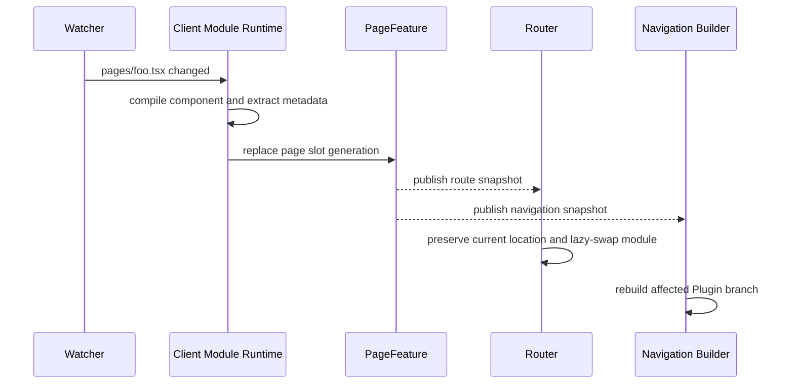

# ADR 0046: 约定式 pages 与 Plugin 导航树

## 状态

Accepted；全新项目目标架构。

## 背景

Plugin 的客户端页面应当和 Command、Tool 一样由目录约定发现。页面路由和左侧导航必须保留 Plugin ownership 与父子关系，不能由每个插件通过 `addRoute()`、`addTool()` 分别维护一套扁平全局状态。

## 决策

### D1. pages 是 canonical Capability 目录

```text
<plugin-package>/
├── plugin.ts
├── schema.json
└── pages/
    ├── overview.tsx
    ├── settings.tsx
    ├── $nav.tsx
    └── $footer.tsx
```

普通页面发现 `pages/*.ts` 与 `pages/*.tsx`。首版不赋予嵌套目录、`index`、`[param]` 等特殊路由语义；普通文件 stem 必须满足稳定 slug 约束。

`pages/$nav.tsx` 与 `pages/$footer.tsx` 是保留的 Layout Slot 文件，不产生 Page route。其他以 `$` 开头的文件拒绝发现，直到对应 slot 形成正式决策。

页面模块默认导出客户端页面组件，可选导出静态 metadata：

```tsx
import { definePage } from 'zhin.js/console';

export const meta = definePage({
  title: '运行概览',
  icon: 'ChartNoAxesCombined',
  order: 10,
  requiredPermissions: ['a:read'],
});

export default function OverviewPage() {
  return <Overview />;
}
```

`definePage()` 只验证并标记 JSON-serializable metadata，不注册路由，不读取当前 Plugin。未声明 metadata 时，title 从文件名生成，其他字段使用 Console 默认值。

### D2. URL 是 Plugin path 的确定性投影

页面 canonical identity 是 `(ownerPluginId, 'page', localName)`。URL 规则为：

```text
route(plugin, page) = '/' + pluginPathWithoutRoot + '/p-' + pageLocalName
```

例如：

| Owner | Source | Route |
|---|---|---|
| Root | `pages/home.tsx` | `/p-home` |
| A | `pages/name.tsx` | `/a/p-name` |
| A/B | `pages/foo.tsx` | `/a/b/p-foo` |
| A/B/C | `pages/settings.tsx` | `/a/b/c/p-settings` |

Plugin path 段来自 instance key。页面 metadata 不能覆盖 canonical route；需要多个展示入口时，应创建不同 Page 文件或显式 Redirect capability。

`p-` 是保留前缀，用于区分 Page leaf 与 child Plugin path。Plugin instance key 禁止以 `p-` 开头，因此 A 的 child `foo` 与 A 的 page `foo` 不会发生路由歧义。

### D3. Layout Slot 按 Plugin 树继承

Console Shell 暴露两个可覆盖 slot：

```text
ConsoleShell
├── NavRegion       <- pages/$nav.tsx
├── ContentOutlet   <- framework owned, 不可覆盖
└── FooterRegion    <- pages/$footer.tsx
```

当当前 route owner 是 `root/a/b` 时，slot resolver 按最近祖先查找：

```text
B/$nav -> A/$nav -> Root/$nav -> Console default nav
B/$footer -> A/$footer -> Root/$footer -> Console default footer
```

因此 A 的 `$nav.tsx` 默认作用于 A 及其全部后代页面；B 可以只为 B 子树覆盖。Layout canonical identity 是 `(ownerPluginId, 'layout', 'nav' | 'footer')`。

Layout 文件默认导出 renderer：

```tsx
import type { NavSlotProps } from 'zhin.js/console';

export default function Nav({ tree, current, navigate }: NavSlotProps) {
  return <PluginNavigation tree={tree} current={current} navigate={navigate} />;
}
```

`NavSlotProps.tree` 已完成 Plugin 建树、排序和权限过滤。自定义 Nav 只能改变展示，不能取得被过滤 route、写入 PageFeature 或绕过 route guard。Footer 同样只获得只读 `FooterSlotProps`。

Console Shell 继续拥有：

- 响应式区域尺寸与移动端 drawer。
- `<nav>` / `<footer>` landmark、focus restoration 与键盘入口。
- Content Outlet、路由生命周期与页面 Suspense。
- 每个 slot 的 Error Boundary、loading fallback 和默认 renderer 回退。

Layout renderer 只渲染 Shell 提供的区域内容，不替换整个 Console root。完整 `$layout.tsx` 不在本 ADR 范围内。

### D4. Navigation 从 Plugin tree 派生

Console Navigation Builder 输入只有：

- Plugin instance tree 的只读 snapshot。
- owner-aware PageFeature snapshot。
- 当前用户的 permission/role snapshot。

输出导航树：

```text
A
├── Name                 /a/p-name
└── B
    ├── Foo              /a/b/p-foo
    └── C
        └── Settings     /a/b/c/p-settings
```

规则：

1. Plugin instance 产生 group node，Page 产生 leaf node。
2. 没有可见 Page 且没有可见后代的 Plugin group 被裁剪。
3. group label/icon/order 默认来自 Plugin definition metadata；Page leaf 来自 `definePage()` metadata。
4. 同级 group 与 page 分别按 `(order, identity)` 稳定排序。
5. group 展开状态以 Plugin id 保存，Page 热更不重置导航状态。
6. 导航只是 route catalog 的视图，不是第二份可写 registry。

### D5. 权限同时约束 catalog 与 route

- Host 根据 Page manifest 的 `requiredPermissions`、`requiredRoles` 过滤返回给用户的 route catalog。
- Client Router 在直接访问 URL 时再次执行 route guard。
- 隐藏导航不等于授权；`hideInNav` 只影响 Navigation Builder，不绕过 route guard。
- 页面所调用的服务端接口仍必须独立鉴权。

### D6. 浏览器模块与服务端 manifest 分离

Page 与 Layout TS/TSX 都是浏览器模块，服务端 PluginLoader 不直接执行它们。Client Module Runtime 负责：

1. 发现 Page 与 Layout source 并生成稳定 module id。
2. 通过构建 transform 提取字面量 `definePage()` metadata 与 Layout Slot identity。
3. 开发环境发布虚拟 Page manifest 与可 HMR 的模块 URL。
4. 生产构建输出 chunk 与 `pages.manifest.json`。
5. Host 把 manifest 转换为 owner-bound PageFeature 与 LayoutFeature contributions。
6. Client Router 按 route lazy import 对应页面 chunk。

构建 transform 遇到动态 metadata 必须失败并指出文件位置，不能在 Node 端执行客户端模块来猜测值。

### D7. Page 与 Layout HMR



- 页面实现变化只触发浏览器 HMR，不重载服务端 Plugin。
- `$nav.tsx`、`$footer.tsx` 变化只替换对应 Layout Slot；当前 route 和 Page state 保持不变。
- Layout renderer 抛错时，slot Error Boundary 回退到最近祖先或 Console 默认 renderer，不卸载 Content Outlet。
- title、icon、order、permission 等 metadata 变化原子替换 Page manifest，并重建对应导航分支。
- 页面编译失败时继续展示旧 Page generation，并把诊断推送到开发客户端。
- Plugin instance path 变化属于 Plugin subtree replacement，其后代 route 与 nav identity 一起重建。
- 当前页面被删除或因权限消失时，Router 导航到最近祖先中 `(order, identity)` 最小的可见 Page；不存在时进入 Console home。

### D8. 发布契约

开发包可以直接包含 `pages/*.ts|tsx`。生产发布物必须包含：

- Page source 或编译后的 client chunks。
- Layout source 或编译后的 client chunks。
- `pages.manifest.json`。
- manifest 中的 source identity、chunk、metadata 与构建 hash。

生产 Host 不在启动时临时编译 npm 包页面。开发与生产的 Page identity 和 route 必须一致。

## 不变量

1. Page route 只由 Plugin path 与 Page localName 生成。
2. Navigation 只由 Plugin tree 与 PageFeature snapshot 派生。
3. Page 客户端模块不由服务端 PluginLoader 直接执行。
4. Page metadata 必须可静态提取和序列化。
5. Page Slot、route record 与 nav leaf 使用同一 canonical identity。
6. 页面 HMR 不导致无关 Plugin 或服务端 Runtime 重载。
7. Layout override 只控制 Shell slot 的表现，不拥有 navigation model、权限和路由状态。

## 后果

### 正面

- 文件位置即可预测页面 URL 和导航位置。
- 安装 A 时，A/B/C 页面自动形成关联导航树。
- Page、route、nav、permission 和 HMR 使用一份 manifest。
- Plugin 作者不再编写重复的 `addRoute()` 与 `addTool()` 注册代码。

### 设计成本

- 需要独立 Client Module Runtime 与 Page manifest transform。
- Console Shell 必须提供稳定、可访问、响应式的 Nav/Footer slot contract。
- Plugin instance key 和 Page localName 成为公开 URL contract。
- 路由改名需要显式 Redirect capability 才能保留旧链接。
- Host 与 Client 必须共享 Page manifest contract 版本。

## 参考

- [Plugin-first 目标架构](../../TARGET-ARCHITECTURE.md)
- [ADR 0043](./0043-unify-capability-roots.md)
- [ADR 0044](./0044-typescript-hmr-plugin-kernel.md)
