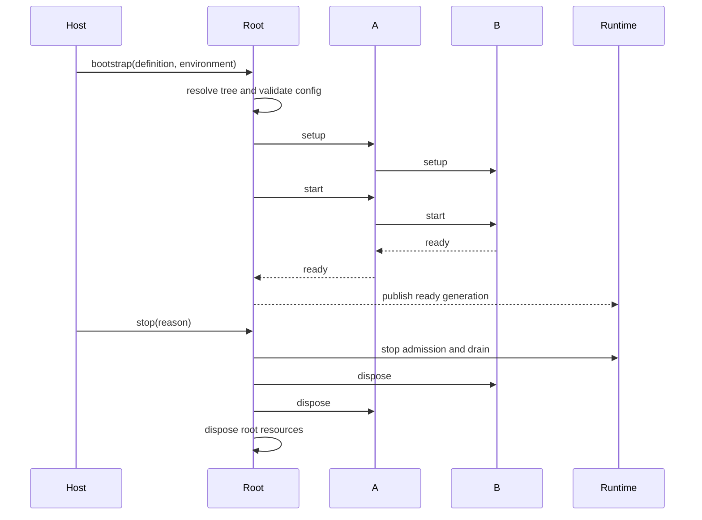

# ADR 0047: 独立 Plugin 项目与 Root 生命周期域

## 状态

Accepted；全新项目目标架构。

## 背景

Plugin 是 Zhin 的基础运行单元，而不是只能被某个固定应用加载的扩展。A 可以作为 Root 独立运行，也可以作为 X 的 child；B/C 同理。整棵 Plugin tree 必须只有一个生命周期权威，否则配置、HMR、共享 Resource 和关闭顺序会出现竞争。

## 决策

### D1. 每个 Plugin package 都是可运行项目

任意符合 canonical package contract 的 Plugin 都可以直接启动：

```text
<plugin-project>/
├── package.json
├── pnpm-workspace.yaml
├── plugin.ts
├── schema.json
├── packages/
├── plugins/
├── pages/
├── commands/
├── components/
├── middlewares/
├── agents/
├── skills/
└── tools/
```

`packages/*` 与 `plugins/*` 只允许一级 workspace package；逻辑 child tree 由静态 package manifest 表达，不使用 nested workspace。具体规则见 ADR 0048。

```text
zhin dev .
zhin run @scope/plugin-a
```

Runtime 读取同一个 `plugin.ts` definition 并把它实例化为 Root，不要求 Plugin package 编写另一份应用入口。测试 harness 也通过相同 public Interface 启动该包。

“可独立运行”不表示所有外部依赖都变成可选。Plugin definition 必须声明 required Resource/Feature；Root Bootstrap 提供标准 Resource，缺失的领域依赖在 setup 前给出结构化诊断。

### D2. Root 是实例角色

```ts
interface PluginInstance {
  readonly id: PluginId;
  readonly parent?: PluginInstance;
  readonly root: PluginInstance;
  readonly role: 'root' | 'child';
}
```

- `parent === undefined` 的实例是当前树的 Root。
- package name、Plugin definition type 和 Root role 相互独立。
- 同一个 package 可以在一棵或多棵树中产生多个实例。
- Plugin 代码不得根据 package identity 假设自己是 Root。

### D3. RootController 是唯一生命周期权威

只有 Root 持有 `RootController`，其 interface 覆盖整棵树：

```ts
interface RootController {
  readonly generation: number;
  start(): Promise<void>;
  transact(change: TreeChange): Promise<Generation>;
  reload(target: PluginId | CapabilityIdentity): Promise<Generation>;
  stop(reason: StopReason): Promise<void>;
}
```

RootController 负责：

- Plugin topology resolution 与 mutation serialization。
- Environment、ConfigStore、Database、Logger 等 Root Resource。
- Effective Schema、ConfigView 与 Capability snapshot 的原子 generation。
- Server/Client Module Runtime 和 HMR transaction。
- Runtime admission、quiesce、drain、cancel 与 shutdown。
- children-first dispose 和 Root Resource 最终回收。

Child Plugin 可以通过受控 command 请求装载、卸载或重载，但不能直接更新 parent children、全局 registry 或 generation。

### D4. 生命周期是整树状态机



状态与顺序：

1. `resolving`：解析 Plugin definitions、children 和 required dependencies。
2. `configuring`：组合 schema、物化默认值、校验配置。
3. `preparing`：建立 shadow scopes 与 Module Runtime generations。
4. `starting`：setup/start parent-first。
5. `ready`：children-first 确认后一次发布整树 generation。
6. `quiescing`：Root 阻止新任务，等待进行中的 Runtime lease。
7. `stopping`：dispose children-first，Root Resource last。
8. `stopped` 或 `failed`：不再发布 snapshot。

启动失败按已完成步骤逆序回滚，不发布部分 ready 的树。

### D5. Root promotion 不改变 Plugin 实现

同一个 A package：

```text
作为某棵树中 X 的 child：
  id      = root/x/a
  config  = plugins.x.a
  page    = /x/a/p-overview

作为 Root：
  id      = root
  config  = plugin
  page    = /p-overview
```

A 只通过 `plugin.id`、ConfigView、Resource Token 和 route helpers 获得运行时位置，不硬编码上述绝对路径。B/C 的 config、route 与 nav 自动相对新的 Root 重新投影。

### D6. Host 不成为隐藏 Root

Host 负责进程能力：创建 Module Runtime、接收 OS signal、选择要启动的 Plugin definition。Bootstrap 完成后，Host 把控制权交给 RootController。

Host 不保存第二份 Plugin registry，不跨过 Root 直接 stop child，也不在 Root 之外提交配置或 HMR generation。若一个进程启动多棵树，每棵树具有独立 RootController、ConfigStore namespace 和 lifecycle domain。

## 不变量

1. 任意 canonical Plugin package 都可作为 Root 启动。
2. Root 是 Plugin instance role，不是特殊 package superclass。
3. 每棵 Plugin tree 只有一个 RootController 和 generation authority。
4. Child 不直接改变树、共享 Resource 或 lifecycle state。
5. ready generation 整树发布，失败不暴露部分启动状态。
6. Root promotion 只改变运行时投影，不改变 Plugin 实现。

## 后果

### 正面

- 每个 Plugin 都能单独开发、预览、测试和部署。
- 任意子树根都可以提升为独立应用。
- 组合部署与独立部署使用同一份源码和 package。
- 生命周期、配置、HMR 和资源回收拥有唯一权威。

### 设计成本

- Plugin 不能依赖隐式 parent/global singleton。
- Root Bootstrap 必须能提供标准 Resource 并诊断 required dependency。
- Config、Page route 和日志身份必须通过 role-relative view 获取。
- 多 Root 进程必须隔离 namespace、generation 和 Host 资源配额。

## 参考

- [Plugin-first 目标架构](../../TARGET-ARCHITECTURE.md)
- [ADR 0044](./0044-typescript-hmr-plugin-kernel.md)
- [ADR 0045](./0045-hierarchical-plugin-config-schema.md)
- [ADR 0046](./0046-convention-pages-and-plugin-navigation.md)
- [ADR 0048](./0048-plugin-monorepo-and-feature-provider-packages.md)
