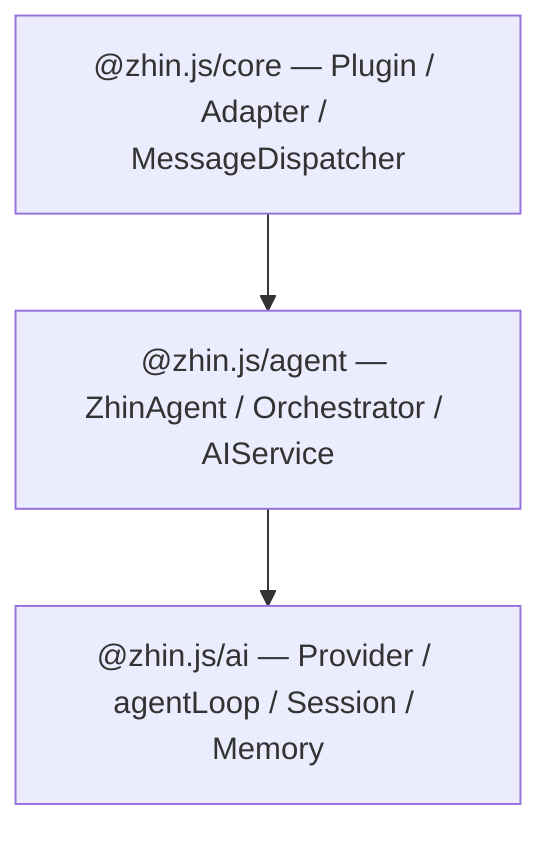
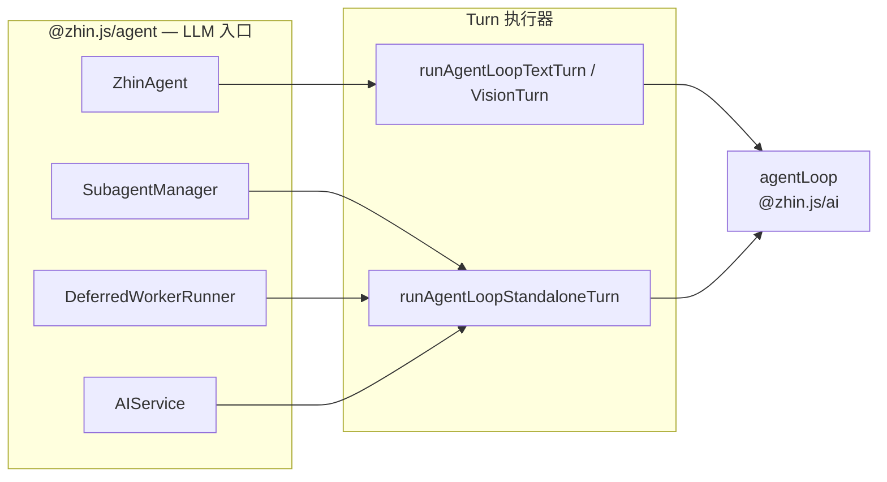

# Agent 概念入门

本文用**概念图**说明 Zhin.js 的 Agent 栈，帮助不熟悉 MCP / Agent 编排的开发者建立心智模型。细节配置见 [AI 模块](/advanced/ai)，MCP 实操见 [MCP 集成](/advanced/mcp)。

## 分层：从 IM 到 LLM





| 包 | 有无 IM 概念 | 职责 |
|----|--------------|------|
| `@zhin.js/ai` | 无 | LLM 调用（**agentLoop**）、会话压缩、Provider 抽象 |
| `@zhin.js/agent` | 有 | 把 AI 接到消息流：ZhinAgent、工具收集、安全策略 |
| `@zhin.js/core` | 有 | 插件、适配器、入站/出站消息链 |

用户发消息后，[MessageDispatcher](/essentials/message-flow) 判定是否走 AI → 调用 **ZhinAgent** → 底层 **`agentLoop`** 完成 LLM 回合（无工具单轮或有工具多轮）→ 回复经统一发送链发出。

## 两个 Context：`ctx.ai` 与 `ctx.agent`

`initAgentModule()` 挂载后，插件可注入两个不同层级的上下文：

| Context | 典型用途 | 示例 API |
|---------|----------|----------|
| **`ctx.ai`（AIService）** | 业务侧 AI：会话、程序化 Agent | `ai.sessions.get()`、`ai.createAgent()` → **`ServiceAgent`**、`ai.runAgent()` |
| **`ctx.agent`（AgentOrchestrator）** | 扩展编排资源：注册表 | `agent.addTool()`、`agent.addSkill()`、`agent.addMcp()` |

**记忆口诀**：`ctx.ai` 用来**跑对话**；`ctx.agent` 用来**挂能力**（工具、技能、MCP 条目）。

```typescript
useContext('ai', async (ai) => {
  const result = await ai.runAgent('总结这段话', { provider: 'openai' })
})

useContext('agent', async (agent) => {
  agent.addTool({ name: 'my_tool', /* ... */ })
})
```

## 一次 AI 对话里发生什么（简化）

1. **触发** — @机器人、私聊或 `ai:` 前缀等（见 [触发条件](/advanced/ai#触发条件)）
2. **收集工具** — Skill 粗筛 → Tool 细筛；若启用 MCP，合并 `mcp_*` 工具
3. **构建上下文** — 历史、用户画像、Bootstrap 文件（SOUL / AGENTS / TOOLS）
4. **agentLoop** — 从 `ContextRepository` 加载历史 → LLM + 工具调用，受 `maxIterations`、exec 安全策略约束；同 session 并发走 steer / followUp 队列
5. **出站** — `Message.$reply` → 统一发送链（不可绕过 Adapter）

完整流程图见 [AI 模块 — 消息处理流程](/advanced/ai#消息处理流程)。

## 三种「多 Agent」模式（勿混淆）

| 模式 | 机制 | 何时用 |
|------|------|--------|
| **Subagent（`spawn_task`）** | 主 ZhinAgent 派后台子任务，完成后回调通知 | 耗时任务不阻塞主对话；**默认即可用** |
| **多实例（`ai.createAgent` / `runAgent`）** | `ServiceAgent` + 隔离 context；不同 provider/model/systemPrompt | 代码审查、翻译等**专用角色** |
| **AgentDispatcher 角色** | harness 层 7 种预定义角色（main / worker / …） | **toolSearch + Worker** 编排；见 [Agent 安全与角色](/advanced/agent-harness-engineering) |

::: warning 与 IM「平台角色」区分
Discord/KOOK 的群管理员、群主是**平台权限**；本文的 Agent **角色**是编排与安全 harness 概念，两者无关。
:::

### Subagent 速览

用户说「后台帮我整理文档」时，主 Agent 可调用 `spawn_task({ task: '...', label: '...' })`。子 Agent 工具集默认受限；可通过 `ai.agent.subagentTools` 追加白名单。

### AgentDispatcher 七种角色（Advanced）

| 角色 | 简述 |
|------|------|
| `main` | 主 Agent，可发消息、spawn、写文件 |
| `subtask` | 子任务，不可发消息 |
| `worker` | 执行 deferred 工具 |
| `researcher` / `executor` / `reviewer` / `planner` | 分工型 Worker 变体 |

详情与权限表见 [Agent Harness — 预定义角色](/advanced/agent-harness-engineering#预定义角色)。

## toolSearch：何时开启

**toolSearch** 启用 **deferred Worker** 编排：主 Agent 仅保留少量编排工具（如 `tool_search`、`run_deferred_task`、`ask_user`），具体业务工具由 Worker 按需执行，从而控制 system prompt 体积。

```yaml
ai:
  agent:
    toolSearch: true   # Stable 默认 false
```

| | Stable（minimal-bot / 脚手架默认） | Advanced（test-bot） |
|--|-----------------------------------|----------------------|
| `toolSearch` | `false` | `true` |
| `memoryMcp` | `false` | 按需 |
| `mcpServers` | 空 | 可配置 filesystem 等 |

仅在工具数量多、prompt 接近上下文上限时再开；日常业务 bot 保持 Stable 默认即可。

架构背景：[Agent 上下文块 — Deferred Tools](/architecture/agent-context-blocks)。

## Bootstrap 引导文件（速读）

项目根或 `data/` 下三文件按 **SOUL → AGENTS → TOOLS** 顺序注入 system prompt：

| 文件 | 用途 | 可写 |
|------|------|------|
| **SOUL.md** | 人格、边界、沟通风格 | 只读 |
| **AGENTS.md** | 长期记忆、操作指南 | AI 可读写 |
| **TOOLS.md** | 自定义工具使用规则 | 只读 |

`create-zhin` 可生成模板。完整说明见 [AI 模块 — Bootstrap](/advanced/ai#bootstrap-引导文件)。

## Stable vs Advanced 能力对照

| 能力 | Stable 承诺 | Advanced 验证 |
|------|-------------|---------------|
| 基础 AI 对话 + 内置工具 | ✅ minimal-bot | ✅ test-bot |
| 文件化 Tool / Skill / Agent | ✅ | ✅ |
| `spawn_task` Subagent | ✅ | ✅ |
| `toolSearch` + Worker | ❌ 默认关 | ✅ |
| MCP Client / Server | ❌ 默认关 | ✅ ACCEPTANCE |
| 多 Endpoint 同进程 | 非 Stable 重点 | ✅ test-bot |

**建议路径**：先用 [minimal-bot](https://github.com/zhinjs/zhin/tree/main/examples/minimal-bot) 跑通 L1/L2 → 读本文 → [MCP 集成](/advanced/mcp) → 需要时再参考 [test-bot](https://github.com/zhinjs/zhin/tree/main/examples/test-bot)。

## 下一步

- [AI 模块](/advanced/ai) — 完整配置与 API
- [MCP 集成](/advanced/mcp) — Client / Server 实操
- [工具与技能](/advanced/tools-skills) — `*.tool.md` / `SKILL.md`
- [术语表 — Agent 相关条目](/reference/glossary)
- [学习路径 — L3+](/essentials/learning-paths#l3-ai-与-mcp-进阶)
