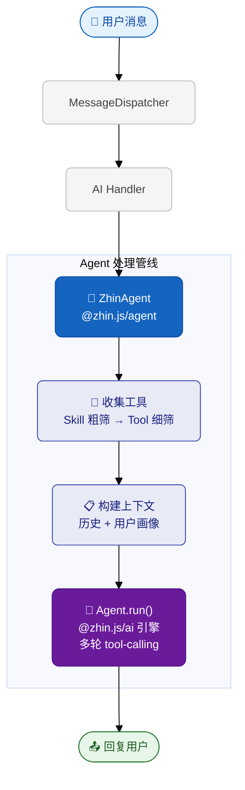

# AI 模块

::: info 文档分工（SSOT）
- **[配置文件 — AI 节](/essentials/configuration)**：L1 常用字段与 Stable 默认值子集
- **本文**：AI / Agent / Context / MCP 全集与行为说明
- **源码**：`packages/im/ai/src/types.ts`（Provider / Context）、`packages/im/agent/src/zhin-agent/config.ts`（`DEFAULT_CONFIG`）
:::

Zhin.js 内置 AI Agent 能力，可以对接大语言模型（LLM），让机器人具备智能对话、工具调用、上下文记忆等能力。

## 目录

- [架构概览](#架构概览)
- [配置](#配置)
- [Agent 配置详解](#agent-配置详解)
- [触发条件](#触发条件)
- [消息处理流程](#消息处理流程)
- [会话管理](#会话管理)
- [工具与技能](#工具与技能)
- [MCP 集成](#mcp-集成)
- [toolSearch 与 Deferred Tools](#toolsearch-与-deferred-tools)
- [子任务 (Subagent)](#子任务-subagent)
- [定时消息 (Follow-up)](#定时消息-follow-up)
- [用户画像](#用户画像)
- [对话记忆](#对话记忆)
- [Hook 系统](#hook-系统)
- [会话压缩](#会话压缩)
- [Bootstrap 引导文件](#bootstrap-引导文件)
- [输出解析](#输出解析)
- [权限控制](#权限控制)
- [执行安全 (execSecurity)](#执行安全-execsecurity)
- [系统提示词架构](#系统提示词架构)
- [AI 引擎内部模块](#ai-引擎内部模块)
- [Provider 统一抽象](#provider-统一抽象)
- [小模型适配](#小模型适配)
- [流式输出](#流式输出)
- [多模态支持](#多模态支持)
- [自定义 Provider](#自定义-provider)

## 架构概览

AI 能力分为两层包：

- **`@zhin.js/ai`** — 框架无关的 AI 引擎（Provider、Agent 循环、Session、Memory、Compaction），可独立用于非 IM 应用
- **`@zhin.js/agent`** — IM 场景的 Agent 编排（ZhinAgent、AIService、子任务、用户画像、引导文件），桥接 `@zhin.js/core` 和 `@zhin.js/ai`



核心组件（按包归属）：

**@zhin.js/ai（通用 AI 引擎）**：
- **AIProvider** - LLM 提供者统一接口（OpenAI、Anthropic、Ollama、DeepSeek、Moonshot、Zhipu）
- **Agent** - 无状态 Agent 引擎，执行多轮 tool-calling 循环
- **SessionManager** - 会话元数据（遗留 API；IM 活跃会话见 `IMSessionStore` + `ai_sessions`）
- **ChatHistoryContext** - 只读：从 `chat_messages` + `ai_summaries` 拼 LLM 历史
- **IMSessionStore** - `ai_sessions` 活跃/归档（`session_key` → 纪元 `session_id`）
- **ContextManager** - 场景级摘要（`context_summaries`，非 IM 主路径）
- **ConversationMemory** - 主题检测 + 链式摘要（`ai_summaries`；不再写 `ai_messages`）
- **CostTracker** - Token 用量与成本追踪器，支持按模型/Provider 统计
- **FileStateCache** - 文件状态缓存，减少重复磁盘读取
- **MicroCompact** - 微压缩引擎，增量式上下文摘要
- **ToolSearchCache** - 工具搜索结果缓存，加速重复查找
- **RateLimiter** - 请求速率限制
- **ToneDetector** - 消息情绪感知

**@zhin.js/agent（IM Agent 编排）**：
- **ZhinAgent** - AI Agent 核心，编排 LLM 交互、工具选择和响应生成
- **AIService** - AI 服务管理器，Provider 注册与路由
- **SubagentManager** - 后台子任务管理器，执行复杂异步任务
- **FollowUpManager** - 定时跟进提醒管理器
- **UserProfileStore** - 用户画像，跨会话个性化
- **BootstrapLoader** - 引导文件加载（SOUL.md / AGENTS.md / TOOLS.md）
- **ExecPolicy** - Bash 执行安全策略（6 层纵深防御）
- **FilePolicy** - 文件访问安全验证（路径检查、设备路径拦截、命令读写分类）
- **buildRichSystemPrompt** - ZhinAgent 主路径 system prompt（常驻段 + Platform / Skills / Bootstrap 注入）
- **PromptBuilder** - 可选分层提示词 API（非默认主路径）

**@zhin.js/core（IM 层）**：
- **SkillFeature** - 技能注册中心，管理所有 Skill
- **ToolFeature** - 工具注册中心，管理所有 Tool
- **MessageDispatcher** - 消息调度器，判断消息是否触发 AI

### IM 消息事实源（chat_messages）

入站、出站消息由 **zhin.js 主包**在 core 生命周期落库，**不经过** `@zhin.js/ai` 写入：

| 事件 | 时机 | 表 |
|------|------|-----|
| `message.receive` | MessageDispatcher 处理完成后 | `chat_messages`（direction=inbound） |
| `message.send` | `Adapter.sendMessage` 平台发送成功后 | `chat_messages`（direction=outbound） |

`@` 触发时 `ChatHistoryContext` 只读上述表；当前用户句由 turn-pipeline 显式 append。归档会话：`/new` 或 `ai.clear`（归档 `ai_sessions`，保留审计行）。

## 配置

在 `zhin.config.yml` 中配置 AI 模块：

```yaml
ai:
  enabled: true
  defaultProvider: ollama
  
  providers:
    ollama:
      host: "http://localhost:11434"
      # models 可省略 — 框架通过 ModelRegistry 自动发现可用模型
      # models:
      #   - qwen3:14b
      num_ctx: 32768          # 上下文窗口（token 数）
      contextWindow: 32768    # 通用字段，优先级高于 num_ctx
    openai:
      apiKey: "${OPENAI_API_KEY}"
      baseURL: "https://api.openai.com/v1"
      contextWindow: 128000
      # 对于 API 聚合 / 中转服务（如 9router），无需手动列出模型
      # ModelRegistry 会自动调用 /v1/models 接口发现所有可用模型
  
  sessions:
    useDatabase: true
    maxHistory: 50
    expireMs: 3600000
    coldStartMaxMessages: 50      # 无 ai_summary 时从 chat_messages 冷启动条数
    coldStartMaxAgeMs: 86400000   # 冷启动时间窗（毫秒）
    sessionIdleArchiveMs: 604800000  # 空闲归档 active 会话（0=关闭）

  context:
    enabled: true
    maxRecentMessages: 100    # 读取的最近消息数（默认 100）
    summaryThreshold: 50      # 触发总结的消息数阈值（默认 50）
    keepAfterSummary: 10      # 总结后保留条数（默认 10）
    maxContextTokens: 4000    # 上下文 token 估算上限（默认 4000）
  
  agent:
    chatModel: ''             # 指定聊天模型（留空自动选择最优）
    visionModel: ''           # 指定视觉模型（留空自动选择）
    execSecurity: allowlist   # 默认 deny；示例为 allowlist
    execPreset: custom        # readonly / network / development / custom（默认 custom）
    execAllowlist:            # 与 preset 合并
      - "curl"
    maxIterations: 15         # 默认 15（技能激活时再 +3）
    contextTokens: 128000
    maxHistoryShare: 0.5
    toneAwareness: true
    modelSizeHint: medium     # small / medium / large（留空自动推断）
    maxSubagentIterations: 25 # 默认 25
    phaseTrace: false         # 输出 Agent 阶段观测日志（或 ZHIN_AGENT_PHASE_TRACE=1）
    modelHarness:
      providerPatterns:
        "open*":
          maxIterations: 7
      models:
        "openai:gpt-4o":
          maxIterations: 9
  
  trigger:
    enabled: true
    prefixes: ["#", "AI:", "ai:"]   # 框架默认含 ai:
    respondToAt: true
    respondToPrivate: true
    ignorePrefixes: ["/", "!", "！"]
    timeout: 60000
```

`ai.sessions` 与 `ai.context` 字段定义见 `@zhin.js/ai` 的 `AIConfig`（`packages/im/ai/src/types.ts`）。会话默认：数据库模式 `maxHistory` 200、`expireMs` 7 天；内存模式 100 / 24 小时。

## Agent 配置详解

`ai.agent` 下的完整配置项：

| 配置项 | 类型 | 默认值 | 说明 |
|--------|------|--------|------|
| `maxIterations` | number | 15 | 最大工具调用轮数（会叠加 model harness 默认值与技能激活 +3） |
| `timeout` | number | 120000 | 单次 Agent 回合超时（ms） |
| `preExecTimeout` | number | 15000 | 预执行超时（ms） |
| `maxSkills` | number | 5 | 单次请求最多匹配的 Skill 数量 |
| `maxTools` | number | 12 | 单次请求最多下发的工具数量 |
| `contextTokens` | number | 128000 | 上下文窗口 token 数 |
| `maxHistoryShare` | number | 0.5 | 历史记录占上下文窗口的最大比例 |
| `toneAwareness` | boolean | true | 是否启用情绪感知 |
| `visionModel` | string | '' | 视觉模型名称（留空自动选择视觉能力模型） |
| `chatModel` | string | '' | 聊天模型名称（留空自动选择最优模型） |
| `execSecurity` | string | 'deny' | bash 执行策略：deny / allowlist / full |
| `execPreset` | string | 'custom' | 预设命令白名单：readonly / network / development / custom |
| `execAllowlist` | string[] | [] | 白名单匹配**首段命令名**（见 exec-policy）；`allowlist` 下 **`icqq` 非敏感子命令**另有单独放行，见下文 [icqq 与 allowlist](#icqq-bash-exec) |
| `execApprovalMode` | `'ask' \| 'allow' \| 'deny'` | `'deny'` | 主 Agent 对白名单外 bash 的处理：`ask` 触发 Owner 确认（`ask_user` / `ZHIN_NEEDS_OWNER`）；见 [icqq 与 allowlist](#icqq-bash-exec) |
| `disabledTools` | string[] | [] | 禁用的工具列表 |
| `allowedTools` | string[] | [] | 仅允许的工具列表（优先于 disabledTools） |
| `rateLimit` | object | {} | 速率限制配置 |
| `modelSizeHint` | string | '' | 模型大小提示（影响技能截断） |
| `skillInstructionMaxChars` | number | 0 | 技能指令最大字符数（覆盖自动推断） |
| `maxSubagentIterations` | number | 25 | 子 agent 最大工具调用轮数 |
| `subagentTurnWaitMs` | number | 300000 | 主回合结束前等待 spawn 子 agent 的毫秒数（0=不等待） |
| `subagentTools` | string[] | [] | 子 agent 额外允许的工具名（显式白名单追加；不自动继承主会话技能工具） |
| `phaseTrace` | boolean | false | 开启后输出稳定 `[AGENT_PHASE]` 回合阶段日志（或 `ZHIN_AGENT_PHASE_TRACE=1`） |
| `modelHarness.providerPatterns` | object | {} | 按 provider 模式（支持 `*`）覆盖 harness |
| `modelHarness.models` | object | {} | 按 model id 覆盖 harness；支持 `model` 或 `provider:model` 精确键 |

`modelHarness` 与 TypeScript 默认表（`packages/im/agent/src/zhin-agent/model-harness.ts`）按 **ADR 0006** 规则合并：对象 deep merge，数组显式写出时完整覆盖默认数组。

### Agent phase 观测（排障）

开启以下任一开关后，主 Agent 回合会输出稳定 phase 序列日志：

- `ai.agent.phaseTrace: true`
- 或环境变量 `ZHIN_AGENT_PHASE_TRACE=1`

日志前缀固定为 `[AGENT_PHASE]`，示例 phase：`turn.start` → `tools.collected` → `context.ready` → `path.chat|path.pre_exec_fast|path.agent` → `turn.end`。

## 触发条件

AI 不会处理所有消息。只有满足以下条件之一时才会触发：

1. **@机器人** - 群/频道中 **仅 @** 触发 AI 回复（需 `respondToAt: true`）；未 @ 的群消息会**旁听写入**同 session 上下文，供下次 @ 时带入
2. **私聊** - 直接发私聊消息（需 `respondToPrivate: true`）
3. **前缀触发** - 私聊等单人会话中，消息以指定前缀开头（如 `#今天天气怎样`）；群/频道不用此前缀触发

以下消息会被排除：
- 以 `ignorePrefixes` 中的前缀开头的消息（通常是命令）

### MessageDispatcher：指令与 AI 路由

`Adapter.emit('message.receive')` 在内部会 **`await MessageDispatcher.dispatch`**（再进入根插件生命周期 `message.receive`，详见 [消息如何流转](/essentials/message-flow)）。

- **互斥（默认）**：`dispatcher.mode: exclusive`（框架与 `createMessageDispatcher` 默认值）——命中指令路径后不再走 AI；未命中指令时再判断是否走 AI。
- **独立判定（按需）**：`dispatcher.mode: dual` 时，「是否走指令」与「是否走 AI」**分别**判断；可同时为真并按 `order` 执行；`allowDualReply: true` 时可能各回复一次（两次 `$reply`）。
- **顺序与开关**：在 `dual` 模式下，`order` 为 `command-first`（默认）或 `ai-first`；`allowDualReply: false` 且双命中时只执行顺序上的**第一个**分支。
- **出站润色**：与 **`Adapter.sendMessage` → `renderSendMessage` → `before.sendMessage`** 同一管道。`dispatcher.addOutboundPolish(handler)` 会往**根插件**注册额外的 `before.sendMessage`；仅当通过 **`MessageDispatcher.replyWithPolish`** 回复时，框架会用异步上下文带上入站 `message` 与 `source`（`command` / `ai`），润色函数与手写 `before.sendMessage` 内可通过 **`getOutboundReplyStore()`**（`@zhin.js/core` / dispatcher 导出）读取。直接 `message.$reply` 的调用仍会走 `before.sendMessage`，但**没有**该异步上下文，润色 handler 应跳过（`getOutboundReplyStore()` 为空）。
- **双轨配置示例**（仅在你需要指令与 AI 同时判定时，`zhin.config.yml`）：

```yaml
dispatcher:
  mode: dual
  order: command-first
  allowDualReply: true
# … ai 等其余配置
```

- **notice / request**：本期仍由适配器 `dispatch` 事件，**不**经 MessageDispatcher；与消息双轨对齐留待后续。

## 消息处理流程

### 1. 工具收集（两级过滤）

**第一级：Skill 粗筛** — 根据用户消息关键词匹配相关的 Skill。

**第二级：Tool 细筛** — 从匹配到的 Skill 中取出工具，按权限过滤、按相关性评分排序。

### 2. 上下文构建

构建上下文包括：人格设定、当前场景信息、历史对话记录、用户画像。历史记录经过 token 预算修剪，确保不超出上下文窗口。

### 3. 路由处理

- **无工具（闲聊路径）** → 纯对话模式，轻量 prompt + 流式 1 次 LLM 调用
- **全预执行工具（快速路径）** → 预执行结果注入 prompt → 1 次 LLM
- **有参数工具（Agent 路径）** → 多轮 LLM tool-calling

### 4. 自适应 maxIterations

当检测到 `activate_skill` 或 `install_skill` 在工具列表中时，自动将 `maxIterations` 增加 3，避免多步技能流程被提前截断。

## 会话管理

AI 为每个场景（群/私聊）维护独立的会话历史，支持内存模式和数据库持久化模式。

### 自动摘要

当对话消息数超过阈值时，AI 自动生成链式摘要：

```
第 1-10 轮对话 → 摘要 A
第 11-20 轮对话 → 摘要 B（包含摘要 A 引用）
```

## 工具与技能

详见 [工具与技能](/advanced/tools-skills)。

### 注册工具

```typescript
const { addTool } = usePlugin()

addTool({
  name: 'search_music',
  description: '搜索音乐',
  parameters: {
    type: 'object',
    properties: {
      keyword: { type: 'string', description: '搜索关键词' },
    },
    required: ['keyword'],
  },
  execute: async (args) => {
    return await searchMusic(args.keyword)
  },
})
```

### 文件化工具（`*.tool.md`）

除了程序化注册，还可以在 `tools/` 目录放置 `*.tool.md` 文件声明工具——无需 TypeScript 代码：

```markdown
---
name: greeting
description: 生成个性化问候语
parameters:
  name:
    type: string
    description: 用户名称
    required: true
---
你好，{{name}}！欢迎使用 Zhin.js 🎉
```

需要复杂执行逻辑时，在 frontmatter 加 `handler: ./handler.ts`，指向默认导出函数。详见 [文件化 Tool](/advanced/tools-skills#文件化-tool-tool-md)。

### Agent 预设（`*.agent.md`）

在 `agents/` 目录放置 `*.agent.md` 声明领域专长 Agent，AI 可自动委派子任务：

```markdown
---
name: code-reviewer
description: 代码审查专家
tools: [read_file, grep]
model: gpt-4o
maxIterations: 8
---
你是一个资深代码审查员，专注于安全和性能问题。
```

Body 作为 `systemPrompt` 注入。详见 [Agent 预设](/advanced/tools-skills#agent-预设-agent-md)。

### 技能（文件化）

在插件或适配器包内维护 `skills/<name>/SKILL.md`（见 [工具与技能](/advanced/tools-skills)）。Core 不再提供 `declareSkill` API；技能记录由 Agent 等运行时同步到 `SkillFeature`。

### 安装外部技能 (install_skill)

AI 可以从 URL 下载 `SKILL.md` 并安装到本地 `skills/` 目录。用户只需说"从 https://example.com/skill.md 安装技能"，AI 会自动调用 `install_skill` 下载并安装，然后用 `activate_skill` 激活。

### SKILL.md 编写指南

建议 SKILL.md 添加 `## 快速操作` 摘要段，供小模型优先使用：

```markdown
---
name: my-skill
description: 我的技能
tools:
  - web_fetch
  - write_file
---

# My Skill

## 快速操作
1. 调用 web_fetch 获取数据
2. 调用 write_file 保存结果

## 详细说明
...
```

### 技能热重载

工作区 `skills/` 目录支持 `fs.watch` 监控。新增或修改 SKILL.md 后，技能列表会自动更新，无需重启。

## MCP 集成

Zhin 可作为 **MCP Client** 消费外部工具（`ai.mcpServers`、`ai.memoryMcp`），也可通过 `@zhin.js/mcp` 作为 **MCP Server** 对外暴露插件开发能力。两者方向相反，配置入口不同。

要点摘要：

- Client 工具命名：`mcp_{server}_{tool}`，每轮 AI 前懒连接
- 需可选安装 `@modelcontextprotocol/sdk`
- Stable 默认关闭；YAML 示例见 [配置文件 — Advanced AI 开关](/essentials/configuration#advanced-ai-开关)

**完整教程**：[MCP 集成](/advanced/mcp)

## toolSearch 与 Deferred Tools

`ai.agent.toolSearch: true` 时，主 Agent 仅保留少量编排工具（如 `tool_search`、`run_deferred_task`），具体业务工具由 **Worker** 角色按需执行，从而控制 system prompt 体积。Stable 路径（minimal-bot / 脚手架）默认 **关闭**。

- 概念与 Stable vs Advanced 对照：[Agent 概念入门](/advanced/agent-concepts)
- 提示词分段约定：[Agent 上下文块](/architecture/agent-context-blocks)
- Harness 与七种 Agent 角色：[Agent 安全与角色](/advanced/agent-harness-engineering)

## 子任务 (Subagent)

`spawn_task` 工具允许 AI 将复杂或耗时的任务交给后台子 agent 异步处理。

### 工作原理

1. 主 agent 调用 `spawn_task(task, label)`
2. `SubagentManager` 创建独立的子 agent，配备受限工具集
3. 子 agent 独立执行，不阻塞主对话
4. 完成后通过 `resultSender` 回调将结果发送到原始频道

### 受限工具集

子 agent 只能使用以下工具：`read_file`, `write_file`, `edit_file`, `list_dir`, `glob`, `grep`, `bash`, `web_search`, `web_fetch`。

**安全**：子 agent 的 `bash` 工具同样受 `execSecurity` 策略约束，不会绕过安全检查；icqq 相关放行规则与主会话一致（见 [icqq 与 bash](/advanced/ai#icqq-bash-exec)）。

### 主编排常驻

`spawn_task` 为主 Agent 默认常驻编排工具之一（与 `tool_search`、`run_deferred_task`、`ask_user` 并列），无需关键词触发即可指派后台子 agent。文生图请使用 **`agent: draw`**（`agents/draw.agent.md`）；**`vision`** 仅用于入站识图，不要用于画图。

## 文生图 (generate_image)

主编排**不常驻** `generate_image`（控制 prompt 体积）；通过 deferred 或子 agent 调用。

### 调用路径

| 场景 | 路径 |
|------|------|
| 当场出图 | 主 agent → `tool_search` → `run_deferred_task`（Worker 目录含 `generate_image`） |
| 后台出图 | `spawn_task(task, label, agent: "draw")` + `ai.agents.draw` + `agents/draw.agent.md` |

子 agent 任务含「画/生图」等关键词时，会优先载入 `generate_image`（见 `resolve-subagent-tools`）。

### Provider 与 driver

| driver | 默认模型 | 说明 |
|--------|----------|------|
| `zhipu` | `cogview-3-flash` | 智谱 Flash 系列免费文生图；`cogview-4` 按次付费 |
| `cloudflare` | `@cf/black-forest-labs/flux-1-schnell` | Workers AI 配额 |
| `openai` | `gpt-image-2` | OpenAI Images API；需账号开通与计费 |
| `google` / `gemini` | `gemini-2.5-flash-image` | Nano Banana；`generateContent` + IMAGE；**不支持 chat**，仅作 `generate_image` 的 provider |

### 配置

```yaml
ai:
  imageGeneration:          # 全局默认
    watermarkEnabled: false # 智谱去水印须先在开放平台签署声明
  providers:
    zhipu-vl:
      driver: zhipu
      apiKey: ${BIG_MODEL_API_KEY}
      imageGeneration:
        defaultModel: cogview-3-flash
        defaultSize: 1024x1024
        promptSuffix: "写实摄影..."  # 可选，追加到 prompt
    # openai-image:
    #   driver: openai
    #   imageGeneration: { defaultModel: gpt-image-2, quality: medium }
    # gemini-image:
    #   driver: google
    #   imageGeneration: { defaultModel: gemini-2.5-flash-image, aspectRatio: "1:1", imageSize: "1K" }
  agents:
    draw:
      provider: zhipu-vl
      model: glm-4.7-flash   # 工具循环；生图走 generate_image API
```

### 工具参数

`generate_image` 必填：`provider_alias`（`ai.providers` 中的实例名）、`prompt`。可选：`model`、`size`（OpenAI/智谱）、`quality`（GPT Image）、`aspect_ratio` / `image_size`（Gemini）、`watermark_enabled`（智谱）。

### ICQQ 出站大图

- **同机**：默认 `outboundMedia: file`（本机临时路径 → CQ `[image:...]`）。
- **异机 / 异进程 / 配置 `rpc`**：设置 `outboundMedia: base64`（或依赖 rpc 自动默认），经 `[image:base64://...]` 交给守护进程解码。

详见仓库内 [plugins/adapters/icqq/README.md](https://github.com/zhinjs/zhin/blob/main/plugins/adapters/icqq/README.md#发送图片)「发送图片」一节。

## 定时消息 (Follow-up)

`schedule_followup` 工具允许 AI 安排定时跟进提醒。

### 特性

- **持久化**：任务保存到数据库，重启不丢失
- **自动恢复**：启动时调用 `restoreFollowUps()` 恢复未完成的任务
- **自动取消**：同一会话创建新提醒时，旧的 pending 提醒自动取消
- **触发关键词**：提醒、定时、过一会、跟进、别忘、分钟后、小时后

### 示例

用户说"3分钟后提醒我喝水"，AI 调用：

```json
{ "action": "create", "delay_minutes": 3, "message": "该喝水啦！" }
```

## 用户画像

`user_profile` 工具让 AI 读写用户的个人偏好信息。

### 操作

- `get` — 读取用户所有偏好
- `set(key, value)` — 保存偏好（如 name, style, interests, timezone）
- `delete(key)` — 删除偏好

### 持久化

默认内存存储，调用 `upgradeProfilesToDatabase(model)` 后升级为数据库存储，实现跨会话个性化。

画像会被注入到系统 prompt 中（通过 `buildProfileSummary`），让 AI 在每次对话中都能感知用户偏好。

## 对话记忆

`ConversationMemory` 管理双层记忆：

### 短期记忆

滑动窗口保留最近 N 轮消息（默认 5），确保上下文连贯。

### 长期记忆（链式摘要）

当话题持续超过 `minTopicRounds` 轮时触发摘要。使用主题检测（`topicChangeThreshold`）判断话题边界，不同话题分别生成摘要。

### chat_history 工具

当用户消息包含"之前"、"上次"、"历史"、"回忆"等关键词时，且已注入 `ChatHistoryContext`（`chat_messages` 表就绪），`chat_history` 工具被注入。执行时**按需从数据库查询**，不在进程内缓存全量历史：
- `keyword`：模糊匹配 `chat_messages.message`（同 `platform` + `bot_id` + `scene_id`）
- `keyword` 留空：返回最近 N 条（`limit`，默认 10）
- 若存在 `ai_summaries`，会在结果中附带最新摘要文本

## Hook 系统

AI 模块提供事件钩子，允许插件监听和响应 AI 行为。

### 事件类型

| 事件 | 触发时机 |
|------|---------|
| `message:received` | AI 收到用户消息时 |
| `message:sent` | AI 发送回复时 |
| `session:compact` | 会话压缩时 |
| `session:new` | 新会话创建时 |
| `agent:bootstrap` | Agent 初始化时 |
| `tool:call` | 工具被调用时 |

### 注册方式

```typescript
import { registerAIHook } from '@zhin.js/agent'

registerAIHook('message:received', async (event) => {
  console.log(`用户 ${event.data.userId} 说: ${event.data.content}`)
})
```

## 会话压缩

`compactSession` 模块管理上下文窗口，防止 token 超限。

### 策略

1. **Token 预算**：`contextTokens`（默认 128000）定义总上下文窗口大小
2. **历史占比**：`maxHistoryShare`（默认 0.5）限制历史消息最多占用 50% 的窗口
3. **自动修剪**：`pruneHistoryForContext` 从最旧的消息开始丢弃，直到符合预算
4. **分阶段摘要**：`summarizeInStages` 对超长历史进行分块摘要

### 上下文窗口守卫

```typescript
const guard = evaluateContextWindowGuard({
  messages: historyMessages,
  maxContextTokens: 128000,
  maxHistoryShare: 0.5,
})
// guard.status: 'ok' | 'warning' | 'critical'
```

## Bootstrap 引导文件

项目根目录或 `data/` 下可放置引导文件，按 **SOUL → AGENTS → TOOLS** 顺序注入到 system prompt：

| 文件 | 用途 | 大小限制 |
|------|------|---------|
| **SOUL.md** | 人格与边界：性格、价值观、沟通风格。只读。 | 约 8KB |
| **AGENTS.md** | 记忆与操作指南：用户偏好、重要记录、待办。AI 可读写。 | 约 16KB |
| **TOOLS.md** | 工具使用指引：自定义工具使用规则与注意事项。 | 约 8KB |

- 文件不存在不报错；单文件与总长度有上限，超长会截断
- `clearBootstrapCache()` 可清除缓存重新加载
- 创建项目时可用 `create-zhin` 生成上述模板

### Heartbeat 与 Scheduler

若启用统一调度器，**HEARTBEAT.md** 会按周期（默认 30 分钟）被检查。若文件存在且内容非空，Agent 会执行一次固定 prompt。你可通过 `edit_file` / `write_file` 管理其中的任务列表。详见 [定时任务](/advanced/cron)。

### 文件制记忆

`data/memory/MEMORY.md` 用于长期记忆，`data/memory/{date}.md` 用于今日笔记。AI 可通过 `write_file` 写入重要事项。系统自动在 system prompt 中注入 Memory 段落。

## 输出解析

`parseOutput` 将 AI 的文本回复解析为结构化的 `OutputElement[]`：

### OutputElement 类型

| 类型 | 说明 |
|------|------|
| `TextElement` | 纯文本 |
| `ImageElement` | 图片（URL 或 base64） |
| `AudioElement` | 音频 |
| `VideoElement` | 视频 |
| `CardElement` | 卡片消息（带字段和按钮） |
| `FileElement` | 文件附件 |

### 渲染方法

- `renderToPlainText(elements)` — 渲染为纯文本
- `renderToSatori(elements)` — 渲染为 Satori XML

## 权限控制（SenderRole）

工具通过 `requiredAnyRole` 声明所需角色；`ToolContext.roles` 为发送者角色集合（`user`、`group_admin`、`group_owner`、`trusted`、`master`）。详见 [工具与技能](/advanced/tools-skills#权限控制senderrole-集合)。

**Breaking**：阶梯 `permissionLevel` 已移除；trigger 配置使用 `masters` / `trusted`，bot 配置使用 `bots[].master` / `bots[].trusted`。

## 执行安全 (execSecurity)

控制 AI 调用 `bash` 工具的权限。

### 策略模式

| 模式 | 说明 |
|------|------|
| `deny` | 禁止所有 Shell 命令（默认） |
| `allowlist` | 仅允许白名单内的命令 |
| `full` | 不限制（危险，仅开发环境使用） |

### 预设白名单 (execPreset)

| 预设 | 包含命令 |
|------|---------|
| `readonly` | ls, cat, pwd, date, whoami, grep, find, head, tail, wc, stat, file |
| `network` | readonly + curl, wget, ping, dig, nslookup, host |
| `development` | network + npm, npx, node, git, gh, python, python3, pip, pnpm, yarn, tsc, bun |
| `custom` | 仅使用自定义 `execAllowlist` |

preset 和 `execAllowlist` 会合并，即 `execPreset: network` + `execAllowlist: ["docker"]` 会允许网络命令和 docker。

### 6 层纵深防御

exec-policy 实现了 6 层纵深防御：

| 层 | 防御内容 | 示例 |
|----|---------|------|
| **1. 危险命令黑名单** | 即使 full 模式也拒绝的命令：`sudo`, `su`, `eval`, `exec`, `dd`, `mkfs`, `gdb` 等 | `sudo rm -rf /` → 拦截 |
| **2. 环境变量前缀剥离** | 剥离 `KEY=value` 前缀后再匹配白名单，防止绕过 | `FOO=bar python evil.py` → 识别为 `python` |
| **3. Safe wrapper 剥离** | 剥离 `timeout`, `nice`, `nohup` 等安全包装器，检查实际命令 | `timeout 10 python evil.py` → 识别为 `python` |
| **4. 复合命令拆分** | 按 `&&`, `||`, `;` 拆分，每段独立检查，deny 优先 | `ls && rm -rf /` → 拦截 `rm` |
| **5. 只读命令自动放行** | 与 file-policy 的 `classifyBashCommand` 集成，只读命令无需白名单 | `cat file \| grep pattern` → 自动放行 |
| **5+. icqq 子命令分级** | `allowlist` 下首词为 `icqq` 时：非敏感子命令直接放行；敏感子命令需 Owner 确认或已配置的放行正则 / `approve always bash` | `icqq friend like 123` 通常直接放行；`icqq group kick …` 可能需确认 |
| **6. Owner 审批信号** | `execApprovalMode: ask` 时，未知命令返回 `ZHIN_NEEDS_OWNER` 而非硬拒绝 | `npm install` → 提示用户确认 |

### 交互式审批 (`execApprovalMode: ask`)

设置 `execApprovalMode: ask` 后，不在白名单但也不在黑名单的命令不会被直接拒绝，而是返回审批请求。AI 会调用 `ask_user` 工具向用户确认是否执行：

```yaml
ai:
  agent:
    execSecurity: allowlist
    execPreset: readonly
    execApprovalMode: ask    # 未知命令请求用户确认，而非直接拒绝
```

工作流程：
1. 用户要求 AI 执行 `npm install`
2. `npm` 不在 readonly 白名单 → 触发审批
3. AI 调用 `ask_user` 工具："要执行 `npm install`，是否允许？"
4. 用户确认后 AI 再执行

> **注意**：危险命令（黑名单中的 `sudo`/`eval`/`dd` 等）即使 `execApprovalMode: ask` 也会被直接拒绝，不可审批。

### icqq CLI 与 allowlist（bash 路径） {#icqq-bash-exec}

当 AI 通过 **`bash`** 执行 `icqq …` 子命令时（常见路径：启用 icqq 技能后由模型生成 shell）：

- **`execSecurity: allowlist`** 下，**非敏感** icqq 子命令（如状态查询、好友点赞等）**不需要**写进 `execAllowlist`，也**不需要**先加 `approve rule`，exec-policy 会直接放行（仍受危险命令黑名单、环境变量 / wrapper 剥离、复合命令拆分等约束）。
- **敏感**子命令（踢人、禁言、群解散/转让、好友删除/拉黑/移动、支付与钱包、撤回、部分群文件删除等）在 `execApprovalMode: ask` 时会走 **Owner 确认**（编排层 `ask_user` / `ZHIN_NEEDS_OWNER`）；Owner 可在私聊用 **`approve rule <正则>`** 对**整条规范化后的子命令**做持久化匹配（例如 `^icqq\s+friend\s+like\b`），避免把 QQ 号写死在白名单里。敏感子命令的判定见源码 `packages/im/agent/src/security/owner-approve-always-store.ts` 中的 `ICQQ_SENSITIVE_SUBCOMMAND_REGEXES`。

> **说明**：旧文档中的 `execAsk` 已废弃；配置请使用 `execApprovalMode`（实现见 `packages/im/agent/src/zhin-agent/config.ts`）。

### Bot Owner 私聊指令（approve） {#owner-approve-commands}

仅 **Bot Owner** 在**私聊**中可用（指令以 `/` 开头）：

| 指令 | 作用 |
|------|------|
| `/approve always bash` | 对本 Bot **永久**跳过 bash 链路上的 Owner 硬编排确认；写入 `data/owner-approve-always.json` |
| `/approve always` | 同上，但须在近期 bash 待确认窗口内，否则应使用上一行 |
| `/approve rule <正则>` | 增加一条**子命令级**放行：用 `RegExp(正则)` 匹配整条待检子命令（常用于敏感 icqq 的「整类放行」） |
| `/approve list` | 列出 bash 永久放行状态与各条规则的 id |
| `/approve revoke rule <id>` | 按 id（或前 8 位前缀）删除一条正则规则 |
| `/approve revoke` | 撤销 bash **永久**放行；**不**删除已保存的正则规则 |

持久化结构为 JSON **v2**（`bashAlways`、`bashRules[]`），文件路径：**`data/owner-approve-always.json`**（与数据目录配置一致）。

### 子任务安全

SubagentManager 的 `bash` 工具受同一 `execSecurity` 策略约束。子 agent 运行时会挂载与 `origin` 一致的会话上下文（含 `platform`、`botId` 等），以便 **icqq 敏感放行规则** 与主会话一致生效，不存在「子任务绕过 icqq Owner 规则」的路径。

## Provider 统一抽象

所有 Provider 共享统一接口：

```typescript
// 定义在 @zhin.js/ai
interface ProviderConfig {
  apiKey?: string
  baseUrl?: string
  contextWindow?: number   // 上下文窗口大小（token 数）
  models?: string[]        // 可用模型列表（优先于自动检测）
  capabilities?: {
    vision?: boolean
    streaming?: boolean
    toolCalling?: boolean
    thinking?: boolean
  }
}
```

各 Provider 将 `contextWindow` 映射到自身参数（Ollama → `num_ctx`，OpenAI/Anthropic 用于窗口管理）。当配置了 `models` 时，Provider 会使用指定的模型列表，而非自动检测。

### 查询能力

```typescript
const caps = aiService.getProviderCapabilities('ollama')
// { contextWindow: 32768, capabilities: { vision: true, streaming: true, ... } }
```

## 模型自动发现与智能选择

框架内置 **ModelRegistry**，自动发现、缓存和智能选择 Provider 上的可用模型，无需手动配置 `models` 列表。

### 自动发现

启动时，ModelRegistry 调用 Provider 的 `listModels()` 接口（Ollama: `/api/tags`，OpenAI 兼容: `/v1/models`）获取所有可用模型，并推断每个模型的能力（视觉、编码、上下文窗口等）。

对于 Ollama，还会通过 `/api/show` 获取详细的参数量和量化信息。对于 OpenAI 兼容 API（如中转/聚合服务），则基于模型名称启发式推断。

发现结果会缓存到 `data/model-registry-cache.json`，避免重复 API 调用。

### 智能选择（Tier 评分）

ModelRegistry 为每个模型计算 **Tier 评分**（0-100 分），用于自动选择最优模型：

| 模型系列 | 评分示例 |
|----------|----------|
| claude-opus, gpt-5 | 95-96 |
| claude-sonnet-4.6, o3 | 90-93 |
| gpt-4o, gemini-pro | 88 |
| deepseek-r1, qwen-max | 85 |
| kimi, grok | 80-82 |
| glm-4 | 78 |
| 小模型 (< 8B) | 40-60 |

自动发现后，模型列表按 Tier 评分降序排列，`provider.models[0]` 自动指向最优模型。

### 自动降级

当首选模型请求失败时（如限流、负载过高），系统自动切换到 Tier 评分次高的模型：

- **Chat 路径**：`streamChatWithHistory` 按候选列表依次尝试（流式 → 非流式回退）
- **Vision 路径**：`processMultimodal` 对视觉模型同理
- **Agent 循环**：底层 `Agent.chatWithFallback()` 支持 `modelFallbacks` 配置

降级时会输出日志：`[模型降级] claude-sonnet → gpt-4o`。首次降级成功后，后续轮次自动使用降级后的模型。

### 配置示例

**最简配置**（全自动）：
```yaml
ai:
  enabled: true
  defaultProvider: ollama
  providers:
    ollama:
      host: "http://localhost:11434"
      # models 省略 — 自动发现并选择最优模型
```

**指定模型**（手动覆盖）：
```yaml
ai:
  providers:
    openai:
      apiKey: "${OPENAI_API_KEY}"
      baseURL: "https://api.openai.com/v1"
  agent:
    chatModel: gpt-4o           # 指定聊天模型
    visionModel: gpt-4o         # 指定视觉模型
```

**API 聚合服务**（如 9router 等 OpenAI 兼容中转）：
```yaml
ai:
  providers:
    openai:
      apiKey: "${ROUTER_API_KEY}"
      baseURL: "http://my-router:8000/v1"
      # ModelRegistry 自动发现所有中转模型（支持 prefix/model-name 格式）
  agent:
    chatModel: cu/claude-4.5-sonnet   # 可选：指定中转前缀格式的模型
```

### 编程接口

```typescript
import { ModelRegistry } from 'zhin.js'

const registry = new ModelRegistry(logger)

// 发现模型
const models = await registry.discover(provider)

// 智能选择
const bestChat = registry.selectModel(provider.name, 'chat')
const bestVision = registry.selectModel(provider.name, 'vision')

// 获取候选列表（用于降级）
const candidates = registry.selectModels(provider.name, 'chat', 5)
```

## 小模型适配

针对 8B 及以下小模型的优化策略。

### 模型大小推断

系统根据模型名称自动推断大小：
- **small**：`qwen3:8b`, `llama3.2:3b` 等（参数量 ≤ 8B）
- **medium**：`qwen3:14b`, `llama3.1:32b` 等（14B-32B）
- **large**：`gpt-4o`, `claude-sonnet` 等（> 32B 或 API 模型）

可通过 `modelSizeHint` 手动覆盖推断结果。

### 技能指令分级截断

根据模型大小动态调整 `extractSkillInstructions` 的截断长度：
- **small**：1500 字符（只保留 intro + 快速操作段）
- **medium**：4000 字符（默认）
- **large**：8000 字符（更完整的技能指令）

可通过 `skillInstructionMaxChars` 手动覆盖。

### SKILL.md 摘要协议

SKILL.md 作者可添加 `## 快速操作` / `## Quick Actions` 段落。小模型优先只使用该摘要段，避免信息过载导致幻觉。

## 流式输出

当适配器支持时，AI 以流式方式输出响应。通过 `OnChunkCallback` 实现：

```typescript
type OnChunkCallback = (chunk: string, full: string) => void

agent.process(content, context, tools, (chunk, full) => {
  // chunk: 增量文本片段
  // full: 到目前为止的完整文本
  updateMessage(full)
})
```

## 多模态支持

AI 支持多种媒体类型的多模态输入（需要 LLM 支持视觉/音频能力）：

```typescript
agent.processMultimodal(
  [
    { type: 'text', text: '这是什么？' },
    { type: 'image_url', image_url: { url: 'https://...' } },
    { type: 'video_url', video_url: { url: 'https://...' } },
    { type: 'audio', audio: { data: 'base64...', format: 'mp3' } },
    { type: 'face', face: { id: '178', text: '笑哭' } },
  ],
  context
)
```

### 支持的媒体类型

| ContentPart 类型 | 说明 | IM 消息段类型 |
|---|---|---|
| `text` | 纯文本 | `text` |
| `image_url` | 图片（URL） | `image` |
| `video_url` | 视频（URL） | `video` |
| `audio` | 音频（base64） | `audio`, `record`, `voice` |
| `face` | 表情/贴纸 | `face`, `sticker`, `emoji` |

### 自动提取

当 IM 消息包含图片、视频、音频或表情时，AI 触发器会自动从 `message.$content` 中提取这些媒体元素并转换为 `ContentPart[]`，然后调用 `processMultimodal` 进行处理。无需手动构建。

### 输入：MessageElement 约定

多模态输入依赖 `message.$content`（`MessageElement[]`）中 **MessageSegment** 的 `type` 与 `data` 约定。适配器在构造 `$content` 时需使用下表约定的段类型与字段，AI 触发器才能正确提取并转为 `ContentPart`：

| 消息段 type | 说明 | data 常用字段 |
|---|---|---|
| `image` | 图片 | `url`、`file` 或 `src`（任一带有效值即可） |
| `video` | 视频 | `url`、`file` 或 `src` |
| `audio`、`record`、`voice` | 音频/语音 | base64 内容：`data` 或 `base64`；格式：`format`（`wav`/`mp3`）。若仅有 `url`，会退化为文本描述传给模型 |
| `face`、`sticker`、`emoji` | 表情/贴纸 | `id` 或 `face_id`；可选 `text`、`name`、`describe` |

仅当 `$content` 元素为 `MessageSegment`（`{ type: string, data: Record<string, any> }`）且 `type` 匹配上表时会被提取；`MessageComponent` 或其它 type 会被安全跳过。

### 输出回传

AI 回复中的富媒体内容（图片、音频、视频）会自动解析为 `OutputElement[]`，然后通过 `parseRichMediaContent` 转换为 IM 消息段发送回用户：

- `` → 图片消息
- `[audio](url)` → 音频消息
- `[video](url)` → 视频消息

需配置 `visionModel` 或使用默认模型。

#### Ollama 多模型 + 多模态示例

若本地通过 Ollama 同时跑多款模型（如 qwen3:14b、qwen3:8b、qwen2.5:7b、qwen2.5vl:7b），框架会自动发现所有模型并按 Tier 评分排序。

- **文本对话与工具调用**：自动选择 Tier 评分最高的模型（或通过 `chatModel` 指定）。
- **多模态（看图/视频等）**：自动选择视觉能力最优的模型（或通过 `visionModel` 指定）。

示例（自动发现模式）：

```yaml
ai:
  enabled: true
  defaultProvider: ollama
  providers:
    ollama:
      host: "http://localhost:11434"
      # 无需列出 models — ModelRegistry 自动发现并排序
  agent:
    # 可选指定：不指定则自动选择
    chatModel: qwen3:14b          # 指定用于文本对话的模型
    visionModel: qwen2.5vl:7b    # 指定用于视觉的模型
```

手动指定 models 列表仍然有效（会跳过自动发现）：

```yaml
ai:
  providers:
    ollama:
      host: "http://localhost:11434"
      models:                     # 手动指定时按此列表，第一个为默认
        - qwen3:14b
        - qwen2.5vl:7b
  agent:
    visionModel: qwen2.5vl:7b
```

## 系统提示词架构

ZhinAgent 的系统提示词采用精简分层架构（`packages/im/agent/src/zhin-agent/prompt.ts`）：常驻段只保留必要边界，平台、技能、记忆等按需注入。

| 名称 | 内容 |
|------|------|
| **Context** | 人格设定、CWD、平台、时间、文件记忆路径 |
| **Style** | 输出风格：先答复结果、简洁、必要时 Markdown |
| **Tools** | 工具边界；toolSearch 模式下仅保留 orchestrator 规则 |
| **Safety** | 破坏性操作确认、Owner 信号、工具结果注入防护 |
| **Platform** | 适配器 `AgentPromptContributor` 按平台注入 |
| **Deferred Tools** | toolSearch 域统计和 Worker-only 工具提示 |
| **Skills / Active Skills** | 技能摘要与已激活技能上下文 |
| **Memory / Bootstrap** | 文件记忆与 SOUL.md / AGENTS.md / TOOLS.md 注入 |

每段由 `buildXxxSection()` 函数独立生成，最终由 `buildRichSystemPrompt()` 组装。空段自动跳过，不浪费 token。

## AI 引擎内部模块

`@zhin.js/ai` 包含以下性能优化模块，通常无需直接使用，但可按需导入：

### CostTracker

追踪每次 LLM 调用的 token 用量和估算成本：

```typescript
import { CostTracker } from '@zhin.js/ai'

const tracker = new CostTracker()
tracker.record({ model: 'qwen3:14b', inputTokens: 1200, outputTokens: 350 })

console.log(tracker.summary())
// { totalCalls: 1, totalInputTokens: 1200, totalOutputTokens: 350, estimatedCost: 0.002 }
```

### FileStateCache

缓存文件 mtime 和内容摘要，避免工具多次读取同一文件时重复访问磁盘：

```typescript
import { FileStateCache } from '@zhin.js/ai'

const cache = new FileStateCache({ maxEntries: 500, ttlMs: 30000 })
const content = await cache.getOrRead('/path/to/file.ts')
```

### MicroCompact

轻量级上下文压缩，在完整 LLM 摘要之前先做增量裁剪：

```typescript
import { MicroCompact } from '@zhin.js/ai'

const compactor = new MicroCompact({ maxTokens: 2000 })
const compacted = compactor.compact(messages)
```

### ToolSearchCache

缓存工具关键词匹配结果，避免每轮对话重复扫描全部工具：

```typescript
import { ToolSearchCache } from '@zhin.js/ai'

const cache = new ToolSearchCache({ maxSize: 100, ttlMs: 60000 })
const tools = cache.getOrSearch('天气查询', () => searchTools('天气查询'))
```

## 自定义 Provider

只要兼容 OpenAI Chat Completions API 格式，就可以接入：

```yaml
ai:
  providers:
    my-local:
      baseURL: "http://my-server:8000/v1"
      apiKey: "optional-key"
      contextWindow: 32000
```

或实现 `AIProvider` 接口注册自定义 Provider：

```typescript
import { BaseProvider } from '@zhin.js/ai'
import type { AIProvider } from '@zhin.js/ai'

// 方式 1：继承 BaseProvider
class MyProvider extends BaseProvider {
  name = 'my-provider'
  models = ['my-model']
  contextWindow = 32000
  capabilities = { streaming: true, toolCalling: true }
  
  async chat(request) { /* ... */ }
  async *chatStream(request) { /* ... */ }
}

// 方式 2：实现 AIProvider 接口
class AnotherProvider implements AIProvider {
  name = 'another'
  models = ['model-a']
  contextWindow = 16000
  capabilities = { streaming: false, toolCalling: true }
  
  async chat(request) { /* ... */ }
  async *chatStream(request) { /* ... */ }
  async healthCheck() { return true }
}

aiService.registerProvider(new MyProvider())
```

### 核心类型参考

`ChatCompletionRequest` — 聊天补全请求：

```typescript
interface ChatCompletionRequest {
  model: string
  messages: ChatMessage[]
  tools?: ToolDefinition[]
  tool_choice?: 'auto' | 'none' | 'required' | { type: 'function'; function: { name: string } }
  temperature?: number
  top_p?: number
  max_tokens?: number
  stream?: boolean
  stop?: string | string[]
  think?: boolean  // 启用模型思考（如 qwen3 的 <think> 模式）
}
```

`ChatCompletionResponse` — 聊天补全响应：

```typescript
interface ChatCompletionResponse {
  id: string
  object: 'chat.completion'
  created: number
  model: string
  choices: { index: number; message: ChatMessage; finish_reason: 'stop' | 'length' | 'tool_calls' | null }[]
  usage?: { prompt_tokens: number; completion_tokens: number; total_tokens: number }
}
```

`ProviderCapabilities` — Provider 能力声明：

```typescript
interface ProviderCapabilities {
  vision?: boolean      // 图片理解
  streaming?: boolean   // 流式输出
  toolCalling?: boolean // 工具调用
  thinking?: boolean    // 思考模式
}
```
