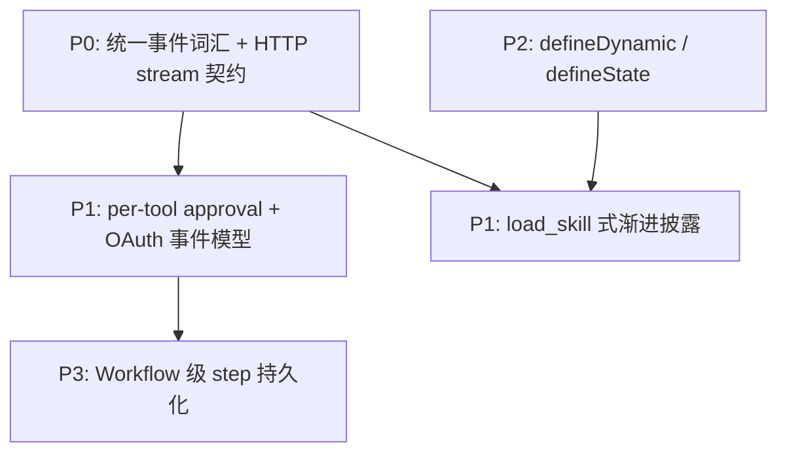

# Eve 框架参考与 Zhin.js 借鉴对比

> 基于 [eve.dev](https://eve.dev/docs/introduction) 官方文档整理，供 Zhin 维护者作路线图输入。  
> 插件作者面用法见 [agent-authoring.md](./agent-authoring.md)。  
> **架构决策**见 [ADR 0039](../adr/0039-eve-aligned-agent-surface-roadmap.md)（边界与 P0–P3 路线）。

---

## 第一章：Eve 核心概念速查

### 1.1 是什么

**Eve** 是在 TypeScript 项目里用**普通文件**构建**持久化 Agent** 的框架。核心理念是 **filesystem-first**：能力写在 `agent/` 目录下，框架自动发现，无需维护独立注册表。

最小 Agent 只需两个文件：

- `agent/instructions.md` — 常驻系统提示（身份、规则）
- `agent/agent.ts` — 运行时配置（模型、压缩、限额等）

按需扩展 `tools/`、`skills/`、`channels/`、`connections/` 等。

### 1.2 项目布局（路径即身份）

| 路径 | 解析为 |
|------|--------|
| `agent/tools/get_weather.ts` | 工具 `get_weather` |
| `agent/skills/summarize.md` | 技能 `summarize` |
| `agent/connections/linear.ts` | 连接 `linear` |
| `agent/subagents/researcher/agent.ts` | 子代理 `researcher` |

子代理目录**不继承**根 Agent 的槽位；`channels/`、`schedules/` 仅根 Agent 可用。排查发现结果：`eve info`。

### 1.3 消息与持久化流程

无论消息来自 Web、终端还是 Slack，流程一致：

1. 通道将平台输入标准化为 user message  
2. 组装 instructions + skills + tools + 会话历史  
3. 模型循环（可调用工具、子代理）  
4. **持久化** session，**流式**输出 NDJSON 事件  
5. 通道按平台格式回传  

持久化基于开源 [Workflow SDK](https://workflow-sdk.dev)：支持跨进程重启、人工审批暂停、OAuth 等待、多日续聊。

**三层结构：**

- **Session** — 整个 durable 会话  
- **Turn** — 一条用户消息触发的完整工作  
- **Step** — Turn 内的检查点（一次模型调用 + 其工具调用）

已完成 step **不重跑**；中断中的 step **会重跑** → 非幂等副作用需 approval 或幂等设计。

### 1.4 核心构建块

**Instructions** — 每轮 prepend 的常驻提示；与 **Skills**（按需 `load_skill` 加载）相对。

**Tools** — `defineAgentTool({ description, inputSchema, execute, approval?, toModelOutput? })`；在**应用运行时**执行（非沙箱），可访问 `process.env`。`ctx` 提供 `session`、`getSandbox()`、`getSkill()`、`abortSignal` 等。

**默认 Harness 内置工具**（可覆盖/禁用）：

| 工具 | 作用 |
|------|------|
| bash, read/write_file, glob, grep | 沙箱文件/命令 |
| web_fetch, todo, ask_question, agent, load_skill | 应用运行时 |
| web_search | Provider 侧 |
| connection_search | 发现 connection 工具 |

**Sandbox** — 单一隔离环境，cwd `/workspace`；可选 vercel/docker/microsandbox/justbash 等后端；支持 network policy 与凭证注入（密钥不进沙箱进程）。

**Connections** — MCP 或 OpenAPI 外部服务；模型通过 `connection_search` 发现，调用名如 `linear__list_issues`；凭证不进模型上下文。

**Subagents** — 内置 `agent` 工具（复制自身、共享沙箱）或 `subagents/<name>/` 声明式专家（独立 sandbox/tools/skills）。

**Channels** — 平台边缘适配：标准化输入、持有 `continuationToken`、决定如何投递响应。默认 HTTP 通道 `eveChannel()` 暴露 `/eve/v1/session*`。

**Hooks** — `defineHook` 订阅流事件，**仅观察**，不能注入模型上下文。

**Schedules** — 根 Agent 定时任务；markdown 为 fire-and-forget；`run` handler 可通过 `receive(channel, …)` 跨通道投递。

**defineDynamic** — 按 session/turn/step 事件运行时解析 model、tools、skills、instructions（多租户/按用户差异化）。

**defineState** — 会话内 typed durable memory，`get()` / `update()`。

### 1.5 HTTP 会话契约（双句柄）

| 句柄 | 用途 |
|------|------|
| `continuationToken` | 续聊、发 follow-up（channel 持有） |
| `sessionId` | 订阅事件流 |

```bash
# 创建会话
POST /eve/v1/session  →  { sessionId, continuationToken }

# 订阅流（NDJSON）
GET /eve/v1/session/:sessionId/stream

# 续聊
POST /eve/v1/session/:sessionId  →  { continuationToken, message }
```

关键事件：`session.started` → `turn.started` → `actions.requested` / `action.result` → `message.completed` → `session.waiting` / `session.completed`；另有 `input.requested`（HITL）、`authorization.required`（OAuth）、`subagent.called` 等。

### 1.6 Human-in-the-loop

- **Approval**：工具上 `approval: always() | once() | never()` 或自定义 policy  
- **Questions**：内置 `ask_question`，模型可暂停提问  
- 协议：`input.requested` → `session.waiting`（durable park）→ 用户回答 → 原处恢复  

### 1.7 认证（两套独立系统）

- **Route auth（入站）**：保护 HTTP session 路由；有序 `auth` walk，默认 fail-closed  
- **Connection auth（出站）**：调用外部服务时；支持 app/user 凭证、交互式 OAuth  

### 1.8 官方文档索引

| 主题 | 链接 |
|------|------|
| 介绍 | https://eve.dev/docs/introduction |
| 项目布局 | https://eve.dev/docs/reference/project-layout |
| 快速开始 | https://eve.dev/docs/getting-started |
| agent.ts | https://eve.dev/docs/agent-config |
| Tools / Skills / Instructions | https://eve.dev/docs/tools |
| Connections / Sandbox / Subagents | https://eve.dev/docs/connections |
| Channels | https://eve.dev/docs/channels/overview |
| Sessions & Streaming | https://eve.dev/docs/concepts/sessions-runs-and-streaming |
| Execution & Durability | https://eve.dev/docs/concepts/execution-model-and-durability |
| Default Harness | https://eve.dev/docs/concepts/default-harness |
| HITL | https://eve.dev/docs/human-in-the-loop |
| Dynamic capabilities | https://eve.dev/docs/guides/dynamic-capabilities |
| Auth | https://eve.dev/docs/guides/auth-and-route-protection |
| Schedules / Deployment | https://eve.dev/docs/schedules |

**待补读**：Frontend（`useEveAgent`）、TypeScript SDK（`eve/client`）、OpenAPI connections 子页、Security model、Observability、Evals。

---

## 第二章：Zhin.js 全栈对比矩阵

说明：

- **建议优先级**标注为「待维护者确认」。
- **排除项**：Vercel Connect、`vercel()` sandbox、Build Output、Agent Runs 等不要求 API parity，只借鉴可移植概念。
- **Zhin 现状**列给出主要代码/文档路径，便于跳转。

### 2.1 创作面与发现

| 层级 | Eve 做法 | Zhin 现状 | 借鉴建议 | 保留/替换 | 建议优先级 |
|------|----------|-----------|----------|-----------|------------|
| 插件/agent | `agent/` 槽位表；路径即身份 | 已对齐 Eve-style，见 [agent-authoring.md](./agent-authoring.md)；插件工具带前缀如 `lottery_sync` | `zhin agent info` 维护者诊断 | **保留** Zhin 插件前缀命名（多插件共存） | — |
| 工作区 Agent | `agents/<name>/` | `examples/test-bot/agents/<name>/` + `agent.ts` + `instructions.md` | 文档化 workspace agent 与插件 agent 命名差异 | **保留** | — |
| 模型配置 | `agent.ts` 内 `model` 必填（有文件时） | `zhin.config.yml` 的 `ai` 段 | 不搬到 `agent.ts`；可选在 `agent.ts` 声明 strategy/identity -only | **保留** config 集中管理 | — |
| 诊断 | `eve info` + `.eve/` 编译产物 | `discoverPluginAgentSurface`；无统一 CLI info | 增加维护者向 `zhin packages agent-surface` 或类似命令 | 借鉴思路 | P2 |
| Evals | `evals/*.eval.ts` | 插件可有 `evals/`；框架级 eval 分散 | 统一 eval 发现与 CI 入口文档 | 借鉴 | P2 |
| Harness 禁用 | `disableTool()` sentinel | `defineAgent({ disallowedTools: [disableTool('bash')] })` | **已实现**（ADR 0039 P2） | 借鉴 | — |
| 诊断 | `eve info` + `.eve/` 编译产物 | `zhin agent info` | **已实现**（ADR 0039 P2） | 借鉴思路 | — |

### 2.2 Tools

| 层级 | Eve 做法 | Zhin 现状 | 借鉴建议 | 保留/替换 | 建议优先级 |
|------|----------|-----------|----------|-----------|------------|
| 定义 API | Eve: `defineTool` + Zod；Zhin 规范名 **`defineAgentTool`**（`defineTool` 软弃用别名） | `@zhin.js/agent/tools` | 已对齐语义；Zhin 用 `defineAgentTool` 避免与 core 命令 `defineTool` 混淆 | **保留** | — |
| 运行位置 | 应用运行时；沙箱经 `ctx.getSandbox()` | 多数工具在 agent 运行时；bash/read 等走 sandbox | 文档明确「authoring tool vs sandbox tool」边界 | 借鉴表述 | P1 |
| Approval | per-tool `approval: always/once/never` | `defineAgentTool({ approval })` + `runToolApprovalGate`；与 ExecPolicy / Owner confirm **叠加** | **已实现**（ADR 0039 P1） | **保留** ExecPolicy 叠加 | — |
| 模型可见输出 | `toModelOutput` | `defineAgentTool({ toModelOutput })` + `applyToolToModelOutput` | **已实现**（ADR 0039 P1） | 借鉴 | — |
| Replay 语义 | 完成 step 不重跑；中断 step 重跑 | Turn 级处理；无 Workflow step 边界 | 文档化幂等要求；长期对齐 step 语义 | 概念借鉴 | P2 |
| 内置工具 | harness 表（bash/todo/ask_question/…） | `web_search`、`ask_user`；bash/read/edit 等 builtin | 对照表写入 agent-authoring；缺啥补啥 | **保留** Zhin ExecPolicy 包装 | P1 |

### 2.3 Skills

| 层级 | Eve 做法 | Zhin 现状 | 借鉴建议 | 保留/替换 | 建议优先级 |
|------|----------|-----------|----------|-----------|------------|
| 加载模型 | `load_skill` 渐进披露 | `discover` → `load_skill` + `SKILL_DISCLOSURE_*` 规范 | **已实现**（ADR 0039 P1） | 借鉴 | — |
| 标准 | Agent Skills `SKILL.md` | 支持 `.md` + 遗留 `skills/SKILL.md` | 迁移指南已存在；强化 `description` frontmatter | **保留** 双路径过渡 | P1 |
| 作用域 | 每 agent 独立 | 插件/workspace 分 scope；orchestrator 按 agentId | 文档化 scope 规则 | **保留** IM 多 agent 路由 | — |

### 2.4 Connections（MCP / 外部服务）

| 层级 | Eve 做法 | Zhin 现状 | 借鉴建议 | 保留/替换 | 建议优先级 |
|------|----------|-----------|----------|-----------|------------|
| 发现 | `agent/connections/*.ts` | 插件 `agent/connections/` + `McpRegistry` | 已对齐文件化 | **保留** | — |
| 工具命名 | `linear__list_issues` | `{connection}__{tool}` + `McpRegistry.listQualifiedTools()` | **已实现**（ADR 0039 P1）；legacy `mcp_*` 仅解析 | **保留** | — |
| OpenAPI | `defineOpenAPIConnection` | 无一等 OpenAPI connection | 评估是否需要；非 IM 核心可 P3 | 按需 | P3 |
| Auth | app/user、`getToken`、交互 OAuth + 事件 | `authorization.required/completed` + Host `POST /zhin/v1/authorization/:id/complete` | **已实现**（ADR 0039 P1） | 概念借鉴 | — |
| 凭证隔离 | token 不进 history/模型 | MCP clean env；audit | 强化文档与 harness 检查 | **保留** 并加强 | P1 |

### 2.5 Sandbox

| 层级 | Eve 做法 | Zhin 现状 | 借鉴建议 | 保留/替换 | 建议优先级 |
|------|----------|-----------|----------|-----------|------------|
| 抽象 | 多 backend + `defaultBackend()` | `security/sandbox.ts`、`sandbox-docker.ts` | 文档见 agent-authoring Sandbox 节 | 借鉴 | — |
| Network policy | allow-list / deny-all / transform | `network-policy.ts` | 对照 Eve 域名级策略与 credential brokering | 借鉴 | P2 |
| Workspace seed | `agent/sandbox/workspace/**` | 无标准 agent 槽位 seed | 可选 `agent/sandbox/workspace/` 约定 | 借鉴 | P3 |
| 作者 API | `ctx.getSandbox()` 统一 | bash-tool 等分散调用 | authoring `execute` 暴露一致 ctx | 借鉴 | P2 |

### 2.6 Subagents

| 层级 | Eve 做法 | Zhin 现状 | 借鉴建议 | 保留/替换 | 建议优先级 |
|------|----------|-----------|----------|-----------|------------|
| 内置复制 | `agent` 工具，共享沙箱 | `SubagentSystem`、`spawn_task` 等 | 文档化「复制 vs 专家」两种模式 | **保留** Zhin 协作场景 | P1 |
| 声明式 | `subagents/<name>/` 不继承根槽位 | `agent/subagents/` 已支持 | 强化「不继承」规则与 description 必填 | 已对齐 | — |
| 深度限制 | `maxSubagentDepth` | 配置分散 | 集中到 agent config | 借鉴 | P2 |
| 子 session 流 | `subagent.called` + child stream | 子 agent 结果回传 IM | Host/Console 暴露 child session 订阅 | 借鉴 | P2 |

### 2.7 Hooks 与事件流

| 层级 | Eve 做法 | Zhin 现状 | 借鉴建议 | 保留/替换 | 建议优先级 |
|------|----------|-----------|----------|-----------|------------|
| Hooks | `defineHook` 订阅 NDJSON 事件 | `AgentStreamBus` → HookSink + `HookRegistry`；`process-stream` 单次映射 TurnEvent | **P0 ✓** Bus 统一 egress（ADR 0041） | 借鉴 | P0 ✓ |
| 语义 | observe-only | hooks 多种用途 | 文档区分 observe vs 改 prompt | 借鉴 | P1 |
| 顺序 | channel → persist → hooks → dynamic | 分散在 turn pipeline | 明确 pipeline 阶段图 | 借鉴 | P1 |

### 2.8 Session、流式与持久化

| 层级 | Eve 做法 | Zhin 现状 | 借鉴建议 | 保留/替换 | 建议优先级 |
|------|----------|-----------|----------|-----------|------------|
| 持久化 | Workflow SDK step checkpoint | DB session + memory；HTTP JSON 快照（ADR 0040） | **P3 已实现** Host 文件持久化 + step 事件；IM 侧不变 | 长期借鉴 | — |
| HTTP 契约 | `/eve/v1/session` + NDJSON | `GET/POST /zhin/v1/session*` + NDJSON stream（ADR 0039 P0） | 定义 Zhin 稳定 session/stream API（可不同路径） | 借鉴 | P0 ✓ |
| 双句柄 | continuationToken vs sessionId | IM Message 会话；continuation 概念弱 | Console/SDK 明确两句柄 | 借鉴 | P0 |
| 消息队列 | 非 FIFO；等 `session.waiting` | `InboundTurnQueue` 合并同会话 | 文档化与 Eve 差异；channel 层可选队列 | **保留** IM 合并策略 | P1 |
| Compaction | harness 默认 0.9 threshold | `@zhin.js/ai` compaction | 已具备；对齐配置文档 | **保留** | — |

### 2.9 Human-in-the-loop

| 层级 | Eve 做法 | Zhin 现状 | 借鉴建议 | 保留/替换 | 建议优先级 |
|------|----------|-----------|----------|-----------|------------|
| 提问 | `ask_question` | `ask_user`（`ask-user-tool.ts`） | 概念已对齐 | **保留** IM 适配 | — |
| Approval | per-tool + `input.requested` | `pendingInputs` reducer + `runToolApprovalGate` | **已实现**（ADR 0039 P1） | 借鉴 | — |
| Park/resume | durable `session.waiting` | HTTP `POST .../input` + 文件快照（ADR 0040）；IM 仍走 LoginAssist 等 | **P3 已实现**（HTTP 路径）；跨重启 mid-turn 见 ADR 0040 D5 | 概念借鉴 | — |

### 2.10 Channels vs Adapters

| 层级 | Eve 做法 | Zhin 现状 | 借鉴建议 | 保留/替换 | 建议优先级 |
|------|----------|-----------|----------|-----------|------------|
| 抽象 | Channel 持 continuationToken | Adapter + Endpoint + `$reply` 发送链 | **不替换** IM 栈；借鉴「通道持 resume 句柄」分离 | **保留** Adapter 架构 | — |
| HTTP | 默认 `eveChannel` | Host router | Host 提供等效 session 路由 | 借鉴 | P0 |
| 平台 | Slack/Discord/… 一等 channel | `plugins/adapters/*` 成熟 | 互鉴卡片/Block Kit 构建方式 | **保留** Zhin adapters | — |
| Route auth | `auth` walk on channel | Host Bearer/CORS | 文档化 fail-closed 与 helper 列表 | 借鉴 | P1 |

### 2.11 Host / Console / SDK

| 层级 | Eve 做法 | Zhin 现状 | 借鉴建议 | 保留/替换 | 建议优先级 |
|------|----------|-----------|----------|-----------|------------|
| 前端 | `useEveAgent` | `@zhin.js/client` `startAgentSession` / `subscribeAgentStream` | stream reducer 对齐 Eve 事件集子集 | 借鉴 | P0 ✓ |
| SDK | `eve/client` | 无对等 npm 包 | `@zhin.js/console-contract` 或 thin client | 借鉴 | P1 |
| Inspect | `GET /eve/v1/info` | `GET /zhin/v1/info` + `zhin agent info` | **已实现**（ADR 0039 P2） | 借鉴 | — |

### 2.12 Schedules

| 层级 | Eve 做法 | Zhin 现状 | 借鉴建议 | 保留/替换 | 建议优先级 |
|------|----------|-----------|----------|-----------|------------|
| 定义 | `defineSchedule` + cron | 插件 `agent/schedules/` | 已对齐 | **保留** | — |
| 投递 | `receive(channel, { message, target, auth: appAuth })` | `deliverScheduleToAdapter` + proactive outbound | **已实现**（ADR 0039 P1） | **保留** IM 链 | — |
| Dev 触发 | `POST .../dev/schedules/:id` | 依赖 Cron/手动 | dev-only 一次性 dispatch 路由 | 借鉴 | P2 |

### 2.13 Dynamic 与 State

| 层级 | Eve 做法 | Zhin 现状 | 借鉴建议 | 保留/替换 | 建议优先级 |
|------|----------|-----------|----------|-----------|------------|
| defineDynamic | 按 auth/tenant 解析 tools/skills/instructions | `agent/dynamic.ts` + `applyDynamicTurnOverrides` | **已实现**（ADR 0039 P2） | 借鉴 | — |
| defineState | 会话内 durable KV | `agent/state/*.ts` + `getAgentState` / `updateAgentState` | **已实现**（内存 per session） | 借鉴 | — |

### 2.14 安全与策略

| 层级 | Eve 做法 | Zhin 现状 | 借鉴建议 | 保留/替换 | 建议优先级 |
|------|----------|-----------|----------|-----------|------------|
| Exec | sandbox + approval | **ExecPolicy 5 层** + audit | **保留** Zhin harness；补 per-tool approval | **保留** ExecPolicy | P1 |
| File | sandbox FS | **FilePolicy 4 层** | **保留**；与 read-before-write 对齐文档 | **保留** | — |
| 网络 | sandbox networkPolicy | `network-policy.ts` | 借鉴 domain allow-list 表述 | 互补 | P2 |

### 2.15 脚手架与安装分层

| 层级 | Eve 做法 | Zhin 现状 | 借鉴建议 | 保留/替换 | 建议优先级 |
|------|----------|-----------|----------|-----------|------------|
| 初始化 | `npx eve init` | `pnpm create zhin-app` / `zhin setup` | wizard 增加 agent/ 模板与首工具 | 借鉴 UX | P2 |
| 安装体积分层 | 单包 eve | IM 核心 + 可选 `@zhin.js/agent`（ADR 0019） | **不合并**；Eve 一体化 vs Zhin 分层是 deliberate | **保留** ADR 0019 | — |

---

## 第三章：建议路线图优先级

> **P0 状态（2026-07-12）**：已在 `@zhin.js/ai`、`@zhin.js/contract`、`@zhin.js/client`、`@zhin.js/agent`、`@zhin.js/host-api` 落地。**P1 核心项（2026-07-12）**：approval、toModelOutput、MCP qualified 名、OAuth 事件、schedule 投递、skills 披露、Console reducer 已闭合。**P2（2026-07-12）**：`disableTool`、`zhin agent info`、`defineDynamic`/`defineState`、sandbox 文档、`GET /zhin/v1/info` 已闭合。**P3（2026-07-12）**：HTTP step checkpoint 文件持久化、`session.waiting` mid-turn park（`reason: parked|idle`）、`POST .../input` 已闭合（见 ADR 0040）。**仍待**：P1 route auth 文档、hooks 管线图、thin SDK 发布面、P2 dev schedule 路由。

依赖关系简图：



| 优先级 | 主题 | 理由 |
|--------|------|------|
| **P0** | 统一 turn/stream 事件词汇；Host 稳定 session/stream API；Console 消费契约 | 不改持久化引擎也能提升可观测性与 SDK/控制台一致性 |
| **P1** | per-tool `approval`；connection OAuth **事件**；`toModelOutput`；qualified MCP 工具名；schedule→channel 投递 | 作者体验与安全声明式配置；IM 富消息与模型上下文分离 |
| **P2** | `disableTool`；`zhin agent info`；defineDynamic/defineState；sandbox backend 文档化 | 多租户与运维向能力 |
| **P3** | HTTP step 持久化与 `session.waiting` park（`reason: parked|idle`） | 已实现（ADR 0040）；非 Workflow SDK |

---

## 第四章：Zhin 应保持的差异化（不宜照搬 Eve）

1. **IM-first 发送链** — `Message.$reply` / `Adapter.sendMessage`，不要用 Eve channel 替换 Adapter。  
2. **模型在 `zhin.config.yml`** — 运维/多环境友好，不强制迁入 `agent.ts`。  
3. **`@zhin.js/agent` 可选 peer** — 安装体积与 Stable/L4 分档（ADR 0019）。  
4. **ExecPolicy / FilePolicy** — 比 Eve 更贴 IM 群管/Owner 场景；与 per-tool approval **互补**而非替换。  
5. **插件工具前缀** — 多插件共存下的命名空间，优于 Eve 单 app 裸 slug。  
6. **Vercel 专有栈** — Connect、vercel sandbox、Build Output 等仅借鉴概念，用 Zhin Host + 自托管 sandbox 实现。

---

## 修订记录

- 2026-07-12：P3 实现闭合 — mid-turn `session.waiting`（`reason: parked`）、idle 续聊（`reason: idle`）、ADR 0040 文件持久化。
- 2026-07-12：P0 实现闭合 — contract `agent-stream`、agent HTTP session store、`/zhin/v1` Host 路由（见 ADR 0039 实现追踪）。
- 2026-07-12：初版，基于 eve.dev 文档抓取与 Zhin 代码库对照（agent-authoring、orchestrator、host、security）。
