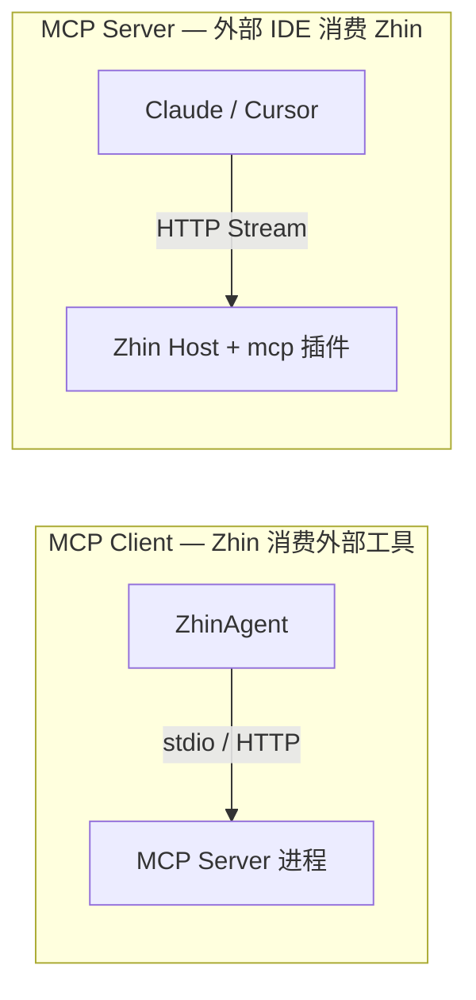

# MCP 集成

[Model Context Protocol (MCP)](https://modelcontextprotocol.io) 让 AI 助手与外部工具、数据源标准化对接。在 Zhin.js 中有**两个方向**，初学者最容易混淆：

| 方向 | 谁消费谁 | 典型场景 | 配置入口 |
|------|----------|----------|----------|
| **MCP Client** | Zhin **调用**外部 MCP Server 的工具 | 文件系统、知识图谱、自建工具服务 | `ai.mcpServers`、`ai.memoryMcp` |
| **MCP Server** | 外部 IDE/助手 **调用** Zhin 暴露的能力 | 在 Claude Desktop / Cursor 里生成 Zhin 插件 | `@zhin.js/mcp` 插件 |



> **Stable 默认关闭 MCP**。脚手架与 [minimal-bot](https://github.com/zhinjs/zhin/tree/main/examples/minimal-bot) 不启用 `mcpServers` / `memoryMcp`；Advanced 验收见 [test-bot ACCEPTANCE.md](https://github.com/zhinjs/zhin/blob/main/examples/test-bot/ACCEPTANCE.md)。

## 前置依赖

MCP Client 需要可选安装 SDK（peer dependency）：

```bash
pnpm add @modelcontextprotocol/sdk
```

未安装时，连接 MCP Server 会失败并在日志中 warn，**不会阻塞**普通 AI 对话。

## MCP Client：接入外部工具

### 1. 长期记忆（推荐：三层 Markdown）

默认使用 `ai.memory` 文件三层（`data/memory/global`、`platforms/`、`sessions/`），由 system prompt 注入；Agent 通过 `write_file` 写入（全局/平台仅 master）。详见 [配置参考 — 三层文件记忆](/essentials/configuration#三层文件记忆-stable-默认启用)。

### 1b. 记忆 MCP（已弃用）

`ai.memoryMcp: true` 仍会注册 `@modelcontextprotocol/server-memory` 并打弃用警告；新部署请改用文件三层，勿再依赖 `data/knowledge-graph.jsonl`。

### 2. 多模态媒体 MCP（可选）

入站音视频混合路由可在 `ai.multimodal` 中启用 `audio.strategy: mcp` / `video.strategy: mcp`，由 Zhin 将 base64 载荷按需落盘到 `data/media/inbound/` 后调用外部 MCP（例如 Whisper 转写、ffmpeg 抽帧）。出站仍走 **base64 + Adapter** 发送链，不要求公网图床。

```yaml
ai:
  multimodal:
    enabled: true
    audio:
      strategy: mcp
    video:
      strategy: mcp
      maxFrames: 8
  mcpServers:
    - name: whisper
      transport: stdio
      command: npx
      args: ["-y", "@your-org/mcp-whisper"]
```

本地文件分析请用内置 `analyze_media`（勿对图片使用 `read_file`）。

### 3. 注册外部 MCP Server

在 `zhin.config.yml` 的 `ai.mcpServers` 中声明（也可在插件里 `ctx.agent.addMcp`）：

```yaml
ai:
  mcpServers:
    - name: filesystem
      transport: stdio
      command: npx
      args:
        - "-y"
        - "@modelcontextprotocol/server-filesystem"
        - "/tmp/zhin-mcp-test"
```

**字段说明**：

| 字段 | 说明 |
|------|------|
| `name` | 逻辑名，工具前缀为 `mcp_{name}_{tool}` |
| `transport` | `stdio` / `streamable-http` / `sse` |
| `command` + `args` | stdio 模式下启动子进程的命令 |
| `url` | HTTP/SSE 模式下 Server 地址 |
| `env` | stdio 子进程环境变量（键值对） |
| `headers` | HTTP/SSE 请求头 |

每次 AI 回合前框架**懒连接**；`ZhinAgent` 将 MCP 工具并入工具池，命名如 `mcp_filesystem_read_file`。

### YAML vs 代码注册

| 方式 | 适合 |
|------|------|
| **`ai.mcpServers`（YAML）** | 项目级固定 Server、与配置一起版本管理 |
| **`ctx.agent.addMcp()`（代码）** | 插件动态注册、按 bot/环境条件挂载 |

二者最终都进入 `AgentOrchestrator` 的 `McpRegistry`，行为一致。

### 限制（当前版本）

- 单个 Server 连接失败仅 **warn**，不阻塞本回合
- MCP 的 **resources / prompts** 暂不注入模型上下文
- 与 `@zhin.js/mcp`（MCP **Server** 插件）方向相反，勿混为一谈

## MCP Server：让 IDE 开发 Zhin 插件

安装 `@zhin.js/mcp` 后，Zhin 对外暴露 Tools / Resources / Prompts，供 Claude Desktop、Cursor 等调用。

### 1. 启用插件

```typescript
import { defineConfig } from 'zhin.js'

export default defineConfig({
  plugins: [
    '@zhin.js/host-router',
    '@zhin.js/mcp',
  ],
  mcp: {
    enabled: true,
    path: '/mcp',
  },
  http: {
    port: 8086,
  },
})
```

默认 HTTP 端口见 `http.port`（常见 `8086`），MCP 端点为 `http://127.0.0.1:<port>/mcp`（或经反向代理的公网地址）。

### 2. 配置 Claude Desktop

编辑 `~/Library/Application Support/Claude/claude_desktop_config.json`（路径因平台而异）：

```json
{
  "mcpServers": {
    "zhin": {
      "command": "curl",
      "args": ["-N", "http://localhost:8086/mcp"]
    }
  }
}
```

确保 Zhin 应用已启动且 HTTP 插件已加载。Cursor / VS Code 通过 MCP 扩展配置同类地址。

重启 IDE 后即可在对话中使用 `create_plugin` 等 Zhin 开发工具。完整工具列表见 [`@zhin.js/mcp` README](https://github.com/zhinjs/zhin/tree/main/packages/host/mcp)。

## 验证（Smoke Test）

完成 Client 配置后，按以下步骤自检：

1. **启动**：`pnpm dev`，确认日志无 SDK 缺失的致命错误
2. **触发 AI**：私聊或 `@` 机器人发一条需要工具的消息（如「列出 /tmp/zhin-mcp-test 下的文件」）
3. **查工具名**：日志或 `phaseTrace` 中应出现 `mcp_filesystem_*` 类工具调用

维护者完整矩阵见 [examples/test-bot/ACCEPTANCE.md — MCP Client](https://github.com/zhinjs/zhin/blob/main/examples/test-bot/ACCEPTANCE.md)。

## 排障

| 现象 | 可能原因 | 处理 |
|------|----------|------|
| 日志提示 SDK 未安装 | 未装 `@modelcontextprotocol/sdk` | `pnpm add @modelcontextprotocol/sdk` 后重启 |
| MCP 工具不出现 | `mcpServers` 拼写错误或子进程启动失败 | 检查 YAML；手动运行 `command` + `args` 验证 |
| 单 Server warn 但对话正常 | 该 Server 不可达 | 预期行为；修复对应 Server 或从配置移除 |
| 杀 MCP 子进程后首轮失败 | 连接缓存失效 | 下一轮应自动重连；见 ACCEPTANCE 重连用例 |
| 难以定位阶段 | Agent 内部阶段不清晰 | 设 `ai.agent.phaseTrace: true` 或 `ZHIN_AGENT_PHASE_TRACE=1` |

## 相关文档

- [Agent 概念入门](/advanced/agent-concepts) — `ctx.ai` / `ctx.agent`、toolSearch
- [AI 模块 — MCP 集成摘要](/advanced/ai#mcp-集成)
- [配置文件 — Advanced AI 开关](/essentials/configuration#advanced-ai-开关)
- [Agent 安全与角色](/advanced/agent-harness-engineering)
- [Agent Mesh 硬编排](/advanced/agent-mesh) — A2A v1.0、`ai.remoteAgents[].cardUrl`、OrchestrationKernel DAG
