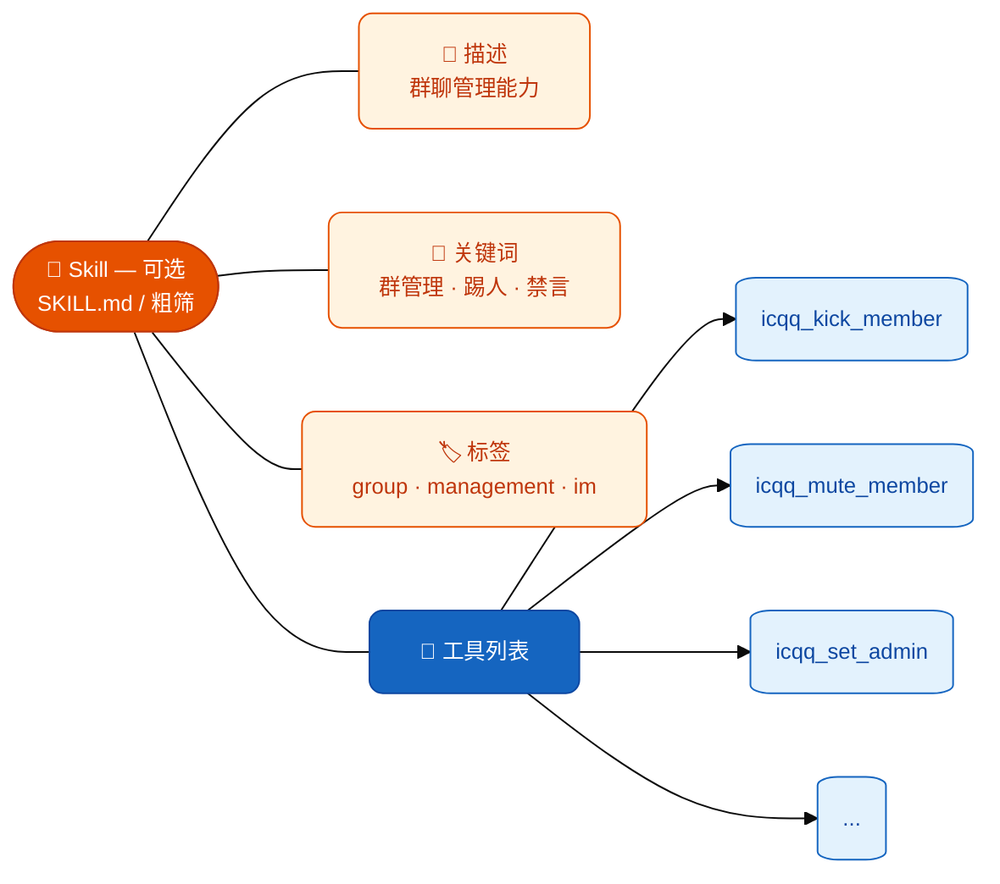

# 工具与技能

## 技能可以不要，工具能不能也不要？

**不能混为一谈：**

| 层次 | 作用 | 不用它时 |
|------|------|----------|
| **Tool（工具）** | AI 通过 function calling **真正执行**的能力（调接口、改数据、发消息等） | 若仍要让 AI **办事**，就必须保留对应 Tool；否则 AI 只能 **纯聊天**，无法替你操作插件。 |
| **Skill（SKILL.md / SkillFeature）** | **可选**：长说明、`activate_skill`、粗筛里帮模型缩小工具范围 | 可以 **不写 SKILL**；工具仍可通过 `keywords/tags` 和全量收集参与筛选。Core **不提供** `declareSkill`。 |

**非 AI 路径**：不需要「技能」时，能力可以完全放在 **命令 `addCommand`、HTTP API、CLI、定时任务** 上——**不注册 Tool** 即可，与 SKILL 无关。

**通用性建议**：SKILL 里只写 **跨平台通用的流程与约束**；平台差异放进 **Tool 的 description / parameters**。重复、无激活价值、只为凑关键词的 SKILL 可以 **直接删掉**，避免「垃圾技能」；保留精简工具与清晰 `keywords` 往往更稳。

---

工具（Tool）是 AI 可调用的具体操作；技能（Skill）是可选的语义层，用于说明与粗筛（当前推荐磁盘 `SKILL.md`）。

## 概念关系



AI Agent 处理消息时常见流程：
1. **粗筛**：用户消息匹配 Skill（含关键词）或直接从工具池按相关性选 Tool
2. **细筛**：权限过滤 + 相关性排序（无 Skill 时仍可对 **全部已注册 Tool** 做细筛）

## 工具（Tool）

### 注册工具

使用 `addTool`（ToolFeature 扩展方法）注册工具：

```typescript
import { usePlugin } from 'zhin.js'

const { addTool } = usePlugin()

addTool({
  name: 'search_music',
  description: '按关键词搜索音乐，返回歌曲名、歌手和链接',
  parameters: {
    type: 'object',
    properties: {
      keyword: { type: 'string', description: '搜索关键词' },
      limit: { type: 'number', description: '返回数量，默认 5' },
    },
    required: ['keyword'],
  },
  tags: ['音乐', '搜索'],
  keywords: ['音乐', '歌', '听歌', '搜歌'],
  execute: async (args) => {
    const results = await musicAPI.search(args.keyword, args.limit || 5)
    return results
  },
})
```

### Tool 接口

`Tool` 支持泛型参数推断（默认 `Record<string, any>`，向后兼容）：

```typescript
interface Tool<TArgs extends Record<string, any> = Record<string, any>> {
  // 必填
  name: string                           // 工具名称（全局唯一）
  description: string                    // 描述（AI 用来理解工具用途）
  parameters: ToolParametersSchema<TArgs>  // 参数定义（JSON Schema 格式）
  execute: (args: TArgs, context?: ToolContext) => MaybePromise<ToolResult>  // 执行函数
  
  // 可选 - AI 发现
  tags?: string[]                 // 分类标签
  keywords?: string[]             // 触发关键词
  
  // 可选 - 约束
  platforms?: string[]            // 限定平台（如 ['icqq']）
  scopes?: ('private'|'group'|'channel')[]  // 限定场景
  permissionLevel?: ToolPermissionLevel     // 权限要求
  hidden?: boolean                // 对 AI 隐藏
  preExecutable?: boolean         // 允许预执行（无副作用的只读工具）
  
  // 可选 - 命令互转
  command?: { pattern: string } | false  // 同时生成命令
  
  // 可选 - 元数据
  source?: string                 // 来源标识
  kind?: string                   // 工具分类（如 file / shell / web）
}
```

### ToolResult 返回类型

工具的 `execute` 返回 `ToolResult`，支持多种形式：

```typescript
type ToolResult =
  | string               // 直接作为文本回复
  | { text: string }     // 结构化文本
  | { data: any; format?: string }  // 结构化数据
  | void | null | undefined  // 无回复
  | any                  // 其他类型自动 JSON.stringify
```

### 使用 ZhinTool 链式 DSL

`ZhinTool` 提供更简洁的链式写法：

```typescript
import { usePlugin, ZhinTool } from 'zhin.js'

const { addTool } = usePlugin()

addTool(
  new ZhinTool('get_weather')
    .desc('查询城市天气')
    .param('city', 'string', '城市名称', true)
    .param('unit', 'string', '温度单位(C/F)', false)
    .platform('icqq')           // 仅 ICQQ 平台可用
    .scope('group')             // 仅群聊可用
    .permission('user')         // 所有用户可用
    .execute(async (args) => {
      return await fetchWeather(args.city, args.unit)
    })
)
```

### 使用 defineTool（类型安全）

`defineTool<TArgs>` 利用 `Tool<TArgs>` 的泛型支持，让 `execute` 的 `args` 参数获得完整的类型提示：

```typescript
import { defineTool } from 'zhin.js'

const weatherTool = defineTool<{ city: string; unit?: string }>({
  name: 'get_weather',
  description: '查询城市天气',
  parameters: {
    type: 'object',
    properties: {
      city: { type: 'string', description: '城市名称' },
      unit: { type: 'string', description: '温度单位' },
    },
    required: ['city'],
  },
  execute: async (args) => {
    // args 类型为 { city: string; unit?: string }
    return await fetchWeather(args.city, args.unit)
  },
})
```

> **注意：** 旧的 `ToolDefinition<TArgs>` 已废弃，现在是 `Tool<TArgs>` 的类型别名。直接使用 `Tool<TArgs>` 即可。

## 技能（Skill）

### 技能目录与发现顺序

文件化技能（`SKILL.md`）的发现与 `activate_skill` 查找路径一致，优先级为：

1. 工作区 `cwd/skills/<name>/SKILL.md`
2. `~/.zhin/skills/<name>/SKILL.md`
3. `data/skills/<name>/SKILL.md`（框架默认数据目录）
4. **已加载插件**：根插件与**直接子插件**包目录下的 `skills/<name>/SKILL.md`（插件根 = `path.dirname(plugin.filePath)`）

`install_skill` 默认仍安装到工作区 `skills/`。工作区 `skills/` 支持热重载（见下文及 AI 文档）。

### 通用技能 vs 插件技能（文档与技能商店）

| | **通用技能** | **插件技能** |
|---|-------------|-------------|
| **位置** | 如 create-zhin 模板 `packages/create-zhin/template/skills/`；用户可复制到项目 `skills/` | 各插件 / 适配器包内 `skills/<name>/SKILL.md`，随 npm 安装 |
| **谁需要它** | 与具体插件无关的流程说明（如摘要、写 SKILL 规范） | 说明本插件工具集、触发词，帮模型做粗筛 |
| **CLI `zhin skills add`** | 仅当 registry 条目提供可下载 `source`（ZIP）时适用 | 一般**不需要**：装插件包即可，Agent 会扫包内 `skills/` |
| **文档** | [技能商店](/skills/) 中「通用技能」分类；数据由 `docs/scripts/build-skills-registry.mjs` 扫描生成 | 同页「插件技能」分类，展示对应 npm 包名与仓库路径 |

### 在插件中声明（推荐：文件化）

当插件提供多个相关工具时，在**插件包目录**下增加 `skills/<技能名>/SKILL.md`（frontmatter 含 `name`、`description`、`keywords`、`tags`；可选 `tools` 列表关联工具名）。Agent 会通过 `discoverWorkspaceSkills` 与同路径的 `activate_skill` 发现该技能。

```text
plugins/utils/my-plugin/skills/my-plugin/SKILL.md
```

### 在适配器中声明

#### 包内 `skills/<name>/SKILL.md`

各适配器包内提供 `skills/<适配器名>/SKILL.md`（含 `name`、`description`、`keywords` 等 frontmatter），工具通过 `addTool` / `registerDefaultTools` / 群管自动生成注册。**`Adapter.declareSkill` 已从 Core 移除**，仅保留文件化技能。

#### 群管理能力（推荐：覆写方法自动检测）

群管理是 IM 的通用能力。Adapter 基类声明了 `IGroupManagement` 接口中的可选方法规范，适配器只需覆写自己平台支持的方法，`start()` 会自动检测并**生成群管 Tool**（Skill 粗筛依赖 `SKILL.md` 或工具 `keywords`，不再由适配器代码注册 Skill）：

```typescript
class IcqqAdapter extends Adapter<IcqqBot> {
  // 覆写标准群管方法 —— 内部委托给 Bot 的原生 API
  async kickMember(botId: string, sceneId: string, userId: string) {
    const bot = this.bots.get(botId)
    if (!bot) throw new Error(`Bot ${botId} 不存在`)
    return bot.kickMember(Number(sceneId), Number(userId), false)
  }

  async muteMember(botId: string, sceneId: string, userId: string, duration = 600) {
    const bot = this.bots.get(botId)
    if (!bot) throw new Error(`Bot ${botId} 不存在`)
    return bot.muteMember(Number(sceneId), Number(userId), duration)
  }

  async listMembers(botId: string, sceneId: string) {
    const bot = this.bots.get(botId)
    if (!bot) throw new Error(`Bot ${botId} 不存在`)
    const memberMap = await bot.getMemberList(Number(sceneId))
    return { members: Array.from(memberMap.values()), count: memberMap.size }
  }

  async start() {
    this.registerIcqqPlatformTools()  // 注册平台特有工具（头衔、公告、戳一戳等）
    await super.start()               // 自动检测上述 3 个方法 → 生成 Tool → 注册 Skill
  }
}
```

目前 10 余个 IM 适配器（含 ICQQ、OneBot11、Milky、QQ 官方、Telegram、Discord、KOOK、Slack、钉钉、飞书等）已采用此模式，Satori、OneBot 12 等协议适配器见 [适配器](/essentials/adapters) 一览：

| 适配器 | 覆写的标准方法 | 保留的平台特有工具 |
|--------|---------------|-------------------|
| ICQQ | kick, mute, muteAll, setAdmin, setNickname, setGroupName, listMembers | 头衔、群公告、戳一戳、禁言列表等 |
| OneBot11 | kick, mute, muteAll, setAdmin, setNickname, setGroupName, listMembers, getGroupInfo | 头衔 |
| Milky | kick, mute, muteAll, setAdmin, setNickname, setGroupName, listMembers, getGroupInfo | — |
| Telegram | kick, unban, mute, setAdmin, setGroupName, getGroupInfo | 置顶、投票、反应、贴纸、权限等 |
| Discord | kick, ban, unban, mute, setNickname, listMembers, getGroupInfo | 角色管理、帖子/论坛、反应、Embed |
| KOOK | kick, ban, unban, setNickname, listMembers | 角色管理、黑名单 |
| QQ 官方 | kick, mute, muteAll, listMembers, getGroupInfo | 频道/子频道、角色管理 |
| Slack | kick, setGroupName, listMembers, getGroupInfo | 邀请、话题、归档、反应等 |
| 钉钉 | kick, setGroupName, getGroupInfo | 部门管理、工作通知等 |
| 飞书 | kick, listMembers, getGroupInfo, setGroupName | 管理员设置、解散群等 |

可用的群管理方法规范：

| 方法 | 说明 | 权限级别 |
|------|------|---------|
| `kickMember` | 踢出成员 | group_admin |
| `muteMember` | 禁言（duration=0 解除） | group_admin |
| `setMemberNickname` | 设置群昵称/名片 | group_admin |
| `setAdmin` | 设置/取消管理员 | group_owner |
| `listMembers` | 获取成员列表 | user |
| `banMember` | 封禁成员 | group_admin |
| `unbanMember` | 解除封禁 | group_admin |
| `setGroupName` | 修改群名称 | group_admin |
| `muteAll` | 全员禁言/解除 | group_admin |
| `getGroupInfo` | 获取群信息 | user |

#### 群管理使用指南

AI 在调用群管理工具时会遵循以下规则（已内置到 Skill 描述中）：

1. **用户名到 ID 的解析** — 当用户只提供昵称/名片时，AI 会先调用 `list_members` 查询成员列表，匹配目标用户的 `user_id`，再执行后续操作
2. **禁言场景** — `mute_member` 适用于违规发言、刷屏、骚扰等需要临时限制发言的场景。`duration` 单位为秒，传 0 表示解除禁言，默认 600 秒（10 分钟）
3. **管理员操作** — `set_admin` 需要群主权限，普通管理员无法操作；`enable=false` 为取消管理员
4. **踢人与封禁的区别** — `kick_member` 是将成员移出群聊（可再次加入），`ban_member` 是永久拉黑
5. **操作前确认** — AI 会确认目标用户正确后再执行，避免误操作

#### 平台特有工具约束

不同平台的特有工具有各自的使用限制：

| 平台 | 工具 | 约束 |
|------|------|------|
| ICQQ | `icqq_poke` | 每次请求只戳一次，不重复调用 |
| ICQQ | `icqq_send_user_like` | 每人每天最多 20 次 |
| ICQQ | `icqq_list_muted` | 仅查询，不执行禁言操作 |
| ICQQ | `icqq_set_title` | 需要群主权限 |

#### 平台特有工具

对于标准群管以外的平台特有操作（如 ICQQ 的头衔/群公告、Discord 的角色管理/Embed 等），在 `start()` 中通过 `addTool()` 手动注册；平台级 AI 说明放在适配器包 `skills/<adapter>/SKILL.md`，由 Agent 扫描与 `activate_skill` 使用。

```typescript
class IcqqAdapter extends Adapter<IcqqBot> {
  async kickMember(...) { /* ... */ }
  async muteMember(...) { /* ... */ }

  async start() {
    this.addTool({ name: 'icqq_set_title', ... })
    this.addTool({ name: 'icqq_announce', ... })
    this.addTool({ name: 'icqq_poke', ... })
    await super.start()
  }
}
```

### Skill 接口

```typescript
interface Skill {
  name: string              // 技能名称
  description: string       // 描述（含 conventions）
  tools: Tool[]             // 包含的工具
  keywords?: string[]       // 触发关键词
  tags?: string[]           // 分类标签
  pluginName: string        // 来源插件
}
```

## 权限控制

### 权限级别

```typescript
type ToolPermissionLevel = 
  | 'user'          // 普通用户（默认，所有人可用）
  | 'group_admin'   // 群管理员
  | 'group_owner'   // 群主
  | 'bot_admin'     // 机器人管理员
  | 'owner'         // 机器人拥有者
```

### 两层校验

**第一层：AI 前过滤**
在工具收集阶段，权限不足的工具不会出现在 AI 的可选列表中：
```
发送者是普通用户 → AI 只能看到 permissionLevel: 'user' 的工具
发送者是群管理员 → AI 能看到 'user' + 'group_admin' 的工具
```

**第二层：运行时校验**
工具执行时，ToolContext 会注入到 execute 函数中，适配器在执行前再次校验权限：

```typescript
execute: async (args, context) => {
  this.checkPermission(context, 'group_admin')  // 运行时二次校验
  // ... 执行实际操作
}
```

## Tool 与 Command 互转

### 工具自动生成命令

注册工具时通过 `command` 选项同时生成命令：

```typescript
addTool({
  name: 'get_weather',
  description: '查询天气',
  parameters: { ... },
  command: { pattern: 'weather <city:string>' },  // 自动生成命令
  execute: async (args) => { ... },
})
```

用户可以通过 `weather 北京` 命令调用，AI 也可以通过工具调用。

### 手动转换

```typescript
import { toolToCommand, commandToTool } from 'zhin.js'

// Tool -> Command
const command = toolToCommand(myTool)

// Command -> Tool（第二个参数为插件名）
const tool = commandToTool(myCommand, 'my-plugin')
```

## 去重机制

当同一个工具同时通过 Skill 路径和 externalTools 路径被收集时，`collectTools` 会自动去重：
- Skill 路径优先
- 同名工具只保留第一次收集到的

## 完整示例

```typescript
import { usePlugin, MessageCommand, ZhinTool } from 'zhin.js'

const { addTool, addCommand, logger } = usePlugin()

// 工具 1：搜索音乐
addTool(
  new ZhinTool('search_music')
    .desc('搜索音乐')
    .param('keyword', 'string', '搜索关键词', true)
    .param('limit', 'number', '返回数量', false)
    .execute(async (args) => {
      const results = await musicAPI.search(args.keyword, args.limit || 5)
      return { songs: results, count: results.length }
    })
)

// 工具 2：获取歌词
addTool({
  name: 'get_lyrics',
  description: '获取指定歌曲的歌词',
  parameters: {
    type: 'object',
    properties: {
      songId: { type: 'string', description: '歌曲 ID' },
    },
    required: ['songId'],
  },
  keywords: ['歌词', '词'],
  execute: async (args) => {
    return await musicAPI.getLyrics(args.songId)
  },
})

// 另：在插件包 skills/my-music/SKILL.md 写 name/description/keywords，供 Agent 发现（无 declareSkill API）

// 同时也注册一个命令（传统调用方式）
addCommand(
  new MessageCommand('music <keyword:string>')
    .desc('搜索音乐')
    .action(async (_, result) => {
      const data = await musicAPI.search(result.params.keyword, 3)
      return data.map(s => `${s.name} - ${s.artist}`).join('\n')
    })
)
```
