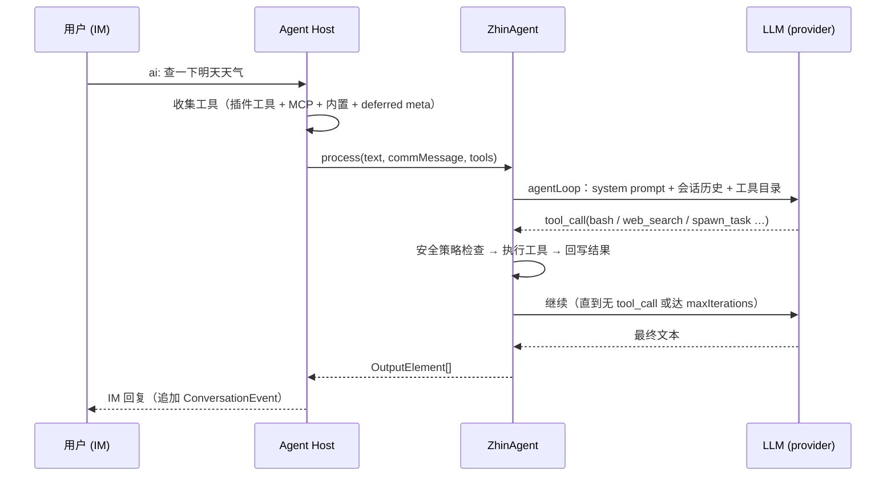

# Agent 深入

群里发一句 `ai: 查一下明天天气`，几秒后 bot 回了带数据的回答——中间发生了什么？本篇沿着这条路径展开 [AI 总览](./index.md) 的运行时：`ZhinAgent` 的回合流程、deferred tools、子代理与编排、会话持久化与 compaction、Assistant profile 与调度任务。

## ZhinAgent 回合

触发命中后，Agent Host 调用 `zhinAgent.process(text, commMessage, tools)` 跑一个回合（turn）：



几个值得记住的事实。ZhinAgent、子代理、后台 worker、`AIService.runAgent` 走的是**同一条 agentLoop**，行为可以一致地预期。同会话的消息按 `ai.agent.inboundQueue` 排队（`groupMode: supersede | fifo`），并发回合不会互相覆盖。首选模型失败时按候选链 fallback 到同 provider 的其他可用模型。`maxIterations` 默认 15（`DEFAULT_CONFIG.maxIterations`），可按 provider/model 经 model harness 覆盖（见下文）。超时有三层：触发侧单回合受 `ai.trigger.timeout` 约束（默认 60000ms），Agent 回合整体默认 120000ms（`DEFAULT_CONFIG.timeout`），工具预执行另有 15000ms 上限（`preExecTimeout`）。

回合产出的工具池 = 插件注册工具 + `ai.mcpServers` 连接工具 + 内置工具 + deferred meta 工具 + `schedule_*` + `bash` + Host 扩展工具（如 `voice_stt` / `voice_tts`）。

### Thinking 透明与步骤可视化

回合执行中，Agent 会通过 Activity Feedback 向 IM 侧推送实时状态。默认行为是发送静态 "思考中…" 占位，但可以开启 **thinking 透明**，将 LLM 实际的 thinking 内容（截断后）作为活动反馈展示给用户：

```yaml
ai:
  agent:
    thinkingPreview: true          # 展示 LLM 实际 thinking 内容（截断），默认 false
    thinkingPreviewMaxLength: 200  # 展示的最大字符数，默认 200
```

开启后，用户在等待 AI 回复时能看到模型的思考过程片段，而不是一成不变的占位文本。

当回合需要多轮工具迭代时（如模型调用工具后继续推理），每一轮迭代会发出 `iteration_start` 事件，Activity Feedback 会更新为 `处理中 [2/15]...` 等进度提示。插件开发者可以监听 `TurnEvent` 流中的 `iteration_start` 事件获取当前迭代进度：

| TurnEvent 类型 | 说明 |
|----------------|------|
| `iteration_start` | 新一轮迭代开始，含 `iteration`（当前轮次）和 `maxIterations` |
| `thinking` | LLM thinking 文本片段（`thinkingPreview` 开启时会持续累积推送） |

### 取消正在执行的回合

用户可以在 IM 中发送以下任一消息来**取消正在执行的 Agent 回合**：

- `取消`
- `/cancel`
- `cancel`

ZhinAgent 收到取消消息后，会通过 `PromptController.cancelSession()` 中断当前回合的 LLM 调用和工具执行，并回复 "已取消"。如果当前没有正在执行的回合，则回复 "当前没有正在执行的任务"。

取消机制的终止事件在 `TurnEvent` 流中表现为 `turn_cancelled`（`code: 'cancelled'`）。超时（`DEFAULT_CONFIG.timeout`）导致的中断同样表现为 `turn_cancelled`（`code: 'timeout'`）。

## Deferred tools（discover / load_tool / load_skill）

工具数量大时，全量 schema 塞进 prompt 会挤占上下文。Zhin.js 的做法是**延迟加载**：回合只常驻少量元工具，模型按需检索、按名加载。

常驻工具（`alwaysLoadedTools` 默认值）：`ask_user`、`spawn_task`、`discover`、`load_tool`、`load_skill`。

| 元工具 | 作用 |
|--------|------|
| `discover` | 按 query 检索工具/技能（`kind: tool|skill|all`，可按 MCP server 过滤），返回 Top-K 摘要 |
| `load_tool` | 按名把工具 schema 载入本会话，之后可直接调用 |
| `load_skill` | 载入技能说明文本与其声明的工具 |

调参（`ai.agent.deferredTools`）：

```yaml
ai:
  agent:
    deferredTools:
      maxLoadedPerSession: 12   # 单会话最多载入工具数（默认 12）
      discoverTopK: 5           # discover 返回条数（默认 5）
      alwaysLoadedTools: [ask_user, spawn_task, discover, load_tool, load_skill]
      mcpServers:
        icqq: { alwaysLoaded: [send_msg] }   # 指定 MCP server 的常驻工具
```

保留/内置工具名（`bash`、`read_file`、`spawn_task` 等）不可被插件覆盖；非保留工具同名时后注册覆盖前注册，冲突记 warn。

## 子代理与 spawn_task

主 Agent 通过 `spawn_task` 把复杂/耗时任务派给**后台子代理**，主对话不阻塞：

```yaml
ai:
  agent:
    maxParallelSubagents: 5        # 并行子代理硬顶（默认 5）
    toolExecution: tiered          # parallel | sequential | tiered（默认）
    subagentAutoContinue: true     # 异步完成后唤醒主 Agent 续聊（默认 true）
    subagentDirectImDelivery: false # 额外直发子任务摘要到 IM（默认 false）
    subagentTools: []              # 追加子代理可用工具白名单
```

`spawn_task` 关键参数：

| 参数 | 说明 |
|------|------|
| `task` | 任务描述（目标、范围、期望产出） |
| `agent` | 子代理名（须在 `ai.agents` 或 `agents/*.agent.md` 预设中存在） |
| `wait` | `true` 时同步等待，结果经 tool result 回到当前回合 |
| `context` | `fork`（注入父会话近期消息）/ `fresh`（空上下文） |
| `tools` / `skills` | 声明子任务需要的工具与技能 |

行为上有几条约束：同一回合可发起多个 `spawn_task`，独立子任务建议并行；`tiered` 模式下只读工具与 spawn 并行、写/bash 顺序执行。子代理默认使用受限工具集（`read_file` / `write_file` / `edit_file` / `list_dir` / `glob` / `grep` / `web_search` / `web_fetch` / `bash` + deferred meta），不自动继承主会话全部工具，要用 `ai.agent.subagentTools` 显式追加。主 Agent 可见的子代理类型受 `ai.agents.<name>.permission.task`（glob → allow/deny）约束。异步完成后结果**先交还主 Agent**（写入主会话并 auto-continue），用户可见回复由主 Agent 整理发出。另外，子代理预设可用 `agents/<name>.agent.md`（YAML frontmatter + 说明）文件化声明，启动时自动发现注册。

## Workroom Kernel

`WorkroomKernel` 只接受显式 Project-scoped command，并以 versioned append-only Journal 作为 Run / Task / Assignment 的唯一事实源。普通聊天与 `spawn_task` 不会隐式创建 Workroom，也不会发布允许模型伪造 execution/acceptance 的通用 transition 工具。command adapter 必须持有认证后的 Project capability，并分别接入 Scheduler、Executor 与 Acceptance port。

Console 的 **Workrooms** 菜单用于声明 Project 边界、Agent 成员/角色，以及群、频道或 GitHub 仓库的协作空间。一个 Workroom 绑定一个完整协作空间地址；同一个 Bot/App Endpoint 可以服务多个 Workroom。人类入站先由 Space Router 按完整地址进入 content-free Project Inbox，再由 Orchestrator 仲裁任务；`conversation.agent` 标识该 Inbox 所属的 Orchestrator，但绝不能绕过仲裁把消息直接执行成 Task 状态。Workroom 定义写入持久化运行时 Catalog，而不是 `ai` 配置文件；保存立即生效，无需重启 Host。旧 `ai.workrooms` 会明确拒绝并提示迁移。记录键就是 Workroom Kernel 使用的 `projectId`：

```json
{
  "projectId": "support",
  "name": "客户支持",
  "enabled": true,
  "members": [
    { "agent": "zhin", "role": "orchestrator" },
    { "agent": "support", "role": "executor" },
    { "agent": "reviewer", "role": "reviewer" }
  ],
  "conversation": {
    "adapter": "telegram",
    "endpoint": "support-bot",
    "kind": "group",
    "id": "10001",
    "agent": "support"
  }
}
```

`members[].agent` 必须引用 `ai.agents`；角色闭表为 `orchestrator | executor | reviewer | integration`。`sponsors[]` 保存可执行 typed Project Sponsor control 的 authenticated principal id（例如 `owner:<platform-user-id>`），属于持久 Catalog authority，不读取消息 metadata 自报身份。`conversation` 引用已配置的 Adapter Endpoint，`agent` 必须是承担 `orchestrator` 角色的 Workroom 成员，并成为该空间 Project Inbox 的入口 Agent；`kind` 为 `group | channel | repository`。启用的 Workroom 至少需要一个 Orchestrator 和一个协作空间。只有完整地址 `adapter:endpoint:kind:id` 不能被两个启用 Workroom 重复绑定，Endpoint 本身可以复用。

GitHub 适配器会用 Webhook 的稳定 `repo` 元数据（`owner/repo`）匹配 `repository` Workroom，因此同一仓库下的 Issue/PR 评论通道都归入同一个 Workroom：

```json
{
  "projectId": "zhin-repo",
  "name": "Zhin Repository",
  "enabled": true,
  "members": [{ "agent": "zhin", "role": "orchestrator" }],
  "conversation": {
    "adapter": "github",
    "endpoint": "my-github-bot",
    "kind": "repository",
    "id": "zhinjs/zhin",
    "agent": "zhin"
  }
}
```

GitHub Project Item 是 Task 的外部投影/同步目标，不是 Workroom 身份的一部分。当前 Console 的 Task 页仍只读 Journal + Kernel 事实；Project V2 同步需要独立的 Integration Port、幂等 task-key ↔ item-id 映射和冲突策略，不能由 Console 直接改 Task 状态。

Catalog 与 Run Journal 使用相同的持久化选择：数据库模式写入 `workroom_catalog`，`ai.sessions.useDatabase: false` 时回退到 `.zhin/workroom-catalog.json`。Catalog 保存采用 revision CAS；成员引用仍以当前 generation 的 `ai.agents` 为准，失效引用会被拒绝。已有 Run 的 Journal 事实不会被 Catalog 编辑覆盖。

`/work` 不会回退成固定单 Task。生产入口只有在 composition root 安装受治理的 `HumanIngressPlanningPort` 后才会创建 Run；否则持久化请求并返回 `planning_unavailable` 澄清。推荐使用 `DynamicWorkflowPlanningPort`：模型或 Strategy 只返回不可信的结构化 DAG candidate，Project/Catalog、Profile、Orchestrator、planning policy、预算和 Sponsor Gate authority 全由可信端口注入；候选经过 `WorkflowPlanBuilder` 重新校验 Profile capability ceiling、required/optional、依赖/cycle、Task/attempt budget 与 approval gate 后，只有 `WorkroomKernel.admitWorkflowPlan()` 可以原子写入 Plan/Task facts。Plan Gate 会先物化为 `approval` Blocker，普通 Orchestrator `resolve_blocker` 无法解除；安装 `WorkroomPlanGateAuthorityPort` 后，人类 Sponsor 可用 `/control plan-gate <approve|reject|request-changes|cancel> <runId> <taskKey> <gateId> [reason]` 提交 exact、可重放的 typed decision。

Workroom 的 Journal 后端在进程启动时固定：`ai.sessions.useDatabase !== false` 使用 `workroom_events`，Database Root Host 未就绪会使候选 generation 发布失败；显式设为 `false` 时使用 `.zhin/workroom-journal` 的原子文件事件流。热重载不能切换后端，修改该选择必须重启进程，避免旧代 lease 与新代写入两个无 CAS 关系的事实源。Console 的 Run 列表与详情仍是 Project-scoped 只读投影（例如 `GET /api/agent/workroom/runs?projectId=...`），不能直接修改 Task/Assignment。认证 Console 另有彼此隔离的 typed 控制面：Profile 与 Project Knowledge 通过 `workroom.profile.*` / `workroom.knowledge.*` RPC 发布或回滚，Portfolio Sponsor 通过 `POST /api/agent/workroom/portfolio/commands` 提交 exact command，Effect Sponsor 通过 `POST /api/agent/workroom/effects/sponsor-decisions` 只决定绑定 exact Intent 的授权。它们都从认证 token 重新派生 principal，并重验当前 Catalog/Profile revision；请求体自报身份、approval 或 discussion 不能取得状态写权限。可选 Remote A2A Executor 复用同一 Assignment lease/fence/event 契约；只有持久 Profile、Authority Grant、Workspace、Disclosure 与 endpoint Card/auth/transport 快照全部精确匹配时才允许新 claim，缺项会持久阻塞，旧 `ai.remoteAgents` poller 不再存在。

升级旧数据时，`zhin agent legacy-runs <input>` 只读审计 legacy Run export，`zhin agent legacy-payloads <input> --kind <kind>` 只读扫描遗留内嵌正文；两者只生成 create-only audit/proposal，不会自动写新 Journal、接受旧结果、删除 payload 或执行迁移。详见[旧概念兼容说明](../contributing/legacy-concepts.md)。

## 会话持久化与会话树

数据库可用时，Agent Host 落 canonical 会话与 Agent session 表（缺库时使用内存实现）：

| 表 | 内容 |
|----|------|
| `agent_sessions` | Agent 会话元数据（含会话树 `parent_id` / `active_leaf`） |
| `agent_messages` | Agent 回合消息（上下文仓库） |
| `conversation_events` | canonical IM 消息、引用关系与 notice 事实（幂等追加） |
| `conversation_event_cursors` | 各 Agent session 的未读会话事件游标 |

设 `ai.sessions.useDatabase: false` 可强制内存模式。

同一 IM 会话内还可以分叉（branch）成会话树，用 IM 命令管理：

| 命令 | 作用 |
|------|------|
| `/compact` | 手动压缩当前会话上下文 |
| `/tree` / `/tree N` | 查看 / 切换会话分支 |
| `/reset` | 重置会话 |
| 发送 `clear` / `清空` / `重置` | 归档并清空本会话 AI 多轮上下文 |

其他管理命令（master / 有权限用户）：`/models`、`/health`、`/cmd`、`/endpoints`、`/bindings`、`/tools`、`/mcp`。

## Compaction

上下文接近窗口上限时自动压缩，配置 `ai.agent.compaction`：

```yaml
ai:
  agent:
    compaction:
      enabled: true
      auto: true
      keepRecentTokens: 20000   # 保留最近消息的 token 预算（默认 20000）
      minKeepCount: 2           # 至少保留的消息条数（默认 2）
```

估算 token 超过 `contextWindow × 0.6` 触发压缩。压缩分两级：先做 micro-compact（裁剪冗余工具结果等），再由 LLM 生成 `[Previous conversation summary]` 摘要替换旧历史。连续自动压缩失败达到上限后停止自动压缩，避免反复消耗。

## Model harness

按 provider / model 覆盖执行循环参数（当前消费 `maxIterations`），合并顺序：TS 默认表 → `providerPatterns`（支持 `*` 通配）→ `models` 精确键：

```yaml
ai:
  agent:
    modelHarness:
      providerPatterns:
        "open*": { maxIterations: 7 }
      models:
        "gpt-4o": { maxIterations: 8 }
        "openai:gpt-4o": { maxIterations: 9 }
```

## 内置工具

| 类别 | 工具 |
|------|------|
| 执行 | `bash`、`run_deferred_task` |
| 文件 | `read_file`、`write_file`、`edit_file`、`list_dir`、`glob`、`grep` |
| 网络 | `web_search`、`web_fetch` |
| 交互 | `ask_user` |
| 任务 | `spawn_task`、`todo_read`、`todo_write` |
| 记忆/检索 | `memory_search`、`memory_upsert`、`knowledge_search`、`inspect_conversation_reference` |
| 媒体 | `generate_image`、`analyze_media` |
| 元 | `discover`、`load_tool`、`load_skill`、`install_skill` |
| 调度 | `schedule_list`、`schedule_add`、`schedule_remove`、`schedule_pause`、`schedule_resume`、`schedule_preview` |

文件工具只在当前 Turn 显式授权的项目 workspace 内运行。相对路径以该 workspace 为根；绝对路径必须仍位于其中；`~`、目录逃逸以及经符号链接指向 workspace 外的路径都会在统一策略门面中 fail-closed。策略批准后的 canonical 路径才会传给 ToolFeature 执行器，`glob` / `grep` 不启动 shell 子进程。

网络工具仅在 `ai.agent.execPreset: network` 时获得 HTTPS authority。`web_fetch` 的初始 URL 与每个重定向目标都会重新检查协议、域名和 SSRF；DNS 结果中的私网、link-local、CGNAT 与 multicast 地址会被拒绝，实际连接固定到已审核地址。`readonly` 等其他 preset 不会隐式开放网络。

`todo_read` / `todo_write` 只操作当前 canonical session 的计划，调用参数不再接受 `chat_id` 或路径。状态原子写入 `.zhin/todos`，且 `.zhin/` 整体属于 runtime-private state，不能通过文件工具读取或枚举。

## Assistant profile 与调度任务

Assistant 运行时把「定时做事」产品化：持久化任务存 `data/schedule-jobs.json`，由 `ScheduleJobEngine` 到点执行并把结果推回 IM。

```yaml
assistant:
  enabled: true
  profile:
    enabled: true
    file: assistant.profile.yml   # 相对项目根，默认即此名
  events:
    enabled: true                 # 开放 POST /api/assistant/events 外部事件入口
  defaults:
    notifyOnFailure: false
```

`assistant.profile.yml` 声明人设与例行任务（routines），启动时同步为调度任务：

```yaml
version: 1
persona:
  soul: 你是贴心的生活助手。
routines:
  heartbeat:
    enabled: true
    everyMs: 1800000
    prompt: 检查待办并汇报。
  morningBrief:
    enabled: true
    scheduleKind: solar      # solar | lunar | workday | freeDay | holiday
    cron: "0 0 8 * * *"
    tz: Asia/Shanghai
    prompt: 生成今日早报。
```

内置 routine 有 `heartbeat`（间隔执行）、`morningBrief`（默认 08:00）、`bedtimeCheck`（默认 22:00）、`weatherReport`，也可自定义键。注意中国大陆「工作日」场景用 `workday`（含调休），不要用 solar 的 `1-5`。

用户也可以在 IM 里让 Agent 用 `schedule_add` / `schedule_list` / `schedule_preview` 等工具直接管理任务；外部系统可经 `POST /api/assistant/events` 注入事件、`GET /api/assistant/jobs` 查询任务。

## 相关

- [AI 能力总览](./index.md)：安装、providers、触发与安全
- [语音能力](./speech.md)：语音消息的 STT/TTS
