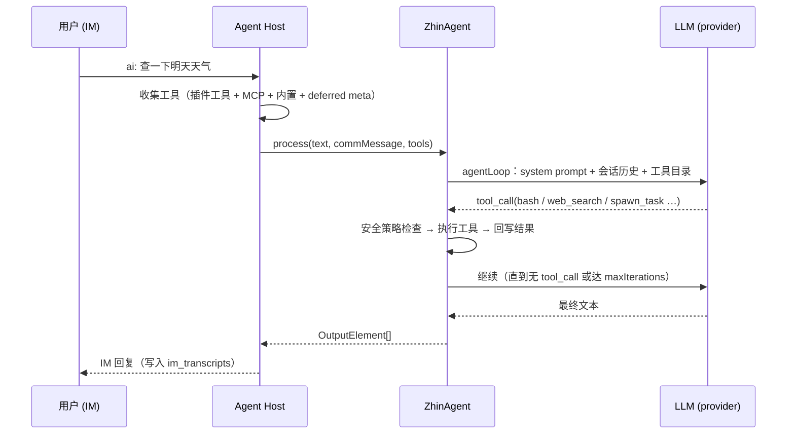

# Agent 深入

本篇展开 [AI 总览](./index.md) 的运行时：`ZhinAgent` 的回合流程、deferred tools、子代理与编排、会话持久化与 compaction、Assistant profile 与调度任务。

## ZhinAgent 回合

触发命中后，Agent Host 调用 `zhinAgent.process(text, commMessage, tools)` 跑一个回合（turn）：



要点：

- **统一 agentLoop**：ZhinAgent、子代理、后台 worker、`AIService.runAgent` 走同一条执行循环。
- **入站队列**：同会话消息按 `ai.agent.inboundQueue` 排队（`groupMode: supersede | fifo`），避免并发回合互相覆盖。
- **模型降级**：首选模型失败时按候选链 fallback 到同 provider 的其他可用模型。
- **maxIterations**：默认 15（`DEFAULT_CONFIG.maxIterations`），可按 provider/model 经 model harness 覆盖（见下文）。
- **超时**：触发侧单回合受 `ai.trigger.timeout` 约束（默认 60000ms）；Agent 回合整体默认 120000ms（`DEFAULT_CONFIG.timeout`），工具预执行另有 15000ms 上限（`preExecTimeout`）。

回合产出的工具池 = 插件注册工具 + `ai.mcpServers` 连接工具 + 内置工具 + deferred meta 工具 + `schedule_*` + `bash` + Host 扩展工具（如 `voice_stt` / `voice_tts`）。

## Deferred tools（discover / load_tool / load_skill）

工具数量大时全量 schema 塞进 prompt 会挤占上下文。Zhin.js 采用**延迟加载**：回合只常驻少量元工具，模型按需检索、按名加载。

常驻工具（`alwaysLoadedTools` 默认值）：`ask_user`、`spawn_task`、`discover`、`load_tool`、`load_skill`。

| 元工具 | 作用 |
|--------|------|
| `discover` | 按 query 检索工具/技能（`kind: tool|skill|all`，可按 MCP server 过滤），返回 Top-K 摘要 |
| `load_tool` | 按名把工具 schema 载入本会话，之后可直接调用 |
| `load_skill` | 载入技能说明文本与其声明的工具 |

调参（`ai.agent.deferredTools`）：

```yaml
ai:
  agent:
    deferredTools:
      maxLoadedPerSession: 12   # 单会话最多载入工具数（默认 12）
      discoverTopK: 5           # discover 返回条数（默认 5）
      alwaysLoadedTools: [ask_user, spawn_task, discover, load_tool, load_skill]
      mcpServers:
        icqq: { alwaysLoaded: [send_msg] }   # 指定 MCP server 的常驻工具
```

保留/内置工具名（`bash`、`read_file`、`spawn_task` 等）不可被插件覆盖；非保留工具同名时后注册覆盖前注册，冲突记 warn。

## 子代理与 spawn_task

主 Agent 通过 `spawn_task` 把复杂/耗时任务派给**后台子代理**，主对话不阻塞：

```yaml
ai:
  agent:
    maxParallelSubagents: 5        # 并行子代理硬顶（默认 5）
    toolExecution: tiered          # parallel | sequential | tiered（默认）
    subagentAutoContinue: true     # 异步完成后唤醒主 Agent 续聊（默认 true）
    subagentDirectImDelivery: false # 额外直发子任务摘要到 IM（默认 false）
    subagentTools: []              # 追加子代理可用工具白名单
```

`spawn_task` 关键参数：

| 参数 | 说明 |
|------|------|
| `task` | 任务描述（目标、范围、期望产出） |
| `agent` | 子代理名（须在 `ai.agents` 或 `agents/*.agent.md` 预设中存在） |
| `wait` | `true` 时同步等待，结果经 tool result 回到当前回合 |
| `context` | `fork`（注入父会话近期消息）/ `fresh`（空上下文） |
| `tools` / `skills` | 声明子任务需要的工具与技能 |

约束与行为：

- 同一回合可发起多个 `spawn_task`，独立子任务建议并行；`tiered` 模式下只读工具与 spawn 并行、写/bash 顺序执行。
- 子代理默认使用受限工具集（`read_file` / `write_file` / `edit_file` / `list_dir` / `glob` / `grep` / `web_search` / `web_fetch` / `bash` + deferred meta），不自动继承主会话全部工具；用 `ai.agent.subagentTools` 显式追加。
- 主 Agent 可见的子代理类型受 `ai.agents.<name>.permission.task`（glob → allow/deny）约束。
- 异步完成后结果**先交还主 Agent**（写入主会话并 auto-continue），用户可见回复由主 Agent 整理发出。
- 子代理预设可用 `agents/<name>.agent.md`（YAML frontmatter + 说明）文件化声明，启动时自动发现注册。

## 编排（Orchestration）

`OrchestrationService`（Kernel）维护 **Run / Task** 状态机：一个用户请求可拆成有依赖关系（`dependsOn`）的多任务，按 executor（local / remote）分派执行。内置编排工具：

| 工具 | 作用 |
|------|------|
| `orchestration_start` | 开启一个编排 Run |
| `orchestration_add_task` | 向 Run 添加任务（role / goal / dependsOn / priority） |
| `orchestration_status` | 查询 Run / Task 状态 |
| `orchestration_complete` | 结束 Run |
| `orchestration_retry_task` / `orchestration_skip_task` | 失败任务重试 / 跳过 |

Run 状态：`open` → `running` / `waiting` → 完成。配置 `ai.remoteAgents`（`id` + `cardUrl` + `token`）后可将任务派给远程 A2A agent 执行：

```yaml
ai:
  remoteAgents:
    - id: local
      cardUrl: http://127.0.0.1:8069/a2a/zhin/.well-known/agent-card.json
      token: ${HTTP_TOKEN}
```

编排运行可在 Console 的 Orchestration 页查看（`GET /api/agent/orchestration/runs`），见 [Console](../console/index.md)。

## 会话持久化与会话树

数据库可用时，Agent Host 落三张表（缺库时自动降级为内存模式）：

| 表 | 内容 |
|----|------|
| `agent_sessions` | Agent 会话元数据（含会话树 `parent_id` / `active_leaf`） |
| `agent_messages` | Agent 回合消息（上下文仓库） |
| `im_transcripts` | IM 进出站流水（`chat_history` 工具的数据源） |

设 `ai.sessions.useDatabase: false` 可强制内存模式。

**会话树**：同一 IM 会话内可分叉（branch），IM 命令管理：

| 命令 | 作用 |
|------|------|
| `/compact` | 手动压缩当前会话上下文 |
| `/tree` / `/tree N` | 查看 / 切换会话分支 |
| `/reset` | 重置会话 |
| 发送 `clear` / `清空` / `重置` | 归档并清空本会话 AI 多轮上下文 |

其他管理命令（master / 有权限用户）：`/models`、`/health`、`/cmd`、`/endpoints`、`/bindings`、`/tools`、`/mcp`。

## Compaction

上下文接近窗口上限时自动压缩，配置 `ai.agent.compaction`：

```yaml
ai:
  agent:
    compaction:
      enabled: true
      auto: true
      keepRecentTokens: 20000   # 保留最近消息的 token 预算（默认 20000）
      minKeepCount: 2           # 至少保留的消息条数（默认 2）
```

- 估算 token 超过 `contextWindow × 0.6` 触发压缩。
- 两级策略：先做 micro-compact（裁剪冗余工具结果等），再由 LLM 生成 `[Previous conversation summary]` 摘要替换旧历史。
- 连续自动压缩失败达到上限后停止自动压缩，避免反复消耗。

## Model harness

按 provider / model 覆盖执行循环参数（当前消费 `maxIterations`），合并顺序：TS 默认表 → `providerPatterns`（支持 `*` 通配）→ `models` 精确键：

```yaml
ai:
  agent:
    modelHarness:
      providerPatterns:
        "open*": { maxIterations: 7 }
      models:
        "gpt-4o": { maxIterations: 8 }
        "openai:gpt-4o": { maxIterations: 9 }
```

## 内置工具一览

| 类别 | 工具 |
|------|------|
| 执行 | `bash`、`run_deferred_task` |
| 文件 | `read_file`、`write_file`、`edit_file`、`list_dir`、`glob`、`grep` |
| 网络 | `web_search`、`web_fetch` |
| 交互 | `ask_user` |
| 任务 | `spawn_task`、`todo_read`、`todo_write`、`orchestration_*` |
| 记忆/检索 | `memory_search`、`memory_upsert`、`knowledge_search`、`chat_history` |
| 媒体 | `generate_image`、`analyze_media` |
| 元 | `discover`、`load_tool`、`load_skill`、`install_skill` |
| 调度 | `schedule_list`、`schedule_add`、`schedule_remove`、`schedule_pause`、`schedule_resume`、`schedule_preview` |

## Assistant profile 与调度任务

Assistant 运行时把「定时做事」产品化：持久化任务存 `data/schedule-jobs.json`，由 `ScheduleJobEngine` 到点执行并把结果推回 IM。

```yaml
assistant:
  enabled: true
  profile:
    enabled: true
    file: assistant.profile.yml   # 相对项目根，默认即此名
  events:
    enabled: true                 # 开放 POST /api/assistant/events 外部事件入口
  defaults:
    notifyOnFailure: false
```

**assistant.profile.yml** 声明人设与例行任务（routines），启动时同步为调度任务：

```yaml
version: 1
persona:
  soul: 你是贴心的生活助手。
routines:
  heartbeat:
    enabled: true
    everyMs: 1800000
    prompt: 检查待办并汇报。
  morningBrief:
    enabled: true
    scheduleKind: solar      # solar | lunar | workday | freeDay | holiday
    cron: "0 0 8 * * *"
    tz: Asia/Shanghai
    prompt: 生成今日早报。
```

内置 routine：`heartbeat`（间隔执行）、`morningBrief`（默认 08:00）、`bedtimeCheck`（默认 22:00）、`weatherReport`，也可自定义键。中国大陆「工作日」场景用 `workday`（含调休），不要用 solar 的 `1-5`。

用户也可以在 IM 里让 Agent 用 `schedule_add` / `schedule_list` / `schedule_preview` 等工具直接管理任务；外部系统可经 `POST /api/assistant/events` 注入事件、`GET /api/assistant/jobs` 查询任务。

## 相关

- [AI 能力总览](./index.md)：安装、providers、触发与安全
- [语音能力](./speech.md)：语音消息的 STT/TTS
