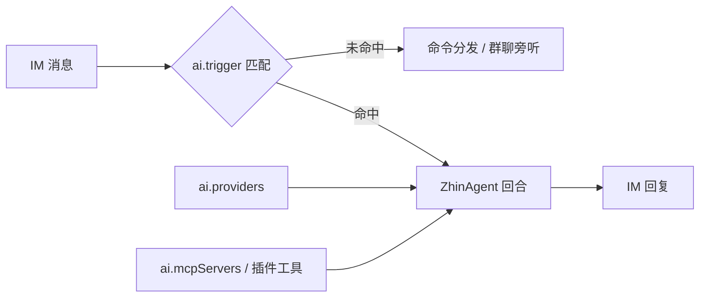

# AI 能力总览

默认安装的 zhin.js 只会收发消息，不会「回话」。想让它听懂 `#查一下明天天气`，得加装 AI 层：装几个包、在配置里写一段 `ai:`，启动时 CLI 就会自动装配 Agent Host，把未命中命令的消息路由给 **ZhinAgent** 处理。



## 安装

```bash
pnpm add @zhin.js/agent zod ai
pnpm add @ai-sdk/openai   # 按所用厂商安装对应的 provider SDK
```

provider SDK 是可选 peer 依赖，用到哪个 `sdk` 就装哪个包；缺失时运行时会报 `Missing peer dependency` 并提示安装命令。代码侧从 `zhin.js/agent`（或 `@zhin.js/agent`）导入 `ZhinAgent`、`AIService` 等。

## 配置骨架

全部配置位于 `zhin.config.yml` 的顶层 `ai:` 段，`${VAR}` 从环境变量展开：

```yaml
ai:
  providers:        # 厂商连接（必填）
    openrouter:
      sdk: openai-compatible
      baseUrl: ${OPENROUTER_BASE_URL}
      apiKey: ${OPENROUTER_API_KEY}
  agents:           # Agent 绑定（至少要有 zhin）
    zhin:
      provider: openrouter
      model: openrouter/free
  mcpServers: []    # MCP client 连接（可选）
  agent:
    inboundQueue:
      groupMode: supersede # 默认；可设为 fifo，让普通重叠消息按到达顺序等待
  trigger: {}       # 触发规则（可选）
  access: {}        # 访问门控（可选）
```

启动时会对 `ai:` 做 **soft-prune**：凭据展开后为空的 provider 被剔除（仅记 debug 日志），绑定到被剔除 provider 的 agent 一并跳过；`zhin` 绑定缺失时 Agent Host 不装配，不影响 IM 启动。

`ai.agent.inboundQueue.groupMode` 同时是 canonical Turn Intent 的默认策略：`supersede`
保持兼容的抢占行为，`fifo` 将普通入站解析为 `new` 并按到达顺序等待。
`steer`、`follow_up` 与 `observe` 仍由 adapter、command 或其他产品策略显式解析。
跨参与者的 `steer` / `follow_up` 授权只能由 Host 的可信 `resolveTurnIntent` 策略产生，消息
metadata 不能自行声明授权。工具继续受 active turn 的 authority 约束，journal 会另外记录
触发控制的 principal 与 Turn ID。

## ai.providers

每个 provider 以别名命名，`sdk` 决定用哪个 AI SDK 适配器（闭表，ADR 0018）：

| sdk | peer 依赖 | 关键配置 |
|-----|-----------|----------|
| `openai` | `@ai-sdk/openai` | `apiKey`，可选 `baseUrl` |
| `openai-compatible` | `@ai-sdk/openai-compatible` | `baseUrl` + `apiKey`（`baseUrl` 自动补 `/v1`）；Cloudflare Workers AI 可用 `accountId` 代替 `baseUrl` |
| `anthropic` | `@ai-sdk/anthropic` | `apiKey`，可选 `baseUrl`（自动补 `/v1`） |
| `deepseek` | `@ai-sdk/deepseek` | `apiKey`，可选 `baseUrl` |
| `google` | `@ai-sdk/google` | `apiKey`，可选 `baseUrl`（自动补 `/v1beta`） |
| `ollama` | `@ai-sdk/openai-compatible`（内部走 OpenAI 兼容接口） | `host`（默认 `http://127.0.0.1:11434`，自动补 `/v1`），无需 `apiKey` |

通用字段：`models`（显式模型白名单）、`contextWindow`、`imageGeneration`（文生图默认值）、`input`（模型可接收的显式模态列表：`text | image | audio | video | file`）。`input` 缺省时按 `['text']` fail-closed，不会根据模型名或厂商猜测视觉/音视频能力。

不写 `models` 时，启动后由 `ModelRegistry` 后台调用 `/v1/models` 自动填充可用模型列表（先恢复上次缓存，再异步刷新）；写了 `models` 则以 YAML 白名单为准。`agents.<name>.model` 只需出现在发现列表或白名单中，无需逐个手写。

## ai.agents

把 agent 名绑定到 `provider + model`：

```yaml
ai:
  agents:
    zhin:                       # 主 Agent，必须存在
      provider: openrouter
      model: openrouter/free
      mcpServers: [icqq]        # 该 agent 挂载的 MCP server（按 name 引用）
      nickname: 小智            # LLM 自称与界面展示名
    planner:
      provider: openrouter
      model: openrouter/free
      match:                    # 可选路由规则（可数组）
        scene: group
      permission:               # spawn_task 可见的子 agent 类型
        task: { "researcher": allow, "*": deny }
```

| 字段 | 说明 |
|------|------|
| `provider` / `model` | 引用 `ai.providers` 的别名与模型 id（必填） |
| `mcpServers` | 引用 `ai.mcpServers` 中的 `name` 列表 |
| `nickname` | Agent 自称与界面展示昵称 |
| `match` | 路由规则：`adapter` / `endpoint` / `scene` / `sceneId` / `hasMedia` / `contentContains` |
| `permission.task` | glob → `allow` / `deny`，约束 `spawn_task` 可派的子 agent |

## ai.mcpServers

注册 MCP（Model Context Protocol）server。声明进入候选 generation，激活时连接；未 ready 会阻止候选代发布，旧代继续服务。连接成功的工具以 owner-qualified 名称进入工具池。需安装 peer `@modelcontextprotocol/sdk`。

```yaml
ai:
  mcpServers:
    - name: icqq
      transport: streamable-http      # stdio | streamable-http | sse
      url: ${ICQQ_MCP_URL}
      headers:
        Authorization: Bearer ${ICQQ_MCP_TOKEN}
    - name: filesystem
      transport: stdio
      command: npx
      args: ["-y", "@modelcontextprotocol/server-filesystem", "/tmp/zhin-mcp-test"]
```

配置的 server 必须在候选 generation 激活时 ready；任一连接失败都会阻止候选代发布，旧代继续服务（fail-closed）。Agent binding 只能引用这里已声明的 server，未知名称会使配置校验失败。

## 触发规则（ai.trigger）

未命中任何命令的消息按固定顺序判定是否交给 AI：

1. **忽略前缀**：命中 `ignorePrefixes`（默认 `/`、`!`、`！`）直接跳过，避免与命令冲突；
2. **前缀触发**：命中 `prefixes`（默认 `#`、`AI:`、`ai:`）则取前缀后的文本（私聊、群聊均生效）；
3. **@ 触发**：群/频道中 `respondToAt !== false` 且适配器标注了 `mentioned`（如 CQ 码、app_mention）；
4. **私聊直达**：`respondToPrivate !== false` 时私聊全文直接进 AI；
5. **关键词**：仅私聊，命中 `keywords` 任一子串。

```yaml
ai:
  trigger:
    prefixes: ["ai:"]
    respondToAt: true        # 默认 true
    respondToPrivate: true   # 默认 true
    timeout: 60000           # 单回合超时（ms）
    thinkingMessage: 思考中…  # 可选：进入 AI 前的占位回复
    errorTemplate: "❌ AI 处理失败: {error}"
    masters: ["10001"]       # trigger 级 master（参与 Owner 审批放行）
    trusted: []              # trigger 级 trusted（弱于 master）
```

## 访问门控（ai.access）

控制 LLM 回复路径对哪些会话开放（平台 AIGC 合规等场景）：

```yaml
ai:
  access:
    mode: whitelist     # open（默认）| closed | whitelist
    users: ["10001"]    # 白名单 sender.id
    groups: ["123456"]  # 白名单 group/channel id
    denyMessage: 当前会话未开放 AI 功能。
```

私聊拒绝时回复 `denyMessage`；群/频道拒绝为静默。

## 安全策略（ai.agent）

`bash` 这类执行类工具受 `ai.agent` 下的纵深防御约束：

```yaml
ai:
  agent:
    execSecurity: allowlist       # deny | allowlist（默认）| full
    execPreset: readonly          # readonly | network | development | custom
    execAllowlist: [make]         # execPreset=custom 时的白名单
    execApprovalMode: ask         # ask（默认）| allow | deny
    gitStatus: true               # 默认 true：Runtime 段注入单行 git 状态摘要（非 git 仓库自动跳过）
    contextPaths: []              # 追加注入系统提示词的上下文文件（支持 ~ 与相对路径）
    systemPromptMaxChars: 100000  # 系统提示词总字符上限，超出按牺牲顺序截断可截断段
```

除 `contextPaths` 外，默认还会自动加载全局上下文文件 `~/.config/zhin/AGENTS.md` 与 `~/.config/zhin/ZHIN.md`（不存在则跳过），注入为 `# User Context` 段，置于项目 bootstrap 上下文之前；单文件上限 8KB、总量上限 16KB。

`execPreset` 预设白名单逐档放宽：`readonly`（ls/cat/grep/find 等）→ `network`（加 curl/wget/ping 等）→ `development`（加 npm/node/git/python 等）。无论哪种模式，`sudo`、`eval`、`dd`、`export` 等危险命令一律拒绝，`rm -rf node_modules` 类操作硬阻断。

完整的检查链是：危险黑名单 → 环境变量前缀剥离（`FOO=bar cmd` 按 `cmd` 匹配）→ wrapper 剥离（`timeout 10 cmd`）→ 复合命令拆分（`&&`/`|` 逐段检查）→ 非 full 模式拒绝换行 / `$(...)` / 反引号 → 只读命令自动放行。`execApprovalMode: ask` 时越权命令触发 **Owner 审批**，由 master 在 IM 内 `/approve` 放行；`allow` 全部放行，`deny` 全部拒绝。

## 下一步

- [Agent 深入](./agent.md)：ZhinAgent 回合、deferred tools、子代理、编排、会话与 compaction
- [语音能力](./speech.md)：STT / TTS 与 `voice_stt` / `voice_tts` 工具
- [Console](../console/index.md)：在 Web 控制台观察 agent 会话与编排运行
