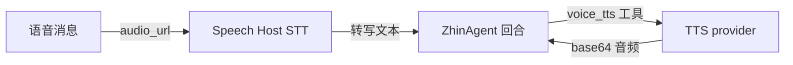

# 语音能力（Speech）

群里发来一条语音，bot 听懂了内容，还能回一段合成语音——这条链路就是 `@zhin.js/speech` 提供的。它是可选包：在 `zhin.config.yml` 顶层写 `speech:` 段并安装该包后，CLI 启动时自动装配 Speech Host，语音消息入站自动转写（STT），并给 Agent 提供 `voice_stt` / `voice_tts` 两个工具。没装这个包就跳过（仅记 warn），不影响其他能力。

```bash
pnpm add @zhin.js/speech
```



## 配置

```yaml
speech:
  stt:
    provider: openai          # ollama | openai
    model: whisper-1
    host: https://api.openai.com
    apiKey: ${OPENAI_API_KEY}
  tts:
    provider: edge            # edge | openai | azure | custom
    voice: zh-CN-XiaoxiaoNeural
```

## STT（语音转文字）

| provider | 说明 |
|----------|------|
| `openai` | 调 `{host}/v1/audio/transcriptions`（OpenAI 兼容 whisper 接口）；`model` 默认 `whisper-1`，`host` 默认 `https://api.openai.com`，语言固定 `zh`，超时 60s |
| `ollama` | **当前不可用**：Ollama 没有音频转写模型，调用会直接报错并提示改用 `openai` |

`stt.enabled: false` 可单独关闭 STT。入站语音先走统一媒体物化与真实 MIME/大小校验；策略为 `transcribe` 时，Agent Host 再转写并作为派生文本加入当前 Turn。下载、校验或转写失败都会产生明确媒体终态，不会伪装成模型已识别成功。

音频格式按 MIME 推断扩展名（wav / mp3 / ogg / webm / amr / silk / m4a / flac），无法识别时按 wav 处理。

## TTS（文字转语音）

`tts.provider` 缺省为 `edge`。四个 provider：

| provider | 关键配置 | 说明 |
|----------|----------|------|
| `edge` | `voice`（默认 `zh-CN-XiaoxiaoNeural`）、`rate`（默认 `+0%`）、`pitch`（默认 `+0Hz`）、`edgeTtsCommand`（默认 `edge-tts`） | 调本机 `edge-tts` CLI，输出 mp3；需自行安装该命令 |
| `openai` | `host`（默认 `https://api.openai.com`）、`model`（默认 `tts-1`）、`voice`（默认 `alloy`）、`speed` | 调 `{host}/v1/audio/speech`；apiKey 取 `tts.apiKey`，缺省回落 `stt.apiKey` |
| `azure` | `region`（默认 `eastasia`）、`subscriptionKey`、`voice` | Azure Cognitive Services REST，输出 16kHz mp3 |
| `custom` | `baseUrl`（必填）、`headers`、`model`、`voice`、`speed` | 任意 OpenAI 兼容 TTS 端点，body 同 `/v1/audio/speech` |

TTS 请求超时统一 30s，输出格式 mp3（`openai` / `custom` 可选 wav）。

## Agent 工具

Speech Host 装配后向 Agent 注册两个工具（`source: speech`）：

| 工具 | 参数 | 返回 |
|------|------|------|
| `voice_stt` | `audio_url` 或 `file_path`（本地绝对路径，二选一） | `{ text }`；失败返回 `{ error }` |
| `voice_tts` | `text`（必填）、`voice`（覆盖默认）、`provider`（`edge` / `openai` / `azure` / `custom`） | `{ audio(base64), format, size }` |

`voice_tts` 可按调用临时切换 provider，便于一次部署同时挂多种音色。

## 完整示例

```yaml
speech:
  stt: { provider: openai, model: whisper-1, host: https://api.openai.com, apiKey: ${OPENAI_API_KEY} }
  tts: { provider: edge, voice: zh-CN-XiaoxiaoNeural }
```

## 相关

- [AI 能力总览](./index.md)
- [Agent 深入](./agent.md)
