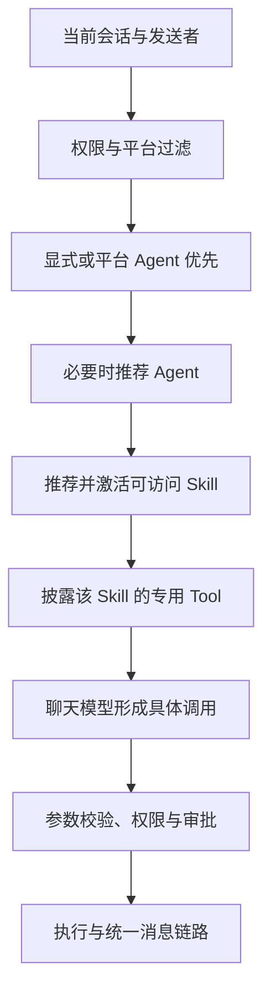

# 结构化决策与 TypeSafe Jev

Jev 用于有明确候选和判断标准的决策：选择 Agent、推荐 Skill、排列 Tool 和检索结果，以及辅助自动审核。聊天模型继续生成回复和工具参数；Zhin 负责身份、权限、能力激活、审批和执行。Jev 的建议不会扩大当前会话的授权范围。

这是可选服务。已有 AI 项目安装 `@zhin.js/service-typesafe` 后，通过 `zhin setup --decisions` 配置；仅安装插件不会改变 Agent 行为。

## 安装与配置

先按 [AI 安装与配置](./index.md) 配好聊天模型，再运行：

```sh
pnpm add @zhin.js/service-typesafe
zhin setup --decisions
pnpm install
zhin doctor
```

向导将密钥保存在 `.env`，插件配置使用环境变量引用，并在 `package.json#zhin.plugins` 声明实例。首次配置仅将 Skill 与 Tool 推荐设为 `shadow`，其余用途关闭；再次配置会保留已有的阈值及其他用途设置。独立实例使用各自的密钥环境变量，已有的显式密钥引用也会保留。

手动配置时，在已有配置中补充以下内容。实例 `typesafe` 必须同时存在于插件挂载清单中：

```json
{
  "zhin": {
    "plugins": [
      { "package": "@zhin.js/service-typesafe", "instanceKey": "typesafe" }
    ]
  }
}
```

```yaml
plugins:
  typesafe:
    apiKey: ${TYPESAFE_API_KEY}
    model: jev-latest
    timeoutMs: 10000
    maxRetries: 2

ai:
  # 保留已有 providers、agents 和其他配置。
  decisions:
    provider: root/typesafe
    skills:
      mode: shadow
      timeoutMs: 3000
      minConfidence: 0.7
      topK: 5
      maxCandidates: 32
      maxSelections: 2
    tools:
      mode: shadow
    agents:
      mode: off
    memory:
      mode: off
    approval:
      mode: off
```

`provider` 是精确的插件 owner，例如 `root/typesafe`，不是聊天模型 provider 的别名。存在多个实例时显式选择其中一个；初始完整 generation 会验证活动策略的绑定，每个回合也会重新检查其所持 generation 中的精确资源。引用未启用或不存在的实例不能执行决策。插件配置更新按现有热重载机制替换该实例资源，正在执行的回合使用其持有的 generation。

插件 `schema.json` 约束 API Key、模型、服务地址、请求预算和重试次数。任务的 `timeoutMs` 是该次决策的总预算，涵盖所有批次和重试；回合取消、插件清理同样会取消请求。`zhin doctor` 只做本地检查，不发起付费模型请求。

## 每个用途独立启用

| 策略 | 行为 |
| --- | --- |
| `off` 或未配置 | 继续现有行为，不调用决策服务。 |
| `shadow` | 调用 Jev 并记录元数据，执行仍由已有策略决定。可能增加网络耗时和费用。 |
| `active` | 使用有效结果；低置信度、无关候选、无效响应和服务失败按该用途的规则处理。 |

推荐使用二级 Score 标准，对全部可访问候选分批评估。`maxCandidates` 是单批数量，不是用关键词预先截断目录。当前默认预算为 3 秒，最低置信度为 `0.7`，最多返回 5 个候选；阈值应通过自己的数据校准。

| 用途 | 结果应用与回退 |
| --- | --- |
| Agent 选择 | 仅补充没有确定性匹配的路由；显式 `@agent`、平台 Agent 和 Workroom 指定角色优先。有效弃选或故障继续默认路由。 |
| Skill 推荐 | 有效结果通过统一激活流程加载所需 Skill，最多激活 `maxSelections` 个；有效弃选不会自动猜测 Skill，服务失败使用已有发现机制。 |
| Tool 发现 | 改进现有 `discover` 排序；有效弃选返回无匹配，服务失败使用已有检索。候选来自当前授权目录。 |
| 记忆排序 | 只重排当前用户、会话或 Agent 范围内已经检索出的候选，不能跨范围检索。有效弃选返回无匹配；故障、`shadow` 和 `off` 使用已有检索结果。 |
| 自动审核 | 仅在 `execApprovalMode: auto` 时作为审核判断器；证据不足询问 master，错误、超时或无效响应拒绝当前操作。 |

这些策略不承担自由值抽取。用户 ID、时间、金额等参数继续由现有解析或聊天模型生成，并经工具 schema 校验。

## 渐进披露与执行边界



目录仍遵循根 `tools/`、`agents/<name>/tools/`、`skills/<name>/tools/`、`agents/<name>/skills/<name>/tools/` 四种位置。选择一个 Agent 后，才获得该 Agent 可见的 Skill；激活 Skill 后，才披露其专用 Tool。没有激活的其他 Skill 的私有工具不会因模型评分而加入工具列表。

推荐请求只发送当前可访问候选的描述和所需意图信息；记忆排序会发送已检索候选的内容，因此启用前应确认允许这些数据交给外部服务。评分、模型置信度和 Tool 的 `requiresApproval` 是不同概念；模型推荐一个工具不代表获得调用权限。

当前接入用于普通交互回合。Workroom 的指定角色与受限能力计划，以及定时等无人值守执行，不使用这条自动推荐链路，以保持原有执行边界。

## 自动审核与人工决定

如需评估 Jev 审核，先配置旁路：

```yaml
ai:
  agent:
    execApprovalMode: auto
  decisions:
    provider: root/typesafe
    approval:
      mode: shadow
      timeoutMs: 5000
      minConfidence: 0.9
```

`shadow` 保留原聊天模型审核器的结果。确认效果后才改为 `active`。`ask` 和 `bypass` 保持各自原有含义，不通过配置 Jev 改变权限。

自动审核一次提交范围、破坏性、敏感信息披露、权限提升、明确意图与最终判断等问题。输入包括当前操作、有限长度的用户请求、可信身份与角色、相关审核历史。输入文本作为证据处理，不能声明或覆盖系统权限。批准要求置信度和所选概率都满足阈值；明确风险拒绝，不确定时询问人类。无人可询问或等待超时则拒绝。

人工决定仍由共享审核记忆管理：群聊和频道有 `reject`、`approve-once`、`approve-session`、`approve-always`；私聊没有 `approve-session`。会话批准覆盖同一会话的发送者；始终批准只覆盖该会话中的当前发送者，且都绑定具体工具与操作。模型批准仅对本次有效；模型拒绝或网络故障不会生成持续拒绝，人工拒绝可以按原有范围复用。

## 模型校准、观测与验证

先用 `shadow` 运行自己的中文请求集合，分别比较推荐准确率、漏选率、主模型 token、总费用、端到端耗时与审核误判。`jev-latest` 是可变化的别名；生产策略应固定服务实际支持的模型版本，模型升级后重新校准。没有一组通用置信度阈值能保证所有场景正确。

决策日志与回合记录只保留用途、模式、结果、候选数量、选中数量、耗时、模型和用量等元数据。SDK 日志关闭，错误不包含远端响应体、密钥和原始请求。实际返回的 Choice 概率与置信度、Score 标准与期望分数、Noul 真值概率保留在底层类型契约里；Noul 没有额外置信度字段。

仓库的确定性测试使用注入 HTTP transport 和模拟判断，覆盖协议、取消、异常、权限投影、渐进披露及人工审批范围。这些测试不能证明真实账号的中文准确率、费用和延迟，也不证明能全面降低聊天模型成本。正式启用前仍需真实账号评测。

参见 [插件的配置和底层接口](https://github.com/zhinjs/zhin/blob/main/plugins/services/typesafe/README.md)、[TypeSafe JavaScript SDK](https://docs.typesafe.ai/sdk/javascript) 和 [Skill 推荐案例](https://docs.typesafe.ai/cookbooks/skill_suggestion)。
