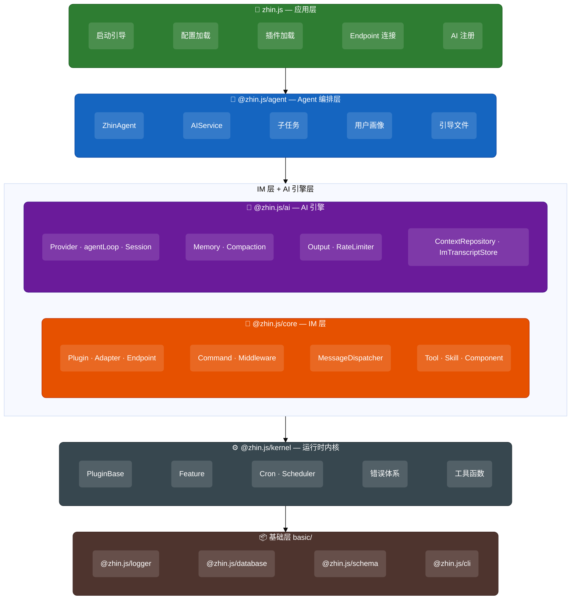
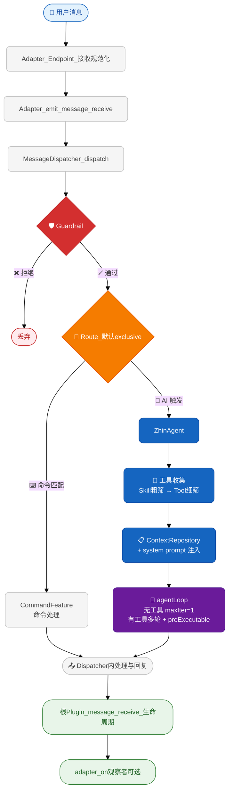
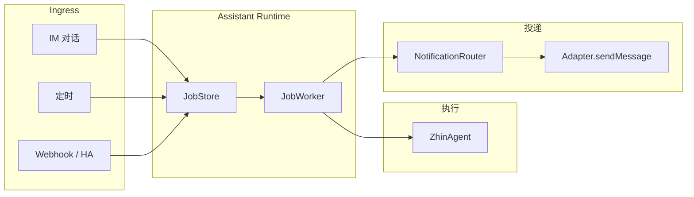

# 架构概览

Zhin.js 采用分层架构：底层通用基建 → AI 引擎 → IM/通道运行时 → Agent 编排 → 应用入口。每层可独立使用，也可组合为带 **多通道 Endpoint** 与 **ZhinAgent** 的完整 Agent 应用（不限于 IM）。

## 分层架构图



## 各层详解

### 基础层 (`basic/`)

框架无关的基础设施，所有上层包共享的底层能力。各包均在 monorepo 内作为普通路径管理（不再使用 git submodule）。

| 包名 | 路径 | 说明 |
|------|------|------|
| `@zhin.js/logger` | `basic/logger` | 结构化日志系统，支持多级别、彩色输出 |
| `@zhin.js/database` | `basic/database` | 统一数据库抽象（SQLite、MySQL、MongoDB 等） |
| `@zhin.js/schema` | `basic/schema` | 配置校验与序列化 |
| `@zhin.js/cli` | `basic/cli` | 命令行工具（dev、start、new、build、pub） |

### @zhin.js/kernel（运行时内核）

**与 IM/AI 无关的通用运行时**，可独立用于 Web 后端、CLI 工具、自动化脚本等任意 Node.js 应用。

| 模块 | 说明 |
|------|------|
| `PluginBase` | 轻量级插件系统，支持 DI（provide/inject）、生命周期、插件树结构 |
| `Feature` | 可追踪、可序列化的插件功能基类，支持变更事件 |
| `Cron` | 基于 croner 的 cron 表达式调度器 |
| `Scheduler` | 持久化定时任务调度系统，可自定义 JobStore |
| 错误体系 | `ZhinError` 层级 + `RetryManager` + `CircuitBreaker` + `ErrorManager` |
| 工具函数 | `evaluate`/`execute`（vm 沙盒）、`compiler`（模板）、`Time`（时间常量）等 |

### @zhin.js/ai（AI 引擎层）

**与 IM 无关的通用 AI 引擎**，可独立用于任何需要 LLM 集成的应用。统一使用 `agentLoop` 作为唯一 LLM 回合引擎（ADR 0009）。

#### `llm/` — LLM 统一栈（ADR 0009）

| 模块 | 说明 |
|------|------|
| `agentLoop` | 唯一 LLM 回合引擎：工具循环、`maxIterations`、steer / followUp 钩子 |
| `agent-loop.ts` | `agentLoop(prompts, context, config)` → `AsyncIterable<AgentEvent>` |
| `api-registry` | `registerLlmApiFromProviders`、`getModel`（发现列表白名单）、`complete` / `stream`；OpenAI bridge 调 `provider.chat` |
| `convert/` | `AgentMessage` ↔ Chat Completions 请求/响应 |
| `types` | `Model`、`Context`、`ParsedToolCall`、TypeBox 工具 schema |

#### `memory/` — 会话与上下文（ADR 0009 主路径）

| 模块 | 说明 |
|------|------|
| `ContextRepository` | 可序列化 `AgentMessage[]` 读写（内存 / DB `agent_messages` + `agent_summaries`）；ADR 0010 消息树 `parent_id` + `active_leaf` 路径回溯 |
| `AgentSessionStore` | `agent_sessions` 活跃/归档（`session_key` → epoch `session_id`） |
| `ImTranscriptStore` | `im_transcripts` 扁平静态 IM 消息（旁听、`chat_history` 工具） |
| `SessionManager` | 遗留 API；IM 主路径见上两项 + `ContextRepository` |
| `ContextManager` | 场景级摘要（`context_summaries`，非 IM 主路径） |
| `ConversationMemory` | 话题检测 + 链式摘要（辅助） |
| Agent `memory-layers` | 三层 Markdown：`global` / `platforms/{platform}` / `sessions/{session_key}` |
| `CostTracker` | Token 用量与成本追踪 |
| `ToolFilter` / `CachedToolFilter` | TF-IDF 工具相关性过滤与带缓存的过滤器 |

#### `compaction/` — 上下文压缩

| 模块 | 说明 |
|------|------|
| `compaction` | 分阶段摘要、上下文窗口守护、自动压缩管线 |
| `MicroCompact` | 旧工具结果轻量占位清理（主压缩前） |
| `token-counter` | 极简 token 估算（字符/4） |

#### 顶层模块

| 模块 | 说明 |
|------|------|
| `AIProvider` | LLM 提供者统一接口（OpenAI、Anthropic、Ollama、DeepSeek、Moonshot、Zhipu 等） |
| `ModelRegistry` | `listModels` 发现（`/v1/models`、`/api/tags`）、Tier 评分、缓存；与 `getModel` 白名单协作 |
| `FileStateCache` | 文件状态缓存，减少重复磁盘读取 |
| `output` | AI 文本解析为结构化 `OutputElement[]`（文本/图片/音频/卡片等） |
| `RateLimiter` | 请求速率限制 |
| `ToneDetector` | 消息情绪感知 |
| `Storage` | 统一存储抽象（内存 / 数据库可热切换） |

### @zhin.js/core（IM 层）

**IM 与多通道运行时**（Plugin、Adapter、Endpoint、MessageDispatcher），在 kernel 基础上添加消息领域概念。不直接依赖 `@zhin.js/ai`——AI 类型由消费方从 `@zhin.js/ai` 直接导入。

| 模块 | 说明 |
|------|------|
| `Plugin` | 完整的插件类，实现 `PluginLike` 接口，含 IM 特有功能（消息中间件、命令、组件） |
| `InboundMessagePipeline` | 入站消息管线：日志、背压、middleware → dispatcher → 生命周期 → 观察者 |
| `Adapter` | 适配器抽象基类，管理 Endpoint 连接、群管理方法自动检测 |
| `Endpoint` | Endpoint 接口，规范连接/发消息/撤回/格式化等方法 |
| `MessageDispatcher` | 消息三阶段调度：Guardrail → Route → Handle |
| `Feature` 子类 | `CommandFeature`、`ToolFeature`、`SkillFeature`、`CronFeature`、`DatabaseFeature`、`ComponentFeature`、`PermissionFeature`、`ConfigFeature` |
| 消息类型 | `Message`、`MessageElement`、`segment`（消息段工具） |

### @zhin.js/agent（Agent 编排层）

**IM 场景下的 AI Agent 编排**，在 `@zhin.js/ai` 基础上添加 IM 集成逻辑。按五个子模块组织：

#### `orchestrator/` — 中央编排

| 模块 | 说明 |
|------|------|
| `AgentOrchestrator` | 聚合五类注册表，`provide('agent')` 对外暴露，支持 common vs agentId 作用域 |
| `ToolRegistry` | IM 工具权限（`ToolPermissionLevel`）、`ZhinTool` 契约、与 `@zhin.js/ai` 过滤集成 |
| `SkillRegistry` | Skill 注册、按名索引、评分搜索 |
| `SubAgentRegistry` | 子代理定义 + AgentPreset 并存注册 |
| `McpRegistry` | MCP Server 条目注册；`connect` / `ensureConnected` 委托 `McpClientManager` |
| `HookRegistry` | AI 生命周期 Hook（错误隔离触发） |
| `ResourceRegistry<T>` | 通用注册表基类（公共 vs 专有、增删与监听） |

#### `security/` — 安全策略

| 模块 | 说明 |
|------|------|
| `ExecPolicy` | Bash 执行安全（6 层纵深防御：黑名单、环境变量剥离、wrapper 剥离、复合命令拆分、只读放行、审批集成） |
| `FilePolicy` | 文件访问安全（路径检查、设备路径拦截、命令读写分类） |
| `Sandbox` | 多层沙箱：Docker 容器隔离（最强）→ ulimit 资源限制 + 进程组 kill（中等）→ 软沙箱（最弱） |
| `NetworkPolicy` | 网络命令阻断（enableNetwork 配置）+ 域名白名单校验 |
| `AuditLogger` | 安全事件审计日志 |

#### `mcp-client/` — MCP 客户端

| 模块 | 说明 |
|------|------|
| `McpClientManager` | 多连接管理（需可选 `@modelcontextprotocol/sdk`） |
| `McpClientConnection` | 单个 MCP Server 连接生命周期（stdio / streamable-http / sse） |
| `bridge` | MCP 能力到 `AgentTool`（`mcp_{server}_{tool}`） |

ZhinAgent 在 AI 回合前 `ensureConnected`，`collectRuntimeTools` 合并 MCP 工具。配置：`ai.mcpServers`。与 `packages/host/mcp`（MCP **Server**）方向相反。

#### 顶层模块

| 模块 | 说明 |
|------|------|
| `ZhinAgent` | IM 主对话大脑：`promptController` → `runAgentLoopTextTurn` / `runAgentLoopVisionTurn`。统一依赖注入 `configure(deps)` |
| `IAgentTurnProcessor` | Turn 处理接口：process/processMultimodal/prompt/steer/followUp |
| `IAgentSessionManager` | 会话管理接口：compact/archive/upgradeMemory |
| `IAgentDiagnostics` | 诊断接口：getSubagentManager/getEventEmitter/getLastTurnMetrics |
| `IAgentConfigurator` | 配置接口：configure(deps) |
| `AIService` | Provider 注册与路由；`createAgent()` 返回 `ServiceAgent`（agentLoop 隔离上下文） |
| `SubagentManager` | 后台子任务 → `runAgentLoopStandaloneTurn` |
| `DeferredWorkerRunner` | toolSearch Worker → `runAgentLoopStandaloneTurn` |
| `UserProfileStore` | 用户画像管理（跨会话个性化） |
| `PersistentCronEngine` | AI 感知的持久化 cron 引擎 |
| `BootstrapLoader` | 引导文件加载（SOUL.md / AGENTS.md / TOOLS.md） |
| `buildRichSystemPrompt` | ZhinAgent 主路径 system prompt（Context / Style / Tools / Safety + Platform / Skills / Memory / Bootstrap） |
| `PromptBuilder` | 可选分层提示词 API（`buildRichSystemPromptWithBuilder` 等） |
| `resetAllAgentSingletons()` | 集中重置所有 agent 级全局单例（用于测试隔离） |

### zhin.js（应用层）

**面向终端用户的主入口包**，组合所有层并提供一键启动能力。

| 模块 | 说明 |
|------|------|
| 配置加载 | 从 `zhin.config.yml` / `.ts` 加载配置 |
| 项目根锁定 | `setZhinProjectRoot` 防止后续 chdir 导致插件路径偏移 |
| 插件加载 | 基于锁定的项目根自动发现和加载插件（支持热重载） |
| Endpoint 连接 | 按配置连接各平台适配器的 Endpoint |
| AI 注册 | `initAgentModule`、ModelRegistry 发现、`registerChatMessageStore`（`im_transcripts`） |
| 信号处理 | 优雅关闭（SIGINT/SIGTERM） |
| 重新导出 | 直接 `export * from '@zhin.js/core'`，选择性 re-export `@zhin.js/agent`（不再使用 `re-exports/` 垫片文件） |

## 依赖关系


核心设计原则：

- **kernel** 和 **ai** 不依赖任何 IM 概念，可被非 IM 应用直接使用
- **core** 只依赖 kernel，引入 IM 领域概念
- **agent** 桥接 core + ai，实现 IM 场景的 AI 编排
- **zhin.js** 作为 facade 层，组合所有包并提供完整的应用启动流程

## 消息处理流程

入站顺序（与源码一致）：平台 → **`Adapter.emit('message.receive')`**（内部 **`await MessageDispatcher.dispatch`**）→ **`await` 根插件 `message.receive`（生命周期）** → 再通知 **`adapter.on('message.receive')` 注册的观察者**（如控制台 UI）。默认路由 **`exclusive`**（命令与 AI 互斥）；双轨见配置 `dispatcher.mode: dual`。详见仓库根目录 **`AGENTS.md`** 与 [消息如何流转](/essentials/message-flow)。



## 主动路径（Assistant Runtime，规划中）

IM 主路径解决 **用户发消息 → 回复**。个人助手还需要 **定时 / 外部事件 → 执行 → 通知**，该能力将收敛到 **Assistant Runtime**（路线 A，见 [ADR 0008](./adr/0008-introduce-assistant-runtime.md) 与 [演进路线图](./architecture/assistant-runtime.md)）。



**现状（迁移前）**：`PersistentCronEngine`、`Scheduler`、`TaskExecutor` 已能「到点跑 Agent 并投递」，但存储与调度分散。**目标**：统一 `JobStore`，出站仍走下文发送链（不得绕过 Adapter）。

**Stable 承诺**：`assistant.enabled` 默认 `false`；未启用时行为与现网一致。

## 出站消息（发送链）

所有 Endpoint **主动出站**到会话的逻辑应走 **同一套发送管道**，避免在 core 中新增与 `Adapter.sendMessage` 并行的旁路 API。

**推荐链（概念顺序）**：

1. 业务或框架代码调用 **`Message.$reply(...)`**，或直接调用 **`Adapter.sendMessage(...)`**（与具体 Endpoint API 封装一致）。
2. **`Adapter`** 内经过 **`renderSendMessage`** 等渲染/规范化（如 segment → 平台格式）。
3. **根插件** 的 **`before.sendMessage`** 生命周期：可读取/改写即将发出的 `options`（例如统一润色 `content`、审计、限流）。
4. 最终落到具体 **`Endpoint` / 平台 SDK**（如 `bot.$sendMessage`）。

**Dispatcher 出站润色（`packages/im/core/src/built/dispatcher.ts`）**：在调用 `$reply` 的异步上下文中，用 **`AsyncLocalStorage`** 标记「本次发送由 Dispatcher 发起的回复」；`addOutboundPolish` 向根注册额外的 **`before.sendMessage`**，仅在存储命中时修改 `options.content`。这样润色与**普通插件发消息**走同一 `before.sendMessage` 链，行为一致、可组合。

扩展阅读：`docs/advanced/ai.md`（若涉及 AI 触发与出站）；根目录 **`AGENTS.md`**（速查表）；Harness 依据见 [harness-engineering-sources.md](./architecture/harness-engineering-sources.md)。

## 插件系统

Zhin.js 使用 `AsyncLocalStorage` 实现插件上下文管理。开发者通过 `usePlugin()` 获取当前插件 API：

```typescript
import { usePlugin, MessageCommand } from 'zhin.js'

const { addCommand, addTool, onMounted } = usePlugin()
```

插件支持：
- **依赖注入** — `provide` / `inject` / `useContext`
- **生命周期** — `onMounted` / `onDispose`
- **热重载** — 文件修改后自动重载（dev 模式）
- **树状结构** — 子插件自动继承父插件上下文

## 适配器与群管理

适配器通过覆写 `IGroupManagement` 接口方法来声明群管理能力。`Adapter.start()` 会自动检测已覆写的方法并生成对应的 **AI 工具**；技能说明由包内 `skills/`（SKILL.md）提供：

```typescript
class MyAdapter extends Adapter<MyEndpoint> {
  async kickMember(endpointId, sceneId, userId) { /* ... */ }
  async muteMember(endpointId, sceneId, userId, duration) { /* ... */ }

  async start() {
    await super.start() // 自动检测 → 生成 Tool → 注册 Skill
  }
}
```

## 可复用性

由于 `@zhin.js/kernel` 和 `@zhin.js/ai` 与 IM 无关，它们可被直接用于：

- Web 后端服务的插件架构
- CLI 工具的模块化设计
- AI 驱动的自动化脚本
- 任何需要 DI + 生命周期管理的 Node.js 应用
- 任何需要 LLM 集成（对话、工具调用、记忆）的应用

```typescript
import { PluginBase } from '@zhin.js/kernel'
import { agentLoop, agentContextFrom, createUserMessage, getModel } from '@zhin.js/ai'

const app = new PluginBase({ name: 'my-web-app' })
const model = getModel('openai', 'gpt-4o')
const context = agentContextFrom({ systemPrompt: 'You are a helpful assistant' })

for await (const event of agentLoop(
  [createUserMessage('Hello')],
  context,
  { model, maxIterations: 5 }
)) {
  if (event.type === 'turn_end') {
    console.log('Assistant:', event.message)
  }
}
```
