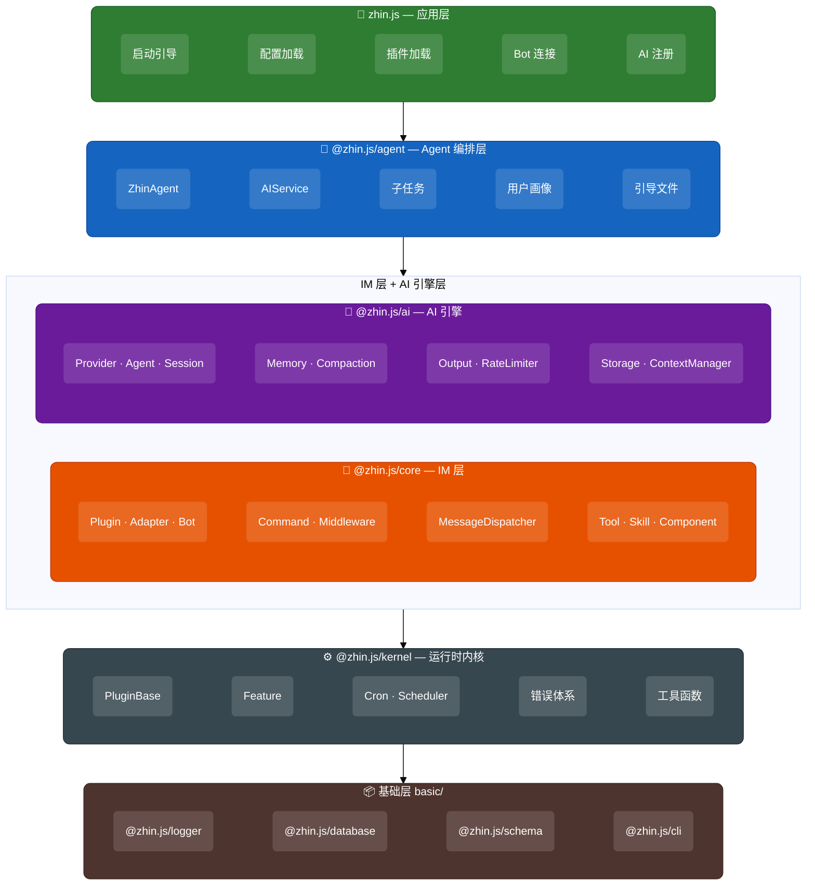
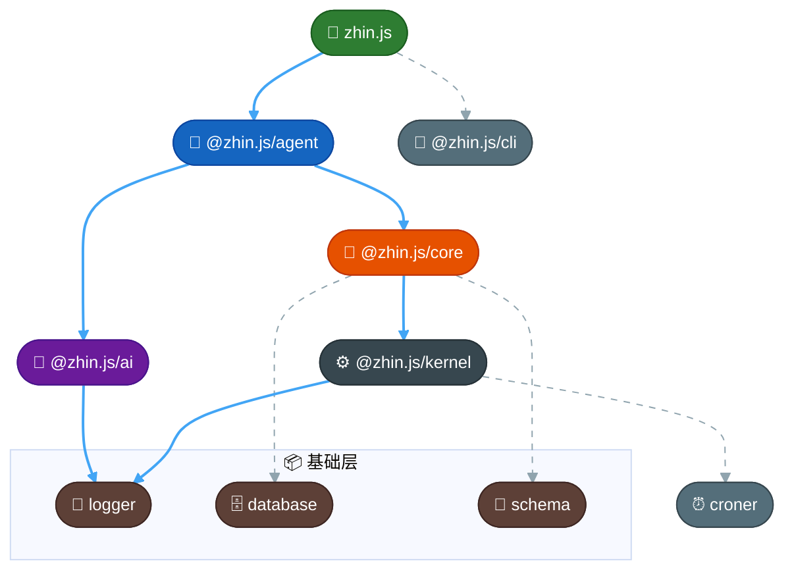
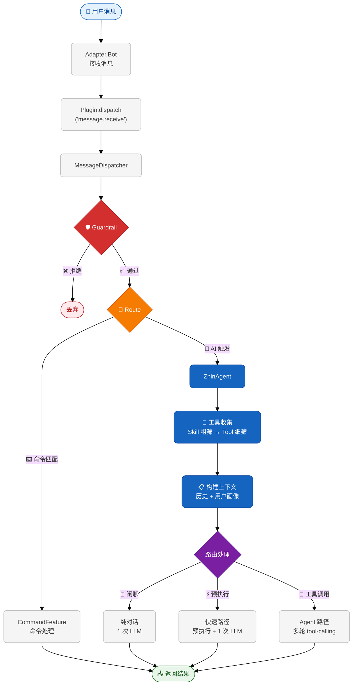

# 架构概览

Zhin.js 采用分层架构设计，从底层通用基建到上层 IM 应用逐层抽象。每层职责明确、可独立使用，也可组合构建完整的聊天机器人应用。

## 分层架构图



## 各层详解

### 基础层 (`basic/`)

框架无关的基础设施，所有上层包共享的底层能力。

| 包名 | 路径 | 说明 |
|------|------|------|
| `@zhin.js/logger` | `basic/logger` | 结构化日志系统，支持多级别、彩色输出 |
| `@zhin.js/database` | `basic/database` | 统一数据库抽象（SQLite、MySQL、MongoDB 等） |
| `@zhin.js/schema` | `basic/schema` | 配置校验与序列化 |
| `@zhin.js/cli` | `basic/cli` | 命令行工具（dev、start、new、build、pub） |

### @zhin.js/kernel（运行时内核）

**与 IM/AI 无关的通用运行时**，可独立用于 Web 后端、CLI 工具、自动化脚本等任意 Node.js 应用。

| 模块 | 说明 |
|------|------|
| `PluginBase` | 轻量级插件系统，支持 DI（provide/inject）、生命周期、插件树结构 |
| `Feature` | 可追踪、可序列化的插件功能基类，支持变更事件 |
| `Cron` | 基于 croner 的 cron 表达式调度器 |
| `Scheduler` | 持久化定时任务调度系统，可自定义 JobStore |
| 错误体系 | `ZhinError` 层级 + `RetryManager` + `CircuitBreaker` + `ErrorManager` |
| 工具函数 | `evaluate`/`execute`（vm 沙盒）、`compiler`（模板）、`Time`（时间常量）等 |

### @zhin.js/ai（AI 引擎层）

**与 IM 无关的通用 AI 引擎**，可独立用于任何需要 LLM 集成的应用。

| 模块 | 说明 |
|------|------|
| `AIProvider` | LLM 提供者统一接口（OpenAI、Anthropic、Ollama、DeepSeek、Moonshot、Zhipu 等） |
| `Agent` | 无状态 Agent 引擎，执行多轮 tool-calling 循环 |
| `SessionManager` | 会话管理（内存 / 数据库持久化） |
| `ContextManager` | 上下文管理，消息记录与摘要 |
| `ConversationMemory` | 短期滑动窗口 + 长期链式摘要 |
| `compaction` | 上下文窗口管理，token 估算、分阶段摘要、历史修剪 |
| `output` | AI 文本解析为结构化 `OutputElement[]`（文本/图片/音频/卡片等） |
| `RateLimiter` | 请求速率限制 |
| `ToneDetector` | 消息情绪感知 |
| `Storage` | 统一存储抽象（内存 / 数据库可热切换） |

### @zhin.js/core（IM 层）

**IM 聊天机器人的核心框架**，在 kernel 基础上添加 IM 领域概念。

| 模块 | 说明 |
|------|------|
| `Plugin` | 完整的插件类，实现 `PluginLike` 接口，含 IM 特有功能（消息中间件、命令、组件） |
| `Adapter` | 适配器抽象基类，管理 Bot 连接、群管理方法自动检测 |
| `Bot` | Bot 接口，规范连接/发消息/撤回/格式化等方法 |
| `MessageDispatcher` | 消息三阶段调度：Guardrail → Route → Handle |
| `Feature` 子类 | `CommandFeature`、`ToolFeature`、`SkillFeature`、`CronFeature`、`DatabaseFeature`、`ComponentFeature`、`PermissionFeature`、`ConfigFeature` |
| 消息类型 | `Message`、`MessageElement`、`segment`（消息段工具） |

### @zhin.js/agent（Agent 编排层）

**IM 场景下的 AI Agent 编排**，在 `@zhin.js/ai` 基础上添加 IM 集成逻辑。

| 模块 | 说明 |
|------|------|
| `ZhinAgent` | AI 全局大脑，编排工具选择、多轮对话、引导文件注入 |
| `AIService` | AI 服务管理器，Provider 注册与路由 |
| `SubagentManager` | 后台子任务管理 |
| `FollowUpManager` | 定时跟进提醒 |
| `UserProfileStore` | 用户画像管理（跨会话个性化） |
| `PersistentCronEngine` | AI 感知的持久化 cron 引擎 |
| `BootstrapLoader` | 引导文件加载（SOUL.md / AGENTS.md / TOOLS.md） |
| Hook 系统 | `message:received`、`tool:call`、`session:compact` 等事件钩子 |
| 内置工具 | `bash`、`read_file`、`write_file`、`web_search`、`chat_history` 等 |

### zhin.js（应用层）

**面向终端用户的主入口包**，组合所有层并提供一键启动能力。

| 模块 | 说明 |
|------|------|
| 配置加载 | 从 `zhin.config.yml` / `.ts` 加载配置 |
| 插件加载 | 自动发现和加载插件（支持热重载） |
| Bot 连接 | 按配置连接各平台适配器的 Bot |
| AI 注册 | 初始化 AI Provider、Agent、SessionManager |
| 信号处理 | 优雅关闭（SIGINT/SIGTERM） |
| 重新导出 | 导出 `@zhin.js/core`、`@zhin.js/agent`、`@zhin.js/kernel` 的全部公开 API |

## 依赖关系



核心设计原则：

- **kernel** 和 **ai** 不依赖任何 IM 概念，可被非 IM 应用直接使用
- **core** 只依赖 kernel，引入 IM 领域概念
- **agent** 桥接 core + ai，实现 IM 场景的 AI 编排
- **zhin.js** 作为 facade 层，组合所有包并提供完整的应用启动流程

## 消息处理流程



## 插件系统

Zhin.js 使用 `AsyncLocalStorage` 实现插件上下文管理。开发者通过 `usePlugin()` 获取当前插件 API：

```typescript
import { usePlugin, MessageCommand } from 'zhin.js'

const { addCommand, addTool, declareSkill, onMounted } = usePlugin()
```

插件支持：
- **依赖注入** — `provide` / `inject` / `useContext`
- **生命周期** — `onMounted` / `onDispose`
- **热重载** — 文件修改后自动重载（dev 模式）
- **树状结构** — 子插件自动继承父插件上下文

## 适配器与群管理

适配器通过覆写 `IGroupManagement` 接口方法来声明群管理能力。`Adapter.start()` 会自动检测已覆写的方法并生成对应的 AI 工具和技能：

```typescript
class MyAdapter extends Adapter<MyBot> {
  async kickMember(botId, sceneId, userId) { /* ... */ }
  async muteMember(botId, sceneId, userId, duration) { /* ... */ }

  async start() {
    await super.start() // 自动检测 → 生成 Tool → 注册 Skill
  }
}
```

## 可复用性

由于 `@zhin.js/kernel` 和 `@zhin.js/ai` 与 IM 无关，它们可被直接用于：

- Web 后端服务的插件架构
- CLI 工具的模块化设计
- AI 驱动的自动化脚本
- 任何需要 DI + 生命周期管理的 Node.js 应用
- 任何需要 LLM 集成（对话、工具调用、记忆）的应用

```typescript
import { PluginBase } from '@zhin.js/kernel'
import { Agent, OpenAIProvider } from '@zhin.js/ai'

const app = new PluginBase({ name: 'my-web-app' })
const provider = new OpenAIProvider({ apiKey: '...' })
const agent = new Agent(provider, logger)
```
