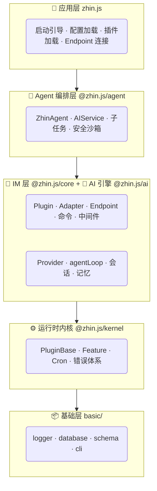

# 架构概览

Zhin.js 采用 5 层架构，每层可独立使用，也可组合为完整的多平台 AI Agent 应用。

## 分层



## 每层做什么

| 层 | 包 | 一句话 | 独立使用场景 |
|----|-----|--------|-------------|
| 基础层 | `@zhin.js/logger` `database` `schema` `cli` | 日志、数据库、配置校验、命令行 | 任何 Node.js 项目 |
| 内核 | `@zhin.js/kernel` | 插件系统、定时任务、错误处理 | Web 后端、CLI 工具 |
| AI 引擎 | `@zhin.js/ai` | 大模型接入、会话管理、工具调用 | 任何需要 LLM 的应用 |
| IM 层 | `@zhin.js/core` | 多平台消息收发、命令、中间件 | 不需要 AI 的机器人 |
| Agent | `@zhin.js/agent` | 多模型编排、安全沙箱、MCP | 需要 AI 能力的机器人 |
| 应用 | `zhin.js` | 启动入口、配置解析、插件加载 | — |

## 消息流转

```
平台消息 → Adapter → Endpoint → MessageDispatcher
                                ├→ Guardrail（安全检查）
                                ├→ 命令路由 → 命令处理
                                └→ AI Agent → 工具调用 → 回复

回复 → Adapter.sendMessage → renderSendMessage
                                ├→ resolveRichSegments（html/tts/qrcode…）
                                └→ before.sendMessage → Endpoint → 平台
```

详细流程见 [消息如何流转](/essentials/message-flow)。

## 依赖方向

```
basic → kernel → ai → core → agent → zhin
```

**严格单向**：下层不能导入上层。`pnpm check:architecture` 自动验证。

## 插件系统

- **AsyncLocalStorage** 管理上下文，`usePlugin()` 在文件顶层调用
- **Feature** 抽象统一命令、工具、定时任务等能力
- **provide/inject** 跨插件共享服务
- **热重载**：文件修改自动重载，语法错误自动回滚

详见 [插件系统](/essentials/plugins)。

## 安全模型（Agent 层）

AI 执行命令有 5 层防御：

1. 命令白名单（哪些命令允许执行）
2. 文件访问策略（哪些路径可读写）
3. 网络域名白名单（哪些域名可访问）
4. 资源预算（Token、调用次数、时长）
5. 审计日志（所有安全事件可追踪）

详见 [Agent 安全策略](/advanced/agent-harness-engineering)。

## 下一步

- [消息如何流转](/essentials/message-flow) — 入站/出站详细流程
- [核心概念速查](/essentials/) — 6 个核心概念一页看完
- [贡献指南 — 仓库结构](/contributing/repo-structure) — 各包详细说明
