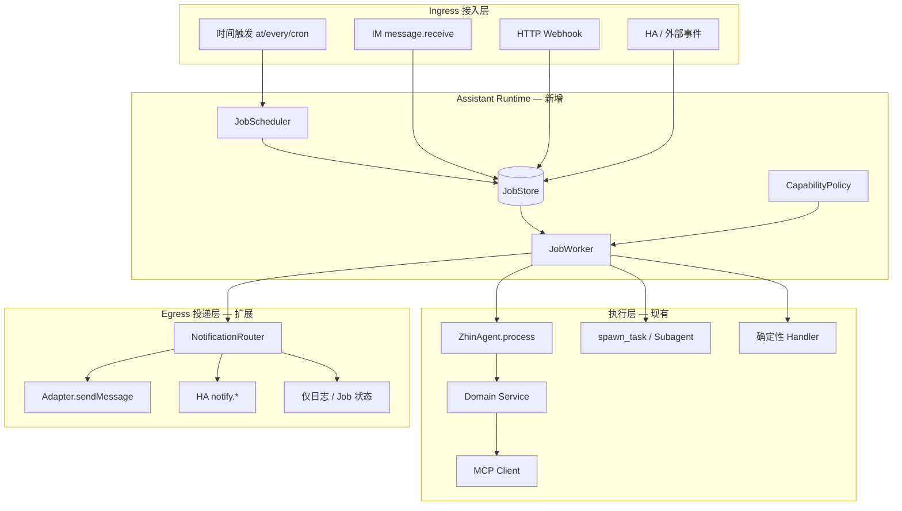

# Assistant Runtime 演进路线图（路线 A）

本文描述 Zhin.js 从 **IM 聊天 Bot** 演进到 **个人助手（Personal Assistant）** 的架构方案、分阶段交付、每步需改动的模块，以及 **破坏性变更** 边界。

- **决策记录**：[ADR 0008 — 引入 Assistant Runtime](../adr/0008-introduce-assistant-runtime.md)
- **跟踪待办**：`.feature/assistant-runtime/todo.md`（仓库根目录）
- **能力矩阵**：`.feature/assistant-runtime/plan.md`（仓库根目录）

---

## 1. 问题陈述

| 现状 | 个人助手需要 |
|------|----------------|
| 架构主路径 = 入站消息 → ZhinAgent → 回复 | 入站消息 **+** 定时 **+** 外部事件 同等重要 |
| Cron / Scheduler / HEARTBEAT 三套存储 | 单一 Job 模型与审计 |
| 主动结果只能 `Adapter.sendMessage` | 多通道通知（IM / HA / 静默） |
| 智能家居 = 扁平 MCP 工具 | 领域服务 + 实体别名 + 能力策略 |
| `TaskQueue` 未接入定时链路 | 重试、死信、并发控制 |

**结论**：不是重写 IM 栈，而是补一根 **主动运行时脊梁**；现有 Agent、MCP、安全策略、发送链继续复用。

---

## 2. 目标架构



### 2.1 核心类型（规划）

```typescript
// 概念模型 — 实现时置于 packages/im/agent/src/assistant/ 或独立 @zhin.js/assistant

type JobTrigger =
  | { kind: 'im'; /* 由对话内 cron_add 等创建时保留来源 */ }
  | { kind: 'schedule'; schedule: AtEveryCron }
  | { kind: 'event'; source: string; payload: unknown }
  | { kind: 'heartbeat'; /* 原 HEARTBEAT.md 巡检 */ };

type JobAction =
  | { kind: 'agent'; prompt: string; agent?: string; binding?: string }
  | { kind: 'handler'; handler: string; args?: Record<string, unknown> };

type JobNotify =
  | { channel: 'im'; target: IMDeliveryTarget }
  | { channel: 'ha'; service: string; target?: string }
  | { channel: 'silent' }
  | { channel: 'log' };

interface AssistantJob {
  id: string;
  label?: string;
  enabled: boolean;
  trigger: JobTrigger;
  action: JobAction;
  notify: JobNotify;
  policy?: { requiresMaster?: boolean; approval?: string };
  state: { lastRunAt?: number; lastStatus?: string; lastError?: string; retryCount?: number };
}
```

### 2.2 不动的约束（Harness）

以下 **任何里程碑都不得破坏**：

1. 出站 IM 消息仍走 `Message.$reply` / `Adapter.sendMessage` → `renderSendMessage` → `before.sendMessage` → Bot。
2. 依赖方向 `basic → kernel → ai → core → agent → zhin` 不变。
3. `usePlugin()` 仍在模块顶层；Assistant 插件不得绕过 Dispatcher。
4. minimal-bot（Stable）在未配置 `assistant.enabled` 时行为与现在一致。

---

## 3. 里程碑总览

| 阶段 | 名称 | 交付物 | 破坏性 |
|------|------|--------|--------|
| **M0** | 文档与契约 | ADR、本文、todo、类型草稿 | 无 |
| **M1** | 统一 JobStore | `data/assistant-jobs.json`、迁移、双写 | 低（M1 末 deprecate 写旧文件） |
| **M2** | Event Ingress | `POST /api/assistant/events`、鉴权、入队 | 无 |
| **M3** | NotificationRouter | 抽象投递、`notify` 必填、多通道 | 高（已移除 `CronJobContext` / `context`） |
| **M4** | Home Domain | `assistant.home`、`HomeAssistantService` | 无 |
| **M5** | Assistant Profile | `assistant.profile` 合并 Bootstrap | 低～中 |

---

## 4. 分阶段详解

### M0 — 文档与契约（当前）

**目标**：团队对路线 A 达成共识，Stable/Advanced 边界清晰。

| 动作 | 位置 |
|------|------|
| ADR 0008 | `docs/adr/0008-introduce-assistant-runtime.md` |
| 路线图 | 本文 |
| 待办 | `.feature/assistant-runtime/todo.md` |

**破坏性**：无。

**验收**：`pnpm check:doc-links` 通过；ADR 索引已更新。

---

### M1 — 统一 JobStore

**目标**：合并 `cron-jobs.json` + `scheduler-jobs.json` + HEARTBEAT 调度项为 **`data/assistant-jobs.json`**（名称可最终敲定）。

#### 4.1.1 新增 / 修改模块

| 模块 | 路径 | 说明 |
|------|------|------|
| Job 类型与存储 | `packages/im/agent/src/assistant/job-types.ts` | `AssistantJob`、序列化 |
| JobStore | `packages/im/agent/src/assistant/job-store.ts` | CRUD、持久化、锁 |
| JobScheduler | `packages/im/agent/src/assistant/job-scheduler.ts` | 包装 kernel `Scheduler` + CronFeature |
| JobWorker | `packages/im/agent/src/assistant/job-worker.ts` | 调用现有 `createTaskExecutor` |
| 迁移 | `packages/im/agent/src/assistant/migrate-legacy-jobs.ts` | 启动时导入旧 JSON |
| 初始化 | `packages/im/agent/src/init/create-zhin-agent.ts` | 挂接 Runtime，**渐进替换** 双引擎 |
| CLI | `basic/cli/src/commands/cron.ts` | `zhin cron *` 读写 JobStore |
| AI 工具 | `packages/im/agent/src/cron-engine.ts` | `cron_*` 工具改调 JobStore（保留工具名） |
| 测试 | `packages/im/agent/tests/assistant/*.test.ts` | 迁移、调度、执行 |
| 文档 | `docs/advanced/cron.md` | 注明新存储与迁移 |

#### 4.1.2 行为调整

- 启动时：若存在旧文件且无 `assistant-jobs.json`，**自动迁移**并写 `.bak`。
- 运行时：可选 **双写**旧 `cron-jobs.json`（`assistant.legacyDualWrite: true`；默认 false）。
- `TaskQueue`：`JobWorker` 入队执行，支持 `maxConcurrency`、`retry`（替代 `TaskExecutor` 内单纯 `withLock` 作为唯一手段）。

#### 4.1.3 破坏性

| 级别 | 内容 | 缓解 |
|------|------|------|
| **无（M1 前半）** | 仅新增文件与 opt-in | `assistant.enabled: false` 默认 |
| **低（M1 后半）** | `cron_add` 主写 JobStore，双写旧文件 | 迁移 CLI `zhin assistant migrate-jobs` |
| **中（M2 前可选 major）** | 停止双写；只读导入旧 JSON 一次 | CHANGELOG + 迁移指南 |

#### 4.1.4 验收

- [ ] test-bot 现有 cron 任务迁移后执行结果一致
- [ ] `pnpm vitest run packages/im/agent/tests/assistant`
- [ ] 重启后 Job 不丢；`lastStatus` / `lastError` 可查
- [ ] minimal-bot 无 `assistant` 配置时零回归

---

### M2 — Event Ingress

**目标**：外部系统（Home Assistant automation、日历、自定义脚本）可 **HTTP 触发 Job**，不必伪造 IM 消息。

#### 4.2.1 新增 / 修改模块

| 模块 | 路径 | 说明 |
|------|------|------|
| HTTP 路由 | `packages/host/api/src/routes/assistant-events.ts` 或 RPC handler | `POST /api/assistant/events` |
| 鉴权 | 复用 `http.token` 或 `assistant.events.token` | Bearer |
| 入队 | `JobStore.enqueueEventJob()` | `trigger.kind = 'event'` |
| 配置 | `zhin.config.yml` → `assistant.events` | enabled、allowedSources、rateLimit |
| Console | 可选：Host API 列出最近 event jobs | 调试 |

#### 4.2.2 请求契约（草案）

```json
{
  "source": "homeassistant",
  "type": "state_changed",
  "payload": { "entity_id": "binary_sensor.door", "state": "on" },
  "action": { "kind": "agent", "prompt": "门开了，按 profile 规则处理" },
  "notify": { "channel": "im", "platform": "icqq", "endpointId": "...", "sceneId": "..." }
}
```

或使用 **预注册 Job id**：`{ "jobId": "door-open-alert" }` 仅触发已有 Job。

#### 4.2.3 破坏性

| 级别 | 内容 |
|------|------|
| **无** | 纯新增端点；默认 `assistant.events.enabled: false` |

#### 4.2.4 验收

- [ ] curl 触发 → Job 入队 → Worker 执行 → 日志/通知可追踪
- [ ] 错误 token 返回 401；未启用返回 404 或 403
- [ ] `pnpm check:harness-paths` 仍通过（不得直调 `bot.$sendMessage`）

---

### M3 — NotificationRouter

**目标**：投递与执行解耦；告别仅 `CronJobContext` 一种形状。

#### 4.3.1 新增 / 修改模块

| 模块 | 路径 | 说明 |
|------|------|------|
| Router | `packages/im/agent/src/assistant/notification-router.ts` | 按 `JobNotify.channel` 分发 |
| IM 通道 | 内部调用 ADR 0004 队列契约 | 与现 TaskExecutor 对齐 |
| HA 通道 | 调用 HA REST `notify.*` 或 MCP | M4 可细化 |
| `cron_add` 工具 | `notify_channel` 参数；持久化 Job 必须带 `notify` | |
| CLI / Console | `zhin cron add --notify-channel`；RPC `cron:add` 传 `notify` 或 `notifyChannel` | |

#### 4.3.2 配置示例

```yaml
assistant:
  enabled: true
  defaults:
    notify:
      channel: im
      platform: icqq
      endpointId: "8596238"
      sceneId: "<master_private_scene>"
      scope: private
```

#### 4.3.3 破坏性

| 级别 | 内容 | 状态 |
|------|------|------|
| **高** | 移除 `CronJobContext` / `context`；`cron-jobs.json` / `assistant-jobs.json` 必须带 `notify` | ✅ 已落地 |
| **中** | `legacyDualWrite` 默认 false | ✅ 已落地 |

#### 4.3.4 验收

- [x] 同一 Job 可 `notify.channel: silent`（只写 Job 状态）
- [x] IM 通道与现有 cron 私聊投递行为一致
- [x] 缺 `notify` 的 JSON 读取失败（无自动迁移旧 `context`）

---

### M4 — Home Domain

**目标**：智能家居不是 80 个扁平 `mcp_ha_*`，而是 **领域服务 + 配置化实体别名**。

#### 4.4.1 新增 / 修改模块

| 模块 | 路径 | 说明 |
|------|------|------|
| 配置 schema | `assistant.home` in config types | url、token、aliases、exposedEntities |
| Service | `packages/im/agent/src/assistant/domains/home-assistant.ts` | `turnOn(alias)`、`getState(alias)` |
| Agent binding | `ai.agents.home` + `agents/home.agent.md` | 仅 home 工具 + homeassistant MCP 子集 |
| 工具 | 注册 `home_*` 或薄 ZhinTool | 内部调 Service，不暴露原始 entity_id 给主 Agent |
| 文档 | `docs/advanced/assistant-home.md` | HA MCP / 官方 Server 接入 |

#### 4.4.2 配置示例

```yaml
assistant:
  home:
    enabled: true
    mcpServer: homeassistant   # ai.mcpServers 中的 name
    aliases:
      客厅灯: light.living_room
      卧室空调: climate.bedroom
    policy:
      requireMaster: true
      confirmServices: [lock, alarm_control_panel]
```

#### 4.4.3 破坏性

| 级别 | 内容 |
|------|------|
| **无** | 全新 opt-in 块；未配置时与 M3 行为相同 |

#### 4.4.4 验收

- [ ] 对话「关掉客厅灯」走 alias，不拼 entity_id
- [ ] 非 master 调 `home_*` 被拒绝（复用 owner 策略）
- [ ] lock 类操作走 `ask` 审批（与 `execApprovalMode` 一致）

---

### M5 — Assistant Profile

**目标**：把 `SOUL.md`、`AGENTS.md`、`TOOLS.md`、routines、默认 notify 收敛为 **可校验的一份 Profile**。

#### 4.5.1 新增 / 修改模块

| 模块 | 路径 | 说明 |
|------|------|------|
| Profile schema | `assistant.profile` 或 `assistant.profileFile` | YAML / JSON |
| Loader | `packages/im/agent/src/assistant/profile-loader.ts` | 与 BootstrapLoader 协作 |
| Bootstrap | `bootstrap.ts` | Profile 存在时合并注入顺序：Profile → 文件 |
| HEARTBEAT | 迁入 Profile `routines.heartbeat` 或保留文件同步 | |
| 脚手架 | `scaffold-wizard` 可选生成 `assistant.profile.yml` | |

#### 4.5.2 破坏性

| 级别 | 内容 | 缓解 |
|------|------|------|
| **低** | 仅新增 Profile 路径；无 Profile 时仍读 SOUL/AGENTS/TOOLS | |
| **中（远期 major）** | 脚手架默认 Profile 而非三文件 | 文档迁移期 ≥ 2 minor |

#### 4.5.3 验收

- [ ] test-bot 可用 Profile 复现现有助手行为
- [ ] `pnpm test` 无 Bootstrap 回归

---

## 5. 与现有功能的对照迁移

| 现有 | 迁移后 |
|------|--------|
| `data/cron-jobs.json` | `assistant-jobs.json` 中 `trigger.schedule` + `action.agent` |
| `data/scheduler-jobs.json` | 同上 |
| `HEARTBEAT.md` 周期巡检 | `trigger.kind: heartbeat` 或 Profile routine |
| `cron_add` 工具 | 保留名称；实现改 JobStore |
| `zhin cron` CLI | 保留；读写 JobStore |
| 插件 `addCron` | 保留；内存任务类型 `runtime: memory`（不持久化） |
| `TaskExecutor` | JobWorker 内复用 |
| `spawn_task` | 不变；长任务仍走 Subagent |

---

## 6. 推荐实施顺序（依赖）

```
M0 文档
 └─► M1 JobStore（阻塞 M2/M3）
      ├─► M2 Event Ingress
      └─► M3 NotificationRouter
           └─► M4 Home Domain（依赖 M2 事件 + M3 通知）
                └─► M5 Assistant Profile
```

**个人助手落地建议**（与开发里程碑并行）：

1. M1 完成后：用 JobStore 重挂 test-bot 早报 / 巡检 cron。
2. M2 + M4：HA automation → webhook → 门磁 / 温度事件。
3. M3：默认 notify 到你的 ICQQ 私聊。
4. M5：整理 SOUL/AGENTS 进 Profile。

---

## 7. 风险与回滚

| 风险 | 缓解 |
|------|------|
| 双写不一致 | M1 以 JobStore 为 SSOT；旧文件只读备份 |
| 定时任务静默失败 | Job `state.lastError` + 可选 `notify on failure` |
| 工具膨胀 | M4 领域工具；主 Agent 不挂全量 HA MCP |
| Stable 回归 | `assistant.enabled` 默认 `false`；CI 跑 minimal-bot |
| 发送链绕过 | Code review + `check:harness-paths` |

**回滚**：关闭 `assistant.enabled` → 回退到现有 `PersistentCronEngine` + `Scheduler` 路径（M1 完成前保持两套代码并存）。

---

## 8. 相关代码锚点（现状）

| 用途 | 路径 |
|------|------|
| Cron 持久化引擎 | `packages/im/agent/src/cron-engine.ts` |
| 统一 Scheduler | `packages/im/core/src/scheduler/scheduler.ts` |
| 任务执行与投递 | `packages/im/agent/src/task-executor.ts` |
| 初始化挂接 | `packages/im/agent/src/init/create-zhin-agent.ts` |
| 任务队列（待接入） | `packages/im/agent/src/orchestrator/task-queue.ts` |
| 出站字段契约 | `packages/im/core/src/built/queue-im-field-contract.ts` |
| MCP 注册 | `packages/im/agent/src/init/register-mcp-from-config.ts` |

---

## 9. 文档维护

每完成一个里程碑，更新：

- [ ] `docs/advanced/cron.md`
- [ ] `docs/essentials/configuration.md`（`assistant.*` 块）
- [ ] `docs/architecture-overview.md`（补主动路径图）
- [ ] `CHANGELOG.md`
- [ ] `.feature/assistant-runtime/todo.md` 勾选状态
