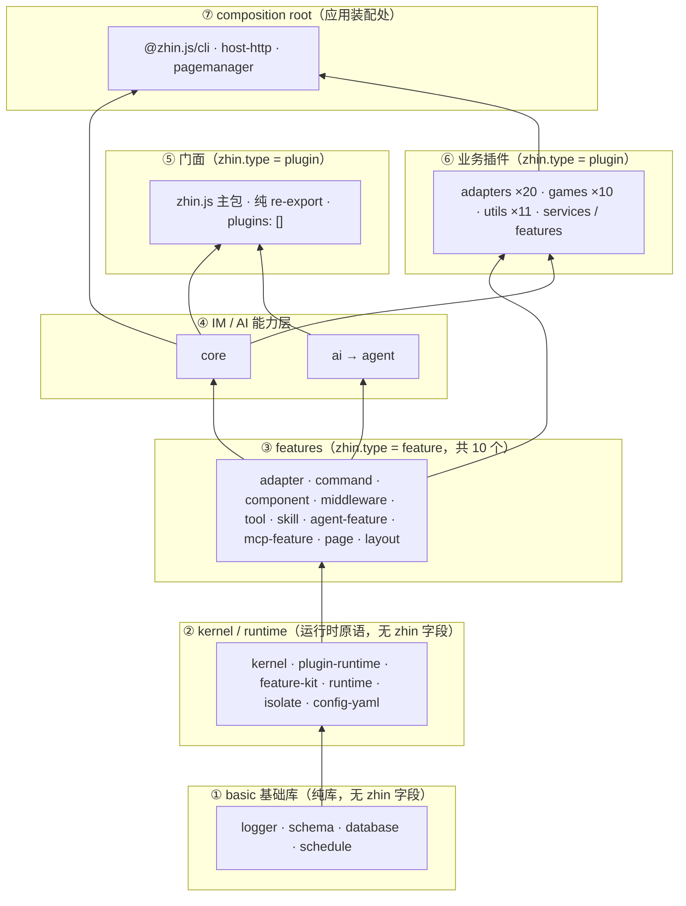

# 包结构依赖图与 zhin 字段配置指南

本文回答一个问题：**搭一个 zhin 应用时，每一层包的 `package.json#zhin` 该怎么写**。
zhin.js 的设计是乐高式的：应用从零散的碎片（feature、plugin）拼起来，
而 `zhin.js` 主包本身又可以作为更高维度应用的子插件。

`zhin` 字段的 schema SSOT 是 [`packages/im/runtime/src/manifest.ts`](https://github.com/zhinjs/zhin/blob/main/packages/im/runtime/src/manifest.ts)。

## 1. 分层依赖图

依赖方向严格单向（下层不知道上层的存在）：



要点：

- **① → ② → ③ → ④ → ⑤** 是主干依赖链，自下而上单向；任何一层只依赖比它低的层。
- **⑥ 业务插件**只依赖 ③ features 和 ④ core（不依赖 ⑤ 门面）——可以被任何维度的应用复用。
- **⑦ `@zhin.js/cli` 是唯一的 composition root**：只有它被允许导入各层并装配成进程（`zhin runtime start`）；Console/Host 维度（host-http + pagemanager）也在这一层装配，不是插件图节点。业务代码永远不要依赖 cli。
- **`zhin.js` 主包是门面（facade）**：re-export core/logger，自身 `plugins: []`——它是可以嵌进任何 Root 的纯积木。`@zhin.js/host-api` / `@zhin.js/host-router` 是 legacy 插件包，新 Runtime 不经 graph 加载它们。
- **业务插件（adapters/games/utils）不依赖 zhin.js 主包**，只依赖自己用的 feature 包和 core——这样它们可以被任何维度（IM-only、L4、厨房水槽）复用。

## 2. zhin 字段 schema 速查

```jsonc
{
  "protocol": 1,                    // 必填，恒为 1
  "type": "plugin" | "feature",     // 必填
  "entry": "./plugin.ts",           // 必填，./ 开头，不许越出包根
  "engine": "^1.0.0",               // 可选 semver，对齐 runtime 代际

  // type: "plugin" 专有
  "runtime": "trusted",             // trusted（默认）| isolated（Root 禁用 isolated）
  "platformFeatures": true,         // 仅 Root 有意义：是否继承 platformFeatures（默认 true）
  "features": [                     // 本包消费哪些 feature provider
    { "package": "@zhin.js/command", "api": "^1.0.0", "optional": false }
  ],
  "plugins": [                      // 本包挂载哪些子插件实例
    { "package": "@zhin.js/adapter-qq", "instanceKey": "qq", "optional": true }
  ],

  // type: "feature" 专有
  "featureApi": "1.0.0"
}
```

- `features[].api` 与 feature 包的 `featureApi` 做 semver 兼容检查。
- `plugins[].package` 支持两种来源：npm 包名（dependencies）或 `./` 相对路径（monorepo 本地插件目录，相对声明方包根，可嵌套）。
- `plugins[].instanceKey` 必填，`^[a-z0-9][a-z0-9-]*$`；配置落在 `zhin.config.yml` 的 `plugins.<instanceKey>`。
- `plugins[].optional: true`：依赖缺失时跳过该实例（用于"装了才启用"的可选维度）。

## 3. 每层怎么写

### 3.1 基础库（basic/*、kernel、plugin-runtime、feature-kit、runtime、ai、toolkit 各包）

**不写 `zhin` 字段。** 它们是纯库/运行时原语，不参与插件图。
判断标准：包里没有任何 `commands/`、`adapters/`、`tools/` 等约定目录要被发现，就不需要 manifest。

### 3.2 Feature Provider（@zhin.js/adapter、@zhin.js/command 等 10 个）

全部同构，照抄即可：

```jsonc
"zhin": {
  "protocol": 1,
  "type": "feature",
  "entry": "./lib/provider.js",   // default export defineFeatureProvider(...)
  "engine": "^1.0.0",
  "featureApi": "1.0.0"
}
```

| 包 | featureId | 扫描约定 |
|---|---|---|
| @zhin.js/adapter | `zhin.adapter` | `adapters/**/*.ts` |
| @zhin.js/command | `zhin.command` | `commands/**/*.ts`（子路径=命令段） |
| @zhin.js/component | `zhin.component` | `components/**/*.ts` |
| @zhin.js/middleware | `zhin.middleware` | `middlewares/**/*.ts` |
| @zhin.js/tool | `zhin.agent-tool`（注意不是 zhin.tool） | `tools/*.ts` |
| @zhin.js/skill | `zhin.skill` | `skills/*/SKILL.md` |
| @zhin.js/agent-feature | `zhin.agent` | `agents/*.agent.md` |
| @zhin.js/mcp-feature | `zhin.mcp` | `mcp/**/*.ts` |
| @zhin.js/page | `zhin.page` | `pages/**/*.{ts,tsx}` |
| @zhin.js/layout | `zhin.layout` | `pages/` 的 layout 槽位 |

新增一类乐高砖块 = 新增一个这样的 feature 包，然后让需要的插件在 `features` 里引用它。

### 3.3 @zhin.js/core —— platformFeatures 的 carrier

```jsonc
"zhin": {
  "protocol": 1,
  "type": "plugin",
  "entry": "./lib/index.js",
  "engine": "^1.0.0",
  "runtime": "trusted",
  "features": [
    { "package": "@zhin.js/adapter",    "api": "^1.0.0" },
    { "package": "@zhin.js/command",    "api": "^1.0.0" },
    { "package": "@zhin.js/component",  "api": "^1.0.0" },
    { "package": "@zhin.js/middleware", "api": "^1.0.0" }
  ],
  "plugins": []
}
```

这 4 个 feature 就是 Root 应用缺省继承的 **platformFeatures**：
Root 依赖里有 `@zhin.js/core`（或 `zhin.js`）时，Root 自动获得 IM 四件套，
用户同名声明可 pin 覆盖；`platformFeatures: false` 可整体关闭。

### 3.4 zhin.js 主包 —— 可被拼的门面

```jsonc
"zhin": {
  "protocol": 1,
  "type": "plugin",
  "entry": "./lib/index.js",
  "engine": "^1.0.0",
  "runtime": "trusted",
  "features": [],
  "plugins": []
}
```

门面模式的要点：

- 自己几乎不实现功能，只 re-export（`zhin.js` → core/logger；`zhin.js/agent` → agent；`zhin.js/ai` → ai）。
- `plugins: []`——历史上它曾把 host-router/host-api 声明为 optional 子插件，但那是 legacy 插件包（`usePlugin` 入口），新 Runtime 的 Console 由 cli 装配，门面保持纯净。
- 因为自己是 `type: plugin`，**zhin.js 可以被更高维度的应用当作子插件拼进去**（见 §4.4）。

### 3.5 Host / Console 维度（cli 装配，非插件图）

`@zhin.js/host-http` / `@zhin.js/mcp` / `@zhin.js/a2a` / `@zhin.js/pagemanager` 是**库**（无 zhin 字段），
由 `@zhin.js/cli` 在 `zhin runtime start` 时装配成 HTTP Host、Console API、MCP/A2A 端点。
`@zhin.js/host-router` / `@zhin.js/host-api` 是 legacy 插件包（`usePlugin` 入口），
保留给旧应用栈，新 Runtime 不要把它们写进 `plugins`。

### 3.6 业务插件（adapters / games / utils / services）

统一模板：

```jsonc
"zhin": {
  "protocol": 1,
  "type": "plugin",
  "entry": "./plugin.ts",        // definePlugin({ setup })
  "engine": "^1.0.0",
  "runtime": "trusted",
  "features": [ /* 按约定目录出现的东西引用 */ ],
  "plugins": []                  // 业务插件一律不挂子插件
}
```

`features` 的选择规则——**包里有什么约定目录就引什么 feature**：

| 包里有 | features 引用 | 例子 |
|---|---|---|
| `adapters/*.ts` | `@zhin.js/adapter` | 全部 20 个平台适配器 |
| `commands/**` | `@zhin.js/command` | games、qq、utils 大部分 |
| `middlewares/**` | `@zhin.js/middleware` | games、repeater、group-suite |
| `components/**` | `@zhin.js/component` | music |
| `tools/*.ts` | `@zhin.js/tool` | 60s、process-monitor、music |
| `pages/**` | `@zhin.js/page` | sandbox |
| 啥都没有 | `features: []` | activity-feedback |

反例警戒：`plugin-music` 依赖 `adapter-icqq`（peer）——跨业务插件的 peer 是**例外而非常态**，
优先走 host token（如 `outboundHostToken`、`agentToolsHostToken`）解耦。

### 3.7 Root 应用（用户项目）

```jsonc
"zhin": {
  "protocol": 1,
  "type": "plugin",
  "entry": "./plugin.ts",
  "engine": "^1.0.0",
  "runtime": "trusted",
  "features": [ /* 项目自己有哪些约定目录就引哪些；全靠继承可留 [] */ ],
  "plugins": [
    { "package": "@zhin.js/adapter-sandbox", "instanceKey": "sandbox" },
    { "package": "@zhin.js/adapter-icqq",    "instanceKey": "icqq" },
    { "package": "@zhin.js/plugin-game-hub", "instanceKey": "game-hub" }
  ]
}
```

Root 的特殊性：

- **platformFeatures 默认继承**（§3.3）：`features: []` 也有 adapter/command/component/middleware。
- `plugins` 清单就是"积木清单"——每个条目一个实例，配置写到 `zhin.config.yml` 的 `plugins.<instanceKey>`。
- 进程入口是 `@zhin.js/cli`（`zhin runtime start`），Root 只管声明，不管装配；Console/Host 由 cli 顺带装配。

## 4. 乐高拼装配方

### 4.1 IM-only（Stable，<10MB）

依赖 `zhin.js` + 需要的适配器插件；`features: []`（继承四件套）；
`plugins` 列适配器实例。参考 `examples/minimal-bot`。

### 4.2 +AI（L4）

在 4.1 基础上加 `@zhin.js/agent` + `zod` + `ai` + 所选 `@ai-sdk/*`；
配置顶层 `ai:` 段，cli 检测到后自动装配 Agent Host。参考 `examples/full-bot`。

### 4.3 +Console / 游戏 / 工具

Console 由 cli 自动装配（`@zhin.js/host-http` + pagemanager 随 cli 就位），
配置 `http:` 段（port/token/corsOrigins）即可访问；`plugins` 追加 games/utils 实例。参考 `examples/test-bot`。

### 4.4 zhin.js 作为更高维应用的子插件

因为主包是 `type: plugin`，更高维的 Root 可以直接拼它：

```jsonc
// 某个"超级应用"的 package.json
"zhin": {
  "protocol": 1,
  "type": "plugin",
  "entry": "./plugin.ts",
  "engine": "^1.0.0",
  "features": [],
  "plugins": [
    { "package": "zhin.js", "instanceKey": "zhin" },          // 整个 IM 维度作为一个积木
    { "package": "@myorg/dashboard", "instanceKey": "dash" }  // 自己的维度
  ]
}
```

zhin.js 自身 `plugins: []`，不会把任何额外维度强加给上层 Root；配置经 `plugins.zhin`（子树）下发。

## 5. 校验清单（写 package.json 时自查）

1. `entry` 必须 `./` 开头且不越包根；feature 的 entry 指向 `./lib/provider.js`（生产），plugin 指向 `./plugin.ts`。
2. `features` 里引的包必须 `type: feature`，且 `api` 与其 `featureApi` semver 兼容。
3. `plugins[].instanceKey` 全图唯一、小写横杠；同包多实例靠不同 instanceKey（同实例多账号改用适配器 `endpoints` 数组，见 `@zhin.js/adapter` README）。
4. 业务插件 `plugins: []`——只有门面/应用层才挂子插件；子插件可来自 npm 依赖，也可来自 `./` 本地目录（monorepo 内插件，免发布）。
5. Root 想完全自管 feature 面：`platformFeatures: false`。
6. 跑 `pnpm check:all` 的 Plugin Spec / Plugin Runtime API / Install Size 门禁验证。
