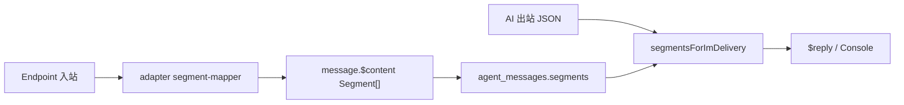

# Segment 内容模型（SSOT）

破坏性改版（2026）：**`Segment[]` 为 IM、Console、`agent_messages` 与 AI 出站 JSON 的共享消息体契约**。Adapter 负责平台互转；Core 负责 schema 与校验；文档为本文件唯一权威表。

## 规范态形状

```typescript
interface Segment {
  type: string;
  data: Record<string, unknown>;
  platform?: Record<string, unknown>; // 与 type 同级；adapter 往返用，Console 一般不渲染
}
```

- **`data` 与 `platform` 字段一律 snake_case**（如 `message_id`、`mime_type`、`forward_id`）。
- **禁止**在规范 `data` 内混写 `url` / `file` / `src` 表示同一媒体；统一用 **MediaRef**。
- 编写期可用 `MessageComponent`（html / keyboard 等）；**async render** 完成后再进入 `$content`、WebSocket、DB。

### MediaRef

```typescript
interface MediaRef {
  kind: 'url' | 'path' | 'base64';
  value: string;
  mime_type?: string;
}
```

用于 `image` / `video` / `audio` / `voice` / `record` / `file` 等媒体类 `data.media`。

## 数据流



## Canonical type 总表

| type | data（snake_case） | IM 可见 | 说明 |
|------|-------------------|---------|------|
| `text` | `{ text }` | yes | |
| `image` | `{ media: MediaRef, alt? }` | yes | |
| `video` | `{ media: MediaRef }` | yes | |
| `audio` / `voice` / `record` | `{ media: MediaRef, duration?, text? }` | yes | `text` 可为 STT 转写 |
| `file` | `{ media: MediaRef, name? }` | yes | |
| `face` | `{ id, name? }` | yes | 入站 `sticker` / `emoji` normalize 为 `face` |
| `mention` | `{ target, name? }` | yes | 全体：`target: 'all'`；原 `at` / `qq` |
| `reply` | `{ message_id }` | yes | 与 `message.$quote_id` 双层同步 |
| `forward` | `{ forward_id, title?, messages? }` | yes | `messages` 为嵌套 `Segment[][]` |
| `link` | `{ url, text? }` | yes | |
| `dice` / `rps` | `{}` 或 `{ result? }` | yes | 非 OneBot 出站降级 `text` |
| `markdown` | `{ content, width?, background_color?, file_name? }` | yes | **存储 SSOT**；出站 rich render 见下 |
| `html` / `qrcode` / `tts` | 见 [Rich Segment](../essentials/rich-segment-adapters.md) | yes | 存储 SSOT |
| `keyboard` | 见 [Interactive Segment](../essentials/interactive-segments.md) | yes | |
| `thinking` | `{ text }` | **no** | 仅 `agent_messages` / Console agent 面板 |
| `tool_call` | `{ id, name, arguments }` | **no** | 仅 agent 持久化 |
| ~~`json` / `xml`~~ | — | — | **非规范**；入站 normalize |

### Rich / Interactive 与存储

- `markdown` / `html` / `qrcode` / `tts`：**持久化保留原 type**；`resolveRichSegments` 出站可变为 `text` / `image` / `audio`，但不改写 SSOT 存储。
- `keyboard`：同上，policy 见 [ADR 0022](../adr/0022-interactive-button-modes.md)。

## 非规范：json / xml

QQ 等平台入站常有 `{ type: 'json' }` / `{ type: 'xml' }` 包装。Adapter **入站**须 normalize 为 `forward` / `face` / `text` 等规范段；无法识别时降级 `text: '[卡片消息]'`。原始 payload 放 `platform`，不进 `data`。

## reply 与 `$quote_id`（双层）

```json
{ "type": "reply", "data": { "message_id": "12345" } }
```

- **段级**：`$content` 内保留 `reply`，供 Console 展示与 adapter CQ/API 往返。
- **消息级**：`message.$quote_id`、`SendOptions.quoteId` 供框架与 AI quote context。
- 入站：adapter 从 reply 段或平台 raw 解析 → 写 `$content` 并 `syncQuoteId`。
- 出站：`alignReplySegments` 写回 `data.message_id`（单字段，废弃 `id` / `message_id` 双写）。

## forward 示例

```json
{
  "type": "forward",
  "data": {
    "forward_id": "ABC123",
    "title": "群聊的聊天记录",
    "messages": [[{ "type": "text", "data": { "text": "..." } }]]
  },
  "platform": { "resid": "ABC123" }
}
```

`messages` 由 adapter `get_forward_msg` enrich 后可选填入。

## AI 交互层

### AgentMessage 信封 vs Segment[]

持久化使用 **信封 + 段** 双层，不新增 `type=tool_result` 段：

| 角色 | 形状 | segments 内容 |
|------|------|----------------|
| `user` | `{ role: 'user', segments }` | 多为 text / image / … |
| `assistant` | `{ role: 'assistant', segments, api, model, … }` | 可含 `text` + `thinking` + `tool_call` |
| `toolResult` | `{ role: 'toolResult', tool_call_id, tool_name, segments, is_error }` | 多为 text / image |

### IM 可见性白名单

`segmentsForImDelivery(segments)` 过滤 **AI-only** 段后再进 `$reply` / 用户 IM：

- **剔除**：`thinking`、`tool_call`
- **保留**：上表 IM 可见 = yes 的 type

### ZhinAiOutboundPayload（ADR 0025）

AI 结构化出站 JSON 的 `segments` 与 canonical **同形**（`type` / `data` / `platform`），**废弃** `{ kind, mode, data }` DSL。

```json
{
  "text": "可选正文",
  "mentions": ["researcher"],
  "segments": [
    { "type": "mention", "data": { "target": "123", "name": "Bot" } },
    { "type": "text", "data": { "text": " 请看一下" } }
  ],
  "extensions": { "onebot.keyboard": { } }
}
```

- `mentions` + `text` 为便捷字段；resolve 后合并为 canonical `mention` + `text`。
- **禁止** AI 直接输出平台原生 CQ 码；`extensions` → adapter `toMessageElements`。

### LLM 序列化

- **废弃** agent 路径上的 segment XML（`segment.from` / `segment.toString` 对模型输入）。
- LLM 只收 **JSON `Segment[]`** 或 **纯 text**。

## Legacy 映射（adapter 责任）

| 入站 legacy | 规范态 |
|-------------|--------|
| `image.url` / `file` / `src` | `data.media` |
| `at.qq` / `at.id` | `mention.target` |
| `face_id` | `face.id` |
| `reply.id` / `message_id` | `reply.message_id` |
| `forward.id` / `resid` | `forward.forward_id` + `platform` |
| `json` / `xml` 卡片 | forward / face / text 或 `[卡片消息]` |
| Telegram `file_id` | `platform.file_id` |

Core **不**自动 normalize legacy；各 adapter `segment-mapper` 实现互转。CI：`pnpm check:segments`。

## Adapter 互转 checklist

- [ ] 入站：平台 payload → `toCanonicalSegments()` → `message.$content`
- [ ] 出站：`fromCanonicalSegments()` → 平台 API / CQ
- [ ] `tests/segment-contract.test.ts` golden round-trip
- [ ] 平台专有字段仅放 `platform`，不进规范 `data`

## Console 双视图

| 视图 | 数据源 | 展示 |
|------|--------|------|
| **endpoint inbox** | `message.$content` 经 IM-visible 过滤 | text / image / face / mention / reply / forward / … |
| **agent 面板** | `agent_messages.segments` 全量 | 含 `thinking` / `tool_call` |

### 发送示例（`endpoint:sendMessage`）

```json
{
  "adapter": "icqq",
  "endpointId": "8596238",
  "id": "634415832",
  "type": "channel",
  "parent": { "type": "guild", "id": "650779094005186335" },
  "content": [
    { "type": "text", "data": { "text": "你好" } },
    { "type": "mention", "data": { "target": "123456", "name": "Alice" } }
  ]
}
```

## 相关

- [Rich Segment 适配器矩阵](../essentials/rich-segment-adapters.md)
- [Interactive / Keyboard Segment](../essentials/interactive-segments.md)
- [ADR 0025 — AI 结构化出站 JSON](../adr/0025-adapter-ai-outbound-json.md)
- [ADR 0009 — agentLoop](../adr/0009-pi-aligned-ai-agent-core.md)
- [AI 模块](../advanced/ai.md)（多模态与 agent 配置；段字段见本文）
