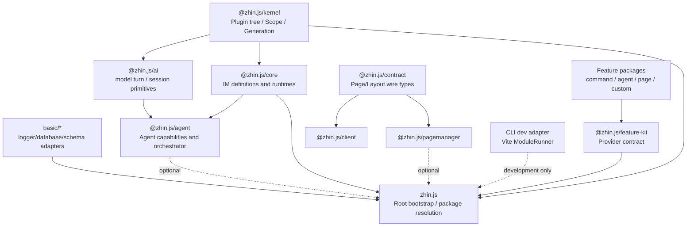
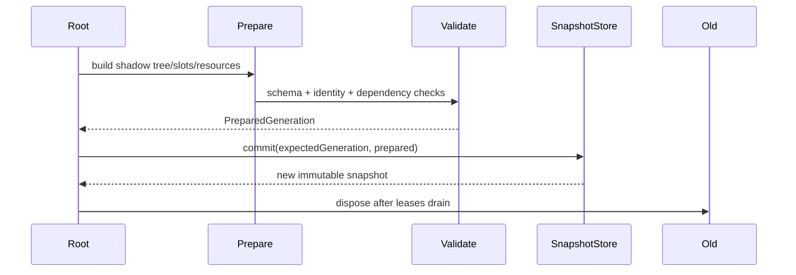

# Target Implementation Blueprint

> 状态：Plugin-first 目标架构的规范性技术实现蓝图。领域目标见 [TARGET-ARCHITECTURE.md](../../../TARGET-ARCHITECTURE.md)，本目录回答模块放在哪里、interface 如何设计、关键代码如何实现。

## 1. 设计目标

实现必须同时满足：

1. **优雅**：作者只面对 Plugin definition、ConfigView 和由 Feature provider 提供的纯 capability definition。
2. **轻量**：生产 Kernel 不携带 YAML、JSON Schema compiler、Vite、React、AI SDK。
3. **原子**：Plugin tree、配置、Resource 和 Feature 作为同一个 generation 发布。
4. **局部**：Capability、Page、Layout 优先文件级替换，越过 Resource seam 才升级为 Plugin subtree。
5. **单向**：低层不知道 IM、Agent、Console；Runtime 不成为第二个注册源。
6. **可独立运行**：任意 Plugin package 都能成为 Root，不需要第二份应用入口。

“轻量”不是拒绝成熟依赖，而是让依赖只出现在真正需要它的 adapter 中。JSON Schema 应使用成熟 compiler，TS/TSX HMR 应使用成熟 module graph；它们不进入 `@zhin.js/kernel`。

## 2. 模块与依赖方向



### 2.1 `@zhin.js/kernel`

只负责：

- `Token<T>`、`Scope`、disposer stack。
- Plugin definition、Plugin instance tree、identity。
- Feature-neutral Capability identity、Slot、immutable RuntimeSnapshot。
- generation lease、compare-and-swap commit。
- RootController 生命周期和树事务。
- Logger、Clock、ModuleRuntime 等 interface，不提供重实现。

目标：**零第三方 runtime dependency**。使用 TypeScript 和平台内建能力即可。

不再放在 Kernel：YAML/TOML、Schema 实现、Schedule engine、IM 类型、文件 watcher、Vite。

### 2.2 `zhin.js`

它是组合层，不是第二个 Kernel：

- Root Bootstrap。
- `config.yml` AST adapter、JSON Schema compiler adapter、EnvStore。
- 解析静态 package manifest，并调度已启用 Feature provider 的 discovery。
- Server Module Runtime 与生产 ESM adapter。
- 将可选 IM、Agent、Console Runtime 连接到 Kernel snapshot。

YAML 和 JSON Schema compiler 的生产依赖止于此层。

### 2.3 `@zhin.js/core`

只负责 IM：

- Message、Adapter、Endpoint、SendContent contract。
- Command、Component、Middleware definition。
- Inbound Runner、Message Dispatcher、Outbound Renderer。
- Page、Agent 或配置文件发现不属于 Core。

数据库、二维码和 HTML renderer 应通过 Root Resource 或可选 toolkit 接入，不作为 IM Core 的强依赖。

### 2.4 `@zhin.js/ai` 与 `@zhin.js/agent`

- AI：provider-neutral turn、stream、session、compaction contract。
- Agent：Tool/Skill/Agent/MCP Feature、CapabilityIngress、Orchestrator、安全策略。
- Agent Runtime 从 Kernel snapshot 派生只读索引；索引是 generation cache，不是 registry。
- AI SDK、provider、MCP、A2A 为 peer/optional adapter，不进入 IM 默认安装。

### 2.5 Console

- `@zhin.js/contract`：零 runtime dependency 的 Page/Layout manifest 与消息 contract。
- `@zhin.js/pagemanager`：Host 端 manifest、chunk、权限过滤。
- `@zhin.js/client`：Router、Navigation Builder、Console Shell、LayoutResolver；React 是 peer。
- Vite 只属于 dev/build adapter，生产 Host 读取预构建 manifest。

Console contract 不应依赖 `@zhin.js/ai`；Agent stream contract 由可选 subpath 或中立 transport contract 提供。

### 2.6 Host 与基础设施

- Host Router、HTTP server、Database pool、Filesystem、Schedule engine 都是 Root Bootstrap 可选安装的 adapter/Resource。
- Plugin 依赖它们的 Token interface，不依赖 Host package 或 driver。
- Root 拥有 process/socket/pool，child 只获得 owner-scoped view。
- Host 可以承载多棵 Plugin tree，但不能成为隐藏 Root 或跨树共享可变 registry。

## 3. 建议源码布局

```text
packages/im/kernel/src/
├── identity.ts
├── token.ts
├── scope.ts
├── capability.ts
├── snapshot.ts
├── plugin-definition.ts
├── plugin-instance.ts
├── root-controller.ts
└── ports.ts

packages/im/feature-kit/src/
├── provider.ts
├── convention.ts
└── projection.ts

packages/im/zhin/src/runtime/
├── bootstrap.ts
├── packages/
│   ├── manifest.ts
│   ├── resolver.ts
│   └── project-graph.ts
├── config/
│   ├── config-store.ts
│   ├── schema-composer.ts
│   └── yaml-document.ts
├── discovery/
│   ├── discover.ts
│   └── manifests.ts
└── modules/
    ├── production-esm-runtime.ts
    └── invalidation-planner.ts

packages/im/core/src/runtime/
├── inbound-runner.ts
├── message-dispatcher.ts
└── outbound-renderer.ts

packages/im/agent/src/runtime/
├── capability-index.ts
├── capability-ingress.ts
└── orchestrator.ts

packages/console/contract/src/
├── page-manifest.ts
└── layout-manifest.ts

packages/console/client/client/runtime/
├── router.ts
├── navigation-builder.ts
├── console-shell.tsx
└── layout-resolver.ts
```

路径是 ownership 建议，不要求一次迁移时机械照搬；public Interface 和依赖方向是规范性的。

每个 Plugin 项目自身采用一级 `packages/*` Feature package 与一级 `plugins/*` child Plugin package；物理 package graph 与逻辑 Plugin tree 的完整规则见 [Plugin Monorepo 与 Feature Provider](./plugin-monorepo-and-features.md)。

### 3.1 当前代码到目标模块

| 当前代码 | 目标处理 |
|---|---|
| [`kernel/src/plugin.ts`](../../../packages/im/kernel/src/plugin.ts) | 拆出稳定 identity、Scope、PluginInstance、RootController；移除全局 extension registry |
| [`kernel/src/feature.ts`](../../../packages/im/kernel/src/feature.ts) | Feature 可变 items 改为 Root RuntimeSnapshot 中的 CapabilitySlot map |
| [`core/src/plugin.ts`](../../../packages/im/core/src/plugin.ts) | IM authoring definition 与 Runtime 留在 Core；Plugin lifecycle 下沉 Kernel |
| [`core/src/built/config.ts`](../../../packages/im/core/src/built/config.ts) | 移到 Root config adapter；Runtime 只见 ConfigView |
| [`core/src/built/schema-feature.ts`](../../../packages/im/core/src/built/schema-feature.ts) | 由 package `schema.json` + Config Composer 取代 |
| [`zhin/src/runtime/node.ts`](../../../packages/im/zhin/src/runtime/node.ts) | 收敛为唯一 Root Bootstrap composition root |
| [`console/client/client/app.ts`](../../../packages/console/client/client/app.ts) | 全局 `addRoute/defineSidebar` 改为 Page/Layout snapshot consumer |
| [`console/pagemanager`](../../../packages/console/pagemanager/src/node/pageManager.ts) | EntryStore 改为 owner-aware Page/Layout manifest host |

新增标准能力时应优先形成独立 Feature provider package，而不是向 Kernel 增加 `CapabilityKind`、扫描目录或领域 registry。

迁移时采用 replace-don't-layer：一个 Runtime 切换到 snapshot 后，立即删除它对应的旧写入面，不长期双写 `Feature.items` 和 CapabilitySlot。

### 3.2 旧术语收敛

| 旧概念 | 目标概念 |
|---|---|
| Context value | Resource binding，通过 Token 放入 Plugin Scope |
| Context lifecycle | Resource disposer，归属 Plugin generation |
| Feature items | owner-bound Capability Slot |
| Plugin extension method | 明确的 setup context 或领域 definition interface |
| Runtime registry | generation-scoped derived index/cache |
| 全局事件总线 | Root generation change stream 或领域 Runtime event |

目标不是改名，而是删除同一能力同时存在 Context、Feature、extension、registry 四种写入方式的情况。

## 4. 唯一状态模型

Root 对外只发布一个不可变快照：

```ts
export interface RuntimeSnapshot {
  readonly generation: number;
  readonly tree: PluginTreeSnapshot;
  readonly config: ReadonlyMap<PluginId, unknown>;
  readonly resources: ReadonlyMap<PluginId, ReadonlyMap<TokenId, unknown>>;
  readonly capabilities: ReadonlyMap<CapabilityIdentity, CapabilitySlot>;
}
```

所有 Runtime 处理一次工作时先 lease 当前 snapshot：

```ts
using lease = root.snapshots.acquire();
await inboundRunner.run(message, lease.value);
```

这样保证：

- Message 处理中不会从旧 Middleware 跳到新 Middleware。
- 新 Tool 不会搭配旧 ConfigView。
- Page manifest、permission 和 Layout generation 一致。
- 旧 generation 可以在 lease 清零后安全 dispose。

任何模块内部允许建立只读派生索引，但必须以 generation 为 cache key：

```ts
const index = toolIndexes.for(snapshot.generation, () => buildToolIndex(snapshot));
```

禁止 Runtime 提供 `register()` 回写自己的可变 registry。

## 5. 两阶段装配

所有启动和 HMR 都使用 prepare/commit：



prepare 阶段允许分配临时资源，但必须登记 disposer。commit 只交换内存引用，不执行不可预测 IO。失败只 dispose shadow generation。

## 6. 依赖预算

| 模块 | 强制 runtime dependency 预算 | 说明 |
|---|---:|---|
| `@zhin.js/kernel` | 0 | 平台内建能力 + 类型 |
| `@zhin.js/core` | ≤2 个小型领域依赖 | 例如成熟 command matcher；不带数据库/二维码 |
| `@zhin.js/ai` | transport 级依赖 | provider SDK 全部 peer/optional |
| `@zhin.js/agent` | 轻量 parser + core/ai | MCP/A2A/provider 为可选 adapter |
| `zhin.js` | YAML + JSON Schema compiler | 只在 Root 配置层 |
| `@zhin.js/contract` | 0 | 不依赖 React/AI |
| `@zhin.js/client` | React peer | UI utilities 可内部实现则不引入库 |
| dev adapter | 不限生产预算 | Vite、source maps、watcher 只在 development |

新增依赖必须回答：

1. 它是否实现了复杂标准或成熟引擎，值得依赖？
2. 能否停留在 adapter 层？
3. 是否会进入默认 IM production install？
4. 能否被 platform built-in 或现有 workspace 包替代？
5. 是否有明确 owner、升级策略和安全响应路径？

不手写 JSON Schema compiler、TS transformer、Router matcher、AI protocol 或数据库 driver。Token、Scope、CAS、disposer stack 这类短小框架语义由 Kernel 自己实现。

## 7. Public authoring interface

Plugin 作者常规只学习：

```ts
export default definePlugin({
  name: 'a',
  displayName: 'Plugin A',
  requires: [DatabaseToken],
  async setup({ config, resources, lifecycle }) {
    const database = resources.use(DatabaseToken);
    const repository = createRepository(database, config.get());
    lifecycle.onDispose(() => repository.close());
  },
});
```

Child Plugin 与启用的 Feature provider 由 `package.json#zhin` 静态声明；`plugin.ts` 不重复声明 package topology。

以及目录 definition：

```text
schema.json
pages/*.ts|tsx
pages/$nav.tsx
pages/$footer.tsx
commands/*.ts|tsx
components/*.ts|tsx
middlewares/*.ts
agents/*.md
skills/*/SKILL.md
tools/*.ts
```

不再暴露 `getPlugin()`、全局当前 Plugin、`add*()` 注册清单、全局 config path 或 Runtime registry。

## 8. 关键实现文档

- [Kernel 与原子 generation](./kernel-and-generation.md)
- [Plugin Monorepo 与 Feature Provider](./plugin-monorepo-and-features.md)
- [Greenfield Bootstrap 实现状态](./greenfield-bootstrap.md)
- [Config、Discovery 与 HMR](./config-discovery-hmr.md)
- [IM、Agent 与 Console Runtime](./domain-runtimes.md)

## 9. 实施顺序

1. 新 Kernel Interface 与测试，不连接现有 Runtime。
2. Root Bootstrap + Config Composer，启动只有 Resource 的空 Plugin tree。
3. Command/Middleware vertical slice：发现、snapshot、执行、文件级 HMR。
4. Tool/Skill/Agent discovery 与 Agent generation index。
5. Page/Layout manifest、Router、Navigation、Console Shell。
6. Adapter/Endpoint、Database、Schedule 等 Resource/Feature 逐项迁移。
7. 删除旧全局 extension registry、`index.ts + add*` 和 query-string HMR。

每一步必须能以 Plugin public Interface 做端到端测试，且不要求双写新旧 registry。

## 10. 架构门禁

- `@zhin.js/kernel/package.json` 禁止第三方 runtime dependencies 白名单外新增项，目标最终为空。
- `@zhin.js/contract` 禁止依赖 React、AI、Core 和 Node-only 包。
- `@zhin.js/core` 禁止依赖 Agent、Console、Host、Vite、数据库 driver。
- `zhin.js` 可选能力必须使用动态 import，默认 IM 启动不得解析 Agent/Console package。
- production dependency size 继续由 `pnpm check:install-size` 守护。
- 每个 Runtime 增加测试，证明它只读取 RuntimeSnapshot 且没有第二个 `add/register` 写入面。
- dev adapter 和 production adapter 运行相同的 identity/manifest contract tests。
