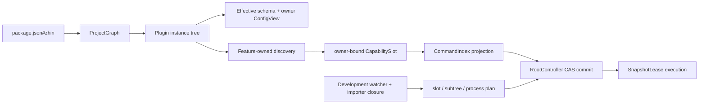

# Greenfield Bootstrap 实现状态

> 分支：`feature/next`。代码位于 `packages/next/*`，不依赖旧 Plugin、Feature registry 或兼容层。

## 1. 当前模块

| Package | 已实现的深模块 |
|---|---|
| `@zhin.js/next-kernel` | Identity、Token/Scope、DisposeStack、CapabilitySlot、SnapshotLease、CAS generation、RootController |
| `@zhin.js/next-feature-kit` | `FeatureAuthoring`、`FeatureRuntime`、可选 `FeatureBuildAdapter`、FeatureCatalog、FeatureDiscovery |
| `@zhin.js/next-runtime` | Manifest parser、扁平 workspace validator、workspace/npm resolver、ProjectGraph、ConfigComposer、显式 RuntimeEnvironment Resource、RootRuntime、ESM ModuleRuntime、SourceOwnershipIndex、InvalidationPlanner、HmrCoordinator |
| `@zhin.js/next-feature-command` | `defineCommand()`、`commands/*.ts|tsx` convention、CommandIndex projection 与 owner-scoped execution context |
| `@zhin.js/next-cli` | `init`、`create plugin`、`create feature`、`inspect`、`build`、默认 dry-run 的 `publish` |

临时包名使用 `next-*`，避免旧 workspace 包名冲突。迁移阶段再通过一次明确的 package rename/swap 切换正式入口，不在当前阶段增加 facade 或双写层。

## 2. 已证明的纵向链路



测试覆盖以下不变量：

1. `packages/*`、`plugins/*` 只扫描一级，nested workspace 被拒绝。
2. package dependency 与 `zhin.plugins`/`zhin.features` 必须同时存在。
3. 物理 build order 来自 package dependencies，逻辑 Plugin tree 不参与猜测。
4. npm 解析结果不会进入当前 Project 的 build/publish plan。
5. schema 默认值按整树物化，ConfigView 只返回 owner 原始 schema 字段。
6. Command 文件由 provider 发现并投影，不发生模块级注册。
7. 新 generation 发布后，旧 lease 继续执行旧 Command；最后一个 lease 释放前不会 dispose。
8. `stop()` 等待当前 generation drain。
9. 默认 ESM adapter 不携带 TS compiler、watcher 或前端构建依赖。
10. 同一 source 可以归属于多个 Plugin mount；Feature provider 变化会覆盖所有 owner。
11. capability、Plugin/schema/manifest 与 lockfile 分别升级为 slot、subtree 与 process 计划。
12. watcher burst 合并为串行 transaction，失败会通知并拒绝整批 waiter。
13. ModuleRuntime port 允许独立开发 adapter 提供 reverse importer closure，不污染生产 Runtime。

## 3. 当前 HMR 边界

当前控制面已经完整：`SourceOwnershipIndex` 从 committed generation 建索引；`InvalidationPlanner` 结合 ModuleRuntime reverse importer closure 生成 slot/subtree/process 计划；`HmrCoordinator` 合并 watcher burst 并串行调用 `RootRuntime`。lockfile/workspace 变化只发出 process restart 请求。

当前执行面仍由 `RootRuntime.reload()` 重新解析 graph、配置、Plugin setup、Feature discovery 与 projection，再原子发布完整 generation。这提供一致性、失败回滚和新旧 lease 隔离；planner 的最小计划尚未等同于最小执行范围。

下一阶段只聚焦执行粒度：

1. generation resource handoff：局部 Slot 重建时复用未变化 Scope，不提前 dispose。
2. slot executor：只重新 load/compile 受影响 definition，并重算对应 Feature projection。
3. subtree executor：在 shadow scopes 中 setup，commit 后才让旧 subtree 进入 lease drain。

在这些执行器完成前，只宣称“精确规划、事务化整代替换”，不宣称“任意文件都能局部替换”。

## 4. 有意保留的后续工作

- `runtime: isolated` 已进入 manifest，但当前明确拒绝启动；Worker/process adapter 尚未实现。
- `engine`、Feature requirement `api` 与 provider `featureApi` 已进入 protocol，semver compatibility gate 尚未接入。
- Page/Layout、Component、Middleware、Agent、Skill、Tool 是后续独立 Feature package，不回填 Kernel 枚举。
- YAML/环境 overlay 属于 ConfigDocument adapter；当前 ConfigComposer 接收解析后的对象。
- publish journal、dist-tag promotion 与失败恢复尚未实现；真实 publish 必须显式 `--execute`。
- 旧 package migration、兼容 facade、codemod 和双版本运行均未开始。

## 5. 验证

```bash
pnpm exec vitest run packages/next
pnpm --filter './packages/next/**' build
pnpm --filter @zhin.js/next-runtime check:size
pnpm check:doc-links
```
