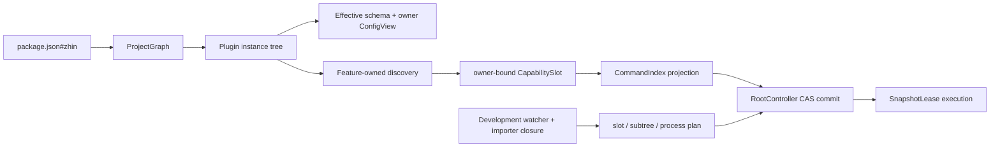

# Plugin Runtime 实现状态

> Greenfield 实现已全部迁入正式 package，不依赖旧 Feature registry 或兼容层。

## 1. 当前模块

| Package | 已实现的深模块 |
|---|---|
| `@zhin.js/plugin-runtime` | Identity、Token/Scope、DisposeStack、CapabilitySlot、SnapshotLease、CAS generation、RootController |
| `@zhin.js/feature-kit` | `FeatureAuthoring`、`FeatureRuntime`、可选 `FeatureBuildAdapter`、FeatureCatalog、FeatureDiscovery |
| `@zhin.js/runtime` | Manifest parser、workspace/npm resolver、ProjectGraph、ConfigComposer、RuntimeEnvironment/owner EnvStore、RootRuntime、Node 原生开发 ModuleRuntime、source ownership、HMR 与 process restart |
| `@zhin.js/isolate` | 可选 Worker/child-process adapter、structured-clone RPC、generation drain/handoff 与 crash propagation |
| `@zhin.js/config-yaml` | 可选 ConfigDocumentPort、YAML AST patch、revision conflict 与原子文件替换 |
| `@zhin.js/command` | `defineCommand()`、`commands/**/*.ts|tsx` convention、层级命令词、CommandIndex projection 与 owner-scoped execution context |
| `@zhin.js/middleware` | `defineMiddleware()`、`middlewares/**/*.ts`、确定性排序、onion compose 与 MiddlewareIndex |
| `@zhin.js/component` | `defineComponent()`、`components/**/*.ts|tsx`、owner override/ancestor fallback 与 ComponentIndex |
| `@zhin.js/adapter` | `defineAdapter()`、`adapters/**/*.ts`、Endpoint lifecycle、generation handoff 与 AdapterIndex |
| `@zhin.js/core/runtime` | MessageGateway、SnapshotLease inbound、Command Dispatcher、Component Renderer、统一 outbound middleware/send |
| `@zhin.js/tool` | `defineAgentTool()`、`tools/*.ts`、owner-scoped ToolIndex |
| `@zhin.js/skill` | `skills/*/SKILL.md`、immutable Markdown SkillIndex |
| `@zhin.js/agent-feature` | `agents/*.agent.md`、immutable Markdown AgentIndex |
| `@zhin.js/mcp-feature` | `mcp/*.ts`、provider-neutral client 与 generation lifecycle |
| `@zhin.js/agent/runtime` | CapabilityIngress、owner-visible handles、snapshot-coherent turn lease |
| `@zhin.js/console-contract` | 零依赖 Page/Layout manifest、route、Navigation 与 Shell slot contract |
| `@zhin.js/page` | `pages/*.ts|tsx`、Client Module artifact 校验、canonical route 与 PageIndex |
| `@zhin.js/layout` | `$nav.tsx`/`$footer.tsx`、最近祖先继承与 renderer fallback chain |
| `@zhin.js/pagemanager/plugin-runtime` | permission-aware route guard、Plugin Navigation、Layout resolver 与 view lease |
| `@zhin.js/pagemanager/client-build` | 可选 TypeScript AST metadata、content-hash ESM/manifest、development builder 与 production loader |
| `@zhin.js/cli` | `init`、`create`、`inspect`、原生 TS `start`、两阶段 migrate/readiness、`build` 与安全 publish |

所有公共入口均使用正式包名；`migration-topology.json` 记录原位迁移与明确删除项。

## 2. 已证明的纵向链路



测试覆盖以下不变量：

1. `packages/*`、`plugins/*` 只扫描一级，nested workspace 被拒绝。
2. package dependency 与 `zhin.plugins`/`zhin.features` 必须同时存在。
3. 物理 build order 来自 package dependencies，逻辑 Plugin tree 不参与猜测。
4. npm 解析结果不会进入当前 Project 的 build/publish plan。
5. schema 默认值按整树物化，ConfigView 只返回 owner 原始 schema 字段。
6. Command 文件由 provider 发现并投影，不发生模块级注册。
7. 新 generation 发布后，旧 lease 继续执行旧 Command；最后一个 lease 释放前不会 dispose。
8. `stop()` 等待当前 generation drain。
9. 默认 ESM adapter 不携带 TS compiler、watcher 或前端构建依赖。
10. 同一 source 可以归属于多个 Plugin mount；Feature provider 变化会覆盖所有 owner。
11. capability、Plugin/schema/manifest 与 lockfile 分别升级为 slot、subtree 与 process 计划。
12. watcher burst 合并为串行 transaction，失败会通知并拒绝整批 waiter。
13. ModuleRuntime port 允许独立开发 adapter 提供 reverse importer closure，不污染生产 Runtime。
14. Slot HMR 只 load 选中的 definition，不重新 import Feature provider 或执行 Plugin setup。
15. Plugin Scope 通过引用计数 lifetime 跨 generation 存活；旧 lease 释放不会提前关闭共享 Resource。
16. definition 校验失败保持 active generation；删除 capability 文件会原子移除对应 Slot。
17. 排他 Resource 可注册 generation handoff；transaction 在 commit 前 quiesce/activate，失败时 deactivate/resume，commit 后再开放 admission。
18. `ConfigPatchPlanner` 对结构化 set/remove patch 做整树校验，比较 owner view 后计算最浅 replacement forest；patch 队列串行且 no-op 不发布 generation。
19. manifest topology transaction 局部处理 child/Feature mount 的新增、删除和移动；稳定 Scope 复用，移动 Scope 按新 owner 重建，等价 manifest 不发布 generation。
20. Root setup/schema、package ESM ABI、engine、Feature API 与 Plugin runtime 变化升级为 process plan；可选 executor 在 drain/stop Root 后只调用一次 Host restart adapter。
21. ConfigDocumentPort 将原始文档与 materialized config 分离；YAML adapter 保留注释/表达式/格式，并与 Resource handoff、generation CAS 共同回滚。
22. Root 显式冻结 EnvironmentLayers，并为每个 Plugin Scope 注入独立 EnvStore；overlay、`${KEY}` 展开、schema parse 与 secret redaction 不读取模块全局状态。
23. Graph inspect 在模块 import/setup 前校验 Runtime engine 与 Feature API semver contract；不兼容候选不产生副作用，兼容 contract 变化升级为 process restart。
24. Middleware 与 Component 均由独立 Feature package 提供；目录发现、definition brand、owner context、projection 与单 Slot HMR 已完成纵向验证。
25. Adapter Endpoint 由 Feature projection handoff 纳入 generation transaction；create/start/open/close/stop 的切代顺序、失败清理和旧 lease 延迟 dispose 已验证。
26. IM Runtime 已贯通 inbound Middleware、最长前缀 Command、Component render、outbound Middleware 与唯一 Endpoint send；消息处理中提交 generation 不会撕裂 snapshot。
27. Tool、Skill、Agent、MCP 均由独立 Feature 提供；项目根与 Plugin 根使用同一发现格式，owner override 和 qualified identity 由共享索引确定。
28. AgentRuntime 一次 turn lease 同一 generation；Tool 使用声明 owner config/resource，MCP connection 参与 handoff，逃逸执行 handle 在 turn 后失效。
29. Page/Layout 浏览器模块只经 Client Module artifact port 加载，Node 不 import TSX；单文件 HMR 不重跑 Plugin setup，编译失败保持旧 generation。
30. ConsoleRuntime 在同一 view lease 中完成 route guard、permission filter、Navigation 建树与 Layout fallback；`hideInNav` 不绕过直访鉴权。
31. Client build adapter 通过 TypeScript AST 只提取 `definePage()` JSON-like literal；动态表达式带源码位置失败，构建不执行作者模块。
32. Publish execute 先写 plan-specific staging dist-tag，全部发布后再 promote；journal 原子记录每个远程 step，resume 使用 registry probe 关闭崩溃窗口。
33. `runtime: isolated` child 通过可选 Worker/process adapter 启动；entry 不在 Host import，旧 RPC drain 后切代，候选 setup 失败恢复旧实例，崩溃与超时使实例明确失效。
34. 正式 Plugin Runtime root/subpath 导出进入 API snapshot；CLI 可 AST inventory/extract 静态 MessageCommand，迁移产物直接使用原生 Feature definition。
35. Command/Middleware/Component extraction、package cutover 与 readiness 状态机已完成；真实双版本 tracer 可读取 YAML、原生加载 TS、提交 generation 并 drain/stop。
36. 原生开发 Runtime 使用 URL revision 局部刷新直接 capability；无法清除 importer closure 的 support module 明确升级为退出码 75 的 process restart。

## 3. 当前 HMR 边界

当前控制面已经完整：`SourceOwnershipIndex` 从 committed generation 建索引；`InvalidationPlanner` 结合 ModuleRuntime reverse importer closure 生成 slot/subtree/process 计划；`HmrCoordinator` 合并 watcher burst 并串行调用 `RootRuntime`。lockfile/workspace 变化只发出 process restart 请求。

Capability-only 计划已经进入局部执行面：FeatureDiscovery 枚举完整约定目录以保留冲突检查，但只 load 选中的 Slot；Plugin tree、配置和 Resource snapshot 直接复用。child Plugin/schema 计划通过 `PluginScopeAssembler` 只创建受影响 forest 的 shadow Scope，ancestor 和 sibling 直接复用。manifest topology transaction 在完整解析候选 graph 后，只 setup added/replaced child forest；removed child 退出候选 snapshot，旧 Scope 继续由旧 generation lease 持有；Feature mount 增删移动只刷新 owner Slot。`FeatureProjector` 统一为四种装配路径重建全部 projection，避免 projection 捕获旧 snapshot。每个 Plugin Scope 都有独立 `SharedLifetime`；新旧 generation 分别持有 lease，最后一代释放后才 children-first dispose。

commit 仍然发布完整 immutable RuntimeSnapshot；“局部”只描述 prepare/load/setup/dispose 范围，不表示原地修改 snapshot。definition 加载、校验或 projection 任一步失败都销毁 shadow projection 并保持 active generation。

绿地建设已经完成，迁移控制面也已具备 extraction、cutover、readiness 与真实 Root smoke。
Stable `minimal-bot`、L4 `full-bot`、厨房水槽 `test-bot` 及其余官方示例均已切正式 Root；
平台 Adapter / utils / services / games 约定式 cutover 已齐（见
[in-place-migration.md](./in-place-migration.md)）；`migration-topology.json` 的
`pending` 为空。Agent Host、Console Database、MCP/A2A、Tool 权限和官方示例均已纳入 L4 门禁。

当前可宣称 Capability 文件、child Plugin/schema 与 manifest topology 的局部替换，以及 Root/package ABI 的受控 process restart。Feature provider 源码、未知 importer 和混合 burst 仍采用事务化整代重建；这是明确的安全边界，不是静默降级。

## 4. 已冻结的边界

- `runtime: isolated` Worker/process adapter 已实现；普通 Feature 跨边界仍需 Feature-specific codec/proxy，当前明确拒绝隐式函数序列化。
- Runtime engine 与 Feature API semver compatibility gate 已实现。
- Page/Layout 独立 Feature、Console contract/runtime 与可选 TypeScript client build/manifest adapter 已实现。
- YAML ConfigDocument adapter、类型化 EnvStore、环境 overlay 与 secret redaction 已实现。
- publish journal、staging dist-tag promotion 与 registry-aware `--resume` 已实现；真实 publish 必须显式 `--execute` 或 `--resume`，这是安全约束。
- 旧 package migration 控制面已完成：三类 AST extraction、entry/manifest cutover、readiness import inventory 与迁移行为 smoke 均有测试。Compat Runtime 已删除；仓库内 Plugin 约定式搬迁已齐。
- Plugin 发布以 `package.json#zhin.entry` 指向 TypeScript SSOT；Node >=22.18 原生加载，不生成第二份易漂移的 JS Plugin entry。浏览器 Page 仍生成 content-hash client artifact。
- Feature provider、未知 importer 与混合 burst 采用事务化整代重建；普通 Feature 不隐式跨 Worker 序列化函数。这些是明确拒绝的行为，不是待办。
- `group-suite` 的 side-event 欢迎/撤回、AI 群日报与 HTML 报表，以及 Lottery 的 legacy Plugin AI narrative/master 推送已在破坏性版本中删除；schema 不再暴露无效开关。

## 5. 完成定义

以下口径只统计仓库内可复现的设计、实现、测试、README 与 SSOT（**2026-07-20**）：

| 口径 | 完成度 |
|---|---:|
| 绿地底座 | **100%** |
| 结构 cutover（包 + Adapter + 约定式 Plugin） | **100%** |
| 官方插件与示例主路径行为 | **100%** |
| 仓库内稳定化可替换版 | **100%** |

真实 IM 凭据、npm dist-tag promotion 与生产流量观察属于 release operation，不是代码
完成度。它们由发布 checklist 逐环境签字，失败时按缺陷回开，不修改本表制造模糊进度。

## 6. 验证

```bash
pnpm exec vitest run packages/im/runtime packages/im/config-yaml packages/im/isolate
pnpm --filter @zhin.js/runtime build
pnpm check:install-size
pnpm --filter @zhin.js/isolate check:size
node scripts/check-plugin-runtime-api.mjs
pnpm check:doc-links
```
