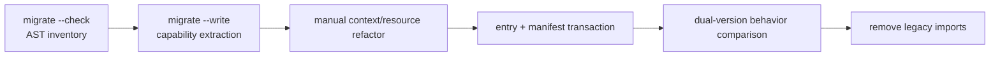

# Next 迁移契约

本文是旧 Zhin Plugin 向 Next package/Feature 模型迁移的单一事实源。迁移不是在新 Kernel 中复刻旧 registry，而是把旧模块副作用逐步编译为静态 manifest、owner capability 文件和显式 Resource。

## 迁移阶段



`--check` 和 `--write` 都不执行旧 Plugin。TypeScript AST 只识别静态 `addCommand(new MessageCommand(...))` builder；输出和 diagnostics 按源文件、源码位置稳定排序。

## 自动 Command 子集

当前自动支持：

- 一个 string literal pattern。
- 最多一个且位于末尾的 `<name:text|string|number|boolean>` 参数。
- 一个 inline arrow/function action。
- 可选的第一个 string literal `.desc()`。
- action 只引用参数、函数内声明和明确的 JavaScript/Node global。

```text
gh pr <title:text>
  -> commands/gh/pr/[title:string].ts
```

输出使用 `defineLegacyCommand()` 保留 `(message, matchResult)` callback。路由 identity、类型转换、owner config/resource 和 lifecycle 已由新 Command Feature 接管。

以下情况必须 manual：外部闭包、Plugin/logger/context、动态 pattern、多个 action、`.permit()`、复杂 SegmentMatcher、非末尾或多个动态参数、目标路径冲突。工具宁可少迁移，也不生成表面可编译但行为错误的代码。

## 写入事务

`--write` 先验证整个 plan、目标必须位于 `commands/` 内且不存在，再把全部内容写到同目录临时文件；只有准备完成后才用排他 hard-link 原子发布，拒绝并发创建的同名目标。失败时删除本次创建的 target 和 temporary。旧 source 保持不变，因此 extraction 可审查、可丢弃，也保留旧版本回滚能力。

entry 与 `package.json#zhin` 切换不属于 extraction。它们在 manual diagnostics 清零、Feature dependency 已声明后作为下一次独立 manifest transaction 完成。

## Compatibility 边界

`@zhin.js/next-compat` 只能返回标准新 definition，不提供 `usePlugin()` / `getPlugin()`、模块级注册或双写、Host Scope 隐式查找、旧 matcher/权限/Context/disposer 模拟。无法通过纯参数转换表达的能力应迁移为新 Resource/Feature contract，而不是扩张 compat。

## API 冻结

`packages/next/api-surface.json` 记录所有 Next package root 与公开 subpath `src/index.ts` 导出。`pnpm --filter @zhin.js/next-cli check:api` 检测未审查的公共面变化。snapshot 只约束公开入口；内部文件仍可重构。

## 当前覆盖

| 旧能力 | 自动提取 | Compat | 后续 |
|---|---|---|---|
| `MessageCommand` 静态子集 | 已实现 | 已实现 | permission/help metadata、复杂 matcher |
| `addMiddleware` | inventory 待实现 | callback adapter 已实现 | owner/target/phase 推断 |
| `addComponent` | 待实现 | 不做旧 Context 模拟 | JSX/render contract 迁移 |
| `provideContext/useContext` | 不自动 | 不兼容 | 显式 Token/Resource |
| Adapter/Endpoint | 不自动 | 不兼容 | Feature + generation handoff |
| Tool/Agent/Skill | 目录已有 | 不需要 | 旧 package 批量搬迁 |
