# Next 迁移契约

本文是旧 Zhin Plugin 向 Next package/Feature 模型迁移的单一事实源。迁移不是在新 Kernel 中复刻旧 registry，而是把旧模块副作用逐步编译为静态 manifest、owner capability 文件和显式 Resource。

## 迁移阶段

```mermaid
flowchart LR
  Inventory["migrate --check\nAST inventory"] --> Extract["migrate --write\ncapability extraction"]
  Extract --> Refactor["manual context/resource refactor"]
  Refactor --> Preview["migrate cutover --check\nmanifest preview"]
  Preview --> Switch["migrate cutover --write\nentry + manifest transaction"]
  Switch --> Compare["dual-version behavior comparison"]
  Compare --> Status["migrate status\nlegacy/compat inventory"]
  Status --> Remove["remove legacy imports"]
```



两个阶段的 `--check` 都不写盘，所有迁移命令都不执行旧 Plugin。TypeScript AST inventory 识别 `addCommand()`、`addMiddleware()` 和 `addComponent()`；只有模块顶层且满足各自安全子集的注册才自动提取，其他调用产生按源文件、源码位置稳定排序的 diagnostic。

## 自动 Command 子集

当前自动支持：

- 一个 string literal pattern。
- 最多一个且位于末尾的 `<name:text|string|number|boolean>` 参数。
- 一个 inline arrow/function action。
- 可选且只调用一次的 `.desc(...stringLiteral)`。
- action 只引用参数、函数内声明和明确的 JavaScript/Node global。

```text
gh pr <title:text>
  -> commands/gh/pr/[title:string].ts
```

输出使用 `defineLegacyCommand()` 保留 `(message, matchResult)` callback。路由 identity、类型转换、owner config/resource 和 lifecycle 已由新 Command Feature 接管。

以下情况必须 manual：外部闭包、Plugin/logger/context、动态 pattern、多个 action、`.permit()`、复杂 SegmentMatcher、非末尾或多个动态参数、目标路径冲突。工具宁可少迁移，也不生成表面可编译但行为错误的代码。

## 自动 Middleware 与 Component 子集

Middleware 自动提取要求模块顶层 `addMiddleware(inlineFunction, optionalStaticName)`。名称优先取第二个 string literal，其次取具名函数；单 middleware 文件还可使用文件名。callback 不得捕获源文件 binding，输出到 `middlewares/<name>.ts` 并通过 `defineLegacyMiddleware()` 保留 `(message, next)` 形状。

Component 自动提取要求 `addComponent()` 引用模块顶层函数/arrow binding，或传入具名 inline function。render 最多接收一个 props 参数且不得捕获源文件 binding，输出到 `components/<kebab-name>.ts|tsx`。旧版第二个 `ComponentContext` 参数、import/closure、依赖 Plugin Context 的 JSX 均进入 manual 清单，不伪造新 Context。

模块初始化之后才调用的 `add*()` 一律进入 manual 清单，因为它们的 owner 和生命周期不能仅凭语法可靠推断。

## 写入事务

`migrate --write` 先验证整个 plan；目标必须按 capability 位于 `commands/`、`middlewares/` 或 `components/` 内且不存在。全部内容先写到同目录临时文件，准备完成后才用排他 hard-link 原子发布，拒绝并发创建的同名目标。失败时删除本次创建的 target 和 temporary。旧 source 保持不变，因此 extraction 可审查、可丢弃，也保留旧版本回滚能力。

`migrate cutover --write` 是独立事务。它从已生成的目录推导 Feature provider，在 dependencies 中补充 Kernel、Runtime、Feature 和实际使用时的 Compat，生成纯 `plugin.next.ts`，最后提交 `package.json#zhin`。原始 package 文本是乐观并发令牌；预检后或事务中发生外部修改会拒绝提交。入口使用排他 hard-link 发布，manifest 使用同目录原子 rename 最后提交；中断后留下的内容一致入口是可重试的 prepared state。已有其他 `zhin` manifest 或内容不同的 `plugin.next.ts` 必须人工处理。

cutover 不删除旧 entry/source，也不声称已经切换生产启动器。完成后应运行旧版与 Next 的行为对照；仓库中的 [`examples/next-migration-bot`](../../../examples/next-migration-bot/README.md) 是可执行 tracer。

`migrate status` 是迁移退出条件的机器可读 SSOT：`extraction-required`、`cutover-required`、`dual-run`、`compat` 依次收敛到 `ready`；manual/error 或冲突 cutover 为 `blocked`。报告保留 legacy/compat module specifier 的文件、行列与 extraction diagnostics。

`zhin-next start --once` 是 cutover 后的最小运行验收。它必须真实读取 config、解析生产 Feature provider、原生加载本地 TS capability、提交 generation 并完成 drain/stop；仅通过语法转译不算启动完成。

## Compatibility 边界

`@zhin.js/next-compat` 只能返回标准新 definition，不提供 `usePlugin()` / `getPlugin()`、模块级注册或双写、Host Scope 隐式查找、旧 matcher/权限/Context/disposer 模拟。无法通过纯参数转换表达的能力应迁移为新 Resource/Feature contract，而不是扩张 compat。

## API 冻结

`packages/next/api-surface.json` 记录所有 Next package root 与公开 subpath `src/index.ts` 导出。`pnpm --filter @zhin.js/next-cli check:api` 检测未审查的公共面变化。snapshot 只约束公开入口；内部文件仍可重构。

## 当前覆盖

| 旧能力 | 自动提取 | Compat | 后续 |
|---|---|---|---|
| `MessageCommand` 静态子集 | 已实现 | 已实现 | permission/help metadata、复杂 matcher |
| `addMiddleware` 静态无闭包子集 | 已实现 | 已实现 | owner/target/phase 的复杂推断 |
| `addComponent` 静态无 Context 子集 | 已实现 | 不做旧 Context 模拟 | JSX/import/render contract 迁移 |
| `provideContext/useContext` | 不自动 | 不兼容 | 显式 Token/Resource |
| Adapter/Endpoint | 不自动 | 不兼容 | Feature + generation handoff |
| Tool/Agent/Skill | 目录已有 | 不需要 | 旧 package 批量搬迁 |
