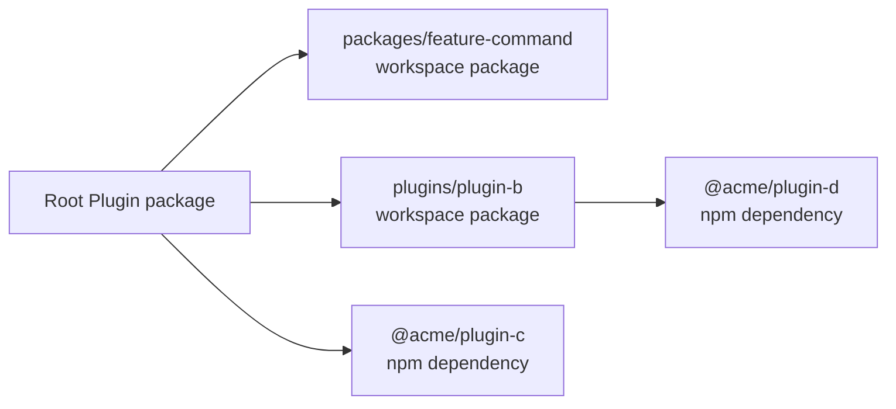
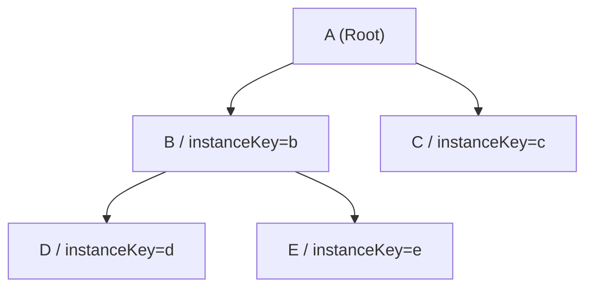
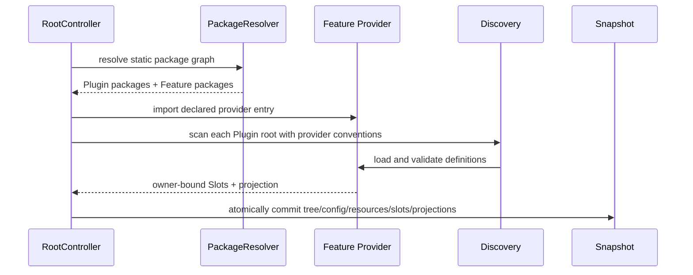

# Plugin Monorepo 与 Feature Provider

本页把 [ADR 0048](../../adr/0048-plugin-monorepo-and-feature-provider-packages.md) 落到 package protocol、Kernel interface、解析算法和 CLI pipeline。它是项目布局与 Feature 扩展机制的规范性实现蓝图。

## 1. 两张图，不要混成一张

### 1.1 物理 Package Graph



物理 graph 解决模块解析、构建和发布。每个本地 package 都是 Root workspace 的直接成员。

### 1.2 逻辑 Plugin Instance Tree



逻辑 tree 解决配置路径、资源继承、route、owner identity 和生命周期。它由各 package manifest 递归声明，不能从磁盘嵌套关系推断。

## 2. Canonical Project Layout

```text
my-plugin/
├── package.json
├── pnpm-workspace.yaml
├── plugin.ts
├── schema.json
├── packages/
│   ├── command/
│   ├── component/
│   ├── skill/
│   ├── tool/
│   └── agent/
├── plugins/
│   ├── group-suit/
│   └── 60s/
│       ├── package.json
│       ├── plugin.ts
│       ├── skills/
│       └── commands/
├── skills/
│   └── 60s/SKILL.md
├── tools/
│   └── get-weather.ts
├── agents/
│   ├── planner.md
│   └── reviewer.md
├── commands/
│   ├── status.ts
│   └── zt.ts
└── components/
    └── test-err.ts
```

`plugins/60s/skills` 是 60s package 的能力目录，不是 nested Plugin workspace。CLI 对 `plugins/*/plugins` 和子 `pnpm-workspace.yaml` 给出结构化错误。

## 3. 静态 Package Manifest

```ts
export interface ZhinPackageManifestV1 {
  readonly protocol: 1;
  readonly type: 'plugin' | 'feature';
  readonly entry: string;
  readonly features?: readonly PackageReference[];
  readonly plugins?: readonly ChildPluginReference[];
}

export interface PackageReference {
  readonly package: string;
  readonly optional?: boolean;
}

export interface ChildPluginReference extends PackageReference {
  readonly instanceKey: string;
}
```

建议 JSON：

```json
{
  "zhin": {
    "protocol": 1,
    "type": "plugin",
    "entry": "./plugin.ts",
    "features": [
      { "package": "@zhin.js/feature-command" },
      { "package": "@zhin.js/feature-agent", "optional": true }
    ],
    "plugins": [
      { "package": "@acme/plugin-60s", "instanceKey": "60s" }
    ]
  }
}
```

manifest 使用对象引用而非字符串简写作为 canonical wire format，便于以后增加 condition、environment 或 capability policy。作者工具可以接受简写，但写回时规范化。

`entry` 必须是 package 内相对路径。Resolver 必须验证 package exports/files，拒绝逃逸 package root 的路径。

## 4. Package Resolver

```ts
export interface ResolvedPackage {
  readonly name: string;
  readonly root: string;
  readonly manifest: ZhinPackageManifestV1;
  readonly source: 'workspace' | 'node_modules';
}

export interface PackageResolver {
  resolve(
    request: string,
    fromPackageRoot: string,
  ): Promise<ResolvedPackage>;
}
```

解析算法：

1. 从声明者 package root 按 Node package resolution 解析 package。
2. 读取目标 `package.json#zhin`，不 import `entry`。
3. 校验声明类型，child 必须是 `type: plugin`，Feature 必须是 `type: feature`。
4. 校验 package 确实存在于 dependency fields；optional 缺失才允许跳过。
5. 以 realpath + package name 缓存 package metadata，但 Plugin instance 仍按挂载路径分别创建。

```ts
export async function resolveChild(
  resolver: PackageResolver,
  parent: ResolvedPackage,
  declaration: ChildPluginReference,
): Promise<ResolvedPackage | undefined> {
  try {
    const child = await resolver.resolve(declaration.package, parent.root);
    if (child.manifest.type !== 'plugin') {
      throw new TypeError(`${declaration.package} is not a Zhin Plugin`);
    }
    return child;
  } catch (error) {
    if (declaration.optional && isPackageNotFound(error)) return undefined;
    throw error;
  }
}
```

package graph cycle 与 instance tree cycle 分别诊断。相同 package 可以在不同 branch 或不同 instanceKey 下实例化，但同一 ancestor chain 上的递归 cycle 默认拒绝。

## 5. Kernel 的通用 Feature Interface

Kernel 只定义稳定 identity：

```ts
declare const featureIdBrand: unique symbol;

export type FeatureId = string & { readonly [featureIdBrand]: true };

export interface CapabilitySlot<T = unknown> {
  readonly id: CapabilityId;
  readonly owner: PluginId;
  readonly feature: FeatureId;
  readonly localName: string;
  readonly source: string;
  readonly definition: T;
}

export function capabilityId(
  owner: PluginId,
  feature: FeatureId,
  localName: string,
): CapabilityId {
  return `${owner}\0${feature}\0${localName}` as CapabilityId;
}
```

Kernel 没有 `CapabilityKind` union，也没有 `commands/` 等路径常量。

## 6. Feature Provider Contract

发现与加载涉及文件系统和模块执行，不应塞进零依赖 Kernel。`@zhin.js/feature-kit` 提供轻量 contract，具体 adapter 由 Root Bootstrap 注入：

```ts
export interface FeatureProvider<TDefinition = unknown, TProjection = unknown> {
  readonly id: FeatureId;
  readonly protocol: 1;
  readonly conventions: readonly SourceConvention[];
  validate(definition: unknown, context: ValidationContext): TDefinition;
  project(
    slots: readonly CapabilitySlot<TDefinition>[],
    context: ProjectionContext,
  ): TProjection | Promise<TProjection>;
}

export interface SourceConvention {
  readonly directory: string;
  discover(context: DiscoveryContext): AsyncIterable<DiscoveredSource>;
  load(source: DiscoveredSource, context: LoadContext): Promise<unknown>;
}

export interface DiscoveredSource {
  readonly localName: string;
  readonly source: string;
  readonly target: 'server' | 'client';
}
```

`project()` 只建立 generation-scoped 的不可变派生物，例如 Command matcher、Tool index 或 Page manifest。它不能写入全局 registry。projection disposer 进入 `PreparedGeneration`，commit 失败或旧 lease 清零后统一释放。

### 6.1 Command Feature 示例

```ts
export const commandFeature = defineFeatureProvider<CommandDefinition, CommandIndex>({
  id: featureId('zhin.command'),
  protocol: 1,
  conventions: [
    moduleFiles({ directory: 'commands', extensions: ['.ts', '.tsx'] }),
  ],
  validate: parseCommandDefinition,
  project: (slots) => CommandIndex.create(slots),
});
```

### 6.2 Agent Feature 示例

```ts
export const agentFeature = defineFeatureProvider<AgentDefinition, AgentIndex>({
  id: featureId('zhin.agent'),
  protocol: 1,
  conventions: [
    markdownFiles({ directory: 'agents', extension: '.md' }),
  ],
  validate: parseAgentMarkdown,
  project: (slots) => AgentIndex.create(slots),
});
```

`agents/<name>.md` 是标准 Agent Feature 的约定。文件名后缀不再重复表达 feature 类型。

## 7. Feature 装配流程



同一 Feature package 可以被多层 Plugin 声明。Root 按 `FeatureId` 去重 provider 实现，但对每个 Plugin root 独立发现并绑定 owner。若两个不同 package 声明同一 `FeatureId` 且实现身份不一致，prepare 失败。

## 8. Plugin Definition 回归 Setup

```ts
export interface PluginDefinition<TConfig = unknown> {
  readonly name: string;
  readonly metadata?: PluginMetadata;
  readonly requires?: readonly Token<unknown>[];
  setup?(context: PluginSetupContext<TConfig>): void | Dispose | Promise<void | Dispose>;
}
```

`plugins` 和 `features` 不再出现在 TypeScript definition。这样 CLI 在 build/publish 前可以完整解析拓扑，HMR `plugin.ts` 时也不会意外改变 package graph。拓扑变更属于 manifest transaction，影响对应 Plugin subtree；普通能力文件仍可进行 Slot 级 HMR。

## 9. HMR 粒度

| 变更 | 最小 prepare 单元 |
|---|---|
| `commands/status.ts` | 单个 Command Slot + Command projection |
| `agents/planner.md` | 单个 Agent Slot + Agent projection |
| Feature provider entry | 使用该 Feature 的所有 Slot/projection |
| child `plugin.ts` | child Plugin subtree |
| child `schema.json` | child subtree config/schema/resources |
| 任意 `package.json#zhin.plugins` | 受影响 Plugin subtree + package graph |
| workspace/lockfile | 整树 dependency resolution，必要时重启 Module Runtime |

一次 commit 仍发布一个完整 generation；“局部”描述 prepare 和 dispose 的范围，不表示 RuntimeSnapshot 被原地修改。

## 10. CLI Pipeline

```ts
export interface ProjectGraph {
  readonly root: PackageNode;
  readonly packages: ReadonlyMap<string, PackageNode>;
  readonly buildOrder: readonly PackageNode[];
}

export interface ProjectGraphService {
  inspect(root: string): Promise<ProjectGraph>;
  validate(graph: ProjectGraph): readonly Diagnostic[];
}
```

### `zhin create plugin 60s`

1. 校验 `plugins/60s` 不存在且名称合法。
2. 创建 package skeleton、`plugin.ts`、`schema.json`。
3. 在 Root `dependencies` 增加 workspace reference。
4. 在 `zhin.plugins` 增加 `{ package, instanceKey }`。
5. 格式化并重新读取，保证操作幂等。

### `zhin create feature command`

1. 创建 `packages/command` 与 provider entry。
2. 在 Root `dependencies` 增加 workspace reference。
3. 在 `zhin.features` 增加 package reference。
4. 生成 contract、测试和 package exports，不生成 Kernel patch。

### `zhin build`

1. `inspect` 和 schema validate，不执行 Plugin entry。
2. 检测 nested workspace、graph cycle、重复 instanceKey、缺失 dependency。
3. 按 Feature dependencies、Plugin dependencies、Root 的拓扑顺序构建。
4. 为 server/client source 生成带 content hash 的 manifest。
5. 对每个 package 运行其显式 build contract。

### `zhin publish`

1. 冻结 ProjectGraph 与版本计划。
2. 执行 lint/test/build 和 package tarball 校验。
3. 跳过 `private: true`，并验证公开包不能依赖无法解析的私有包。
4. 由 PackageManagerPort 生成 registry 可接受的依赖版本。
5. 按拓扑顺序发布 Feature、child Plugin、Root。
6. 任一步失败即停止，输出可恢复的 publish journal，不修改运行时 manifest 语义。

## 11. 关键边界

- Kernel 管 identity、owner、generation，不管理目录和领域 definition。
- Feature provider 管 authoring convention、validation、projection，不管理 Plugin tree。
- PackageResolver 管 workspace/npm resolution，不决定是否加载。
- Static manifest 管 topology，`plugin.ts` 管 setup。
- RootController 管整个逻辑 tree 的生命周期和原子发布。
- CLI 管物理 project graph 的创建、构建和发布，不成为运行时 Root。
