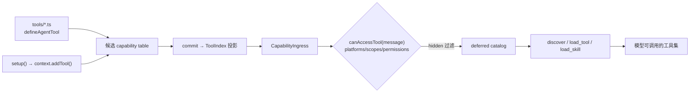

# Agent 工具与技能

想让模型替用户搜一首歌、查一次乐透推荐？把这段逻辑写成一个文件丢进 `tools/`，下一个 Agent turn 模型就能按名调用它。创作有两种形式：**`tools/*.ts` 文件约定**，以及按配置在 **`setup()` 中调用 `context.addTool()`**。两者都写入候选 generation 的同一份 capability table，commit 后由唯一 `ToolIndex` 发布；不存在第二个动态注册表。



## 路径一：`tools/*.ts` 约定

挂载 `@zhin.js/tool` Feature 后，插件包根目录的 `tools/`（不递归）下每个 `.ts` 文件默认导出 `defineAgentTool(...)`：

```ts
// tools/echo.ts（examples/minimal-bot）
import { defineAgentTool } from '@zhin.js/tool';
import { z } from 'zod';

export default defineAgentTool<{ message: string }>({
  description: 'Echo a message back',
  inputSchema: z.object({ message: z.string().min(1) }),
  async execute({ message }) {
    return `echo: ${message}`;
  },
});
```

定义字段（`packages/im/tool/src/definition.ts`）：

| 字段 | 必填 | 说明 |
| --- | --- | --- |
| `description` | 是 | 给模型看的功能描述 |
| `inputSchema` | 否 | zod object 或 JSON Schema，驱动参数校验与 catalog 展示 |
| `approval` | 否 | `'never' \| 'on-risk' \| 'always'`，默认 `'on-risk'` |
| `platforms` | 否 | 限定适配器平台（如 `['icqq']`），空 = 全部 |
| `scopes` | 否 | 限定会话场景 `'private' \| 'group' \| 'channel'`，空 = 全部 |
| `permissions` | 否 | permit 字符串列表（见下文准入） |
| `hidden` | 否 | 注册但不提供给模型（可按名调用） |
| `execute(input, context)` | 是 | `context` 是能力上下文（`config` / `use(token)` / `owner` / `generation`） |

文件名是 owner 内部的 local name。Agent turn 会把全树工具按 `qualifiedName` 暴露给模型：root 工具保持 local name，子插件工具由 owner 路径段与文件名以 `__` 连接（例如 `maps__get-weather`）。执行仍绑定原 owner 的固定 generation capability context，不通过调用方 owner 重新解析。

## 路径二：setup 条件式声明

需要按配置开关或已注入资源决定是否提供工具时，在 `setup()` 中直接调用 `context.addTool()`：

```ts
// plugins/utils/lottery/plugin.ts（节选）
import { definePlugin } from 'zhin.js/plugin-runtime';
import { defineAgentTool } from '@zhin.js/tool';

export default definePlugin({
  name: 'lottery',
  async setup(context) {
    if (!context.config.get().agentToolsEnabled) return;
    context.addTool('lottery_sync', defineAgentTool({
      description: 'Synchronize lottery draws',
      approval: 'always',
      inputSchema: { type: 'object', properties: {} },
      execute: async (_input, toolContext) => {
        const database = toolContext.use(lotteryDatabaseToken);
        return database.sync();
      },
    }));
  },
});
```

`addTool()` 只写 shadow generation；prepare 失败时从未可见，commit 后才随整代原子发布，无需手工注销。定义仍是同一个 `defineAgentTool()`：

```ts
context.addTool('lottery_sync', defineAgentTool({
  description: tool.description,
  inputSchema: tool.inputSchema,
  platforms: tool.platforms,
  scopes: tool.scopes,
  permissions: tool.permissions,
  hidden: tool.hidden,
  approval: 'never',
  execute: (input, context) => tool.execute(input, context),
}));
```

依赖应通过 `execute` 的 capability context 解析；不要在执行时调用插件定位器。这样工具始终绑定调用它的固定 generation lease。

## 统一准入：canAccessTool

两条路径注册的工具，每个 Agent turn 都会经 Core 的 `canAccessTool(tool, message)` 按消息上下文过滤——**一条谓词管两条路径**（`packages/im/core/src/built/tool.ts`；Plugin Runtime 侧经 `CapabilityIngress` 套用，见 `packages/im/agent/src/plugin-runtime/capability-ingress.ts`）。

四元组语义：

| 字段 | 判定 |
| --- | --- |
| `platforms` | 消息来源适配器名（`String(message.$adapter)`）不在列表内则拒绝 |
| `scopes` | 会话场景（`message.$channel.type`，缺省 `private`）不在列表内则拒绝 |
| `permissions` | permit 列表，逐条校验（AND）；单条括号内逗号为 OR |
| `hidden` | 不进入给模型的工具清单，但仍可按名执行 |

permit 语法（`packages/im/core/src/built/permit-parse.ts`）分三类：内建的 `adapter(name)`、`group(id,...)`、`private(id,...)`、`channel(id,...)`、`user(id,...)`、`role(master|trusted|user)`；平台身份 `platform(adapter,perm)`（如群 owner/admin，由适配器 checker 判定）；无法识别的 permit 一律拒绝。

## deferred catalog 与 load_tool

工具不进全量 prompt。每个 turn 先把通过准入的工具建成 **catalog**，并创建独占的 deferred controller（`packages/im/agent/src/tool-catalog/deferred-turn-controller.ts`）；默认只对模型暴露 `alwaysLoadedTools`。其余工具由 controller 为本 turn 创建的三个 meta 工具按需发现与加载：`discover` 按 query 搜索工具/技能（可按 MCP server 过滤），返回名称加简介；`load_tool` 按名加载工具 schema；`load_skill` 加载技能完整指令并解锁其关联工具。并发 turn 和 subagent 使用彼此隔离的 controller，不以 IM `Message` 作为状态键。

加载状态按会话持久化（`DeferredToolSessionSnapshot`），有上限逐出。配置键 `deferredTools`（`ZhinAgentConfig`）：

| 键 | 默认 | 说明 |
| --- | --- | --- |
| `maxLoadedPerSession` | `12` | 每会话最多加载的工具数 |
| `discoverTopK` | `5` | `discover` 返回条数 |
| `alwaysLoadedTools` | `['ask_user', 'spawn_task', 'discover', 'load_tool', 'load_skill']` | 始终对模型可见 |
| `mcpServers` | `{}` | 按 MCP server 覆盖 `alwaysLoaded` 名单 |

Anthropic SDK 通道会把未加载工具以 `deferLoading` 标记下发；其它通道只下发已加载集合。

`ask_user` 是框架提供的 generation-owned ToolFeature，不是 Plugin Prompt/middleware。
它通过当前 Turn 的 `QuestionPort` 请求输入，并按 canonical session 与认证主体匹配回复；
插件工具若需要同类交互，应依赖 `ToolExecutionContext.question`，且必须处理端口缺失。
unattended Turn（例如 Schedule）不会注入该端口，不能回退到全局 Message、Adapter 或用户队列。

## skills 与 agents/*.agent.md

技能与命名 Agent 也是文件约定，分别由 `@zhin.js/skill` 与 `@zhin.js/agent-feature` 两个 Feature 发现。

技能放在 `skills/<name>/SKILL.md`（每个子目录一个技能）：正文即给模型的指令，第一个 Markdown 标题行作为描述，`load_skill` 加载后解锁 `toolNames` 关联的工具。命名 Agent 是 `agents/<name>.agent.md`（文件名必须小写 kebab，如 `agents/planner.agent.md`）：整份 Markdown 是该 Agent 的 instructions，首个标题行作为描述。真实示例见 `examples/test-bot/agents/planner.agent.md`。

```markdown
<!-- agents/planner.agent.md -->
# planner

You are **planner** (协调者): break down user goals, define acceptance
criteria, and coordinate specialist roles.
```

### 插件 `agent/` 目录（另一种组织方式）

装了 `@zhin.js/agent` 的插件还可以用 `agent/` 目录集中声明 AI 面（`packages/im/agent/src/discovery/agent-surface.ts` 扫描）：

```text
my-plugin/
├── agent/
│   ├── agent.ts           # defineAgent：描述、关键词、toolNames、systemPrompt
│   ├── instructions.md    # 系统提示正文
│   ├── tools/*.ts         # defineAgentTool（来自 '@zhin.js/agent/tools'）
│   ├── skills/*.{md,ts}   # .md 可带 frontmatter（description / tools / always）
│   └── subagents/<name>/  # 递归同构的子 Agent
```

与 `@zhin.js/tool` 的 `defineAgentTool` 区别：`@zhin.js/agent/tools` 版本的 `execute(input, ctx)` 第二参是 `{ pluginName, runtimeName, filePath }` 上下文，`approval` 支持 `'always' | 'once' | 'never'` 或自定义谓词，且可配 `toModelOutput` 塑形回传模型的文本。真实示例：`plugins/utils/short-url/agent/tools/short_url.ts`。

```ts
// agent/tools/short_url.ts（plugins/utils/short-url，节选）
import { defineAgentTool } from '@zhin.js/agent/tools';
import { z } from 'zod';

export default defineAgentTool<{ url: string }>({
  description: '缩短一个 URL，返回短链接',
  inputSchema: z.object({ url: z.string().min(1) }),
  keywords: ['短链', '缩短', 'shorten'],
  async execute({ url }) {
    // …
  },
});
```

## Custom Prompt Sections

Plugins can extend the Agent's system prompt by defining custom prompt sections in the `agent/prompt-sections/` convention directory.

### Defining a prompt section

Create a TypeScript file that default-exports a `defineAgentPromptSection()` call:

```typescript
// agent/prompt-sections/my-context.ts
import { defineAgentPromptSection } from '@zhin.js/agent';

export default defineAgentPromptSection({
  id: 'my-plugin:context',
  title: 'My Plugin Context',
  content: 'Rules and context for my plugin...',
  priority: 75,
  truncatable: true,
  maxChars: 1000,
});
```

| Field | Type | Default | Description |
| --- | --- | --- | --- |
| `id` | `string` | — | 唯一标识符（建议格式：`plugin-name:section-name`） |
| `title` | `string` | — | 节点标题 |
| `content` | `string` | — | 提示词内容 |
| `priority` | `number` | `50` | 数字越大，排序越靠前 |
| `truncatable` | `boolean` | `true` | 是否允许在预算不足时截断 |
| `maxChars` | `number` | `undefined` | 单节点最大字符数 |
| `layer` | `string` | `'plugin'` | 层级标记（仅用于分类） |

### Auto-discovery

The sections are discovered automatically when the Agent starts. No registration code is needed in your plugin — just place the file under `agent/prompt-sections/` and Zhin.js will pick it up.

You can also call the discovery functions directly when integrating into a custom Agent setup:

```typescript
import { bootstrapPromptSections, PromptAssemblyRegistry } from '@zhin.js/agent';

const registry = new PromptAssemblyRegistry();
await bootstrapPromptSections(ctx, registry);
```

A real example is available at `examples/full-bot/agent/prompt-sections/custom.ts`.
