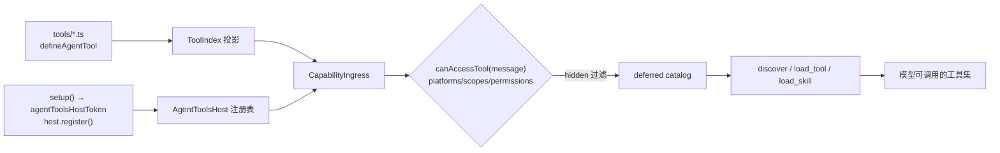

# Agent 工具与技能

想让模型替用户搜一首歌、查一次乐透推荐？把这段逻辑写成一个文件丢进 `tools/`，下一个 Agent turn 模型就能按名调用它。注册有两条路径：**`tools/*.ts` 文件约定**（声明式，随插件树继承）与 **`setup()` 动态注册**（命令式，按代际挂载），两条路径共用同一条准入谓词和同一份 deferred catalog。



## 路径一：`tools/*.ts` 约定

挂载 `@zhin.js/tool` Feature 后，插件包根目录的 `tools/`（不递归）下每个 `.ts` 文件默认导出 `defineAgentTool(...)`：

```ts
// tools/echo.ts（examples/minimal-bot）
import { defineAgentTool } from '@zhin.js/tool';
import { z } from 'zod';

export default defineAgentTool<{ message: string }>({
  description: 'Echo a message back',
  inputSchema: z.object({ message: z.string().min(1) }),
  async execute({ message }) {
    return `echo: ${message}`;
  },
});
```

定义字段（`packages/im/tool/src/definition.ts`）：

| 字段 | 必填 | 说明 |
| --- | --- | --- |
| `description` | 是 | 给模型看的功能描述 |
| `inputSchema` | 否 | zod object 或 JSON Schema，驱动参数校验与 catalog 展示 |
| `approval` | 否 | `'never' \| 'on-risk' \| 'always'`，默认 `'on-risk'` |
| `platforms` | 否 | 限定适配器平台（如 `['icqq']`），空 = 全部 |
| `scopes` | 否 | 限定会话场景 `'private' \| 'group' \| 'channel'`，空 = 全部 |
| `permissions` | 否 | permit 字符串列表（见下文准入） |
| `hidden` | 否 | 注册但不提供给模型（可按名调用） |
| `execute(input, context)` | 是 | `context` 是能力上下文（`config` / `use(token)` / `owner` / `generation`） |

工具名即文件名——对模型暴露的就是这个名字，注意跨插件唯一；子插件可以看到并覆盖父插件的同名工具（沿插件树向上解析）。描述符上另有 `qualifiedName`（owner 路径段与文件名以 `__` 连接）用于消歧。

## 路径二：setup 动态注册

需要按运行期条件（配置开关、数据库句柄）决定注册哪些工具时，在 `setup()` 里通过 `agentToolsHostToken`（`@zhin.js/plugin-runtime` 导出）拿到 `AgentToolsHost`：

```ts
// plugins/utils/lottery/plugin.ts（节选）
import { definePlugin, agentToolsHostToken } from '@zhin.js/plugin-runtime';

export default definePlugin({
  name: 'lottery',
  async setup(context) {
    // AI 未安装/未启用时 Host 不存在，必须先 has() 守卫
    if (context.resources.has(agentToolsHostToken)) {
      const agentTools = context.resources.use(agentToolsHostToken);
      const { registerLotteryAgentTools } = await import('./agent/runtime-tools.js');
      context.lifecycle.add(registerLotteryAgentTools(agentTools));
    }
  },
});
```

`host.register(tool)` 按**当前代际**注册并返回注销函数；挂到 `context.lifecycle` 即可随代际自动清理。注册项（`AgentToolRegistration`）：

```ts
host.register({
  name: 'lottery_sync',          // 暴露给模型的运行名
  description: tool.description,
  inputSchema: tool.inputSchema, // zod object 或 JSON Schema
  source: 'lottery',             // 来源标签（诊断用）
  platforms: tool.platforms,     // 四元组同路径一
  scopes: tool.scopes,
  permissions: tool.permissions,
  hidden: tool.hidden,
  approval: 'never',             // 'never' | 'always'，与 ExecPolicy 叠加
  execute: (input) => tool.execute(input, { pluginName: 'lottery', runtimeName: name }),
});
```

注意：`execute` 闭包在 `setup()` 时捕获依赖，**不要在闭包里调用插件定位器**（如 `getPlugin()`）——运行期路径禁止动态取插件。

## 统一准入：canAccessTool

两条路径注册的工具，每个 Agent turn 都会经 Core 的 `canAccessTool(tool, message)` 按消息上下文过滤——**一条谓词管两条路径**（`packages/im/core/src/built/tool.ts`；Plugin Runtime 侧经 `CapabilityIngress` 套用，见 `packages/im/agent/src/plugin-runtime/capability-ingress.ts`）。

四元组语义：

| 字段 | 判定 |
| --- | --- |
| `platforms` | 消息来源适配器名（`String(message.$adapter)`）不在列表内则拒绝 |
| `scopes` | 会话场景（`message.$channel.type`，缺省 `private`）不在列表内则拒绝 |
| `permissions` | permit 列表，逐条校验（AND）；单条括号内逗号为 OR |
| `hidden` | 不进入给模型的工具清单，但仍可按名执行 |

permit 语法（`packages/im/core/src/built/permit-parse.ts`）分三类：内建的 `adapter(name)`、`group(id,...)`、`private(id,...)`、`channel(id,...)`、`user(id,...)`、`role(master|trusted|user)`；平台身份 `platform(adapter,perm)`（如群 owner/admin，由适配器 checker 判定）；无法识别的 permit 一律拒绝。

## deferred catalog 与 load_tool

工具不进全量 prompt。每个 turn 先把通过准入的工具建成 **catalog**，默认只对模型暴露 `alwaysLoadedTools`；其余工具由三个 meta 工具按需发现与加载（`packages/im/agent/src/builtin/deferred-tool-meta.ts`）：`discover` 按 query 搜索工具/技能（可按 MCP server 过滤），返回名称加简介；`load_tool` 按名把工具 schema 加载进会话，之后即可调用；`load_skill` 加载技能完整指令并解锁其关联工具。

加载状态按会话持久化（`DeferredToolSessionSnapshot`），有上限逐出。配置键 `deferredTools`（`ZhinAgentConfig`）：

| 键 | 默认 | 说明 |
| --- | --- | --- |
| `maxLoadedPerSession` | `12` | 每会话最多加载的工具数 |
| `discoverTopK` | `5` | `discover` 返回条数 |
| `alwaysLoadedTools` | `['ask_user', 'spawn_task', 'discover', 'load_tool', 'load_skill']` | 始终对模型可见 |
| `mcpServers` | `{}` | 按 MCP server 覆盖 `alwaysLoaded` 名单 |

Anthropic SDK 通道会把未加载工具以 `deferLoading` 标记下发；其它通道只下发已加载集合。

## skills 与 agents/*.agent.md

技能与命名 Agent 也是文件约定，分别由 `@zhin.js/skill` 与 `@zhin.js/agent-feature` 两个 Feature 发现。

技能放在 `skills/<name>/SKILL.md`（每个子目录一个技能）：正文即给模型的指令，第一个 Markdown 标题行作为描述，`load_skill` 加载后解锁 `toolNames` 关联的工具。命名 Agent 是 `agents/<name>.agent.md`（文件名必须小写 kebab，如 `agents/planner.agent.md`）：整份 Markdown 是该 Agent 的 instructions，首个标题行作为描述。真实示例见 `examples/test-bot/agents/planner.agent.md`。

```markdown
<!-- agents/planner.agent.md -->
# planner

You are **planner** (协调者): break down user goals, define acceptance
criteria, and coordinate specialist roles.
```

### 插件 `agent/` 目录（另一种组织方式）

装了 `@zhin.js/agent` 的插件还可以用 `agent/` 目录集中声明 AI 面（`packages/im/agent/src/discovery/agent-surface.ts` 扫描）：

```text
my-plugin/
├── agent/
│   ├── agent.ts           # defineAgent：描述、关键词、toolNames、systemPrompt
│   ├── instructions.md    # 系统提示正文
│   ├── tools/*.ts         # defineAgentTool（来自 '@zhin.js/agent/tools'）
│   ├── skills/*.{md,ts}   # .md 可带 frontmatter（description / tools / always）
│   └── subagents/<name>/  # 递归同构的子 Agent
```

与 `@zhin.js/tool` 的 `defineAgentTool` 区别：`@zhin.js/agent/tools` 版本的 `execute(input, ctx)` 第二参是 `{ pluginName, runtimeName, filePath }` 上下文，`approval` 支持 `'always' | 'once' | 'never'` 或自定义谓词，且可配 `toModelOutput` 塑形回传模型的文本。真实示例：`plugins/utils/short-url/agent/tools/short_url.ts`。

```ts
// agent/tools/short_url.ts（plugins/utils/short-url，节选）
import { defineAgentTool } from '@zhin.js/agent/tools';
import { z } from 'zod';

export default defineAgentTool<{ url: string }>({
  description: '缩短一个 URL，返回短链接',
  inputSchema: z.object({ url: z.string().min(1) }),
  keywords: ['短链', '缩短', 'shorten'],
  async execute({ url }) {
    // …
  },
});
```
