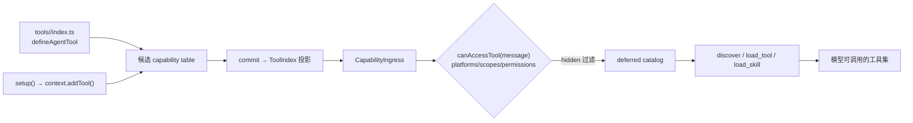

# Agent 工具与技能

想让模型替用户搜一首歌、查一次乐透推荐？先按披露范围选择 Tool 的目录。创作入口会写入候选 generation 的同一份 capability table，commit 后由唯一 `ToolIndex` 发布；不存在第二个动态注册表。

| 目录 | 归属 | 模型披露时机 |
| --- | --- | --- |
| `tools/<name>/index.ts` | 插件通用 Tool | 插件启用后进入公共 deferred catalog |
| `agents/<agent>/tools/<name>/index.ts` | Agent 专用 Tool | 选择该 Agent 后进入能力集 |
| `skills/<skill>/tools/<name>/index.ts` | Skill 专用 Tool | `load_skill` 激活该 Skill 后解锁 |
| `agents/<agent>/skills/<skill>/tools/<name>/index.ts` | Agent 内 Skill 专用 Tool | 选择 Agent 且激活其 Skill 后解锁 |

插件初始只向模型披露根 `tools/` 与根 `skills/`、`agents/` 的摘要。私有 Tool definition 会在 generation prepare 阶段统一校验，但不会提前进入模型 Tool catalog；这样既能在启动时发现无效能力，也不会用未激活能力占用提示词。

根 `tools/` 只用于跨任务、高频、无需额外领域说明的能力。只在某个平台、工作流或角色中成立的 Tool 必须归入对应 Skill 或 Agent。一个 Skill 若包含多个可以独立触发的任务域，也应继续拆分，避免加载一个简单查询时同时披露整个平台的所有 Tool Schema。

适配器提供的 Skill 应归入 `agents/<platform>/skills/<name>/`。平台 Agent 在对应 IM 平台入站时自动选中，其他平台回合不会看到它的私有 Skill 摘要；同一平台声明多个自动候选 Agent 会在路由时报出冲突，必须合并职责或由用户显式选择。



## 路径一：目录约定

挂载 `@zhin.js/tool` Feature 后，四种 Tool 目录中的 `index.ts` 会被发现，并默认导出 `defineAgentTool(...)`。辅助模块可放在同一命名目录内：

Tool 专属 handler、schema 和格式化逻辑应放在所属 Tool 或 Skill 目录；同一 Skill 的多个 Tool
共用实现可放在 Skill 根目录，例如 `skills/github-account/handlers.ts`。叶子 `index.ts` 只声明
Tool 并调用同目录能力，不应通过 `../../../../src/...` 获取插件内部实现。确实由多个能力共享的
运行态契约应形成稳定包 API，或由所属 Skill/Agent 的一个局部桥接模块集中接入。

```ts
// tools/echo/index.ts
import { defineAgentTool } from '@zhin.js/tool';
import { z } from 'zod';

export default defineAgentTool<{ message: string }>({
  description: 'Echo a message back',
  inputSchema: z.object({ message: z.string().min(1) }),
  async execute({ message }) {
    return `echo: ${message}`;
  },
});
```

定义字段（`packages/im/tool/src/definition.ts`）：

| 字段 | 必填 | 说明 |
| --- | --- | --- |
| `description` | 是 | 给模型看的功能描述 |
| `inputSchema` | 否 | Zod 4 object 或根节点为 `object` 的 JSON Schema；由 Tool Feature 统一投影并在执行前校验 |
| `requiresApproval` | 否 | Tool 何时需要审批：`'never' \| 'on-risk' \| 'once' \| 'always'`，默认 `'on-risk'` |
| `platforms` | 否 | 限定适配器平台（如 `['icqq']`），空 = 全部 |
| `scopes` | 否 | 限定会话场景 `'private' \| 'group' \| 'channel'`，空 = 全部 |
| `permissions` | 否 | permit 字符串列表（见下文准入） |
| `hidden` | 否 | 注册但不提供给模型（可按名调用） |
| `execute(input, context)` | 是 | `context` 是能力上下文（`config` / `use(token)` / `owner` / `generation`） |

命名目录是 owner 内部的 local name。Agent turn 会把全树工具按 `qualifiedName` 暴露给模型：root 工具保持 local name，子插件工具由 owner 路径段与目录名以 `__` 连接（例如 `maps__get-weather`）。执行仍绑定原 owner 的固定 generation capability context，不通过调用方 owner 重新解析。

## 路径二：setup 条件式声明

需要按配置开关或已注入资源决定是否提供工具时，在 `setup()` 中直接调用 `context.addTool()`：

```ts
// plugins/utils/lottery/plugin.ts（节选）
import { definePlugin } from 'zhin.js';
import { defineAgentTool } from '@zhin.js/tool';

export default definePlugin({
  name: 'lottery',
  async setup(context) {
    if (!context.config.get().agentToolsEnabled) return;
    context.addTool('lottery_sync', defineAgentTool({
      description: 'Synchronize lottery draws',
      requiresApproval: 'always',
      inputSchema: { type: 'object', properties: {} },
      execute: async (_input, toolContext) => {
        const database = toolContext.use(lotteryDatabaseToken);
        return database.sync();
      },
    }));
  },
});
```

`addTool()` 只写 shadow generation；prepare 失败时从未可见，commit 后才随整代原子发布，无需手工注销。定义仍是同一个 `defineAgentTool()`：

```ts
context.addTool('lottery_sync', defineAgentTool({
  description: tool.description,
  inputSchema: tool.inputSchema,
  platforms: tool.platforms,
  scopes: tool.scopes,
  permissions: tool.permissions,
  hidden: tool.hidden,
  requiresApproval: 'never',
  execute: (input, context) => tool.execute(input, context),
}));
```

依赖应通过 `execute` 的 capability context 解析；不要在执行时调用插件定位器。这样工具始终绑定调用它的固定 generation lease。

## 统一准入：canAccessTool

两条路径注册的工具，每个 Agent turn 都会经 Core 的 `canAccessTool(tool, message)` 按消息上下文过滤——**一条谓词管两条路径**（`packages/im/core/src/built/tool.ts`；Plugin Runtime 侧经 `CapabilityIngress` 套用，见 `packages/im/agent/src/plugin-runtime/capability-ingress.ts`）。

四元组语义：

| 字段 | 判定 |
| --- | --- |
| `platforms` | 消息来源适配器名（`String(message.$adapter)`）不在列表内则拒绝 |
| `scopes` | 会话场景（`message.$channel.type`，缺省 `private`）不在列表内则拒绝 |
| `permissions` | permit 列表，逐条校验（AND）；单条括号内逗号为 OR |
| `hidden` | 不进入给模型的工具清单，但仍可按名执行 |

permit 语法由 `@zhin.js/permission` 统一定义（`packages/im/permission/src/builtin.ts`）：内建的 `adapter(name)`、`group(id,...)`、`private(id,...)`、`channel(id,...)`、`user(id,...)`、`role(master|trusted|user)`；平台身份 `platform(adapter,perm)`（如群 owner/admin，由适配器 checker 判定）；无法识别的 permit 一律拒绝。

`requiresApproval` 在 Tool 通过上述准入后、执行之前判定。`always` 每次确认；`once` 可由标准 Host 在当前会话记住该 Tool；`on-risk` 对未知插件操作保持确认，但 `bash`、文件和网络工具在专用策略已经验证具体命令、路径或 URL 后不重复确认。`never` 只跳过声明式确认，不能绕过权限、网络、文件系统、Shell 或代际策略。

## deferred catalog 与 load_tool

工具不进全量 prompt。每个 turn 先把通过准入的工具建成 **catalog**，并创建独占的 deferred controller（`packages/im/agent/src/tool-catalog/deferred-turn-controller.ts`）；默认只对模型暴露 `alwaysLoadedTools`。其余工具由 controller 为本 turn 创建的三个 meta 工具按需发现与加载：`discover` 按 query 搜索工具/技能（可按 MCP server 过滤），返回名称加简介；`load_tool` 按名加载工具 schema；`load_skill` 加载技能完整指令并解锁其关联工具。并发 turn 和 subagent 使用彼此隔离的 controller，不以 IM `Message` 作为状态键。

加载状态按会话持久化（`DeferredToolSessionSnapshot`），有上限逐出。配置键 `deferredTools`（`ZhinAgentConfig`）：

| 键 | 默认 | 说明 |
| --- | --- | --- |
| `maxLoadedPerSession` | `12` | 每会话最多加载的工具数 |
| `discoverTopK` | `5` | `discover` 返回条数 |
| `alwaysLoadedTools` | `['ask_user', 'spawn_task', 'discover', 'load_tool', 'load_skill']` | 始终对模型可见 |
| `mcpServers` | `{}` | 按 MCP server 覆盖 `alwaysLoaded` 名单 |

Anthropic SDK 通道会把未加载工具以 `deferLoading` 标记下发；其它通道只下发已加载集合。

`ask_user` 是框架提供的 generation-owned Tool capability，不是 Plugin Prompt/middleware。
它通过当前 Turn 的 `QuestionPort` 请求输入，并按 canonical session 与认证主体匹配回复；
插件工具若需要同类交互，应依赖 `ToolExecutionContext.question`，且必须处理端口缺失。
unattended Turn（例如 Schedule）不会注入该端口，不能回退到全局 Message、Adapter 或用户队列。

## Skills、主 Agent 与子 Agent

Skill 使用 `skills/<name>/SKILL.md`。主 Agent 使用插件根目录的标准 `AGENTS.md`。命名子 Agent 使用 `agents/<name>/` 自包含目录，由 `@zhin.js/agent-feature` 发现。

子 Agent 的 `agent.json`、`system.md`、`boundaries.md`、`conventions.md` 缺一不可；`workflows/`、`tools/`、`skills/`、`hooks/`、`knowledge/` 可按需增加。`conventions.md` 必须延伸根 `AGENTS.md`，不能与其冲突。重复出现的错误应固化到该文件。完整 manifest 和目录契约见 [`@zhin.js/agent-feature`](../../packages/im/agent-feature/README.md)。

`agent.json` 的 `tools` 可声明额外公共 Tool；`agents/<agent>/tools/<name>/index.ts` 会自动成为该 Agent 的私有 Tool。Skill 的私有 Tool 使用 `skills/<skill>/tools/<name>/index.ts`；Agent 私有 Skill 及其 Tool 使用 `agents/<agent>/skills/<skill>/SKILL.md` 和其下的 `tools/<name>/index.ts`。所有 Tool 仍经过统一的权限、审批和 generation 准入。

## 插件 Agent 创作目录

```text
my-plugin/
├── AGENTS.md
├── tools/
│   └── short-url/
│       ├── index.ts
│       └── client.ts
├── skills/short-url/
│   ├── SKILL.md
│   ├── tools/normalize/index.ts
│   └── hooks/audit/index.ts
├── hooks/audit/index.ts
└── agents/reviewer/
    ├── agent.json
    ├── system.md
    ├── boundaries.md
    ├── conventions.md
    ├── workflows/
    ├── tools/check-result/index.ts
    ├── skills/review/
    │   ├── SKILL.md
    │   ├── tools/check-result/index.ts
    │   └── hooks/audit/index.ts
    ├── hooks/audit/index.ts
    └── knowledge/
```

`tools/<name>/index.ts` 与 `setup()` 中的 `addTool()` 使用同一个 `AgentToolDefinition`、`ToolExecutionContext` 和 `ToolIndex`。执行上下文提供固定 generation 的 `config`、`use(token)`、`origin`、`principal`、`policy`、`question` 与按 adapter 推断的 `$client`。

## 让插件给 Agent 补充上下文

当插件需要 Agent 理解业务术语、输出规范或工具使用约束时，用 Prompt Section 声明这些上下文。它属于插件能力，会跟随 Runtime generation 原子发布：热更失败不会泄漏半成品，已开始的回合继续使用启动时的版本。

### 1. 挂载 Prompt Section Feature

项目需同时声明依赖和 Feature：

```json
{
  "dependencies": {
    "@zhin.js/prompt-section": "latest"
  },
  "zhin": {
    "features": [
      { "package": "@zhin.js/prompt-section", "api": "^1.0.0" }
    ]
  }
}
```

### 2. 声明一段上下文

在插件根目录创建 `prompt-sections/project-rules/index.ts`：

```ts
import { defineAgentPromptSection } from '@zhin.js/prompt-section';

export default defineAgentPromptSection({
  title: 'Project rules',
  content: 'Answer with repository-local terminology and cite changed files.',
  layer: 'context',
  order: 70,
  retention: 'preferred',
  maxChars: 1000,
  profiles: ['interactive'],
});
```

一级目录名是本地名称；Zhin 会与插件 owner 组合成全局唯一身份，不需要手写 `id`。`order` 只决定呈现顺序；`retention` 决定预算不足时的保留策略，两者不再混成一个“优先级”。

| 字段 | 含义 |
| --- | --- |
| `layer` | 用于表达 `role` / `task` / `context` / `safety` 等语义分层 |
| `order` | 数字越大，在同一层中越靠前 |
| `retention` | `required` 不可静默丢失；`preferred` 优先保留；`opportunistic` 先让出预算 |
| `maxChars` | 这一段可使用的字符上限 |
| `profiles` | 选择 `interactive`、`schedule` 或两者 |
| `platforms` | 可选；仅在指定 IM 平台的回合中注入，例如 `['github']` |

`required` 内容放不下时，回合会明确失败，而不是在未告知的情况下截断安全策略。总预算由 `ai.agent.systemPromptMaxChars` 控制。

### 3. 验证已生效的版本

启动后在 Console 的能力目录查看 **Prompt Sections**，可确认 owner、来源、generation、profile 和预算策略。目录不返回提示词正文，因为其中可能包含内部产品策略。可运行示例见 `examples/full-bot/prompt-sections/custom/index.ts`。

Prompt Section 只影响模型上下文，**不会授予工具、数据或审批权限**。权限仍必须由 Tool Feature、Runtime resource 和 Host 策略提供。
