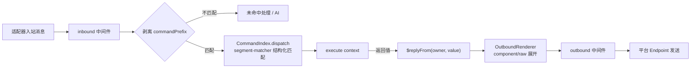

# 命令（defineCommand）

在插件包根目录建一个 `commands/` 目录、往里放一个 `hello.ts`，用户就能在群里敲 `hello` 触发它——**文件路径即命令名**，改完文件热重载立即生效，不用重启进程。这条链路由 `@zhin.js/command` Feature 提供，无需手工注册。

```ts
// commands/hello.ts
import { defineCommand } from '@zhin.js/command';

export default defineCommand({
  description: '打个招呼',
  execute: () => 'Hello from zhin.',
});
```

单文件 Bot 可以在插件入口注册同一个 definition：

```ts
import { definePlugin } from '@zhin.js/plugin-runtime';

export default definePlugin({
  name: 'my-bot',
  setup({ addCommand }) {
    addCommand('hello', defineCommand({
      description: '打个招呼',
      execute: () => 'Hello from one file.',
    }));
  },
});
```

`addCommand` 与目录发现共用 `CommandIndex`、清单、冲突检测和 generation 生命周期。
当命令变多时，把 definition 移到 `commands/hello.ts` 默认导出即可；目录模式还能把
HMR 粒度缩小到单个命令文件。

## 文件路由

命令名 = 插件树路径段（instanceKey，去掉 root，`.` 连接）+ `.` + 文件相对路径段（空格连接）。Root 插件（应用自身）没有前缀。

| 文件 | 所属插件 | 命令名 |
| --- | --- | --- |
| `commands/hello.ts` | root | `hello` |
| `commands/endpoint/list.ts` | `qq` | `qq.endpoint list` |
| `commands/endpoint/add/[[name]].ts` | `qq` | `qq.endpoint add [name]` |
| `commands/foo.ts` | `b` 下的 `a`（`root/b/a`） | `b.a.foo` |

先看嵌套：`commands/` 递归扫描，嵌套目录直接映射为子命令段，目录与文件名必须是小写 kebab 风格（`/^[a-z0-9][a-z0-9-]*$/`）。

动态参数段用 Next.js 风格文件名声明形态，且必须是路径的最后一段；**类型与默认值不写进文件名**，统一在 `defineCommand({ params })` 里声明——`params.<name>.type` 必填，`default` 可选：

| 文件名 | 形态 | 帮助显示 | params 声明 |
| --- | --- | --- | --- |
| `[name].ts` | 必需参数 | `<name>` | `params: { name: { type: 'string' } }` |
| `[[name]].ts` | 可选参数 | `[name]` | `params: { name: { type: 'string', default: '' } }` |
| `[...name].ts` | 捕获所有（消费剩余全部输入） | `<...name>` | `params: { name: { type: 'text' } }`，运行时 `params.name` 为数组 |
| `[[...name]].ts` | 可选捕获所有 | `[...name]` | 同上，未提供时为空数组 |

一致性在启动期校验：有 `default` 时文件名必须用双方括号（`[[name]]`），文件名声明了参数形态但 `params` 里缺对应声明，都会抛 `CommandPathSyntaxError`。

**子插件约束：命令路径首段必须是静态段**。子插件的命令名由插件路径自动加前缀（如 `remind.add`），动态参数只能是路径的最后一段且至多一个——因此 `commands/[note].ts` 在 root 插件可用，在子插件会在启动期抛 `Invalid Command path`（首段没有静态段可依附）。子插件的动态参数一律放进静态目录：`commands/add/[note].ts`（命令名 `remind.add <note>`）。

捕获所有的数组元素粒度由 `params.<name>.type` 决定：`text` 逐消息段收集（纯文本输入整体为一个元素）；`word` / `string` 按空白逐词切分；`number` / `integer` / `float` / `boolean` 逐词切分后逐个转换，任一词转换失败即视为命令不匹配；`mention` / `image` 等结构化类型逐消息段收集。

| 参数类别 | 支持的 type | 匹配结果 |
| --- | --- | --- |
| 文本 | `string` / `word` / `text` | 字符串；`text` 可消费连续文本 |
| 数值 | `number` / `integer` / `float` | 有限数值；`integer` 要求整数，`float` 要求小数 |
| 布尔 | `boolean` | `true` / `false` |
| IM 段 | `mention` / `image` / `face` / `reply` / `forward` / `dice` / `rps` | canonical segment 对应字段 |

结构化 IM 参数不支持默认值。运行时由 `segment-matcher` 直接在 canonical segments
上匹配，不会先把 image、mention 等降级成文本；类型不匹配在派发时视为「命令不匹配」。

路由冲突有两条规则：**静态优先**——`list.ts` 永远赢过 `[name].ts`，动态路由之间静态段多者（更具体）优先；**同形拒绝**——同一路由形状重复注册会在启动时报错（`Duplicate runtime Command`）。

真实示例（`plugins/adapters/qq/commands/endpoint/remove/[name].ts`，命令定义由[endpoint 管理命令套件](#适配器-endpoint-管理命令套件)生成）：

```ts
import { qqEndpointCommands } from '../../../src/qq-endpoint-commands.js';

export default qqEndpointCommands.remove;
```

## execute 上下文

`execute(context)` 收到一个冻结的 `CommandContext`：

| 字段 | 类型 | 说明 |
| --- | --- | --- |
| `args` | `readonly string[]` | 命令名匹配之后剩余的词（按空白切分） |
| `params` | `Record<string, CommandParameterValue>` | 动态参数段解析后的类型化值；结构化参数可为媒体对象 |
| `segments` | `readonly CommandSegment[]` | 命令模式消费后剩余的结构化段；保留媒体、mention 等非文本信息 |
| `config` | `Readonly<TConfig>` | 本插件的配置快照（来自 `zhin.config.yml`） |
| `input` | `TInput \| undefined` | 调用来源；IM 派发时为 Runtime `Message`（满足 `CommandMessage`），Host / `execute(name)` 可能缺省 |
| `adapter` | `string \| undefined` | 适配器插件实例 id（如 `root/icqq`） |
| `endpoint` | `string \| undefined` | Endpoint 名（`metadata.endpoint`） |
| `scene` | `CommandScene \| undefined` | `{ id, type, name? }`；优先上游结构化字段，否则从 `target` / metadata 解析 |
| `sender` | `CommandSender \| undefined` | `{ id, name?, role: string[] }`；`role` 含平台身份与框架角色 |
| `use(token)` | `<T>(token: Token<T>) => T` | 取 Plugin Runtime 资源（见下） |
| `owner` | `PluginNodeSnapshot` | 命令所属插件节点 |
| `generation` | `number` | 当前代际号 |

`TInput` 默认约束为 `CommandMessage`（命令侧消息契约）。因架构分层 `@zhin.js/command` 不能 import `@zhin.js/core`，故独立声明；Runtime `Message` 结构兼容。

```ts
export default defineCommand({
  description: '谁在哪',
  execute: ({ adapter, endpoint, scene, sender }) =>
    `${sender?.name ?? sender?.id} @ ${scene?.type}:${scene?.id} via ${adapter}/${endpoint} roles=${sender?.role.join(',')}`,
});
```

`use(token)` 读的是插件 `setup()` 时 `resources.provide(...)` 注册的资源，缺失时抛错。上面的 QQ 命令用 `use(qqRuntimeStateToken)` 拿到适配器共享状态——这是命令与适配器协作的标准方式。

## 返回值与组件渲染

`execute` 的返回值（或 `Promise` 解出的值）即回复内容，类型为 `SendContent`。它可以是字符串（直接作为文本回复）、`component(name, props)`（调用[组件](./middleware-components.md#definecomponent)渲染，`zhin.js/core/runtime` 导出）、`raw(payload)`（原样下线的 wire 段，如 `{ type: 'html', data: { html, width } }`），也可以是这三者组成的**数组**表示多段消息。返回 `undefined` 则不回复——命令自己已通过 `input.$reply(...)` 回复，或主动静默。

IM 入站的完整链路：



派发时按确定性优先级尝试已编译的命令模式：静态命令先于动态命令，动态命令中更具体的
路径优先。命中后，剩余文本按空白切分进入 `args`，完整富消息尾部保留在 `segments`。
因此 `qq.endpoint remove mybot` 会命中 `qq.endpoint remove <name>`，`args` 为空、
`params.name === 'mybot'`。

结构化参数示例：

```ts
// commands/upload/[asset].ts
import { defineCommand } from '@zhin.js/command';

export default defineCommand({
  params: {
    asset: { type: 'image', description: '要上传的图片' },
  },
  execute: ({ params, args, segments }) => ({
    uploaded: params.asset,
    captionWords: args,
    remainingSegments: segments,
  }),
});
```

当消息由文本 `upload `、image 段和 caption 文本组成时，`params.asset` 是 image 的
`MediaRef`，caption 同时以 `args` 文本兼容视图和 `segments` 结构化视图提供。

## master / trusted 权限模式

框架层发送者角色为三档：`user` → `trusted` → `master`（`master` 隐含 `trusted`）。角色由适配器实例配置解析：

```yaml
# zhin.config.yml
plugins:
  qq:
    master: '10001'        # 顶层 master（endpoint owner）
    endpoints:
      - name: main
        appid: ${QQ_APPID}
        master: '10001'    # endpoints[i] 可逐项覆盖
```

`master` / `trusted` 名单由 Core 的角色解析读取（`resolveSenderRoles`，`packages/im/core/src/built/ai-trigger.ts`），`role(master)`、`role(trusted)` 这类 permit 以及 [Agent 工具](./agent-tools.md)的 `permissions` 都基于同一套角色。

命令自身不内置权限声明，权限判断写在 `execute` 里。以 endpoint 管理命令的通用判定为例（`isEndpointOperator`，`packages/im/adapter/src/endpoint-commands.ts`）：

```ts
export function isEndpointOperator(config: unknown, input: unknown): boolean {
  const cfg = (config ?? {}) as { master?: unknown; endpoints?: unknown };
  const masters = new Set<string>();
  // 收集顶层 master 与各 endpoints[i].master …
  if (masters.size === 0) return true; // 未配置 master 时放行
  const sender = String((input as { sender?: unknown } | null)?.sender ?? '').trim();
  return !!sender && masters.has(sender);
}
```

这个模式的要点：用 `config`（插件配置）拿到声明的 `master` 名单，用 `input`（消息）拿到发送者 id，比对后返回拒绝文案（`仅 master 可执行 <Adapter> endpoint 管理命令`）。未配置 `master` 时放行，首个扫码绑定者即成为 owner（QQ 绑定流程会把操作者写为新 endpoint 的 `master`）。注意 `input` 不一定是消息（可能是 Host 调用），取发送者前要做类型守卫；非消息来源时 `$reply` 降级为 no-op。

## 适配器 endpoint 管理命令套件

`@zhin.js/adapter` 的 `createEndpointCommands(spec, defineCommand)` 为适配器生成 `<adapter> endpoint` 的 **list / add / remove** 三个命令。除 email（smtp/imap 为嵌套对象，kv 无法表达）与 sandbox（内置调试适配器，无凭据）外，全部平台适配器均已接入：qq、icqq、napcat、onebot11、onebot12、milky、satori、slack、telegram、discord、kook、lark、dingtalk、line、wecom、wechat-mp、weixin-ilink、github。

- `<adapter>.endpoint list`：运行中的 endpoints（adapter `create()` 注册的 runtime state）+ `zhin.config.yml` 里 `plugins.<adapterKey>.endpoints` 的配置清单。
- `<adapter>.endpoint add <name> <key=value...>`：手动录入字段。`env: true` 的凭据字段值写入 `.env`（键名派生为 `<ADAPTER>_<NAME>_<FIELD>` 大写，如 `TELEGRAM_BOT1_TOKEN`、`SLACK_BOT1_SIGNING_SECRET`），yaml 中保存 `${REF}` 引用；其余字段内联写入。yaml 用 Document 节点级操作，保留既有注释；重名拒绝；`add`/`remove` 都走上面的 master 门禁。
- `<adapter>.endpoint remove <name>`：从配置移除（重启生效，`.env` 键保留待手动清理）。
- 特殊 add 流程（如 QQ 扫码绑定）经 `spec.bindFlow` 钩子接管 add 命令；QQ 因此多出第四个命令 `qq.endpoint cancel`。

接入一个适配器只需四步（以 telegram 为例）：

```ts
// 1. src/telegram-runtime-state.ts —— 运行中 endpoint 注册表 token
export const telegramRuntimeStateToken = defineEndpointRuntimeStateToken('telegram');

// 2. plugin.ts setup() —— provide 状态；adapters/telegram.ts create() 里登记
context.resources.provide(telegramRuntimeStateToken, createEndpointRuntimeState());
// create(): context.use(telegramRuntimeStateToken).endpoints.set(config.name, { name: config.name, mode: config.mode });

// 3. src/telegram-endpoint-commands.ts —— 生成命令（defineCommand 由适配器侧注入，
//    provider 包之间禁止互相 import）
export const telegramEndpointCommands = createEndpointCommands({
  adapterKey: 'telegram',          // = zhin.config.yml 的 plugins.<key>
  adapterDisplayName: 'Telegram',
  fields: [{ key: 'token', required: true, env: true, description: 'Telegram bot token' }],
  running: (use) => use(telegramRuntimeStateToken).endpoints.values(),
  describeEntry: (entry) => `token: ${String(entry.token)}`,
}, defineCommand);

// 4. commands/endpoint/{list.ts, add/[[name]].ts, remove/[name].ts}
export default telegramEndpointCommands.list; // / .add / .remove
```

`fields` 与该适配器 `schema.json` 的 `endpoints.items.properties` 对齐；`add` 的 kv 参数走 `args`（最长前缀匹配后剩余的词），值含 `=` 时按首个 `=` 切分。

## commandPrefix 适配器配置

默认无前缀：任意文本都会尝试按命令匹配。给适配器实例配置 `commandPrefix` 后，只有以前缀开头的消息才进入命令匹配：

```yaml
plugins:
  qq:
    commandPrefix: '/'     # 仅 "/qq.endpoint list" 触发
    endpoints:
      - name: main
        commandPrefix: ''  # endpoints[i] 可逐项覆盖顶层
```

解析规则（`packages/im/core/src/plugin-runtime/im/message-dispatcher.ts`）：按消息所属适配器实例读 `commandPrefix`（默认 `''`）；实例声明了 `endpoints` 数组时，按消息的来源 endpoint 名找 entry，`entry.commandPrefix` 覆盖顶层。前缀剥离后再做命令匹配；不匹配前缀的消息落入未命中路径（如 AI 对话）。

## 排错提示

`description` 会出现在命令清单里，建议都写。命令名冲突（同名静态命令或同形动态路由）在启动期抛错，改配置时启动一次就能尽早发现。返回 `Promise` 的命令可以做多轮交互——先 resolve 首条回复，后续用 `input.$reply` 追加，参考 `qq.endpoint add` 的扫码绑定流程。
