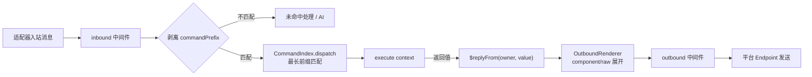

# 命令（defineCommand）

命令由 `@zhin.js/command` Feature 提供。插件包根目录下的 `commands/` 是约定目录：每个 `.ts` / `.tsx` 文件默认导出 `defineCommand(...)`，**文件路径即命令名**，无需手工注册。

```ts
// commands/hello.ts
import { defineCommand } from '@zhin.js/command';

export default defineCommand({
  description: '打个招呼',
  execute: () => 'Hello from zhin.',
});
```

## 文件路由

命令名 = 插件在插件树中的路径段 + 文件相对路径段，用空格连接。Root 插件（应用自身）没有前缀。

| 文件 | 所属插件 | 命令名 |
| --- | --- | --- |
| `commands/hello.ts` | root | `hello` |
| `commands/endpoint/list.ts` | `qq` | `qq endpoint list` |
| `commands/endpoint/add/[name:string=].ts` | `qq` | `qq endpoint add [name]` |

规则：

- **嵌套目录 = 子命令段**。目录与文件名必须是小写 kebab 风格（`/^[a-z0-9][a-z0-9-]*$/`），`commands/` 递归扫描。
- **动态参数段**：文件名写成 `[name:type=default].ts`（`.tsx` 亦可）。
  - `type` 仅支持 `string` / `number` / `boolean`；`=default` 可省略。
  - 无默认值即必填，帮助里显示 `<name>`；有默认值显示 `[name]`，省略该词时取默认值。
  - 运行时按类型解析：`number` 必须是有限数值，`boolean` 只接受 `true` / `false`，解析失败视为「命令不匹配」。
- **静态优先**：`list.ts` 永远赢过 `[name:string].ts`；动态路由之间，静态段多者（更具体）优先。
- 同一路由形状重复注册会在启动时报错（`Duplicate runtime Command`）。

真实示例（`plugins/adapters/qq/commands/endpoint/remove/[name:string].ts`）：

```ts
import { defineCommand } from '@zhin.js/command';
import {
  isQqEndpointOperator,
  QQ_ENDPOINT_FORBIDDEN,
  runQqEndpointRemove,
} from '../../../src/qq-endpoint-commands.js';
import { qqRuntimeStateToken } from '../../../src/qq-runtime-state.js';

export default defineCommand({
  description: '从 zhin.config.yml 的 plugins.qq.endpoints 移除指定 endpoint（重启生效）',
  execute({ config, input, params, use }) {
    if (!isQqEndpointOperator(config, input)) return QQ_ENDPOINT_FORBIDDEN;
    return runQqEndpointRemove(use(qqRuntimeStateToken), String(params.name ?? ''));
  },
});
```

## execute 上下文

`execute(context)` 收到一个冻结的 `CommandContext`：

| 字段 | 类型 | 说明 |
| --- | --- | --- |
| `args` | `readonly string[]` | 命令名匹配之后剩余的词（按空白切分） |
| `params` | `Record<string, string \| number \| boolean>` | 动态参数段解析后的类型化值 |
| `config` | `Readonly<TConfig>` | 本插件的配置快照（来自 `zhin.config.yml`） |
| `input` | `TInput` | 调用来源；IM 消息派发时是 Runtime `Message`（带 `$reply`），其它来源（如 Host 调用）可能为 `undefined` |
| `use(token)` | `<T>(token: Token<T>) => T` | 取 Plugin Runtime 资源（见下） |
| `owner` | `PluginNodeSnapshot` | 命令所属插件节点 |
| `generation` | `number` | 当前代际号 |

`use(token)` 读的是插件 `setup()` 时 `resources.provide(...)` 注册的资源；缺失时抛错。上面的 QQ 命令用 `use(qqRuntimeStateToken)` 拿到适配器共享状态——这是命令与适配器协作的标准方式。

## 返回值与组件渲染

`execute` 的返回值（或 `Promise` 解出的值）即回复内容，类型为 `SendContent`：

- `string` —— 直接作为文本回复；
- `component(name, props)` —— 调用[组件](./middleware-components.md#definecomponent)渲染（`zhin.js/core/runtime` 导出）；
- `raw(payload)` —— 原样下线的 wire 段（如 `{ type: 'html', data: { html, width } }`）；
- 以上三者的**数组** —— 多段消息；
- `undefined` —— 不回复（命令自己已通过 `input.$reply(...)` 回复，或主动静默）。

IM 入站的完整链路：



派发时从整句消息里做**最长前缀匹配**：按词从长到短尝试匹配命令名，命中后剩余的词进入 `args`。因此 `qq endpoint remove mybot` 会命中 `qq endpoint remove`，`args` 为空、`params.name === 'mybot'`。

## master / trusted 权限模式

框架层发送者角色为三档：`user` → `trusted` → `master`（`master` 隐含 `trusted`）。角色由适配器实例配置解析：

```yaml
# zhin.config.yml
plugins:
  qq:
    master: '10001'        # 顶层 master（endpoint owner）
    endpoints:
      - name: main
        appid: ${QQ_APPID}
        master: '10001'    # endpoints[i] 可逐项覆盖
```

`master` / `trusted` 名单由 Core 的角色解析读取（`resolveSenderRoles`，`packages/im/core/src/built/ai-trigger.ts`），`role(master)`、`role(trusted)` 这类 permit 以及 [Agent 工具](./agent-tools.md)的 `permissions` 都基于同一套角色。

命令自身不内置权限声明，权限判断写在 `execute` 里。以 `qq endpoint` 管理命令为例（`plugins/adapters/qq/src/qq-endpoint-commands.ts`）：

```ts
export function isQqEndpointOperator(config: unknown, input: unknown): boolean {
  const cfg = (config ?? {}) as { master?: unknown; endpoints?: unknown };
  const masters = new Set<string>();
  // 收集顶层 master 与各 endpoints[i].master …
  if (masters.size === 0) return true; // 未配置 master 时放行
  const sender = String((input as { sender?: unknown } | null)?.sender ?? '').trim();
  return !!sender && masters.has(sender);
}
```

模式要点：

- 用 `config`（插件配置）拿到声明的 `master` 名单，用 `input`（消息）拿到发送者 id，比对后返回拒绝文案——上面的 `QQ_ENDPOINT_FORBIDDEN`。
- 未配置 `master` 时放行，首个扫码绑定者即成为 owner（绑定流程会把操作者写为新 endpoint 的 `master`）。
- `input` 不一定是消息（可能是 Host 调用），取发送者前要做类型守卫；非消息来源时 `$reply` 降级为 no-op。

## commandPrefix 适配器配置

默认无前缀：任意文本都会尝试按命令匹配。给适配器实例配置 `commandPrefix` 后，只有以前缀开头的消息才进入命令匹配：

```yaml
plugins:
  qq:
    commandPrefix: '/'     # 仅 "/qq endpoint list" 触发
    endpoints:
      - name: main
        commandPrefix: ''  # endpoints[i] 可逐项覆盖顶层
```

解析规则（`packages/im/core/src/plugin-runtime/im/message-dispatcher.ts`）：按消息所属适配器实例读 `commandPrefix`（默认 `''`）；实例声明了 `endpoints` 数组时，按消息的来源 endpoint 名找 entry，`entry.commandPrefix` 覆盖顶层。前缀剥离后再做命令匹配；不匹配前缀的消息落入未命中路径（如 AI 对话）。

## 调试清单

- `description` 会出现在命令清单里，建议都写。
- 命令名冲突（同名静态命令或同形动态路由）在启动期抛错，尽早发现。
- 返回 `Promise` 的命令可以做多轮交互（先 resolve 首条回复，后续用 `input.$reply` 追加），参考 `qq endpoint add` 的扫码绑定流程。
