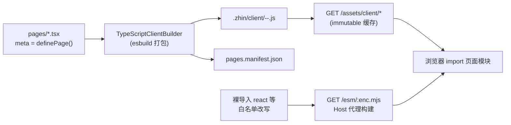

# Console 页面与布局

插件可以向 Remote Console 贡献 React 页面。机制与命令、组件一致：**`pages/` 是约定目录**，由 `@zhin.js/page`（页面）与 `@zhin.js/layout`（布局）两个 Feature 发现，客户端构建管线把 TSX 编译成浏览器可加载的 ES 模块。

## pages/ 约定（@zhin.js/page）

插件包根目录的 `pages/` 下，每个 `.tsx` / `.ts` 文件（小写 kebab 命名）是一个页面：**默认导出 React 组件**，并用命名导出 `meta` 声明元数据（`definePage` 来自 `@zhin.js/console-contract`）：

```tsx
// pages/index.tsx（plugins/adapters/sandbox）
import { definePage } from '@zhin.js/console-contract';
import SandboxChat from './SandboxChat';

export const meta = definePage({
  title: '沙盒',
  icon: 'Box',
  order: 10,
});

export default function SandboxPage() {
  return <SandboxChat />;
}
```

`meta` 字段（全部可选，`definePage` 会校验未知键并抛错）：

| 字段 | 默认 | 说明 |
| --- | --- | --- |
| `title` | 由文件名生成（`foo-bar` → `Foo Bar`） | 导航与页头标题 |
| `icon` | 无 | 图标名（lucide 风格，如 `'Box'`、`'Workflow'`） |
| `order` | `100` | 导航排序，小者靠前 |
| `hideInNav` | `false` | 不出现在导航 |
| `requiredPermissions` | `[]` | 访问所需权限 |
| `requiredRoles` | `[]` | 访问所需角色 |

### 路由规则

路由 = 插件路径 + 页面名（`pageRoute`，`packages/console/plugin-contract/src/page.ts`）：

| 文件 | 所属插件 | 路由 |
| --- | --- | --- |
| `pages/index.tsx` | `sandbox` | `/sandbox` |
| `pages/orchestration.tsx` | root（应用） | `/p-orchestration` |
| `pages/index.tsx` | root（应用） | `/` |

即：`index` 映射到插件路径本身（不带叶子段），其它文件映射为 `p-<name>` 叶子。路由冲突（两个页面算出同一路由）在启动期报错。

## 布局（@zhin.js/layout）

`pages/` 下两个保留文件名提供布局槽位：

- `pages/$nav.tsx` → `nav` 槽（导航区）
- `pages/$footer.tsx` → `footer` 槽（页脚区）

布局文件默认导出 React 组件即可，不需要 `meta`。同一槽位同时存在 `.ts` 与 `.tsx` 时以 `.tsx` 为准。

## 客户端构建管线

页面/布局文件的 `target` 是 `client`，发现时不走 Node 模块加载，而是交给 Client Module 适配器（`TypeScriptClientBuilder`，`packages/console/pagemanager`）：



要点：

- **产物**：每个页面打包为 `<owner>-<localName>-<contentHash>.js`，写入项目下 `.zhin/client/`，经 Host 路由 `GET /assets/client/*` 提供（`cache-control: immutable`，内容 hash 变了文件名就变）。`@zhin.js/console-contract` 在打包时内联为身份函数 stub，`meta` 由静态提取得到。
- **`/esm` 代理**：浏览器不解析裸导入。`react`、`react-dom`、`react-dom/client`、`react/jsx-runtime(-dev)`、`react-router`、`react-router-dom` 这个白名单（`ALLOWED_ESM_CANONICAL`）内的导入被改写为 `/esm/<enc>.mjs`，由 Host 按需构建并代理，保证整个 Console 只有一份 React 实例；白名单外的 canonical 返回 403。
- **Host 路由**（`basic/cli/src/plugin-runtime/console-host-installer.ts`）：`GET /console` 是页面索引；`GET /console/api/pages` 返回页面清单；`GET /*` catch-all 按路由匹配页面并返回页面 shell（内含 importmap 与模块挂载脚本），未命中 404、权限不足 403。
- 页面模块在浏览器里以 `import(moduleUrl)` 加载，取默认导出挂载到 `#root`。

## sandbox 适配器的 page 实例

sandbox 适配器（`plugins/adapters/sandbox`）是这套机制的标准消费者。它的 `package.json#zhin` 声明：

```json
{
  "zhin": {
    "protocol": 1,
    "type": "plugin",
    "entry": "./plugin.ts",
    "runtime": "trusted",
    "features": [
      { "package": "@zhin.js/adapter", "api": "^1.0.0" },
      { "package": "@zhin.js/page", "api": "^1.0.0" }
    ]
  }
}
```

- `@zhin.js/adapter` Feature 发现 `adapters/` 下的适配器（WebSocket `/sandbox` Endpoint）；
- `@zhin.js/page` Feature 发现 `pages/index.tsx`，于是 Console 里出现 **`/sandbox` 聊天页**：`SandboxChat` 组件通过 WebSocket 连到 Host 的 `/sandbox`（base 与 token 见 `pages/sandboxTransport.ts`），收发消息走统一的 IM 链路——在页面里发消息等价于一个真实平台的入站消息，会经过中间件、命令匹配、AI 未命中处理。

这让「无真实平台调试」成为默认开发路径：`pnpm dev`（examples/minimal-bot）起的 Sandbox + Console 即可验证命令、组件渲染与 Agent 行为。页面对出站 html 段是内嵌渲染（sandbox 适配器直接消费 html，不做图片/文本归一化，见[中间件与组件](./middleware-components.md)）。

插件入口本身可以保持极简（`plugins/adapters/sandbox/plugin.ts`）：

```ts
import { definePlugin } from '@zhin.js/plugin-runtime';

export default definePlugin({
  name: 'sandbox',
  metadata: { displayName: 'Sandbox Adapter' },
});
```

页面、适配器都由 Feature 约定发现，入口不需要手工挂载任何东西。
