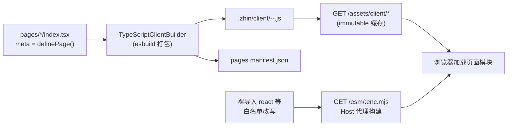

# Console 页面与布局

插件不仅能往群里发消息，还能给 Remote Console 贡献完整的 React 页面。Sandbox 适配器的 `/sandbox` 聊天页就是这样来的。

和命令一样，页面放在**约定目录** `pages/` 里，文件会被自动发现，并编译成浏览器能加载的模块。

## 写第一个页面

```tsx
// pages/index/index.tsx
import { definePage } from '@zhin.js/console-contract';

export const meta = definePage({
  title: '我的插件',
  titleI18n: { en: 'My Plugin' },
  icon: 'Box',
  order: 10,
});

export default function MyPluginPage() {
  return <div>Hello from my plugin</div>;
}
```

- **默认导出**一个 React 组件，就是页面内容。
- **命名导出 `meta`** 声明标题、图标和排序。
- 只有 `pages/<name>/index.tsx`（或 `index.ts`）是页面，同目录的其他文件可以作为组件和辅助模块被引用。

启动 Bot 后，打开 Console 就能在导航里看到这个页面。

## 页面元数据

`meta` 的字段都可选，写了未知字段时 `definePage` 会报错：

| 字段 | 默认 | 说明 |
| --- | --- | --- |
| `title` | 由目录名生成（`foo-bar` → `Foo Bar`） | 导航与页头标题 |
| `titleI18n` | 无 | 显式标题翻译，如 `{ en: 'My Plugin' }`；支持 `zh-CN` / `en`，缺失时保留 `title` |
| `icon` | 无 | lucide 风格的图标名，如 `'Box'`、`'Workflow'` |
| `order` | `100` | 导航排序，越小越靠前 |
| `hideInNav` | `false` | 不在导航中显示 |
| `requiredPermissions` | `[]` | 访问所需权限，对应令牌的 `permissions` |
| `requiredRoles` | `[]` | 访问所需角色，对应令牌的 `roles` |

导航和页面清单按调用者的令牌过滤：full 令牌能看到全部页面；其他令牌只能看到它的 `permissions` 和 `roles` 满足要求的页面；不带令牌只能看到没有要求的页面。令牌怎么配置见 [Console 的用户与权限](../console/index.md#用户与权限)。

Console 根据独立的界面语言选择 `titleI18n`，只改变导航和面包屑显示，不改路由、权限或页面正文。Page 正文本地化由插件自己的组件负责；未声明翻译的第三方标题保留原文。

## 页面的地址

地址 = 插件路径 + 页面名：

| 文件 | 所属插件 | 地址 |
| --- | --- | --- |
| `pages/index/index.tsx` | `sandbox` | `/sandbox` |
| `pages/workroom/index.tsx` | 你的 Bot（root） | `/p-workroom` |
| `pages/index/index.tsx` | 你的 Bot（root） | `/` |

`index` 对应插件路径本身，其他页面对应 `p-<name>`。两个页面算出同一个地址时，启动会报错。规则实现见 `packages/console/plugin-contract/src/page.ts` 的 `pageRoute`。

## 自定义导航和页脚

`pages/` 下有两个保留名字：

- `pages/nav/index.tsx`：导航区
- `pages/footer/index.tsx`：页脚区

默认导出一个 React 组件即可，不需要 `meta`。同一位置同时有 `.ts` 和 `.tsx` 时以 `.tsx` 为准。`npm create zhin-app` 生成的项目里已经带了这两个文件作为示例。

## 例子：Sandbox 聊天页

Sandbox 适配器（`plugins/adapters/sandbox`）同时提供了一个适配器和一个页面，它的 `package.json#zhin` 声明了两个 Feature：

```json
{
  "zhin": {
    "protocol": 1,
    "type": "plugin",
    "entry": "./plugin.ts",
    "runtime": "trusted",
    "features": [
      { "package": "@zhin.js/adapter", "api": "^1.0.0" },
      { "package": "@zhin.js/page", "api": "^1.0.0" }
    ]
  }
}
```

- `@zhin.js/adapter` 发现 `adapters/` 下的适配器，提供 WebSocket `/sandbox` 连接。
- `@zhin.js/page` 发现 `pages/index/index.tsx`，Console 里因此出现 `/sandbox` 聊天页。

页面里的 `SandboxChat` 组件通过 WebSocket 连接 `/sandbox`（地址与 token 见 `pages/sandboxTransport.ts`）。在页面里发一条消息，等价于真实平台收到一条消息：同样会经过中间件、命令匹配和 AI。所以不接任何真实平台也能完整调试命令、组件渲染和 Agent。Sandbox 会直接显示出站的 HTML 内容，不转成图片或文字，见 [中间件与组件](./middleware-components.md#不同平台上的效果)。

插件入口本身什么都不用写，页面和适配器都是自动发现的：

```ts
// plugins/adapters/sandbox/plugin.ts
import { definePlugin } from 'zhin.js';

export default definePlugin({
  name: 'sandbox',
  metadata: { displayName: 'Sandbox Adapter' },
});
```

## 页面数据：插件 RPC

页面需要显示插件的运行状态，或者提供几个按钮时，插件可以注册自己的 Console RPC，不用自己开 WebSocket 或 HTTP 路由。

插件在 `setup` 里注册一个只读的 `status`，再按需加几个有限的动作：

```ts
// plugin.ts
import { definePlugin } from 'zhin.js';
import { definePluginConsoleRpc, PluginConsoleRpcError, pluginConsoleRpcToken } from 'zhin.js/plugin-runtime';

export default definePlugin({
  name: 'ambient',
  setup(context) {
    context.resources.provide(pluginConsoleRpcToken, definePluginConsoleRpc({
      status: {
        page: 'index', // 与 pages/index 的访问规则一致
        handler: async () => ({
          mode: 'shadow',
          recent: recentJudgments(10).map(j => ({ at: j.at, spoke: j.engaged })),
        }),
      },
      actions: {
        'clear-cooldown': {
          page: 'index',
          handler: async ({ group }) => {
            if (typeof group !== 'string') throw new PluginConsoleRpcError('invalid_input', '请选择一个群');
            return { cleared: clearCooldown(group) };
          },
        },
      },
    }));
  },
});
```

页面里用 `@zhin.js/client` 的 `pluginRpc` 调用。`pluginId` 是插件的 PluginId（比如 `root/ambient`），和页面清单里的 `owner` 相同：

```tsx
import { pluginRpc } from '@zhin.js/client';

const status = await pluginRpc<{ mode: string }>('root/ambient', 'status');
await pluginRpc('root/ambient', 'clear-cooldown', { group: '123' });
```

请求走现有的 `POST /api/console/request`，类型名是 `plugin.<pluginId>.status` 或 `plugin.<pluginId>.<动作名>`。动作名只能用小写字母、数字和 `-`，`status` 是保留名。

除了 `status`，还可以用 `queries` 注册几个**只读查询**，规则和 `status` 一样（可以写 `page`、`demo`、`requiredPermissions`）。查询和动作不能重名：

```ts
definePluginConsoleRpc({
  queries: {
    history: { page: 'index', handler: async () => ({ days: last7Days() }) },
  },
});
```

访问规则：

- **跟随页面**：写了 `page` 时，调用者必须满足这个页面的 `requiredPermissions` 和 `requiredRoles`，方法自己声明的要求会叠加上去。页面在当前代没有加载时直接拒绝。
- **full 令牌**可以调用全部方法。
- **其他令牌**（`scope: user` / `demo`）可以读取 `status`，前提是它持有全部要求的权限和角色。`status` 完全没有要求时，只有写了 `demo: true` 才对这些令牌开放。
- **动作**：其他令牌只有在动作**自己**声明了 `requiredPermissions`、`requiredRoles` 或 `anyOfPermissions`，并且令牌满足全部要求（包括页面的要求）时才能执行，否则返回「没有操作权限」。动作自己没有声明任何要求时只允许 full 令牌调用，页面的要求不会单独放行动作。
- **任选其一**：`anyOfPermissions` 列出的权限持有其中**一个**即可（和 `requiredPermissions` 叠加）。适合新权限点与旧权限点并存，例如审批卡结算接受 `ops:approve` 或旧的 `tool_approvals:resolve`。

```ts
actions: {
  'clear-cooldown': {
    page: 'index',                       // 先满足页面的要求
    requiredPermissions: ['ambient:write'], // 再要求这个权限，普通用户才能执行
    handler: async ({ group }) => ({ cleared: clearCooldown(String(group)) }),
  },
},
```

返回给页面的内容会被普通用户看到，所以：

- 只返回页面需要的少量字段，不要直接返回日志记录、提示词、聊天原文或密钥。
- 返回值必须是 JSON，超过 256 KB 会被拒绝；请求的 `data` 也必须是不超过 64 KB 的 JSON 对象。
- 处理函数 10 秒没返回就算超时，`signal` 会被中止。
- 想给用户看错误原因，就抛 `PluginConsoleRpcError`，它的消息会原样显示。其他异常只会显示「插件操作失败」。

插件 RPC 不负责改配置。改配置请用 `config:patch`。

### 内置状态：群聊插话和技能助手

群聊插话和技能助手由 Host 自己提供，不是插件，所以挂在根插件下：

| 方法 | 调用 | 需要的权限 |
| --- | --- | --- |
| `plugin.root.ambient` | `pluginRpc('root', 'ambient')` | `ambient:read` |
| `plugin.root.skills` | `pluginRpc('root', 'skills')` | `skills:read` |

full 令牌不需要这些权限。页面在 `requiredPermissions` 里写同样的权限，令牌在 `http.tokens[].permissions` 里给出（见 [用户与权限](../console/index.md#用户与权限)）。两个查询都只读，不接收参数。

数据只保存在内存里：最近 24 小时，最多 2000 条，重启后清空。不包含聊天内容、提示词、判断理由或密钥。时间都是毫秒时间戳。

`plugin.root.ambient` 返回：

```ts
interface AmbientStatus {
  enabled: boolean;                       // 配置了至少一个群
  mode: 'off' | 'shadow' | 'active';      // shadow：只判断不发言
  groups: number | 'all';                 // 配置的群数，'*' 时为 'all'
  judges: string[];                       // 判断用的模型，按顺序（provider/model）
  last24h: { spoke: number; watched: number; stayed_quiet: number; skipped: number };
  decisionShadow: { agreed: number; disagreed: number }; // ai.decisions.ambient 影子模式和聊天模型判断是否一致
  recent: Array<{                         // 最新在前，最多 20 条
    at: number;
    group: string;                        // platform:groupId
    outcome: 'spoke' | 'watched' | 'stayed_quiet' | 'skipped';
    skipReason?: 'cooldown' | 'hourly_cap' | 'judge_interval' | 'no_context' | 'judge_failed';
    confidence?: number;                  // 0..1，两位小数
    judge?: 'decision' | 'chat-model';
  }>;
  updatedAt: number | null;
}
```

`watched` 是影子模式下判断要发言但没有发。

`plugin.root.skills` 返回结构化决策（技能、工具、记忆、子代理、审批、群聊插话的选择）的调用统计：

```ts
interface SkillsStatus {
  tasks: Array<{                          // 每个任务一行，按名字排序
    task: 'skills' | 'tools' | 'memory' | 'agents' | 'approval' | 'ambient';
    mode: 'off' | 'shadow' | 'active';    // 最近一次调用的模式
    calls: number; selected: number; abstained: number; shadow: number; failed: number;
    averageMs: number;
    inputTokens: number; outputTokens: number;
    lastModel?: string;
    lastAt: number;
  }>;
  totals: { calls: number; inputTokens: number; outputTokens: number };
  recent: Array<{                         // 最新在前，最多 20 条
    at: number; task: string; mode: string;
    outcome: 'selected' | 'abstained' | 'failed' | 'shadow';
    durationMs: number;
    model?: string;
    reason?: string;                      // 机器可读的失败/放弃原因，不是文字说明
  }>;
  updatedAt: number | null;
}
```

### 内置查询：决策回放

「机器人状态」页的决策回放（ADR 0036 切片 C）同样由 Host 提供，读的是 `ai_decision_events` 决策审计表：机器人每次进不进模型、说不说话、调没调工具，各记一行，同一回合的行共享 `turn_id`。

| 方法 | 调用 | 需要的权限 |
| --- | --- | --- |
| `plugin.root.decisions` | `pluginRpc('root', 'decisions', { ... })` | `decisions:read` |
| `plugin.root.decision-turn` | `pluginRpc('root', 'decision-turn', { turnId })` | `decisions:read` |
| `plugin.root.decisions-export` | `pluginRpc('root', 'decisions-export', { since, until, ... })` | `decisions:read` |

三个查询都只读。时间都是毫秒时间戳；`kind` / `outcome` 只认 ADR 0036 里的枚举，拼错会返回 `invalid_input`，不会当成空结果。

- `decisions`：列表，新的在前。可选参数 `platform`、`sceneId`、`kind`、`outcome`、`reasonCode`（如 `cold_field_mention_only_on`，用于复用 kind 的行）、`since`（含）、`before`（不含）、`limit`（默认 50，最多 200）。返回 `{ persistent, items, nextBefore }`；`nextBefore` 不为 `null` 时，把它作为 `before` 再查一次就是下一页。
- `decision-turn`：一个回合的时间线，按时间正序。返回 `{ turnId, startedAt, endedAt, truncated, events }`；没有记录（或已过保留期）返回 `not_found`。
- `decisions-export`：导出一个时间窗，`since`、`until` 必填（两端都含，最多 31 天），可叠加和列表相同的过滤。按时间正序分页返回 `{ table, exportedAt, window, filters, count, nextSince, events }`；`nextSince` 不为 `null` 时把它作为 `since` 继续取，把各页 `events` 依次拼起来就是完整导出。

每一行的字段和表结构同名（`id`、`ts`、`turn_id`、`instance_id`、`platform`、`scene_id`、`user_id`、`kind`、`outcome`、`reason_code`、`reason_detail`、`payload`、`actor`、`actor_id`），`payload` 是对象。写入时已经脱敏：不含密钥、Cookie、token 或完整提示词。

单次返回受 256 KB 上限约束，所以列表和导出按大小分页；同一毫秒的多行总在同一页，用时间戳翻页不会漏行或重复。没有接数据库时（`persistent: false`）只能看到进程内最近 200 条。

默认保留 14 天，用 `ai.audit.retentionDays` 修改；启动时和之后每小时清理一次过期行。开关控制见下面的控制面。

### 内置操作：控制面

「机器人状态」页的控制面（ADR 0036 切片 D）也由 Host 提供，是让机器人立刻安静的统一止损开关。

| 方法 | 调用 | 需要的权限 |
| --- | --- | --- |
| `plugin.root.control` | `pluginRpc('root', 'control')` | `control:read` |
| `plugin.root.control-set` | `pluginRpc('root', 'control-set', { expectedRevision, instance?, sessions? })` | `control:write`（动作；管理员令牌总可调用） |

四个开关：

| 开关 | 效果 |
| --- | --- |
| `emergency_stop` | 不进模型、不出站（含定时通知等主动出站）；只保留审计和 Console 可读 |
| `muted` | 不发言：入站、旁听插话、scene event 唤醒都不进模型 |
| `read_only` | 不做写操作：不进模型、不出站 |
| `mention_only` | 只有 @机器人（命中触发）或私聊才进模型；旁听和 scene event 唤醒直接跳过 |

两级：实例默认（`instance`）+ 会话覆盖（`sessions`，按 `platform` + `sceneId`，`sceneId` 形如 `group:123`，和会话画像同口径）。会话覆盖只能更严：会话里写 `false` 只是去掉这条覆盖，放宽不了实例级开关。生效顺序是 `emergency_stop → 实例 muted → 会话 muted → read_only → mention_only → 常规发言 / 旁听 / scene event 策略`，先命中先返回；控制面在会话画像发言判定之前，拦下时不再判定会话画像和旁听。回合进行中开关变了，发送前还会再判一次，止损类开关（前三个）命中就不发。

- `control`：返回 `{ revision, instance, sessions, temporary, updatedAt, updatedBy, persistent, available, precedence }`。`temporary[]` 是策略加的临时覆盖（目前只有冷场 `mention_only`，见下），每项含 `platform`、`sceneId`、`switch`、`source`（`cold_field`）、`actor`（`policy`）、`since`、`expiresAt`；它不计入 `revision`。`available: false` 表示持久化状态暂时读不出来，这时所有判定都按 `emergency_stop` 处理（fail closed），并且拒绝写入，直到重新读成功。
- `control-set`：只改给出的开关。必须带 `expectedRevision`（先用 `control` 读出）；不一致返回 `conflict`，不会覆盖。成功返回新的状态和 `changed`（实际变化的范围数）。显式写 `mention_only: false`（会话级清该会话、实例级清全部）会一并清除冷场临时覆盖，每个会话写一行 `control_change` / `cold_field_mention_only_cleared`（`actor=operator`）。

每次被拦截写一行 `kind=control_gate`（`reason_code` 为 `control_emergency_stop` / `control_muted_instance` / `control_muted_session` / `control_read_only` / `control_mention_only`）；每次变更按变化的范围写 `kind=control_change`、`actor=operator`，`payload` 记前后值，可以在决策回放里看到。开关存在 `ai_control_state` 表里，重启后保留；没接数据库时只在进程内。

模型没有任何工具能读写这些开关：它不能自己解除禁言，也不能关掉 `emergency_stop`。危险工具硬闸是切片 E，不在这里。

### 内置操作：入群欢迎 / 退群记录

会话运营配置（ADR 0037 第 1 期切片 A）同样由 Host 提供。前端页面另做；这里只有 RPC。

| 方法 | 调用 | 需要的权限 |
| --- | --- | --- |
| `plugin.root.session-ops` | `pluginRpc('root', 'session-ops')` | `control:read` |
| `plugin.root.session-ops-preview` | `pluginRpc('root', 'session-ops-preview', { platform, sceneId, template? })` | `control:read` |
| `plugin.root.session-ops-set` | `pluginRpc('root', 'session-ops-set', { expectedRevision, defaults?, sessions? })` | `control:write`（动作；管理员令牌总可调用） |

配置按 `platform` + `sceneId`（形如 `group:123`，和会话画像同口径）存放，不写进会话画像：

| 字段 | 说明 | 默认 |
| --- | --- | --- |
| `welcome.enabled` | 是否发欢迎（只能按会话打开） | `false` |
| `welcome.template` | 模板，变量 `{members}`（逐个 @）、`{nickname}`、`{group}`、`{rules_url}`；未知变量原样保留 | `欢迎 {members} 加入{group}！` |
| `welcome.mergeWindowMs` | 窗口内多人入群合并为一条；`0` 不合并 | `60000` |
| `welcome.maxPerHour` | 每会话每小时最多几条欢迎 | `10` |
| `welcome.rulesUrl` | `{rules_url}` 的值 | 空 |
| `leave.record` | 退群写审计 | `true` |
| `leave.notify` | 退群在群里发消息（本期只存配置，不发） | `false` |
| `coldField.enabled` | 冷场（切片 C）：是否启用（只能按会话打开） | `false` |
| `coldField.threshold` | 连续多少条群消息未点名且旁听判定不参与后进入临时 `mention_only`（1–1000） | `20` |
| `coldField.durationMs` | 临时 `mention_only` 持续时长（1 分钟 – 24 小时） | `1800000` |
| `ops.cooldownMs` | 群管冷却（切片 E）：同一 `platform + sceneId + 动作`（工具本地名，如 `kick_member`）在这段时间内只生成一张硬闸审批卡；`0` 不冷却，上限 24 小时。实例默认和会话覆盖都可设 | `60000` |

- `session-ops`：返回 `{ revision, defaults, sessions, updatedAt, updatedBy, persistent, available }`，每个会话带 `overrides`（显式设置过的字段）和 `effective`（合并实例默认后的生效值）。
- `session-ops-preview`：只渲染，不发送，不写审计。用该会话最近一次真实入群（进程内），没有则用示例成员；返回 `{ text, parts, unknownVars, sample, members, enabled }`。传 `template` 可以预览还没保存的模板。
- `session-ops-set`：`defaults` 只接受模板和参数（不含开关）；`sessions[]` 里给出的字段覆盖原值，字段写 `null` 回落实例默认，`reset: true` 删除整个会话配置。必须带 `expectedRevision`，不一致返回 `conflict`。每个实际变化的范围写一行 `kind=config_change`、`actor=operator`。

群管冷却（ADR 0037 §3，切片 E）：危险工具在硬闸**生成新审批卡之前**先查冷却。计时从审批卡创建开始，不论之后批准、驳回还是超时；冷却中再调用同一动作直接拒绝，**不生成新卡**，给模型的结果说明「冷却中」和剩余毫秒，审计写 `kind=ops_cooldown`、`outcome=deny`、`reason_code=ops_cooldown_hit`（`payload` 含 `action`、`target`、`remainingMs`、`platform`、`sceneId`），并在同一 `turn_id` 下写一行 `tool_hard_gate` 拒绝；未在冷却中写 `ops_cooldown_passed` 后照常进入审批。运营者已在 Console 批准的同参数卡片照常执行（那张卡创建时已经计时）。冷却计时只存在进程内存，重启后清空；它只是防刷卡的节流，危险工具仍然每次需要人工审批。

冷场（ADR 0037 §1.3，切片 C）：只统计群消息。一条未点名的群消息进入了旁听判定且没有参与（含旁听自身的冷却 / 限频跳过）时计 1；点名、旁听参与、Bot 主动发言（scene event 唤醒发出、模板欢迎、公告）清零；未启用旁听或被控制面 / 会话画像提前拦下的消息不计也不清零。达到 `coldField.threshold` 后给该会话加一条临时 `mention_only`（`actor=policy`，`expiresAt` = 现在 + `durationMs`），写 `kind=control_change`、`reason_code=cold_field_mention_only_on`；到期自动撤销并写 `cold_field_mention_only_expired`。临时覆盖与运营者的手动开关分开存放，只会更严，从不改动手动开关，在 `control` 的 `temporary[]` 里可见；期间被跳过的入口照常写 `control_gate`，`reason_detail` 为 `policy:mention_only`。计数和临时覆盖只在进程内存，重启即清。会话已经处于 `mention_only` 时不会再叠加。

欢迎的发送顺序：入群 → 合并窗口 → 小时上限 → 控制面（模板欢迎按被点名判定：`mention_only`（含冷场临时覆盖）不拦，止损类开关照常拦）→ 会话画像发言判定 → 出站。被拦只写审计、不补发；发送失败不自动重试。会话开启 `welcome.enabled` 后，scene event 唤醒不再因为入群事件调模型，避免和模板欢迎双发。审计写 `kind=member_lifecycle`，`reason_code` 为 `welcome_sent` / `welcome_merged` / `welcome_rate_limited` / `welcome_disabled` / `member_leave_recorded`，被控制面或会话画像拦下时沿用 `control_*` / `cannot_speak_*`。配置存在 `ai_session_ops` 表里；读不出来时一律不发欢迎，退群照常记审计。

### 内置操作：公告（草稿 → 审批 → 发送）

公告（ADR 0037 第 1 期切片 B）由 Host 提供 RPC，前端页面另做。读用 `control:read`；起草、编辑、提交用 `control:write`；**批准、驳回、重发用审批权限 `ops:approve`**（切片 E），只有 `control:write` 不能批准。`ops:approve` 同时可以查看并结算危险工具审批卡（见 [危险工具审批卡](#内置操作危险工具审批卡)）。

| 方法 | 调用 | 需要的权限 |
| --- | --- | --- |
| `plugin.root.announcements` | `pluginRpc('root', 'announcements', { platform, sceneId, status? })` | `control:read` |
| `plugin.root.announcement` | `pluginRpc('root', 'announcement', { id })` | `control:read` |
| `plugin.root.announcement-create` | `pluginRpc('root', 'announcement-create', { platform, sceneId, content, endpoint? })` | `control:write`（动作） |
| `plugin.root.announcement-edit` | `pluginRpc('root', 'announcement-edit', { id, expectedRevision, content })` | `control:write`（动作） |
| `plugin.root.announcement-submit` | `pluginRpc('root', 'announcement-submit', { id, expectedRevision })` | `control:write`（动作） |
| `plugin.root.announcement-approve` | `pluginRpc('root', 'announcement-approve', { id, expectedRevision })` | `ops:approve`（动作） |
| `plugin.root.announcement-reject` | `pluginRpc('root', 'announcement-reject', { id, expectedRevision, reason? })` | `ops:approve`（动作） |
| `plugin.root.announcement-resend` | `pluginRpc('root', 'announcement-resend', { id, expectedRevision })` | `ops:approve`（动作） |

状态只前进：`draft` → `pending` → `approved` → `sent`，旁路 `rejected` / `expired` / `failed`。改正文（任何非终态）都回到 `draft` 并重算 `contentHash`；`pending` 超过 24 小时自动 `expired`。模型只能用 `announcement_draft` 工具建草稿（`risk: safe`），不能提交、审批或发送。

- `announcement-approve`：批准后**立即发送**，返回发送后的状态与 `send.result`（`sent` / `failed`）。发送顺序：摘要复核 → 控制面（按被点名判定，`mention_only` 不拦）→ 会话画像发言判定 → 硬闸（以这次批准作硬闸批准，**不再弹审批卡**）→ 平台公告接口。
- 被拦或失败一律置 `failed` 并写原因，不排队、不自动重试；`announcement-resend` 把它放回 `pending`，需要再批一次才会发。正文与审批时的摘要不符时直接拒绝（`announcement_hash_mismatch`）。
- 全部带 `expectedRevision`，不一致返回 `conflict`，不覆盖。每次状态迁移写一行 `kind=announcement`（`announcement_drafted` / `_submitted` / `_approved` / `_rejected` / `_expired` / `_sent` / `_send_failed` / `_resend` / `_hash_mismatch`），被控制面或会话画像拦下时沿用 `control_*` / `cannot_speak_*`。数据存在 `ai_announcements` 表里。

### 内置操作：会话日程（提醒）

会话日程（ADR 0037 第 1 期切片 D）由 Host 提供 RPC，前端页面另做。读用 `control:read`，新建、修改、取消用 `control:write`。

| 方法 | 调用 | 需要的权限 |
| --- | --- | --- |
| `plugin.root.session-events` | `pluginRpc('root', 'session-events', { platform, sceneId, status? })` | `control:read` |
| `plugin.root.session-event` | `pluginRpc('root', 'session-event', { id })` | `control:read` |
| `plugin.root.session-event-create` | `pluginRpc('root', 'session-event-create', { platform, sceneId, title, at, remindBefore?, template?, endpoint? })` | `control:write`（动作） |
| `plugin.root.session-event-update` | `pluginRpc('root', 'session-event-update', { id, expectedRevision, title?, at?, remindBefore?, template? })` | `control:write`（动作） |
| `plugin.root.session-event-cancel` | `pluginRpc('root', 'session-event-cancel', { id, expectedRevision })` | `control:write`（动作） |

- `at` 是毫秒时间戳（UTC 存储，`{at}` 按实例时区 `TZ` 展示，缺省 `Asia/Shanghai`）；`remindBefore` 是提前量（毫秒）数组，最多 5 个、每个不超过 30 天。**`at` 本身总会提醒一次**，`remindBefore` 只追加提前提醒；创建 / 修改时已经过去的提前量直接记为已触发。`title` 最多 60 字符；`template` 可用 `{title}` `{at}` `{in}`，留空用默认模板 `【日程提醒】{title}：{at}（{in}）`。
- 状态：`scheduled` → `done`（全部提醒都已触发）/ `cancelled`。修改 / 取消只在这里（包括模型建的事件）；模型只能用 `session_event_create` 工具（`risk: safe`）为**当前群 / 频道**新建事件。
- 到点：同一会话同一分钟的提醒合并成一条消息。顺序：`inbound_wake`（`schedule_wake_fired`）→ 控制面（按被点名判定：`mention_only` 含冷场临时覆盖不拦，止损类开关照常拦）→ 会话画像发言判定 → 模板直发（不调模型）。被拦或发送失败都把该提醒记为已触发，**不补发、不重试**。
- 重启补偿：错过超过 10 分钟的提醒不再发送，写 `schedule_wake_missed`；10 分钟内的照常发送。
- 全部写操作带 `expectedRevision`，不一致返回 `conflict`，不覆盖。审计写 `kind=schedule`：`schedule_event_created` / `_updated` / `_cancelled`、`schedule_wake_fired`（单条发出）/ `schedule_wake_merged`（合并发出）/ `schedule_wake_missed`，被控制面或会话画像拦下时沿用 `control_*` / `cannot_speak_*`。数据存在 `ai_session_events` 表里（不写 `schedule-jobs.json`）。

### 内置操作：危险工具审批卡

硬闸（ADR 0036 §3）拦下的危险调用在这里留审批卡。审批人权限是 `ops:approve`（ADR 0037 §3，切片 E），与 `control:write` 分开；为了兼容已有令牌，旧权限仍然有效，持有任意一个即可。

| 方法 | 调用 | 需要的权限 |
| --- | --- | --- |
| `plugin.root.tool-approvals` | `pluginRpc('root', 'tool-approvals')` | `tool_approvals:read` 或 `ops:approve` |
| `plugin.root.resolve-tool-approval` | `pluginRpc('root', 'resolve-tool-approval', { id, decision: 'approve' \| 'deny' })` | `ops:approve` 或 `tool_approvals:resolve`（动作；管理员令牌总可调用） |

## 在页面里保存设置 (config:patch)

页面要改几项设置时，用 `config:patch` 只写具体路径，不要用 `config:set` 覆盖整块配置。`zhin.config.yml` 里其他内容和注释都会保留；YAML/配置页仍然保留给高级用户。

```ts
const { revision } = await wsManager.getConfigSource();
const result = await wsManager.patchConfig({
  instanceKey: 'typesafe',          // 省略则使用 Host 白名单
  expectedRevision: revision,
  patches: [
    { op: 'set', path: ['ai', 'decisions', 'skills', 'mode'], value: 'shadow' },
    { op: 'remove', path: ['typesafe', 'timeoutMs'] },
  ],
});
if (result.status === 'saved' && result.restartRequired) showRestartHint(result.message);
if (result.status === 'conflict') showLatest(result.current, result.revision); // 不会覆盖别人的修改
if (result.status === 'invalid') showErrors(result.errors);
```

**能写哪些路径**

| 调用方式 | 可写范围 |
| --- | --- |
| 带 `instanceKey` | 该插件实例自己的配置块 `[instanceKey, ...]`，加上插件 `schema.json` 根部 `x-zhin-config.patchPaths` 声明的 Host 子路径 |
| 省略 `instanceKey` | `HOST_CONFIG_PATCH_PATHS`（`@zhin.js/console-protocol` 导出，目前是 `ai.trigger.ambient`） |

插件声明跨作用域归属的写法（以 TypeSafe 决策服务为例）：

```json
{
  "type": "object",
  "x-zhin-config": { "patchPaths": ["ai.decisions"] },
  "properties": { "...": {} }
}
```

`patchPaths` 只能写 Host 配置下至少两级的路径（如 `ai.decisions`），不能声明 `plugin`、`http`、`plugins`、整块 Host 键或其他插件的配置块。超出范围的路径会直接报错，不写入任何内容。

**规则**

- `expectedRevision` 必填，取自 `config:get-source`。文件已被别处修改时返回 `status: 'conflict'`，附带最新 `revision` 和每个路径的当前值，不会静默覆盖。
- 写入前按 schema 校验每个被改动的顶层配置块，失败时返回 `status: 'invalid'` 和带完整路径的错误（如 `$.ai.trigger.ambient.mode`），不写入。
- 成功时 `restartRequired` 表示是否改到了 Host 配置：为 `true` 时文件已保存，需要重启进程才能生效，`message` 为「配置已保存，需重启进程才能生效」。
- 成功后发布 `config:updated` 事件，带 `paths`（实际写入的路径）和新 `revision`。
- 只接受 full scope Token；Demo 部署不可用。一次最多 32 个 patch，每个路径最多 16 段。
- 插件状态与动作走 plugin RPC（`plugin.<PluginId>.status` / `plugin.<PluginId>.<action>`），不要用它写配置。

## 它是怎么工作的

页面文件运行在**浏览器**里，所以不会被 Node 直接加载，而是交给客户端构建器（`TypeScriptClientBuilder`，`packages/console/pagemanager`）用 esbuild 打包：


```mermaid
flowchart LR
    A["pages/*/index.tsx<br/>meta = definePage()"] --> B["TypeScriptClientBuilder<br/>(esbuild 打包)"]
    B --> C[".zhin/client/<owner>-<name>-<hash>.js"]
    B --> D["pages.manifest.json"]
    C --> E["GET /assets/client/*<br/>(immutable 缓存)"]
    F["裸导入 react 等<br/>白名单改写"] --> G["GET /esm/:enc.mjs<br/>Host 代理构建"]
    E --> H[浏览器加载页面模块]
    G --> H
```

- **产物**：每个页面打包为 `<owner>-<localName>-<contentHash>.js`，写入项目的 `.zhin/client/`，通过 `GET /assets/client/*` 提供（`cache-control: immutable`，内容变了文件名就变）。`@zhin.js/console-contract` 在打包时被替换成空实现，`meta` 通过静态分析提取。
- **React 只有一份**：浏览器不认识 `import 'react'` 这样的裸导入，所以白名单 `ALLOWED_ESM_CANONICAL`（`react`、`react-dom`、`react-dom/client`、`react/jsx-runtime(-dev)`、`react-router`、`react-router-dom`）中的导入会被改写成 `/esm/<enc>.mjs`，由 Host 按需构建和代理，保证整个 Console 只有一份 React。白名单之外的包返回 403。
- **路由**：在 `basic/cli/src/plugin-runtime/console/host.ts` 中注册。`GET /console` 是页面索引，`GET /console/api/pages` 返回页面清单，其余路径按地址匹配页面并返回页面外壳（包含 importmap 和挂载脚本）；未匹配返回 404，权限不足返回 403。浏览器用 `import(moduleUrl)` 加载页面模块，把默认导出挂载到 `#root`。

## 下一步

- [约定目录](./conventions.md)：其他能力放在哪里。
- [Console](../console/index.md)：Console 本身能做什么。
