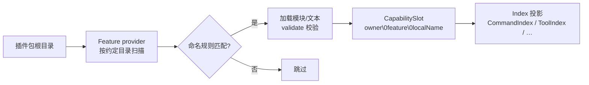

# 约定目录

在插件包根目录下创建 `commands/hello/index.ts`，命令就出现了——不用在其他地方注册。这组会被 Feature 发现机制自动扫描的目录就是**约定目录**。代码能力统一使用 `<name>/index.ts`；Skill 使用 `<name>/SKILL.md`，Agent 使用 `<name>/agent.json`。同一能力目录内的辅助模块、类型和测试文件都是普通模块，可以被入口自由引用。发现流程：



几个要点。能力的完整 id 形如 `owner\0feature\0localName`（`\0` 分隔），`localName` 由目录内的相对路径决定；同一 owner 下 `localName`（或同一文件来源）重复会抛 `DiscoveryConflictError`。目录不存在或没有匹配文件时该 Feature 静默跳过——插件只声明自己用到的目录就行。另外，`target: server` 的模块在 Node 侧加载执行，`target: client`（pages）则经构建产物在浏览器加载。

**作者 import**：依赖 `zhin.js` 的应用可从门面子路径导入 `define*`——`zhin.js/command`、`zhin.js/middleware`、`zhin.js/handler`、`zhin.js/adapter`、`zhin.js/component`（以及主入口 `zhin.js` 的 `definePlugin`）。下表「Feature 包」是 `platformFeatures` 挂载的实现包名；Root 依赖 `zhin.js` / `@zhin.js/core` 时已自动继承。

**`zhin.features` 与依赖声明**（`@zhin.js/runtime` ≥1.0.12）：manifest 里引用的 Feature 包名必须出现在该插件的 `dependencies` / `peerDependencies` / `optionalDependencies` 之一，否则启动抛 `PackageResolutionError`。子插件对 Stable Feature（command / middleware / component / handler）应声明为 **optional `peerDependencies`**，由 Root 经 `zhin.js` 提供——**不要**再 `pnpm add` 进 `dependencies`（避免重复安装实现包）。适配器的 `@zhin.js/adapter`、实验性 `@zhin.js/tool` 等仍按需装进 `dependencies` 或非 optional peer。

## 目录一览

| 目录 | 文件形态 | 递归 | target | Feature 包 | featureId | 默认导出 |
| --- | --- | --- | --- | --- | --- | --- |
| `commands/` | 路由目录 + `index.ts` / `index.tsx` | 是（目录段拼层级） | server | `@zhin.js/command` | `zhin.command` | `defineCommand(...)` |
| `middlewares/` | `<name>/index.ts` | 命名目录 | server | `@zhin.js/middleware` | `zhin.middleware` | `defineMiddleware(...)` |
| `handlers/` | `<name>/index.ts` | 命名目录 | server | `@zhin.js/handler` | `zhin.handler` | `defineHandler(...)` |
| `components/` | `<name>/index.ts` / `index.tsx` | 命名目录 | server | `@zhin.js/component` | `zhin.component` | `defineComponent(...)` |
| `adapters/` | `<name>/index.ts` | 命名目录 | server | `@zhin.js/adapter` | `zhin.adapter` | `defineAdapter(...)` |
| `tools/` | `<name>/index.ts` | 命名目录 | server | `@zhin.js/tool` | `zhin.agent-tool` | `defineAgentTool(...)` |
| `hooks/` | `<name>/index.ts` | 命名目录 | server | `zhin.js/agent` | Agent Hook | `defineHook(...)` |
| `prompt-sections/<name>/` | `index.ts` | 是 | server | `@zhin.js/prompt-section` | `zhin.agent-prompt-section` | `defineAgentPromptSection(...)` |
| `skills/` | 子目录 + `SKILL.md` | 一层 | server | `@zhin.js/skill` | `zhin.skill` | Markdown 文本 |
| `agents/` | `<name>/agent.json` + 3 个核心 Markdown | 一层 | server | `@zhin.js/agent-feature` | `zhin.agent` | 目录化 Agent 定义 |
| `mcps/` | `<name>/index.ts` | 命名目录 | server | `@zhin.js/mcp-feature` | `zhin.mcp` | `defineMcp(...)` |
| `schedules/` | `<name>/index.ts` | 命名目录 | server | `@zhin.js/schedule-feature` | `zhin.schedule` | `defineSchedule(...)` |
| `pages/` | `<name>/index.ts(x)`；`nav` / `footer` 为布局槽 | 命名目录 | client | `@zhin.js/page` / `@zhin.js/layout` | `zhin.page` / `zhin.layout` | 页面构件 |

## 命名规则

代码能力目录不再使用 `$`。只有固定入口 `index.ts`（或允许的 `index.tsx`）会被解析为能力；同目录其他文件都是 helper。Skill 使用 `<name>/SKILL.md`，Agent 使用 `<name>/agent.json`。命名目录匹配小写 kebab；Tool 兼容 snake 名。

**例外：`commands/`** 静态目录段还允许 Unicode 名（如 `赞我/`），规则与 `isCapabilityLocalSegment` 一致；动态参数目录（`[name]/` 等）限 ASCII。Tool 命名目录额外允许 ASCII snake（如 `send_user_like/`）。

各目录的补充规则：

| 目录 | localName 推导 | 示例 |
| --- | --- | --- |
| `commands/` | 从 `commands/` 到 `index.ts` 的目录段用 `/` 拼接；`[name]`、`[[name]]`、`[...name]`、`[[...name]]` 分别表示必需、可选、捕获所有、可选捕获所有参数 | `commands/lottery-today/index.ts` → `lottery-today`；`commands/lottery/[[game]]/index.ts` → `lottery/$game` |
| `middlewares/` | 一级命名目录 | `middlewares/keyword-reply/index.ts` → `keyword-reply` |
| `handlers/` | 一级命名目录；省略 `event` 时目录名作为事件名 | `handlers/message-receive/index.ts` → `message-receive` |
| `components/` | 一级命名目录 | `components/share-music/index.ts` → `share-music` |
| `adapters/` | 同上 | `adapters/napcat/index.ts` → `napcat` |
| `tools/` | `<name>/index.ts`；ASCII kebab 或 snake | `tools/music-search/index.ts` → `music-search`；`tools/send_user_like/index.ts` → `send_user_like` |
| `hooks/` | `<name>/index.ts`；私有 Hook 可嵌入 Agent 或 Skill | `hooks/audit/index.ts` → `audit` |
| `prompt-sections/` | 一级命名目录 | `prompt-sections/project-rules/index.ts` → `project-rules` |
| `skills/` | 一级子目录名；只识别其中的 `SKILL.md`，同目录可放参考资料与脚本 | `skills/memory-consolidate/SKILL.md` → `memory-consolidate` |
| `agents/` | 一级目录名；只识别含 `agent.json` 的目录 | `agents/planner/agent.json` → `planner` |
| `mcps/` | 一级命名目录 | `mcps/my-server/index.ts` → `my-server` |
| `schedules/` | 一级命名目录 | `schedules/daily-report/index.ts` → `daily-report` |
| `pages/` | 一级命名目录；`nav` / `footer` 是布局槽 | `pages/workroom/index.tsx` → `workroom`；`pages/nav/index.tsx` → `nav` |

命令动态参数目录的方括号语法写错会抛 `CommandPathSyntaxError`；有默认值时目录名必须用双方括号，且 `params` 中必须声明对应参数，否则同样报错。

## 各目录的最小形态

### commands/ — `defineCommand`

```ts
// plugins/utils/lottery/commands/lottery-today/index.ts
import { defineCommand } from 'zhin.js/command';

export default defineCommand<LotteryConfig>({
  description: 'Show today published recommendation report',
  async execute({ use }) {
    const { db } = use(lotteryRuntimeToken);
    // …返回字符串即回复
  },
});
```

### middlewares/ — `defineMiddleware`

```ts
// plugins/utils/group-suite/middlewares/keyword-reply/index.ts（节选）
import { defineMiddleware } from 'zhin.js/middleware';

export default defineMiddleware<Message, GroupSuiteConfig>({
  target: 'inbound',
  async handle(context, next) {
    const config = resolveGroupSuiteConfig(context.config);
    if (!config.keywordReply) {
      await next();
      return;
    }
    // …命中关键词则回复，否则 await next() 放行
  },
});
```

### handlers/ — `defineHandler`

按 **Runtime 事件名** 注册监听器（无 `next()` 链）。`handlers/<name>/index.ts` 只提供一级能力名；省略 `event` 时目录名就是事件名。监听 `message.receive` 等带点事件时，应在 `defineHandler` 中显式声明 `event`。`@zhin.js/core/feature/handler` 直接声明 canonical IM 事件表，参数类型可由该字段推断。

依赖 `zhin.js` / `@zhin.js/core` 的 Root 会经由 `platformFeatures` 挂载 `@zhin.js/handler`，无需再单独声明或安装。`ImRuntime` 会分发：

- `message.receive`（消息入站，命令/中间件之前）
- `notice.receive` / `request.receive` / `system.receive`（适配器经 `sideEventGatewayToken` 上报）

Handler 的 `this` 为 `HandlerContext`：

- `this.interaction`：用户输入、确认与选择（与命令 `UserInteraction` 同源；侧事件按场景通道合成）

事件上的 `$endpoint` 是不可变 identity。Handler 不暴露可保存的 live Endpoint；发送、
审批与交互必须走 generation-bound port，避免热切换后继续操作已退役资源。

与 `middlewares/` 的分工：需要 `await next()` 的有序入/出站链用 middleware；只需在某事件上 fire-and-forget 处理用 handler。

```ts
// handlers/message/receive/index.ts
import { defineHandler } from 'zhin.js/handler';

export default defineHandler({
  // 可省略：文件路径已推导出 message.receive
  event: 'message.receive',
  async handle(message) {
    await this.interaction?.ask({ type: 'text', title: '继续？' });
  },
});
```

```ts
// handlers/request/receive/index.ts
import { defineHandler } from 'zhin.js/handler';

export default defineHandler({
  event: 'request.receive',
  async handle(req) {
    if (await this.interaction?.ask({ type: 'confirm', title: '同意该请求？' })) await req.$approve();
  },
});
```

```ts
// handlers/system/receive/index.ts — 登录扫码等
import { defineHandler } from 'zhin.js/handler';

export default defineHandler({
  event: 'system.receive',
  async handle(ev) {
    if (ev.$sub_type !== 'qrcode') return;
    await this.interaction?.ask({ type: 'text', title: '扫码完成后回复 done' });
  },
});
```

也可在 `setup` 里用 `addHandler(localName, defineHandler(...))`，与目录发现进入同一 `HandlerIndex`。

### adapters/ — `defineAdapter`

```ts
// plugins/adapters/napcat/adapters/napcat/index.ts（节选）
import { defineAdapter } from 'zhin.js/adapter';
import { httpHostToken } from '@zhin.js/host-http';

export default defineAdapter<NapCatEndpointConfig>({
  capabilities: ['inbound', 'outbound'],
  create(context) {
    const config = resolveNapCatConfig(context.config);
    if (config.connection === 'wss') {
      return new NapCatWssEndpoint({ id: context.id, http: context.use(httpHostToken), config });
    }
    if (config.connection === 'http') {
      return new NapCatHttpEndpoint({ id: context.id, http: context.use(httpHostToken), config });
    }
    return new NapCatWsEndpoint({ id: context.id, config });
  },
});
```

`capabilities` 至少含 `inbound` / `outbound` 之一；`create` 返回的 Endpoint 生命周期见 [WS/SSE 端点生命周期](./endpoint-lifecycle.md)。

### tools/ — `defineAgentTool`

```ts
// plugins/utils/music/tools/music-search/index.ts（节选）
import { defineAgentTool } from '@zhin.js/tool';

export default defineAgentTool<{ keyword: string; source?: MusicSource; limit?: number }>({
  description: '搜索音乐并返回结果列表',
  inputSchema: {
    type: 'object',
    properties: { keyword: { type: 'string', description: '搜索关键词' } },
    required: ['keyword'],
  },
  requiresApproval: 'never',
  execute: ({ keyword, source, limit }) => searchMusic(String(keyword), source, limit ?? 5),
});
```

### skills/ 与 agents/ — 目录化能力

`skills/<name>/SKILL.md` 带 frontmatter（`name` / `description` / `tools` 白名单等），如 `examples/full-bot/skills/memory-consolidate/SKILL.md`：

```markdown
---
name: memory-consolidate
description: 回合末或 master 说「记住」时，将 1–3 条可检索事实写入 memory_entries
tools:
  - memory_upsert
  - memory_search
---
```

`agents/<name>/` 必须包含 `agent.json`、`system.md`、`boundaries.md`、`conventions.md`。主 Agent 使用插件根目录 `AGENTS.md`；子 Agent 的 `conventions.md` 只能延伸根规则。可选的 `workflows/`、`tools/`、`skills/`、`hooks/`、`knowledge/` 分别承载场景流程、私有 Tool、私有 Skill、私有 Hook 和知识库。Skill 内也可使用 `tools/<name>/index.ts` 与 `hooks/<name>/index.ts`。详见 GitHub 上的 [`@zhin.js/agent-feature` README](https://github.com/zhinjs/zhin/blob/main/packages/im/agent-feature/README.md)。

### pages/ — Console 页面

`pages/<name>/index.tsx` 编译为浏览器产物，挂进 Remote Console；`examples/full-bot/pages/workroom/index.tsx` 是现成例子。`pages/nav/index.tsx` / `pages/footer/index.tsx` 由 `@zhin.js/layout` 消费，注入导航与页脚。

## 仓库实例

想找生产级参照时，直接翻这些目录：`commands` 看 `plugins/utils/lottery/commands/`（含动态参数 `lottery/[[game]]/index.ts`）；`middlewares` 看 `plugins/utils/group-suite/middlewares/` 和 `plugins/games/*/middlewares/`；`handlers` 用 `handlers/message-receive/index.ts` + 显式 `event: 'message.receive'`；`components` 看 `plugins/utils/music/components/share-music/index.ts`；`adapters` 看 `plugins/adapters/napcat/adapters/napcat/index.ts`；`tools` 看 `plugins/utils/music/tools/` 与 `plugins/utils/group-suite/tools/`；`skills` 看 `examples/full-bot/skills/memory-consolidate/SKILL.md`；`agents` 看 `examples/multi-agent-room/agents/`；`pages` 看 `examples/full-bot/pages/workroom/index.tsx`。
