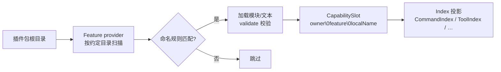

# 约定目录

在插件包根目录下放一个 `commands/` 文件夹、往里丢一个 `.ts` 文件，命令就出现了——不用在任何地方注册。这组会被 Feature 发现机制自动扫描的目录就是**约定目录**：每个目录对应一个 Feature 包（feature provider），目录里的文件按命名规则映射为能力（capability）。发现流程：



几个要点。能力的完整 id 形如 `owner\0feature\0localName`（`\0` 分隔），`localName` 由目录内的相对路径决定；同一 owner 下 `localName`（或同一文件来源）重复会抛 `DiscoveryConflictError`。目录不存在或没有匹配文件时该 Feature 静默跳过——插件只声明自己用到的目录就行。另外，`target: server` 的模块在 Node 侧加载执行，`target: client`（pages）则经构建产物在浏览器加载。

## 目录一览

| 目录 | 文件形态 | 递归 | target | Feature 包 | featureId | 默认导出 |
| --- | --- | --- | --- | --- | --- | --- |
| `commands/` | `.ts` / `.tsx`，支持动态参数文件 | 是（子目录拼层级） | server | `@zhin.js/command` | `zhin.command` | `defineCommand(...)` |
| `middlewares/` | `.ts` | 是 | server | `@zhin.js/middleware` | `zhin.middleware` | `defineMiddleware(...)` |
| `components/` | `.ts` / `.tsx` | 是 | server | `@zhin.js/component` | `zhin.component` | `defineComponent(...)` |
| `adapters/` | `.ts` | 是 | server | `@zhin.js/adapter` | `zhin.adapter` | `defineAdapter(...)` |
| `tools/` | `.ts` | 否 | server | `@zhin.js/tool` | `zhin.agent-tool` | `defineAgentTool(...)` |
| `skills/` | 子目录 + `SKILL.md` | 一层 | server | `@zhin.js/skill` | `zhin.skill` | Markdown 文本 |
| `agents/` | `*.agent.md` | 否 | server | `@zhin.js/agent-feature` | `zhin.agent` | Markdown 文本 |
| `mcp/` | `.ts` | 否 | server | `@zhin.js/mcp-feature` | `zhin.mcp` | `defineMcp(...)` |
| `pages/` | `.ts` / `.tsx`，含 `$nav` / `$footer` 布局槽 | 否 | client | `@zhin.js/page` / `@zhin.js/layout` | `zhin.page` / `zhin.layout` | 页面构件 |

## 命名规则

通用段规则：目录名、普通文件名去扩展名后，默认须匹配 `^[a-z0-9][a-z0-9-]*$`（小写字母/数字开头、可含连字符）。不匹配的文件被跳过。

**例外：`commands/`** 静态段还允许 Unicode 名（如 `赞我.ts`），规则与 `isCapabilityLocalSegment`（`@zhin.js/plugin-runtime`）一致——ASCII kebab，或含非 ASCII 字母且无 ASCII 大写的 Unicode 标识；动态参数文件（`[name].ts` 等）仍限 ASCII。其它约定目录（middlewares / tools / adapters / …）不放宽。

各目录的补充规则：

| 目录 | localName 推导 | 示例 |
| --- | --- | --- |
| `commands/` | 子目录与文件名用 `/` 拼接；静态段可为 ASCII kebab 或 Unicode 名（如 `赞我`）；动态参数文件用 Next.js 风格方括号声明形态并映射为 `$name` 段：`[name].ts(x)` 必需、`[[name]].ts(x)` 可选、`[...name].ts(x)` 捕获所有、`[[...name]].ts(x)` 可选捕获所有；类型与默认值在 `defineCommand({ params })` 中声明 | `commands/lottery-today.ts` → `lottery-today`；`commands/赞我.ts` → `赞我`；`commands/lottery/[[game]].ts` → `lottery/$game` |
| `middlewares/` | 相对路径去扩展名，`/` 拼接 | `middlewares/keyword-reply.ts` → `keyword-reply` |
| `components/` | 同上 | `components/share-music.ts` → `share-music` |
| `adapters/` | 同上 | `adapters/napcat.ts` → `napcat` |
| `tools/` | 文件名去扩展名（不递归子目录） | `tools/music-search.ts` → `music-search` |
| `skills/` | 子目录名即 localName，目录内必须含 `SKILL.md` | `skills/memory-consolidate/SKILL.md` → `memory-consolidate` |
| `agents/` | 文件名去掉 `.agent.md` 后缀 | `agents/planner.agent.md` → `planner` |
| `mcp/` | 文件名去扩展名（不递归） | `mcp/my-server.ts` → `my-server` |
| `pages/` | 文件名去扩展名；`$nav.tsx` / `$footer.tsx` 是布局槽（同 slot 同时有 `.ts` 和 `.tsx` 时以 `.tsx` 为准） | `pages/orchestration.tsx` → `orchestration`；`pages/$nav.tsx` → `nav` |

命令动态参数文件的方括号语法写错会抛 `CommandPathSyntaxError`，提示 `expected [name].ts(x), [[name]].ts(x), [...name].ts(x) or [[...name]].ts(x)`；有默认值时文件名必须用双方括号，且 `params` 中必须声明对应参数，否则同样报错。

## 各目录的最小形态

### commands/ — `defineCommand`

```ts
// plugins/utils/lottery/commands/lottery-today.ts
import { defineCommand } from '@zhin.js/command';

export default defineCommand<LotteryConfig>({
  description: 'Show today published recommendation report',
  async execute({ use }) {
    const { db } = use(lotteryRuntimeToken);
    // …返回字符串即回复
  },
});
```

### middlewares/ — `defineMiddleware`

```ts
// plugins/utils/group-suite/middlewares/keyword-reply.ts（节选）
import { defineMiddleware } from '@zhin.js/middleware';

export default defineMiddleware<Message, GroupSuiteConfig>({
  target: 'inbound',
  async handle(context, next) {
    const config = resolveGroupSuiteConfig(context.config);
    if (!config.keywordReply) {
      await next();
      return;
    }
    // …命中关键词则回复，否则 await next() 放行
  },
});
```

### adapters/ — `defineAdapter`

```ts
// plugins/adapters/napcat/adapters/napcat.ts（节选）
import { defineAdapter } from '@zhin.js/adapter';

export default defineAdapter<NapCatAdapterConfig>({
  capabilities: ['inbound', 'outbound'],
  create(context) {
    const config = resolveNapCatConfig(context.config);
    const gateway = context.use(messageGatewayToken);
    return new NapCatWsEndpoint({ id: context.id, gateway, config });
  },
});
```

`capabilities` 至少含 `inbound` / `outbound` 之一；`create` 返回的 Endpoint 生命周期见 [WS/SSE 端点生命周期](./endpoint-lifecycle.md)。

### tools/ — `defineAgentTool`

```ts
// plugins/utils/music/tools/music-search.ts（节选）
import { defineAgentTool } from '@zhin.js/tool';

export default defineAgentTool<{ keyword: string; source?: MusicSource; limit?: number }>({
  description: '搜索音乐并返回结果列表',
  inputSchema: {
    type: 'object',
    properties: { keyword: { type: 'string', description: '搜索关键词' } },
    required: ['keyword'],
  },
  approval: 'never',
  execute: ({ keyword, source, limit }) => searchMusic(String(keyword), source, limit ?? 5),
});
```

### skills/ 与 agents/ — Markdown

`skills/<name>/SKILL.md` 带 frontmatter（`name` / `description` / `tools` 白名单等），如 `examples/full-bot/skills/memory-consolidate/SKILL.md`：

```markdown
---
name: memory-consolidate
description: 回合末或 master 说「记住」时，将 1–3 条可检索事实写入 memory_entries
tools:
  - memory_upsert
  - memory_search
---
```

`agents/<name>.agent.md` 是 Agent 人格/指令文件，如 `examples/multi-agent-room/agents/planner.agent.md`。

### pages/ — Console 页面

`pages/*.tsx` 编译为浏览器产物，挂进 Remote Console；`examples/full-bot/pages/orchestration.tsx` 是现成例子。`$nav.tsx` / `$footer.tsx` 由 `@zhin.js/layout` 消费，注入导航与页脚。

## 仓库实例

想找生产级参照时，直接翻这些目录：`commands` 看 `plugins/utils/lottery/commands/`（含动态参数 `lottery/[[game]].ts`）；`middlewares` 看 `plugins/utils/group-suite/middlewares/` 和 `plugins/games/*/middlewares/`；`components` 看 `plugins/utils/music/components/share-music.ts`；`adapters` 看 `plugins/adapters/napcat/adapters/napcat.ts`；`tools` 看 `plugins/utils/music/tools/` 与 `plugins/utils/group-suite/tools/`；`skills` 看 `examples/full-bot/skills/memory-consolidate/`；`agents` 看 `examples/multi-agent-room/agents/`；`pages` 看 `examples/full-bot/pages/orchestration.tsx`。
