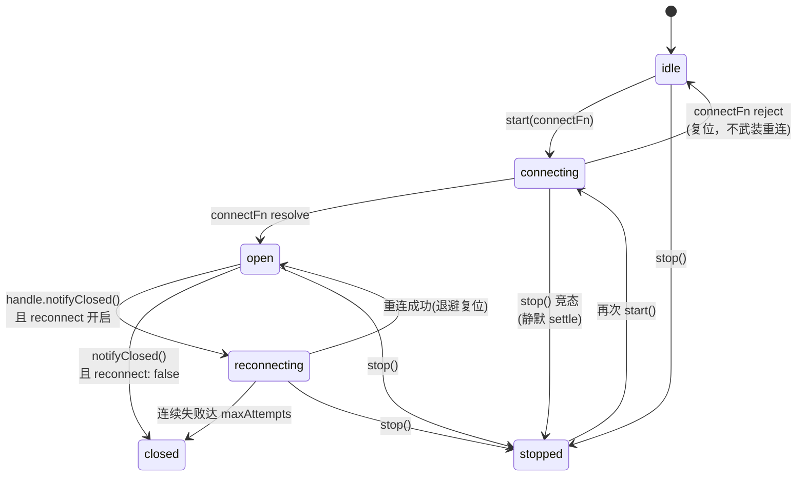

# WS/SSE 端点生命周期

手写过长连接重连循环的人都踩过同样的坑：旧 socket 迟到的 close 事件误杀新连接、stop 与 connect 竞态抛出 unhandled rejection、退避计时器忘了清理。长连接端点（WebSocket / SSE）需要的其实是同一份状态机——连接、断开、指数退避重连、心跳看门狗、主动停止。`@zhin.js/adapter` 的 `createEndpointLifecycle` 把这份状态机收敛为一个基座，napcat 等适配器都在用。**新写 WS/SSE 端点时直接用基座，不要再手写 `#started` / `#reconnectTimer` 旗标。**

## 状态机



先看最容易误解的一点：**初始连接失败 ≠ 断开重连**。`start()` 的 `connectFn` reject 时状态复位回 `idle` 且不武装重连，调用方拿到错误、可以重试；只有**曾 open** 的连接收到 `notifyClosed()` 才武装退避重连。其次是 stop-during-connect 竞态：`connectFn` await 期间调用 `stop()`，`start()` 静默 resolve（主动停止不算失败）。

另外两个判断状态的细节：`started` 为 `true` 当且仅当状态是 `connecting` / `open` / `reconnecting`；每次 connect 尝试递增内部 generation，**陈旧连接句柄的 `notifyClosed` / `onForceClose` 一律被忽略**——旧 socket 的迟到事件不会污染新连接。

## 配置

```ts
import { createEndpointLifecycle } from '@zhin.js/adapter';

const lifecycle = createEndpointLifecycle({
  name: config.name,              // 仅用于日志字段
  reconnect: {
    initialIntervalMs: 5_000,     // 首次重连间隔，默认 5000
    multiplier: 2,                // 退避倍数，默认 2（1 = 固定间隔）
    maxIntervalMs: 60_000,        // 退避封顶，默认 60000
    jitterMs: 250,                // 随机抖动上限，默认 250
    maxAttempts: Infinity,        // 连续失败上限，耗尽进入 closed 终态
  },
  heartbeat: {
    intervalMs: 30_000,           // startHeartbeat 缺省间隔；<=0 不开
    watchdogMisses: 0,            // 看门狗轮数，默认 0 = 关闭
  },
});
```

`reconnect: false` 禁用自动重连，对端断开后直接进入 `closed`。实际延迟 = `min(initial × multiplier^attempt, max) + random(0, jitter)`，重连成功后 attempt 复位；首次断开记 WARN，后续重试静默为 DEBUG，避免刷屏。测试可注入 `random: () => 0` 获得确定退避序列。

## start / stop / notifyClosed

`connectFn` 的契约：连接 open 时 resolve，失败或 open 前 close 时 reject。它收到一个 `EndpointConnectHandle`：

```ts
await lifecycle.start(async (handle) => {
  const ws = new WebSocket(url, { headers });
  // 每次拿到新 socket 都注册强关函数：stop() 与看门狗都会调它
  handle.onForceClose(() => { try { ws.close(); } catch { /* ignore */ } });

  await new Promise<void>((resolve, reject) => {
    let settled = false;
    ws.on('open', () => {
      settled = true;
      lifecycle.startHeartbeat(() => ws.ping(), config.heartbeat_interval);
      resolve();
    });
    ws.on('close', (code, reason) => {
      // 对端断开：通知基座（仅曾 open 才武装重连）
      handle.notifyClosed(new Error(`WS closed: ${code} ${reason}`));
      if (!settled) { settled = true; reject(new Error(`WS closed: ${code}`)); }
    });
    ws.on('error', (err) => {
      if (!settled) { settled = true; reject(err); }
    });
  });
});
```

`stop()` 是主动停止：清全部定时器（重连 + 心跳）、调用已注册的强关函数、唤醒所有竞态等待，**绝不触发重连**，且幂等。适配器在 `stop()` 里先调基座，再做自己的清理：

```ts
// plugins/adapters/napcat/src/ws-endpoint.ts（节选）
async stop(): Promise<void> {
  await this.#lifecycle.stop();          // 清定时器 + 强关 ws + 竞态 settle
  this.#unregisterAgent?.();             // 适配器专有清理
  rejectAllPending(this.#pending);
  this.#inboundDeduper.clear();
  if (this.#ws) {
    try { this.#ws.close(); } catch { /* ignore */ }
    this.#ws = undefined;
  }
}
```

## 心跳与 PONG 看门狗

心跳 API 只有三个：

```ts
lifecycle.startHeartbeat(beat, intervalMs?);  // 启动心跳（重复调用先清旧 timer）
lifecycle.stopHeartbeat();                    // 手动清心跳（close/stop/看门狗时基座自动调）
lifecycle.notifyHeartbeatAck();               // 喂狗：收到任何回包时复位计数
```

看门狗逻辑：开启 `watchdogMisses: N` 后，每轮心跳先累加 miss 计数；**连续 N 轮没有收到任何回包**（`notifyHeartbeatAck` 未被调用）时，基座主动调用 `onForceClose` 注册的强关函数——由底层 `close` 事件驱动 `notifyClosed`，走正常退避重连。ws 的 `message` / `pong` 回调里都应喂狗：

```ts
ws.on('pong', () => this.#lifecycle.notifyHeartbeatAck());
ws.on('message', (data) => {
  this.#lifecycle.notifyHeartbeatAck();   // 有流量即活着
  handleMessage(data);
});
```

## 正面教材：napcat ws-endpoint

`plugins/adapters/napcat/src/ws-endpoint.ts` 是基座的范式用法，结构只有四块：

```ts
export class NapCatWsEndpoint implements EndpointInstance {
  readonly #lifecycle: EndpointLifecycle;
  #ws?: NapCatWsSocket;
  #unregisterAgent?: () => void;

  constructor(options: NapCatWsEndpointOptions) {
    // 1. 构造期建基座；reconnect_interval 旧语义为固定间隔：
    //    multiplier 1 + 无 jitter + 不封顶
    this.#lifecycle = createEndpointLifecycle({
      name: options.config.name,
      reconnect: {
        initialIntervalMs: options.config.reconnect_interval,
        multiplier: 1,
        maxIntervalMs: Number.MAX_SAFE_INTEGER,
        jitterMs: 0,
      },
    });
  }

  async start(): Promise<void> {
    if (this.#lifecycle.started) return;                 // 幂等
    this.#unregisterAgent = registerNapcatAgentEndpoint(this.#options.config.name, this);
    try {
      await this.#lifecycle.start((handle) => this.#connect(handle));
    } catch (err) {
      // start 失败复位由基座保证；agent 注册/反注册是适配器专有依赖，留在适配器侧
      this.#unregisterAgent?.();
      this.#unregisterAgent = undefined;
      throw err;
    }
  }
  // stop() 见上一节；#connect(handle) 见 start/notifyClosed 一节
}
```

对照手写状态机，基座替你删掉了这些字段与分支：

| 手写时代 | 基座接管后 |
| --- | --- |
| `#started` / `#stopping` / `opened` 旗标 | `lifecycle.state` / `lifecycle.started` |
| `#reconnectTimer` + 手写 `setTimeout` 链 | 退避循环内置，可中断 sleep，stop 即时唤醒 |
| `#heartbeatTimer` + 漏 PONG 计数 | `startHeartbeat` + `watchdogMisses` + `notifyHeartbeatAck` |
| 「旧 socket 迟到的 close 事件误杀新连接」 | generation 过期句柄自动失效 |
| 「stop 与 connect 竞态导致 unhandled rejection」 | stopWaiters 竞态 settle，静默 resolve |

适配器侧只保留三类专有逻辑：agent 注册的挂/摘（`registerNapcatAgentEndpoint`）、pending 请求表的拒绝（`rejectAllPending`）、入站去重器清理（`deduper.clear()`）。

## Adapter 1:N endpoints 与 per-endpoint config

一个 Adapter 包声明一次（`adapters/napcat.ts` → `defineAdapter`），但可以在配置里展开为**多个 endpoint 实例**。展开规则在 `packages/im/adapter/src/adapter-index.ts` 的 `expandEndpointConfigs`：插件实例配置含非空 `endpoints: [{ name, ...覆盖项 }]` 时，按数组逐项创建 endpoint，基础配置 = 实例配置去掉 `endpoints` 键，逐项浅合并，`name` 强制写入；`endpoints` 为空或缺省时按实例配置创建单个 endpoint。`name` 必须是非空字符串且不含 `~` / `\0`，重名项保留首个并告警。展开后的 endpoint id 为 `<capabilityId>~<name>`。

```yaml
# examples/full-bot/zhin.config.yml（节选）
plugins:
  napcat:
    connection: ws                 # 基础配置：所有 endpoint 共享
    endpoints:
      - name: full-bot-napcat      # 每个 endpoint 的独立配置
        url: ${ONEBOT11_WS_URL}
        access_token: ${ONEBOT11_ACCESS_TOKEN}
```

`create(context)` 拿到的 `context.config` 就是**合并后的单 endpoint 配置**，`context.name` 是该 endpoint 名——适配器代码不需要感知 1:N 展开，一个 endpoint 实例只服务一条连接。

Endpoint 实例自身的生命周期钩子由 Adapter Index 驱动，与代际事务对齐：

| 钩子 | 时机 |
| --- | --- |
| `start()` | 候选激活时分配传输资源 |
| `open()` | 候选激活时开放 Endpoint 本地事件流；commit 前中央 generation gate 仍拒绝入站 |
| `close()` | 停止准入新事件，保留在途工作 |
| `stop()` | 释放传输资源，调用必须幂等 |
| `send(request)` | 出站发送 |

`NapCatWsEndpoint` 对应关系：`start()` 内 `lifecycle.start(...)` 建连；`open()` / `close()` 翻转 `#open` 旗标（`admit()` 只在 open 时收事件）；`stop()` 走基座 stop 加专有清理。
