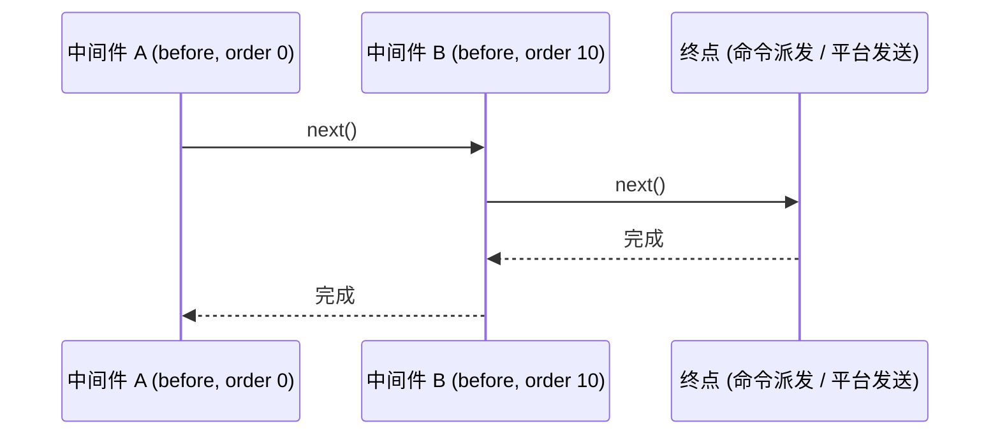
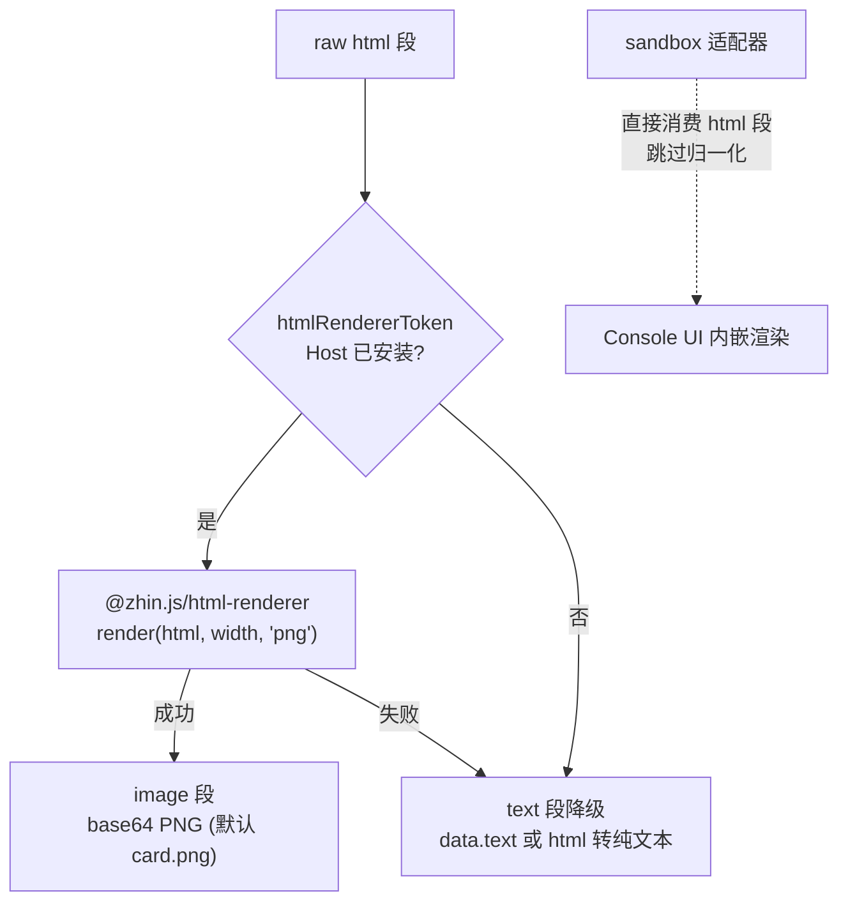

# 中间件与组件

两个相邻的能力：`defineMiddleware`（`@zhin.js/middleware`）拦截消息流，`defineComponent`（`@zhin.js/component`）把结构化 props 渲染成可发送的内容（通常是图片）。

## defineMiddleware

插件包根目录下的 `middlewares/` 是约定目录，每个 `.ts` 文件默认导出 `defineMiddleware(...)`：

```ts
import { defineMiddleware } from '@zhin.js/middleware';
import type { Message } from '@zhin.js/core/runtime';

export default defineMiddleware<Message>({
  target: 'inbound',
  order: 10,
  async handle(context, next) {
    const text = context.input.content?.trim() ?? '';
    if (!text) {
      await next();
      return;
    }
    // …处理；调用 next() 放行，直接 return 则拦截
    await next();
  },
});
```

### 声明项

| 字段 | 默认 | 取值 | 说明 |
| --- | --- | --- | --- |
| `phase` | `'before-dispatch'` | `before-dispatch` / `after-dispatch` | 在命令派发前还是后执行 |
| `target` | `'inbound'` | `inbound` / `outbound` | 拦截入站消息还是出站信封 |
| `order` | `0` | 安全整数 | 同 phase 内的排序键 |

- **inbound**：`context.input` 是 Runtime `Message`，可读 `content`、`sender`、`$reply(...)`。拦截时不调 `next()`，直接 `$reply` 后 return 即可（游戏插件的文本入口就是这个模式）。
- **outbound**：`context.input` 是出站信封（`OutboundEnvelope`），`payload` 是即将发给平台的 wire 段，可做审计、改写、追加。

### 执行序

同一 `target` 内，排序键依次为：**phase → order → 插件拓扑序（Root 先，子插件按树序）→ slot id**。链是洋葱模型：



约束：`next()` 最多调用一次，重复调用抛 `Middleware next() called more than once`；不调 `next()` 即中断链条（终点不执行）。`context` 还带有 `config` / `use(token)` / `owner` / `generation`，与其它能力上下文一致。

真实示例见 `plugins/games/rps/middlewares/rps-choice.ts`：识别游戏 payload 文本（`rps:<session>:<choice>`）或数字 fallback（「1 石头 2 布 3 剪刀」），命中则处理并 `$reply`，否则 `next()` 放行给后续中间件与命令派发。

## defineComponent

`components/` 是约定目录（支持 `.tsx`），每个文件默认导出 `defineComponent(...)`：

```tsx
// components/status-card.ts（提炼自 examples/minimal-bot）
import { defineComponent } from '@zhin.js/component';
import { raw } from 'zhin.js/core/runtime';
import { Card, CardHeader, Row, StatChip, h, wrapCardHtml, DEFAULT_CARD_THEME } from '@zhin.js/satori';

interface StatusCardProps {
  readonly title: string;
  readonly lines: readonly { label: string; value: string }[];
}

export default defineComponent<StatusCardProps>({
  render({ title, lines }) {
    const body = h(Card, {
      children: [
        h(CardHeader, { title, meta: 'minimal-bot' }),
        h(Row, {
          gap: 10,
          children: lines.map((line) =>
            h(StatChip, { label: line.label, value: line.value, accent: DEFAULT_CARD_THEME.accentMem })),
        }),
      ],
    });
    return raw({
      type: 'html',
      data: { html: wrapCardHtml(body, DEFAULT_CARD_THEME.canvas), width: 540 },
    });
  },
});
```

### 调用与解析

命令（或任何出站内容）用 `component(name, props)` 调用：

```ts
import { component } from 'zhin.js/core/runtime';

return component('status-card', { title: 'my-bot', lines: [{ label: 'RSS', value: '42MB' }] });
```

- 组件按**调用者插件沿插件树向上**解析：子插件可以先用自己的同名组件覆盖，找不到再取父插件的。
- 渲染是递归的：组件的 `render` 可以再返回 `component(...)`，深度上限 32。
- `render(props, context)` 的 `context` 额外带 `requester`（调用方插件节点），以及常规的 `config` / `use` / `owner` / `generation`。

### 渲染为图片（html-renderer）

`raw({ type: 'html', data: { html, width } })` 段在出站归一化时转换：



要点：

- 渲染 Host 是可选资源（`htmlRendererToken`，由 `@zhin.js/html-renderer` 提供）；**未安装时自动降级为文本**，组件代码不用改。
- 默认宽度 540px、格式 PNG；`data.text` 可作为自定义降级文案，`data.fileName` 自定义图片文件名。
- **sandbox 适配器直接消费 html 段**（Console UI 内嵌展示），不经过图片/文本归一化。
- 降级是「尽力而为」：渲染抛错也会落到文本，不会阻塞发送。

## 游戏插件的双模式降级

游戏插件（`plugins/games/*` + `@zhin.js/game-kit`）把「按钮键盘 + 文本数字」做成同一份内容的两种消费方式：

1. **按钮模式**（支持键盘的平台）：`buildGridKeyboard` / `buildChoiceKeyboard` 产出 `keyboard` 段，按钮 payload 形如 `ttt:<sessionId>:<cell>`。
2. **文本模式**（无按钮能力的平台）：同一条消息附 ASCII 棋盘和 `fallbackHint`（如「落子：回复数字 1-9（仅空格）」），`fallback.map` 把数字映射回 payload。

```ts
// plugins/games/tic-tac-toe/src/board-view.ts（节选）
return buildGridKeyboard({
  gamePrefix: TTT_PREFIX,
  sessionId,
  rows: 3,
  cols: 3,
  cells: boardToCells(board, highlight),
  statusLine,
  renderAscii: renderTttAscii,
  fallbackHint: '落子：回复数字 1-9（仅空格）',
  postChoices: terminal ? [{ id: 'restart', label: '🔄 再来一局', style: 'primary' }] : undefined,
  channelType,
});
```

配套的 inbound 中间件把两条输入路径归一：直接 payload（按钮回调转文本）走 `parseGridPayload`；纯数字文本经 `buildGridFallbackMap` 反查为 payload，再走同一处理函数。中间件、组件降级因此是同一思想的两侧：**内容只写一遍，按平台能力选择呈现**。
