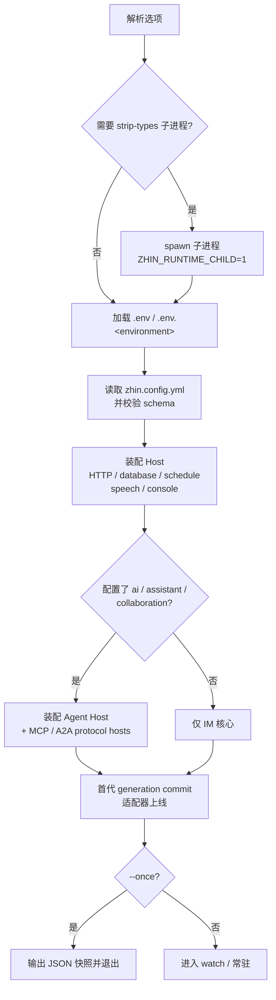

# zhin runtime start 详解

改完一个命令文件，不用重启进程，下一条消息就走新逻辑——开发模式下这一切由 `zhin runtime start` 完成。它直接以 Node 原生 TypeScript 能力执行项目里的 `.ts` 插件源码，按需装配各 Host（HTTP / 数据库 / Console / Agent / MCP / A2A），并在开发模式下提供进程内热重载。

```bash
zhin runtime start                          # 开发模式（默认，watch + HMR）
zhin runtime start --mode production --no-watch   # 生产模式
zhin runtime start --daemon                 # 守护进程模式
zhin runtime start --once                   # 启动一次后退出（CI / 脚本）
```

脚手架生成的项目把常用组合固化成脚本：

```json
{
  "scripts": {
    "dev": "zhin runtime start",
    "start": "zhin runtime start --mode production --no-watch"
  }
}
```

## 选项

| 选项 | 说明 |
| --- | --- |
| `--mode <mode>` | 运行模式：`development`（默认）/ `test` / `production` |
| `--environment <name>` | 环境名，默认 `development`；决定加载 `.env.<name>`，须匹配 `/^[a-z0-9][a-z0-9-]*$/` |
| `--no-watch` | 关闭文件监听与热重载 |
| `--once` | 完成一次启动后输出 JSON 快照并退出 |
| `-d, --daemon` | 守护进程模式：写 pid 文件、日志重定向、崩溃自动重启 |
| `--log-file <path>` | daemon 日志文件，默认 `<项目根>/.zhin/runtime.log` |

未知选项会在启动前直接报错（fail fast），不会进入重启循环。

## 原生 TypeScript（strip-types）

运行时不经过编译步骤，插件源码（`plugin.ts` 等）由 Node 直接执行。最低要求 Node `>=22.6.0`，低于此版本直接报错。Node `>=22.18` / `>=23.6`（strip-types 已免旗标）时，前台启动直接在当前进程内运行；落在 `22.6`–`22.17` 区间时，CLI 会以 `--experimental-strip-types` 重新拉起一个子进程执行，并抑制相关 ExperimentalWarning。daemon 模式则总是经过 supervisor → 子进程两层结构（见下文进程管理）。

因为是「源码即运行时」，import 本地 TS 文件必须带 `.js` 扩展名（由运行时做 specifier 重映射），这也是仓库代码约定之一。

## 启动流程



注意 Agent 栈是**按需加载**的：只有配置了 `ai` / `assistant` / `collaboration` 任一段，才会解析 `@zhin.js/agent`；纯 IM 项目不会载入 AI 依赖。启动成功后的输出也因环境而异——TTY 下是一行摘要（插件数、HTTP 地址、在线/离线适配器），非 TTY 或 `--once` 则输出结构化 JSON（`{ started: true, ... }`），便于脚本消费。配置校验失败会报 `Invalid Plugin config in zhin.config.yml` 并列出全部问题。

## HMR 语义

开发模式默认开启文件监听（`--once` / `--no-watch` 关闭）。变更按影响面分两级处理：

| 变更内容 | 处理方式 |
| --- | --- |
| 插件 / 应用源码 | **进程内世代（generation）重载**：只重建受影响的 capability slot 与插件子树，Console 经 SSE 收到 `hmr:reload` |
| 依赖清单类文件（`pnpm-lock.yaml`、`pnpm-workspace.yaml`、`package-lock.json`、`yarn.lock`） | **进程级重启**：进程以退出码 `75` 退出，由外层 supervisor 重新拉起 |

世代重载是事务式的：新世代先完成装配与 commit，再异步 dispose 旧世代；HTTP 端口在世代切换时先释放再 listen，不会出现端口占用导致的 Console 丢失。同一批文件事件会合并为一次世代事务，避免连续抖动。

## 进程管理

### daemon 模式

```bash
zhin runtime start --daemon            # 日志进 .zhin/runtime.log
zhin runtime start -d --log-file ./bot.log
zhin stop                              # 停止（读取 .zhin.pid）
```

supervisor 常驻并把自身 pid 写入 `<项目根>/.zhin.pid`，bot 进程的 stdout/stderr 追加到日志文件。崩溃（信号或非零退出）与退出码 `75` 都会触发重新拉起；`zhin stop` 或 `kill -TERM <pid>` 正常结束。另有**风暴保护**：最多每分钟重启 10 次、每次间隔 3 秒，超出预算 supervisor 放弃并退出，避免崩溃循环刷爆平台连接。

### 退出码

| 退出码 | 含义 |
| --- | --- |
| `0` | 正常退出 |
| `51` | Console 请求重启（daemon 下会被自动拉起） |
| `75` | restartRequired（依赖状态变化等），supervisor 按风暴保护重启 |

### 孤儿看门狗

bot 进程每 2 秒检查一次 supervisor（`ZHIN_SUPERVISOR_PID`）与父进程存活状态。wrapper 被 `kill -9`、终端关闭或崩溃时，bot 会主动关闭——不会留下仍握着平台连接和文件监听的僵尸进程。SIGINT / SIGTERM / SIGHUP 也会被转发给子进程。

## 典型场景

```bash
# 日常开发：HMR + Console
pnpm dev

# 生产：关闭 watch，日志走 stdout（交给 systemd / 容器收集）
zhin runtime start --mode production --no-watch

# 裸机常驻：daemon + 开机自启
zhin runtime start --daemon
zhin service install

# CI 冒烟：起一次确认配置与装配无误
zhin runtime start --once --mode test
```

相关命令与退出行为见 [CLI 参考](./index.md)；配置项见 [配置参考](../configuration/index.md)。
