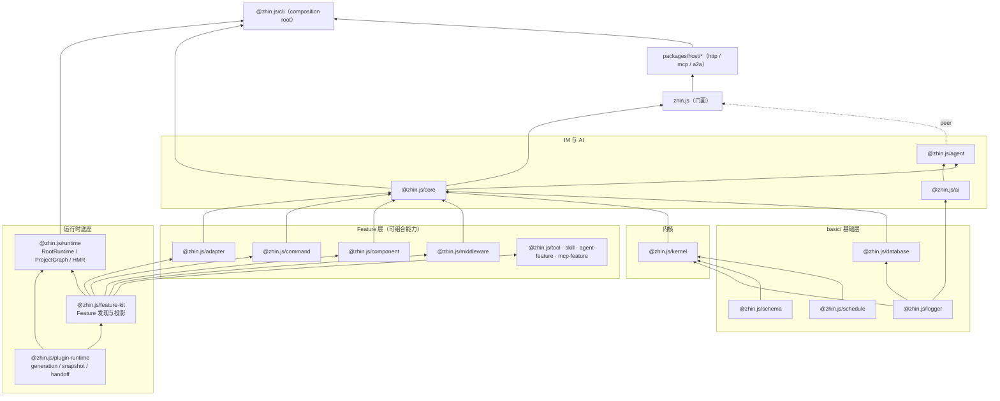

# 分层架构

`pnpm check:architecture` 会在 CI 里拦住一类错误：下层包 import 了上层包。这个 pnpm workspace monorepo 里，包之间的依赖方向**单向向下**——上层可以依赖下层，下层永远不知道上层的存在。这条方向由 harness 强制检查，不是口头约定。

## 分层总览



依赖关系的权威来源是各包的 `package.json`。读它之前，先记住几个关键事实。

底座是运行时底座包（`packages/im/plugin-runtime`）：它不依赖任何 workspace 包，generation、snapshot、dispose、token 都从这里长出来。往上一层，`@zhin.js/feature-kit` 只依赖运行时底座，提供 Feature provider 的注册、发现与投影机制。Feature 层各包（adapter / command / component / middleware / handler / tool / skill / …）只依赖 `feature-kit` + 运行时底座，彼此不互相依赖。

再往上，`@zhin.js/core` 把 adapter / command / component / middleware 四个 Feature 和 kernel 组装成 IM 层（Plugin、Adapter、Endpoint、消息收发）。门面包 `zhin.js` 把核心包重新导出为统一入口——插件作者只需 `import { ... } from 'zhin.js'`。`@zhin.js/agent`、`@zhin.js/ai` 等是可选 peer 依赖，默认安装只含 IM 核心，AI 按需加装。

## 各层职责

| 层 | 包 | 职责 |
|----|----|------|
| 基础层 | `basic/logger` `schema` `schedule` `database` | 日志、配置校验、定时、数据库，零/近零依赖 |
| 运行时底座 | `packages/im/plugin-runtime`（用户从 `zhin.js` 导入） | generation 事务、快照租约、handoff、dispose（见 [generation 与生命周期](./generation-lifecycle.md)） |
| Feature 机制 | `@zhin.js/feature-kit` | 声明 Feature provider、按约定发现能力、投影成运行时索引 |
| 内核 | `@zhin.js/kernel` | 插件系统与错误体系，无 IM 概念 |
| Feature 层 | `@zhin.js/adapter` `command` `component` `middleware` … | 一类能力的契约（如 `defineAdapter`）+ 投影索引（如 `AdapterIndex`） |
| AI 引擎 | `@zhin.js/ai` | Provider、agentLoop、会话、记忆，无 IM 概念 |
| IM 层 | `@zhin.js/core` | Plugin、消息链路、命令分发（见 [消息流](./message-flow.md)） |
| Agent | `@zhin.js/agent` | 多模型编排、工具安全策略、MCP client |
| 门面 | `zhin.js` | 再导出 core 创作面；`zhin.js/agent`、`zhin.js/ai` 子路径按需暴露 |
| 运行时 | `@zhin.js/runtime` | `RootRuntime`：扫描项目图、组合配置、执行 generation 事务、HMR |
| 装配 | `@zhin.js/cli` | composition root，`zhin runtime start` 把一切装起来 |

## Composition root：`@zhin.js/cli`

框架本身不"启动"任何东西——各层只提供机制。把机制组装成一个可运行进程的代码集中在 `@zhin.js/cli`，这是全仓库唯一允许跨层导入所有包的地方（分层规则的唯一例外）。

`zhin runtime start`（定义在 `basic/cli/src/commands/runtime.ts`，装配逻辑在 `basic/cli/src/plugin-runtime/`）做的事：

1. 用 `YamlConfigDocument`（`@zhin.js/config-yaml`）把 `zhin.config.yml` 包装成带事务的 `ConfigDocumentPort`；
2. 创建 `RootRuntime`（`@zhin.js/runtime`），注入模块加载器（开发模式为 `NativeDevelopmentModuleRuntime`）、配置端口和 Root 资源安装器；
3. 通过 `installResources` 安装 Host 级资源：HTTP Host、数据库、Agent Host（含 AI 兜底处理器）、Console API 等；
4. 启动后挂上 `HmrCoordinator`，文件变更触发 generation 重载或进程重启。

用户项目的入口因此可以极小。`examples/minimal-bot/package.json`：

```json
{
  "name": "minimal-bot",
  "type": "module",
  "scripts": {
    "dev": "zhin runtime start",
    "start": "zhin runtime start --mode production --no-watch"
  },
  "dependencies": {
    "zhin.js": "workspace:*"
  },
  "zhin": {
    "protocol": 1,
    "type": "plugin",
    "entry": "./plugin.ts",
    "engine": "^1.0.0",
    "runtime": "trusted",
    "features": [],
    "plugins": []
  }
}
```

项目本身就是一个插件（Root Plugin），CLI 负责发现并启动它。插件清单字段的完整解释见 [插件模型](./plugin-model.md)，配置的声明与校验见 [配置即数据](./config-as-data.md)。

## 分层规则的推论

写 Feature（新能力类型）时只依赖 `feature-kit` / `plugin-runtime`，不要 import `core`。`kernel`、`ai` 不知道"群""私聊"这些 IM 概念；IM 概念只出现在 `core` 及以上。Host（`packages/host/http`、`mcp`、`a2a`）在 `core` 之上、由 CLI 装配，插件不直接依赖 Host 进程。
