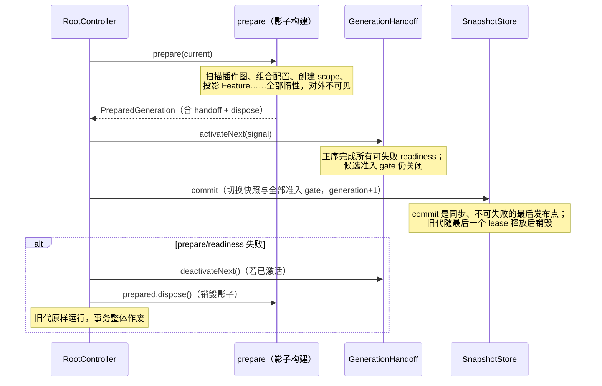

# Generation 与生命周期

改完一个命令文件，不用重启进程，在途的消息也不会被拦腰掐断——因为运行时里启动、热重载、配置变更走的都是同一条路径：一次 **generation 事务**。先在"影子"里把新一代完整构建出来，再做一次原子交接。任何时刻进程里都只有一个当前代，交接失败则旧代原样继续服务——不存在半新半旧的中间态。

## 快照：一代的世界状态

每一代是一份不可变的 `RuntimeSnapshot`（从 `zhin.js` 导入类型）：

```ts
interface RuntimeSnapshot {
  readonly generation: number;                       // 代数，从 0 开始单调递增
  readonly root: PluginId;
  readonly tree: ReadonlyMap<PluginId, PluginNodeSnapshot>;   // 插件树
  readonly config: ReadonlyMap<PluginId, unknown>;            // 各插件的 ConfigView
  readonly resources: ReadonlyMap<PluginId, ReadonlyMap<TokenId, unknown>>;
  readonly capabilities: ReadonlyMap<CapabilityId, CapabilitySlot>;
  readonly projections: ReadonlyMap<FeatureId, unknown>;      // AdapterIndex、CommandIndex…
}
```

快照的集合结构使用只读视图；可序列化 descriptor 必须不可变，有状态 Resource 则只通过受控接口暴露。插件代码拿到的永远是某个确定代的世界状态。

`RuntimeSnapshot` 与 Runtime 的 ownership、generation model 等 sidecar 一起组成
`CommittedGeneration`。Root 只交换这一条完整 record，commit observer 不可能看到
“新 snapshot + 旧 ownership”的混合世界。

## 单一原子发布点

`RootController` 把所有控制操作串行化（promise 队列），每次事务执行同一条流水线：



对应的代码骨架（`RootController.transact`）：

```ts
const previous = this.snapshots.acquire();
try {
  prepared = await prepare(previous.value, signal);
  if (!prepared) return previous.value;      // 无变化，直接返回
  if (prepared.handoff) {
    await prepared.handoff.activateNext(signal);
  }
  return this.#commitGeneration(previous.value.generation, prepared);
} catch (error) {
  return this.#rollback(prepared, { activated }, error);
} finally {
  previous.release();
}
```

`GenerationHandoffStack` 只组合候选资源的 readiness：`activateNext` 按正序执行，失败时对已经成功激活的参与者逆序执行 `deactivateNext`。旧代在整个事务中不被触碰；补偿也失败时 Root fail-closed，不再接纳新操作。

### Adapter 的准入由快照原子切换

`@zhin.js/adapter` 不会提前关闭旧 Endpoint。候选 `AdapterIndex` 在
`activateNext` 中完成 `start()` 与 `open()`，但 `CapabilityContext` 注入的是绑定到候选代
`GenerationAdmissionGate` 的 `OutboundMessageService`；commit 前所有入站都 fail-closed。`SnapshotStore`
提交新快照时同步关闭被移除的 gate、开放新 gate，保留在两代里的同一投影不会被短暂关闭。

因此旧代在 commit 前始终可用，候选激活失败只需 `stop()` 候选；commit 后旧 Endpoint
仍可随旧 lease drain，迟到事件会被旧 gate 拒绝，最终由旧代 disposer 执行
`close()` / `stop()`。不存在 Adapter 专用的 `quiescePrevious`、`resumePrevious` 或
post-commit `openNext` 阶段。已配置 Endpoint 全部是 required prerequisite：create、start、
open 任一失败都拒绝候选代，不会发布 inert/unconfigured record，也不会后台 late-open。
共享 HTTP listener 归 Process Host；候选 generation 只能向 `HttpHost` routing port 注册带
gate 的 HTTP/WS route，不能 listen/close，也不会在 commit 前遮住旧代同路径 route。

## 快照租约：在途消息不被打断

commit 只换指针，旧代不立刻销毁——它可能还在服务在途消息。`SnapshotStore` 用租约（lease）管理：

- `acquire()` 拿到当前代快照并 +1 引用；用完 `release()`；
- 被替换的旧代标记 retired，等租约归零才真正 `dispose()`；
- `RootController.stop()` 会等所有历史代都释放完毕才返回，因此停机不会在消息处理中途掐断资源。

## HMR 语义

`HmrCoordinator`（`@zhin.js/runtime`）监听文件变更，把同一次文件系统操作产生的一批事件合并成一个事务，然后由 `InvalidationPlanner` 规划失效范围：

- **generation 级**：变更只影响某些插件子树或能力 slot → 只重建受影响部分（subtree / slot / topology 三种 preparer），走上面那套交接；
- **process 级**：模块加载器无法安全失效的变更、或 manifest 拓扑变更越过了重启边界（`RestartBoundaryPlanner` 判定，比如新增/删除子插件依赖）→ 交给 `onRestartRequired`，由外层（CLI）重启进程。

失败的 HMR 事务会作废本批次剩余变更并走 `onError`，不会静默重放。HMR stop
会先停止接纳新事件，再等待在途 reload settlement；process restart 一旦确定，当前
coordinator 不再接受新的 generation reload。commit 后的 Console/日志观察器失败只进入
诊断通道，不会把已经提交的 reload 改写成失败。

## 为什么资源必须挂 lifecycle

热重载 = 旧代销毁、新代重建。如果插件把资源挂在**模块级变量**里（`let _db = ...`），模块被重新加载时旧变量跟着旧代死了，但某些回调还持有旧引用——这就是"幽灵单例"事故的典型成因（定时器重复触发、拿到已关闭的数据库连接）。

规则很简单：**一切有生命周期的资源都注册进 `context.lifecycle`（一个 `DisposeStack`）**，generation 结束时统一反注册。

跨模块共享的代级状态必须作为 snapshot Resource 提供，并由一次 operation 持有的
`GenerationView` 解析。禁止模块级 latest-value stack、`createGenerationStore` 或任何
“当前活代”查询；它们既无法隔离多个 Root，也会让 shadow candidate 在 commit 前可见。
