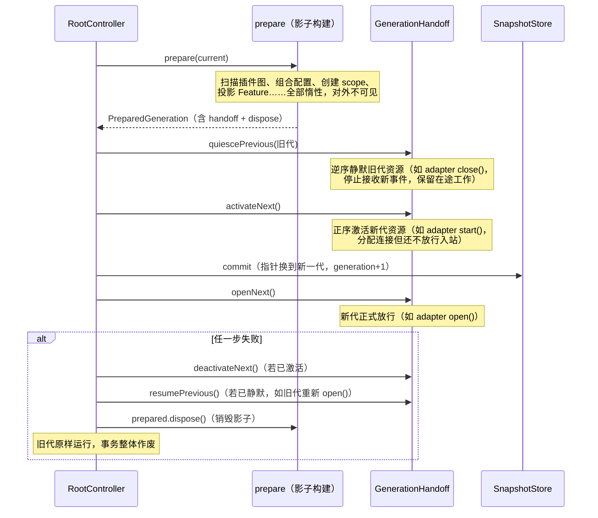

# Generation 与生命周期

Zhin.js 运行时的每一次启动、热重载、配置变更，都是一次 **generation 事务**：先在"影子"里把新一代完整构建出来，再做一次原子交接。任何时刻进程里都只有一个当前代，交接失败则旧代原样继续服务——不存在半新半旧的中间态。

## Generation 是什么

一个 generation 就是一份不可变的 `RuntimeSnapshot`（`@zhin.js/plugin-runtime`）：

```ts
interface RuntimeSnapshot {
  readonly generation: number;                       // 代数，从 0 开始单调递增
  readonly root: PluginId;
  readonly tree: ReadonlyMap<PluginId, PluginNodeSnapshot>;   // 插件树
  readonly config: ReadonlyMap<PluginId, unknown>;            // 各插件的 ConfigView
  readonly resources: ReadonlyMap<PluginId, ReadonlyMap<TokenId, unknown>>;
  readonly capabilities: ReadonlyMap<CapabilityId, CapabilitySlot>;
  readonly projections: ReadonlyMap<FeatureId, unknown>;      // AdapterIndex、CommandIndex…
}
```

快照深冻结（Map 也是只读视图），插件代码拿到的永远是某个确定代的世界状态。

## 五段原子交接

`RootController` 把所有控制操作串行化（promise 队列），每次事务执行同一条流水线：



对应的代码骨架（`RootController.transact`）：

```ts
const previous = this.snapshots.acquire();
try {
  prepared = await prepare(previous.value);
  if (!prepared) return previous.value;      // 无变化，直接返回
  if (prepared.handoff) {
    await prepared.handoff.quiescePrevious(previous.value);
    await prepared.handoff.activateNext();
  }
  return this.#commitGeneration(previous.value.generation, prepared);
} catch (error) {
  return this.#rollback(prepared, { quiesced, activated }, error);
} finally {
  previous.release();
}
```

`GenerationHandoffStack` 组合多个资源的交接动作：quiesce 按逆序、activate 按正序执行；中途失败时自动补偿（已静默的恢复、已激活的停用），补偿也失败则聚合为 `AggregateError` 抛出。

### 适配器是最直观的例子

`@zhin.js/adapter` 的投影把整条 Endpoint 生命周期映射到这五段上：

| 交接阶段 | 动作 | Endpoint 方法 |
|----------|------|---------------|
| quiescePrevious | 旧代停止接收新消息 | `close()` |
| activateNext | 新代建立连接（不放行） | `start()` |
| commit 之后 openNext | 新代放行入站 | `open()` |
| 失败 deactivateNext | 新代释放资源 | `stop()` |
| 失败 resumePrevious | 旧代恢复放行 | `open()` |

Endpoint 契约（`EndpointInstance`）：`start` 分配传输资源但不得接收事件；`open` 在新代 commit 后放行；`close` 停止新事件但保留在途工作；`stop` 释放资源且必须幂等。

## 快照租约：在途消息不被打断

commit 只换指针，旧代不立刻销毁——它可能还在服务在途消息。`SnapshotStore` 用租约（lease）管理：

- `acquire()` 拿到当前代快照并 +1 引用；用完 `release()`；
- 被替换的旧代标记 retired，等租约归零才真正 `dispose()`；
- `RootController.stop()` 会等所有历史代都释放完毕才返回，因此停机不会在消息处理中途掐断资源。

## HMR 语义

`HmrCoordinator`（`@zhin.js/runtime`）监听文件变更，把同一次文件系统操作产生的一批事件合并成一个事务，然后由 `InvalidationPlanner` 规划失效范围：

- **generation 级**：变更只影响某些插件子树或能力 slot → 只重建受影响部分（subtree / slot / topology 三种 preparer），走上面那套交接；
- **process 级**：模块加载器无法安全失效的变更、或 manifest 拓扑变更越过了重启边界（`RestartBoundaryPlanner` 判定，比如新增/删除子插件依赖）→ 交给 `onRestartRequired`，由外层（CLI）重启进程。

失败的 HMR 事务会作废本批次剩余变更并走 `onError`，不会静默重放。

## 为什么资源必须挂 lifecycle

热重载 = 旧代销毁、新代重建。如果插件把资源挂在**模块级变量**里（`let _db = ...`），模块被重新加载时旧变量跟着旧代死了，但某些回调还持有旧引用——这就是"幽灵单例"事故的典型成因（定时器重复触发、拿到已关闭的数据库连接）。

规则很简单：**一切有生命周期的资源都注册进 `context.lifecycle`（一个 `DisposeStack`）**，generation 结束时统一反注册。

跨模块共享的代级状态用 `createGenerationStore`，它是模块级单例的代安全替代品：

```ts
import { createGenerationStore } from '@zhin.js/plugin-runtime';

const dbStore = createGenerationStore<Database>('my-plugin.db');

// setup 中：发布本代的值，lifecycle 销毁时自动反注册
export default definePlugin({
  name: 'my-plugin',
  setup(context) {
    const db = openDatabase(context.config.get());
    context.lifecycle.add(() => db.close());
    dbStore.provide(context, db);
  },
});

// 运行时任意模块：永远拿到当前活代的值
const db = dbStore.use();      // 无活值时抛出带 store 名的错误
const maybe = dbStore.tryUse(); // 或无活值时返回 undefined
```

provide 的值构成栈：最新活注册胜出；所属代结束、注册被 `lifecycle` 移除后，自动重新暴露上一代的值。结构上杜绝了"拿着已销毁代的引用继续跑"的可能。
