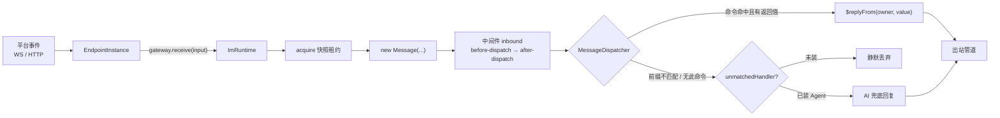
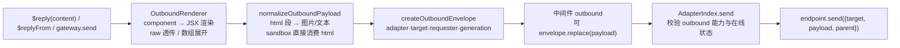

# 消息流

用户在群里发一条 `/ping`，到 Bot 的回复落回平台，中间经过的每个环节都在一条单向管道上：**入站**从平台 Endpoint 流向命令/AI，**出站**从插件代码流向平台 Endpoint。整条管道由 `ImRuntime`（`@zhin.js/core` 的 `MessageGateway` 实现）串起来，每个环节都从当前 generation 快照取数，天然热重载安全。

## 入站：Adapter → 中间件 → 命令 → AI 兜底



各环节的真实代码位置：

1. **Endpoint 归一化**。平台适配器的 Endpoint（如沙箱的 `SandboxWsEndpoint`）把平台事件归一化为 `IncomingMessage`，调用创建时注入的 `messageGatewayToken`：

   ```ts
   interface IncomingMessage {
     readonly conversation: ConversationRef; // 结构化会话（endpoint/kind/id/parent/threadId）
     readonly message?: MessageRef;   // 平台消息身份（原生消息 id）
     readonly content: string;
     readonly sender?: string;
     readonly metadata?: Readonly<Record<string, unknown>>; // 如 endpoint 名
   }
   ```

2. **租约与 Message**。`ImRuntime.receive` 先 `acquire()` 当前代快照（在途消息不被重载打断，见 [generation 与生命周期](./generation-lifecycle.md)），查出该 endpoint 的 owner 插件作为默认 requester，构造 `Message`。`Message` 携带 `$reply(content)` 与 `$replyFrom(owner, content)` 两个出站闭包；dispatch 结束后 reply 作用域关闭，之后再调 `$reply` 会抛 `Message reply scope has ended`。

3. **入站中间件**。`MiddlewareIndex` 按 `phase`（`before-dispatch` 先、`after-dispatch` 后）与 `order` 排序，逐个包住终端动作：

   ```ts
   defineMiddleware({
     phase: 'before-dispatch',   // 默认
     target: 'inbound',          // 默认；'outbound' 拦截出站
     order: 0,
     async handle(context, next) {
       // context.input 是 Message（inbound）或 OutboundEnvelope（outbound）
       await next();             // 不调用 next() 即拦截
     },
   });
   ```

4. **命令分发**。`MessageDispatcher` 先解析命令前缀（默认按消息所属适配器实例的配置：`endpoints[i].commandPrefix` 覆盖顶层 `commandPrefix`，默认 `''` 无前缀，见 [配置即数据](./config-as-data.md)），前缀不匹配直接 miss；命中前缀则剥离后交给 `CommandIndex.dispatch`。命令有返回值时，分发器用命令 owner 身份 `$replyFrom(owner, value)` 自动回复。

5. **AI 兜底**。命令 miss（或无前缀文本）时交给 `unmatchedHandler`——装了 `@zhin.js/agent` 的 Host 会把它接到 Agent 回复；未安装则消息安静丢弃。

6. **事件广播**。dispatch 完成后向 `onMessage` 订阅者发出 `RuntimeMessageEvent`（含方向、conversation、sender、≤200 字的 `contentPreview`、时间戳），Console 的实时消息流就是消费它。

## 出站：$reply → 渲染 → 中间件 → Endpoint



- **SendContent 形态**（`packages/im/core/src/plugin-runtime/im/contracts.ts`）：字符串；canonical `Segment`（一等公民，见下文「多模态」）；`component(name, props)` 组件调用（经 `ComponentIndex` 递归渲染，深度上限 32）；`raw(payload)` 原样透传；以及它们的数组嵌套。
- **Envelope** 携带 `adapter`、`target`、`requester`（发起方插件，用于组件权限与审计）、`generation`，并提供 `replace(payload)` 给出站中间件改写内容。
- **出站中间件**与入站共用一套定义，`target: 'outbound'` 即拦截出站。
- **最终一公里**在 `AdapterIndex.send`：endpoint 必须声明 `outbound` 能力、且处于 `started && !stopped`，否则抛错；通过后调用 `endpoint.send()` 落到平台。

所有发送都应走这条统一管道（`$reply` / `$replyFrom` / `gateway.send`），不要在插件里直接持有平台 SDK 发消息——那会绕过渲染、中间件与事件广播。

## 多模态：双向 Segment 一贯制

全框架只有一种媒体表达——canonical `Segment` + `MediaRef`（`packages/im/core/src/built/segment-contract/types.ts`）：

```ts
interface MediaRef {
  kind: 'url' | 'path' | 'base64' | 'file';  // file = 平台不透明引用（Telegram file_id 等）
  value: string;
  mime_type?: string;
  file_name?: string;
  size?: number;
}
// image / audio / video / file 段的 data 一律为 { media: MediaRef, alt?/duration?/name? }
```

**入站**：适配器把平台载荷归一为 `Segment[]` 随 `gateway.receive({ segments })` 上送 → Agent 的入站注入（`packages/im/agent/src/turn/inbound-media.ts`）把当前 turn 的媒体挂到 `UserMessage.media`（ai 层 Segment 同构的 `MediaContentBlock`，**不随 session 持久化**，历史中只存文本视图）。策略：`ai.multimodal`（`media/resolve-config.ts`）——图片 url 直挂 / path 物化 base64；音频默认 STT（`@zhin.js/speech` 可选，失败降级占位文本）；视频/文件默认占位文本。provider 边界的序列化器（`packages/im/ai/src/llm/convert/media-blocks.ts`）按能力表过滤：缺省 image-only，不支持的类型在边界降级为占位文本，框架内部永不出现任一厂商的 API 格式。

**出站**：AI 回复 → `OutputElement[]` → canonical `Segment[]`（`publishOutboundElements`）→ `$reply`（Segment 是一等 `SendContent`）→ `normalizeOutboundPayload`（html→image/文本、keyboard、媒体协商）→ endpoint。媒体协商按 adapter definition 的 `segments.outboundMedia` 声明驱动（`'url' | 'path' | 'base64' | 'upload'`）：仅 `url-or-text` 端点会在中央把非 URL 媒体降级为文本；其余由 adapter 按平台最优路径自物化（URL 直发 / base64 直发 / 平台上传 / 读盘），无 `data.media` 的段会被 warn 丢弃——legacy `data.url/file/base64` 形状已不存在。

## Endpoint 1:N 展开

一个适配器插件实例配置里声明 `endpoints: [{name, ...}]` 时，`AdapterIndex` 把它展开成 N 条独立 endpoint 记录（配置合并规则见 [配置即数据](./config-as-data.md)）：

- 每条记录的能力 id 形如 `<slot id>~<name>`，拥有自己的生命周期（start/open/close/stop）与在线状态；
- 消息上的 `$adapter` 携带展开后的标识（如 `icqq~8596238`），回复沿原路返回对应账号；
- Console 侧按 `(adapter, endpointId)` 寻址，`AdapterIndex.resolve` 依次匹配本地名、能力 id、owner 路径段和 Endpoint 的运行时名（如 ICQQ 的 uin），多匹配时优先精确的 endpoint 名。

因此"两个 QQ 号各收各的消息、各发各的回复"不需要任何特殊代码——配两个 endpoint entry 即可。
