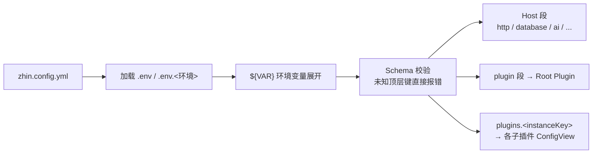

# 配置参考

启动时 `zhin runtime start` 会在项目根目录找配置文件，按下面的顺序找到第一个就停；同时存在多个则直接报错，不会帮你猜：

1. `config.yml`
2. `config.yaml`
3. `config.json`
4. `zhin.config.yml`
5. `zhin.config.yaml`
6. `zhin.config.json`

建议统一用 `zhin.config.yml`，本文的示例都以它为准。

## 这份参考怎么用

先运行 `npx zhin setup` 生成可启动配置，再按本页修改字段。提交前运行 `npx zhin doctor`；启动后以 Console 展示的当前 generation 为准，不要把磁盘文件当成已生效事实。

| 你要改变什么 | 应该放在哪里 |
| --- | --- |
| 安装哪些插件与 Feature | `package.json#zhin` 与依赖 |
| Host、插件实例与 AI 参数 | `zhin.config.yml` |
| 密钥与环境差异 | `.env` / `.env.<环境>`，由 `${VAR}` 引用 |
| Workroom、成员与群/仓库绑定 | 持久 Workroom Catalog，通过 Console 管理 |
| 当前运行时到底发布了什么 | Console 的 Endpoint、能力目录与 generation 状态 |

配置只提供值，不负责挂载代码。新增适配器、Feature 或插件时先安装依赖并更新 `package.json#zhin`，再填写对应配置。

## 加载与校验流程



配置文件会经过 JSON Schema 校验，**顶层只允许下文列出的键**。键名写错会在启动时报 `Invalid Plugin config in zhin.config.yml`。

`plugin` / `plugins` 之外的顶层键由 CLI Host 装配层消费，不会下发给插件。

## 环境变量展开

字符串值中的 `${VAR}`、`${VAR:-default}`、`${VAR:=default}` 会被展开：

```yaml
http:
  token: ${HTTP_TOKEN:-dev-token}   # 未设置 HTTP_TOKEN 时回退为 dev-token
```

变量未设置且没有默认值时会展开为空字符串。对 `apiKey` 等字段，这会触发 AI provider 的 soft-prune。

dotenv 按 `.env` → `.env.<环境>` 加载。环境名由 `--environment` 指定，默认 `development`。密钥一律走环境变量，不要硬编码进配置文件。

## 顶层键

| 键 | 类型 | 说明 |
| --- | --- | --- |
| `log_level` | string \| number | 日志级别（如 `info`、`debug`）；`ZHIN_LOG_LEVEL` / `LOG_LEVEL` 环境变量可临时覆盖 |
| `http` | object | HTTP Host（Console / API 入口） |
| `database` | object | 数据库 |
| `speech` | object | 语音 STT/TTS（需安装 `@zhin.js/speech`） |
| `assistant` | object | Assistant Runtime（调度任务 / 事件 API） |
| `ai` | object | AI 栈（需安装 `@zhin.js/agent` 等，见下文） |
| `mcp` | object | MCP Host（把 bot 工具暴露为 MCP Server） |
| `a2a` | object | A2A Host（Agent Card / 远程 Agent 互调） |
| `htmlRenderer` | object | HTML 渲染（如 `width`） |
| `plugin` | object | Root Plugin（应用自身）的配置 |
| `plugins` | object | 子插件配置，键为 instanceKey |

## http

```yaml
http:
  port: 8086                 # Runtime 无配置时的回退值
  host: 127.0.0.1            # 默认 127.0.0.1
  token: ${HTTP_TOKEN}       # API Bearer 令牌
  corsOrigins:               # 允许的跨域来源
    - "https://console.zhin.dev"
  base: /api                 # API 挂载路径
```

Runtime 无配置时回退到 8086；当前脚手架生成的项目默认写入 8068。以项目配置和启动日志为准。

`token` 未设置时本地开发可直接访问；生产环境务必设置。`tokens` 支持按作用域配置多枚令牌。

## database

```yaml
database:
  dialect: sqlite            # 默认 sqlite
  filename: ./data/bot.db
```

- `dialect` 可选：`sqlite`、`mysql`、`pg`、`mongodb`、`redis`、`memory`。
- 除 `dialect` 外的字段原样传给对应方言（如 pg/mysql 的连接参数）。
- 完全不写 `database` 时，默认使用 `<项目根>/.zhin/data.sqlite`。

## speech

```yaml
speech:
  stt: { provider: ollama, model: whisper, host: http://localhost:11434 }
  tts: { provider: edge, voice: zh-CN-XiaoxiaoNeural }
```

配置后启用语音管道，并向 Agent 暴露 `voice_stt` / `voice_tts` 工具。`@zhin.js/speech` 是 optional peer，需自行安装。

## assistant

```yaml
assistant:
  enabled: true                    # 启用统一 JobStore，默认 false
  profile:
    enabled: true
    file: assistant.profile.yml    # profile 文件，驱动调度任务
  events:
    enabled: true                  # 开放 POST /api/assistant/events
    rateLimitPerMinute: 60         # 默认 60
  defaults:
    notifyOnFailure: false         # Job 失败时是否通知，默认 false
```

其余子键：`queue`（Schedule execution 的并发/重试/超时）。任务事实固定持久化到 `schedule-jobs.json`，可用 [`zhin schedule`](../cli/index.md#schedule) 管理。

## mcp / a2a

```yaml
mcp:
  enabled: true
  path: /mcp
  token: ${HTTP_TOKEN}                  # 未设时回退 http.token
  allowUnauthenticatedLocalhost: false  # 生产建议 false

a2a:
  enabled: true
  path: /a2a
```

两段都挂在 HTTP Host 上，按需启用；未配置时对应 SDK 不会被加载。Workroom
远程执行使用 `a2a.workroomCallbacks` 与 `a2a.workroomRemoteExecutors` 的固定代级
transport binding；Project/成员/群绑定不放在这里，而由持久 Workroom Catalog 管理。
完整示例见 GitHub 上的 [`@zhin.js/a2a` README](https://github.com/zhinjs/zhin/blob/main/packages/host/a2a/README.md#workroom-execution-callbacks)。

## ai

`ai` 段由 Agent Host 消费。只要配置了 `ai` / `assistant` 任一段，启动图就会加载 Agent 栈；缺凭据的 provider 会被 soft-prune，不阻断启动。

### providers：命名模型服务商

```yaml
ai:
  providers:
    deepseek:
      sdk: deepseek                  # 必填
      apiKey: ${DEEP_SEEK_API_KEY}
    openrouter:
      sdk: openai-compatible
      baseUrl: ${OPENROUTER_BASE_URL}
      apiKey: ${OPENROUTER_API_KEY}
      contextWindow: 32768
      models:                        # 可用模型白名单
        - "openrouter/free"
    ollama-local:
      sdk: ollama
      host: http://127.0.0.1:11434   # ollama 用 host 而非 baseUrl
    cloudflare:
      sdk: openai-compatible
      apiKey: ${CLOUDFLARE_API_TOKEN}
      accountId: ${CLOUDFLARE_ACCOUNT_ID}
```

| 字段 | 说明 |
| --- | --- |
| `sdk` | 必填，六种之一：`openai`、`anthropic`、`google`、`deepseek`、`ollama`、`openai-compatible` |
| `apiKey` / `baseUrl` / `host` | 凭据与接入点；`ollama` 用 `host`，Cloudflare 另需 `accountId` |
| `models` | 显式模型列表 |
| `defaultModel`、`contextWindow`、`timeout`、`maxRetries`、`headers` | 行为微调 |
| `authScheme` | Authorization 头前缀，默认 `'Bearer '` |
| `imageGeneration` | 文生图默认（支持该能力的 driver，如 `defaultModel`、`defaultSize`、`watermarkEnabled`、`promptSuffix`） |

provider 别名可任意命名；未显式写 `sdk` 时会按别名前缀推断（如 `deepseek-main` → `deepseek`），推断不出则回退 `openai-compatible`。对应 `@ai-sdk/*` 包是 optional peer，按所用 sdk 自行安装。

### agents：绑定模型与角色

```yaml
ai:
  agents:
    zhin:                            # 主 Agent，默认入口
      provider: openrouter           # 引用 providers 的别名
      model: openrouter/free
      mcpServers: [icqq]             # 引用 ai.mcpServers 的 name
    researcher:
      provider: openrouter
      model: openrouter/free
      nickname: '搜搜'               # Agent 自称与界面展示名
```

| 字段 | 说明 |
| --- | --- |
| `provider` / `model` | 必填，绑定的 provider 别名与模型 |
| `nickname` | Agent 自称与界面展示名 |
| `mcpServers` | 该 Agent 可见的 MCP Server 名列表 |
| `priority` / `match` | 入站路由：`match` 可按 `adapter` / `endpoint` / `scene` / `sceneId` / `hasMedia` / `contentContains` 匹配，单条或数组 |
| `permission.task` | `spawn_task` 可见子 Agent 类型（glob → `allow` / `deny`） |

### mcpServers：外部 MCP Server

```yaml
ai:
  mcpServers:
    - name: icqq
      transport: streamable-http     # stdio | streamable-http | sse
      url: ${ICQQ_MCP_URL}
      headers:
        Authorization: Bearer ${ICQQ_MCP_TOKEN}
    - name: local-tools
      transport: stdio
      command: npx
      args: ["-y", "some-mcp-server"]
      env: { FOO: bar }
```

连接成功后，这些 Server 的工具进入 Agent 工具池（按 `agents.<name>.mcpServers` 分配）。

### 其余 ai 子段

```yaml
ai:
  sessions:                # 会话存储
    maxHistory: 200        # 数据库模式默认 200，内存模式默认 100
    expireMs: 604800000    # 数据库模式默认 7 天，内存模式默认 24h
    useDatabase: true      # 默认 true；使用 Database Root Host（未写 database 时为 .zhin/data.sqlite）
  context:                 # 群聊上下文记录
    enabled: true
    maxRecentMessages: 100
    summaryThreshold: 50
    keepAfterSummary: 10
    maxContextTokens: 4000
  memory:                  # 三层 Markdown 文件记忆，默认启用
    semantic:
      enabled: true        # 语义记忆：generation-owned memory_search/memory_upsert；要求 Database Host
      autoConsolidate: false
    # 启用后 memory_entries 必须在候选代激活时可用，否则该代 fail-closed、不发布
    # memoryMcp 已弃用；语义记忆由上述原生 memory_search / memory_upsert 提供
  access:                  # AI 访问控制
    mode: open             # open | closed | whitelist，默认 open
    users: []              # whitelist 模式下允许的用户 id
    groups: []
    denyMessage: ...
  agent:                   # 工具执行安全
    inboundQueue:
      groupMode: supersede # supersede（默认）| fifo
    execSecurity: allowlist    # deny | allowlist | full
    execPreset: readonly       # readonly | network | development | custom
    execAllowlist: ["^ls ", "^cat "]
    maxIterations: 15          # 单回合最大工具迭代轮次，默认 15
    thinkingPreview: false     # Activity 反馈展示 LLM 实际 thinking 内容（截断），而非静态 "思考中..."，默认 false
    thinkingPreviewMaxLength: 200  # thinkingPreview 展示的最大字符数，默认 200
  trigger:                 # AI 触发规则
    prefixes: ["ai:"]          # 触发前缀，默认 ['#', 'AI:', 'ai:']
    respondToAt: true          # 响应 @机器人，默认 true
    respondToPrivate: true     # 私聊免前缀直达，默认 true
    ignorePrefixes: ['/', '!', '！']  # 避免与命令冲突
    timeout: 60000
```

`ai.multimodal` 管理多模态入出站；`ai.knowledge.baseDir` 指定本地知识库目录，默认 `knowledge`。

远程 Agent 不再通过 `ai.remoteAgents` 旁路接入。可选 A2A Executor 只通过持久 Workroom Catalog 和 generation-owned authority 接入，并服从 Assignment lease/fence 与 Journal 契约。

`ai.workrooms` 已删除。Project、成员和协作空间由 Console 的持久化 Workroom Catalog 管理，保存后通过 revision CAS 立即生效，不需要重启运行时。

## plugin 与 plugins

```yaml
# Root Plugin（应用自身）的配置，键由应用的 config schema 决定
plugin:
  terminal:
    interactive: true

# 子插件配置，键为 instanceKey
plugins:
  sandbox:
    endpoints:
      - context: sandbox
        name: sandbox-bot
        owner: sandbox-user
```

`instanceKey` 默认取包名最后一段，并移除 `adapter-` / `plugin-` / `service-` 前缀。例如 `@zhin.js/adapter-icqq` → `icqq`。

`zhin install` 会写入 `plugins.<instanceKey>`，并把包挂进 `package.json#zhin.plugins`。

### 适配器实例：master / trusted / commandPrefix

平台适配器插件的实例配置支持三个通用键：

| 键 | 位置 | 说明 |
| --- | --- | --- |
| `master` | 实例顶层 | Endpoint Owner：用于权限判定与显式 `/approve` 管理命令的稳定用户 id |
| `trusted` | 实例顶层 / endpoints 逐项 | 受信任用户 id 列表；数组或空白/逗号分隔字符串 |
| `commandPrefix` | 实例顶层 / endpoints 逐项 | 命令前缀，默认 `''`；endpoints 逐项的值覆盖顶层 |

### endpoints 数组：一个实例挂多个账号

多账号适配器用 `endpoints` 数组声明多个 Endpoint：

```yaml
plugins:
  icqq:
    master: "${ICQQ_MASTER}"     # 顶层共享：所有 endpoint 生效
    endpoints:                   # 逐项：name 必填，其余字段与顶层合并（逐项优先）
      - name: "${ICQQ_ACCOUNT_1}"
      - name: "${ICQQ_ACCOUNT_2}"
```

展开规则（`@zhin.js/adapter` 的 `expandEndpointConfigs`）：

- 每个 endpoint 的最终配置 = 实例配置（去掉 `endpoints` 键）与该项的浅合并，**逐项字段覆盖顶层**。
- `name` 必填且为非空字符串；不含 `~`；重名只保留首个并告警。
- `endpoints` 为空或全部非法时，退回单 Endpoint（名为 instanceKey）。

真实示例（QQ 官方 bot，主账号走代理网关 + 沙箱账号并存）：

```yaml
plugins:
  qq:
    endpoints:
      - name: zhin
        appid: "${QQ_APPID}"
        secret: "${QQ_SECRET}"
        mode: websocket
        sandbox: false
        gatewayUrl: "https://bots.example.com/gateway/102005927"
        intents: [GUILDS, GROUP_AND_C2C_EVENT, PUBLIC_GUILD_MESSAGES]
      - name: "102069707"
        appid: "${QQ_SANDBOX_APPID}"
        secret: "${QQ_SANDBOX_SECRET}"
        mode: websocket
        sandbox: true
        intents: [GUILDS, GROUP_AND_C2C_EVENT]

  slack:
    endpoints:
      - name: zhin
        token: "${SLACK_TOKEN}"
        appToken: "${SLACK_APP_TOKEN}"
        signingSecret: "${SLACK_SIGNING_SECRET}"
        socketMode: true
```

各适配器自己的字段（`appid`、`intents`、`socketMode`、`url`、`access_token` 等）见对应适配器包的 README。

## 最小配置

不写任何 Host 段也能跑——这是 `examples/minimal-bot` 的全部配置：

```yaml
plugin:
  terminal:
    interactive: true

plugins: {}
```

启动后按 `zhin setup` 向导逐步补齐 database / 适配器 / AI（见 [CLI 参考](../cli/index.md)）；运行方式见 [zhin runtime start 详解](../cli/runtime.md)。
