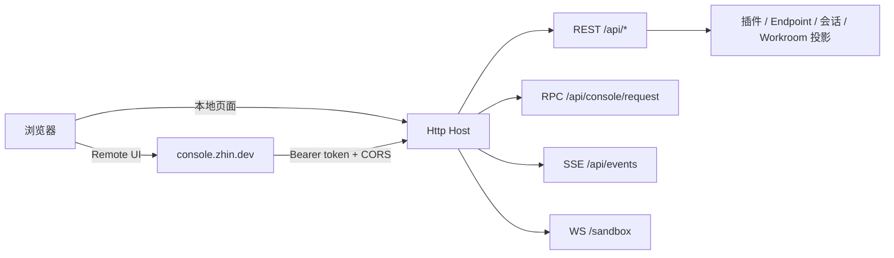

# Console

Console 是 Zhin 的运行事实面：它回答当前 generation 发布了什么、消息进入了哪个 Endpoint、Agent 做了什么，以及持久状态是否恢复。

`zhin runtime start` 会装配 HTTP Host 与 Console API。你可以用 <https://console.zhin.dev> 连接 Host，也可以打开 Host 提供的本地 `/console` 与 Sandbox 页面。



## 部署与配置

全部配置在 `zhin.config.yml` 顶层 `http:` 段：

```yaml
http:
  port: 8068                 # 脚手架默认；以项目配置为准
  host: 127.0.0.1            # 默认 127.0.0.1；远程访问需改 0.0.0.0
  token: ${HTTP_TOKEN}       # 主 token（full scope）
  tokens:                    # 附加作用域 token（可选）
    - token: ${DEMO_TOKEN}
      scope: demo            # full | demo
  corsOrigins:               # CORS 白名单；https://console.zhin.dev 总是自动并入
    - "http://localhost:5173"
  base: /api                 # API 前缀，默认 /api
```

配置 token 后，`/api` 请求需携带 Bearer token；`/pub/*`、Console shell 与页面路由保持公开。`corsOrigins` 会与 Remote Console 源合并。

端口占用会让 HTTP Host 软降级：Adapter 与 Agent 继续启动，但 Console 不可用。Console 发起重启时，CLI daemon 会在进程以 code 51 退出后重新拉起。

Runtime 无配置时回退到 8086，当前脚手架默认写入 8068。连接地址始终以项目配置和启动日志为准。

## 按问题找入口

| 你看到的现象 | 先看哪里 | 要确认的事实 |
| --- | --- | --- |
| Console 连不上 | Dashboard / 启动日志 | Host、端口、token、CORS 与 HTTP Host 是否降级 |
| 平台在线但收不到消息 | Endpoint 详情 | 连接状态、统一收件箱、请求/通知与平台回调 |
| 命令、中间件或组件没生效 | 运行时能力 | 当前 generation 是否发布能力、顺序与 owner |
| Agent 没调用工具 | Agent 工作台 + 运行时能力 | Tool 可见性、审批、安全策略、轨迹与取消终态 |
| 刷新后消息缺失 | Endpoint 会话 + 日志 | history RPC 是否恢复、SSE 是否报告 recovery gap |
| Workroom 没接管群或仓库 | Workrooms + Task 看板 | Catalog revision、完整空间地址、Orchestrator 与 Project Inbox |
| 配置文件写了但行为没变 | Config + Dashboard | 保存是否成功，是否发布了新 generation |

## 页面功能

| 页面 | 数据来源 | 说明 |
|------|----------|------|
| Dashboard | `GET /api/system/status`、`GET /api/stats` | 运行状态、版本、统计概览 |
| Plugins | `GET /api/plugins`、`GET /api/plugins/<name>` | 插件列表与详情（命令、工具、配置 schema） |
| Endpoints | Endpoint 摘要 + 收件箱表 | 各平台端点连接状态；详情页含统一收件箱（消息 / 请求 / 通知） |
| Config | RPC `config:get-yaml` / `config:save-yaml` / `config:set` | 在线查看、编辑 `zhin.config.yml` |
| Logs | `GET /api/logs`、`GET /api/logs/stats`、`DELETE /api/logs`、`POST /api/logs/cleanup` | 系统日志（`SystemLog` 表，需 Database 启动） |
| Cron | RPC `cron:*` | 插件注册的内存任务（list）；安装 Agent 后可增删暂停持久化任务 |
| Database | RPC `db:info` / `db:tables` / `db:select` / `db:insert` / `db:update` / `db:delete` / `db:kv:*` | 数据库浏览与编辑、KV 存储 |
| Files | RPC `files:tree` / `files:read` / `files:save`、`env:list` / `env:save` | 项目文件树与 `.env` 管理 |
| 运行时能力 | `GET /api/introspection/{commands,middlewares,components,tools,prompt-sections,endpoints,bindings,mcp}`、`POST /api/introspection/components/render` | 当前 generation 的能力契约、owner、中间件顺序、组件渲染实验台与 Prompt Section 治理信息 |
| Agent Sessions | `GET/POST /api/agent/sessions/*` | AI 会话树查看与分支切换；渠道会话尚未产生 AI 对话时，GET 返回 `state: not_started` 空树 |
| Workrooms | 持久 Workroom Catalog + `GET /api/agent/workroom/runs[/*]` | 以 revision CAS 管理 Project、成员、Agent 角色和群/频道/仓库绑定；查看 replayed Run / Task / Assignment |
| Marketplace | `GET /pub/marketplace/search`、`/pub/marketplace/detail/*`、`GET /api/marketplace/updates` | 插件市场（plugins.json + npmmirror）与更新检查 |
| Sandbox | WS `/sandbox` | 内置沙箱聊天，免平台联调直接对话 |

实时推送走 SSE：`GET /api/events`（页面目录同步、HMR 重载、消息/配置事件）。

## Agent 工作台运行策略

工作目录与安全策略属于每一次运行，不写入 Prompt，也不会由模型自行提升。新手可以从默认组合开始：工作目录留空时使用当前项目目录，`safetyMode` 选 `workspace-write`，`approvalMode` 选 `ask`，`networkAccess` 保持关闭。

| 字段 | 可选值 | 怎么选 |
| --- | --- | --- |
| `safetyMode` | `read-only` / `workspace-write` / `danger-full-access` | 只检查时选只读；需要修改项目文件时选工作区写入；完整主机权限只用于明确理解风险的本地任务 |
| `approvalMode` | `ask` / `deny` / `allow` | 默认 `ask`；无人值守但不允许越权时选 `deny`；仅在已有外部隔离与授权时选 `allow` |
| `networkAccess` | `false` / `true` | 只有任务确实要访问网络时开启；`danger-full-access` 会天然包含网络权限 |
| `workingDirectory` | 目录路径 | 指向本次任务允许工作的项目目录，不要用宽泛的系统根目录 |

这些是固定契约，不是自由文本。未知的 `safetyMode` / `approvalMode` 会回退到 `workspace-write` / `ask`；工作台应始终回显最终生效值供用户确认。

## 一次标准验收

1. Dashboard 显示连接正常，版本与运行时信息可读。
2. 在 Sandbox 发送消息，并在 Endpoint 会话刷新后确认历史仍存在。
3. 在运行时能力核对命令、中间件、组件、Tool 与 Prompt Section 的当前 owner。
4. 运行一条 Agent 任务，验证工作目录、安全策略、审批、取消、轨迹和产物。
5. 若启用 Workroom，用一个真实群、频道或仓库事件验证它进入正确 Project。

只有当前 generation 与持久投影都符合预期，才算发布成功。磁盘配置和插件清单只是候选输入。

## /entries 插件页面机制

插件可以向 Console 贡献自己的页面。机制分三步：

1. 插件声明 client 页面（pagemanager），构建产物由 Host 服务在 `/assets/client/*`；
2. Host 的 ConsoleRuntime 汇总页面目录，`GET /entries` 返回 `{ entries, runtimeEnvHint }`——每条 entry 含 `id`、`title`、`route`、`module`（页面模块 URL）、`order`、`hash`；
3. Remote Console / 本地 shell 拉取 `/entries` 后动态 import 对应模块渲染；浏览器裸导入（react 等）由 Host 的 `/esm/*` 代理为可执行 ESM。

页面目录变化通过 SSE `sync` 事件实时推给已连接的 UI。

## Demo scope（只读部署）

给演示环境签发 `scope: demo` token，Console 会进入只读模式。Demo 只展示服务端允许的脱敏数据，不能把前端遮罩当成秘密边界。

- 放行：事件流与历史、运行时能力目录、只读 Console RPC、系统状态、统计与插件目录；
- WebSocket 仅 `/sandbox`；
- 其余写操作（改配置、清日志、DB 写入等）一律 `403`。

主 token 为 `full` scope，拥有全部权限。

## 相关

- [AI 能力总览](../ai/index.md)
- [Agent 深入](../ai/agent.md)：Console 的 Agent Sessions / Orchestration 页对应的运行时
